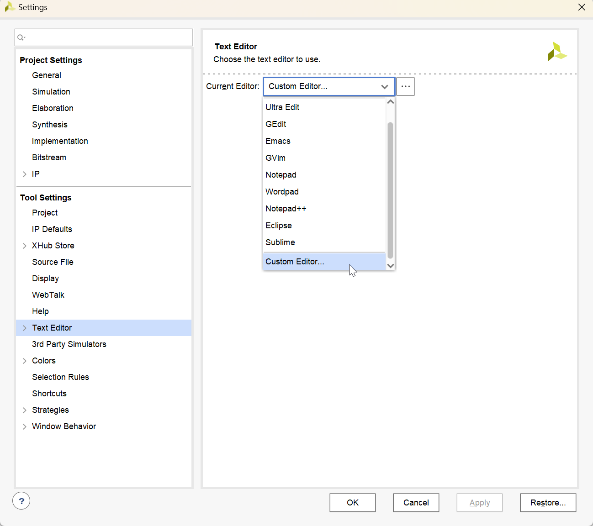
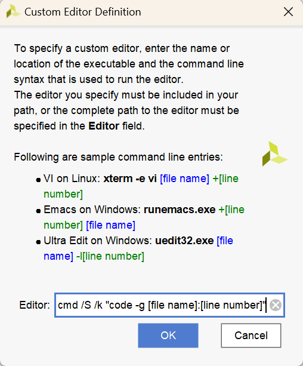
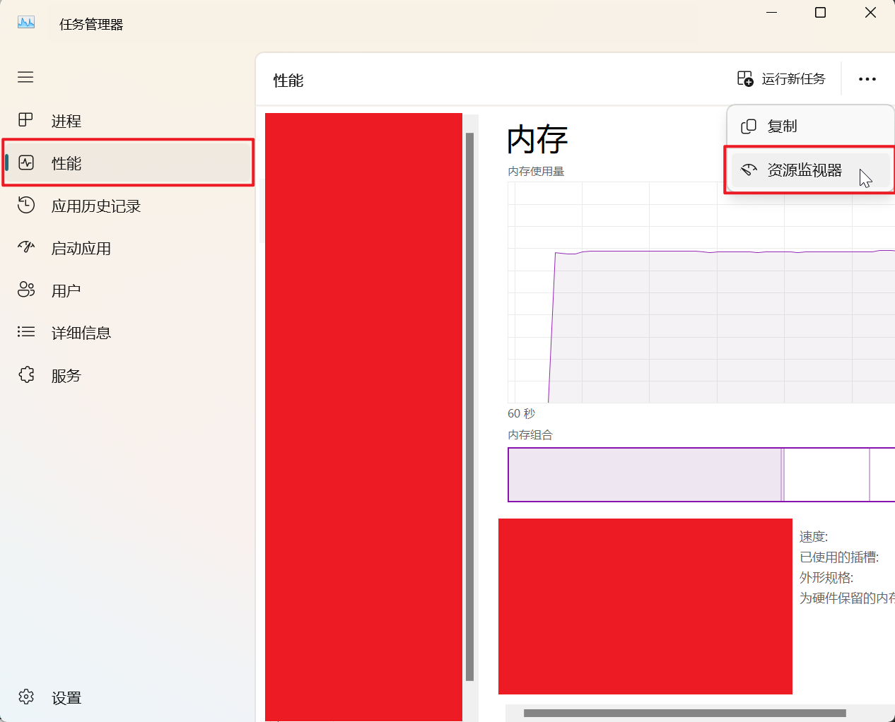
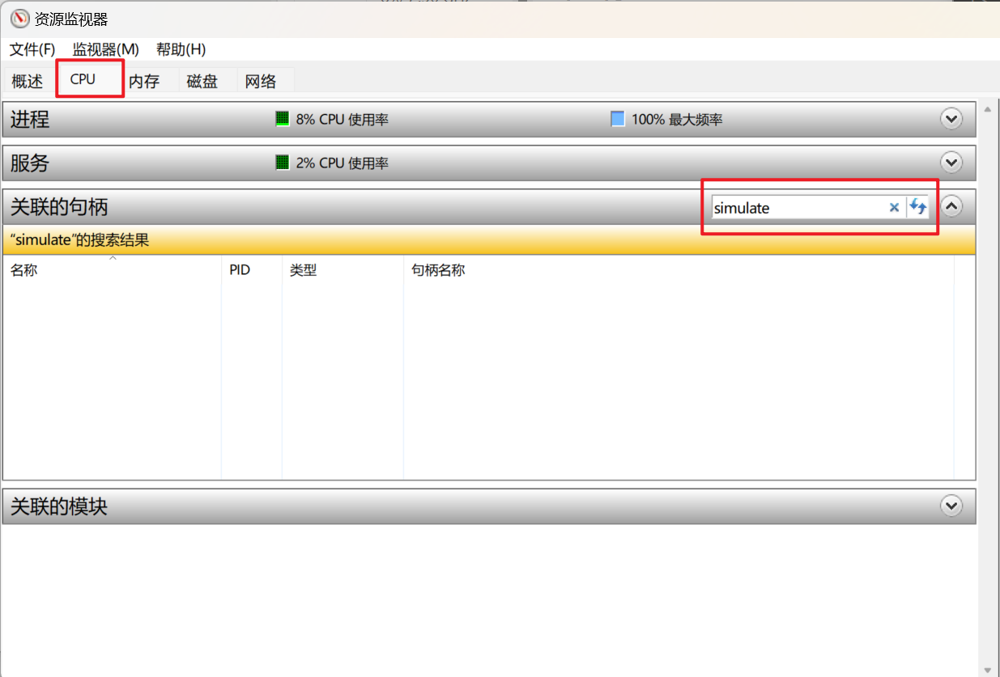

# Vivado

!!! info "AI 介绍"

    Vivado 是由 Xilinx（现在是 AMD 的一部分，自 2022 年收购以来）开发的一种集成设计环境 (IDE)，主要用于 FPGA（现场可编程门阵列）的设计、仿真、实现和调试。它提供了一个全面的工具集，支持从概念到硬件实现的整个设计流程。Vivado 包括了几个关键组件：
    
    1. **设计输入**：用户可以通过 VHDL、Verilog 或 SystemVerilog 等硬件描述语言输入设计，或者使用高层次综合(HLS)直接从 C/C++/SystemC 代码生成硬件
    2. **逻辑综合**：将高级语言描述转换为针对特定 FPGA 架构优化的网表
    3. **布局布线**：自动地在选定的 FPGA 芯片上放置和连接逻辑单元，以满足性能要求
    4. **时序分析**：检查设计是否符合时钟速度和其他时序约束
    5. **模拟与验证**：允许用户通过仿真来测试设计的功能正确性
    6. **IP Integrator**：帮助用户快速集成 IP 核心，简化复杂系统的设计过程
    7. **调试工具**：包括在线逻辑分析仪等工具，帮助用户在实际硬件上调试设计
    
    Vivado 提供了两种主要版本：Vivado Design Suite 和 Vivado WebPACK Edition。后者是一个免费版本，适用于部分 Xilinx 器件，非常适合教育和个人项目使用；而前者则提供了更全面的功能集，适用于商业产品开发。Vivado 在电子工程领域特别是数字电路设计中被广泛使用

## 下载

连接校网，打开文件资源管理器，地址栏输入 `ftp://10.78.18.205/`。里面有 Vivado 2020.2 软件安装等资料

<figure markdown="span">
    { width="600" }
</figure>

## 提高综合速度

<figure markdown="span">
    { width="600" }
</figure>

右键模块，点击 ^^Set as Out-of-Context for Synthesis...^^

<figure markdown="span">
    { width="600" }
</figure>

> 这个演示图片里 Clock Constraint File 那一栏显示的东西不用管，直接点 OK 就行

之后什么都不用动，点击 OK 即可

<figure markdown="span">
    { width="400" }
</figure>

成功以后，模块左侧有一个小黄方块的标识。有些模块不能这样操作，可能是因为它是某些模块的顶层模块等等

这个东西的意思简单理解就是，文件综合一次之后，只要文件内部的代码不变，下一次综合时，这个文件就不用再综合一遍了，只需要和外部模块做连接就好了，提高综合速度

> 更详细的解释，互联网自行搜索

很容易发现，我们生成的 IP 核如果是保持默认设置的话，左边也有这个小黄方块标识，因为 IP 核本身内部的东西就不会变（在当前工程文件中，无法直接修改 IP 核内部代码）

## 关联 vscode

设置中选择 Text Editor -> Custom Editor

<figure markdown="span">
    { width="600" }
</figure>

输入内容：`cmd /S /k "code -g [file name]:[line number]"`

<figure markdown="span">
    { width="600" }
</figure>

之后在 Vivado 工程内双击文件，便可打开 vscode 进行编辑

注意：

1. Vivado 仿真之前建议将 Text Editor 切换为默认选项，否则容易报错，报错大意“其他进程正在使用 simulate”
2. 若遇到此类报错，如下操作：

打开任务管理器 -> 资源监视器

<figure markdown="span">
    { width="600" }
</figure>

在 CPU -> 关联的句柄下，搜索 simulate，删除所有 code.exe 结果

<figure markdown="span">
    { width="600" }
</figure>

之后重新仿真即可