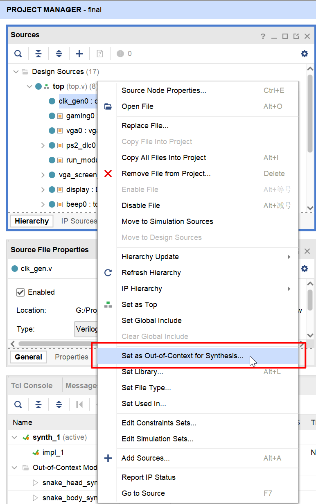
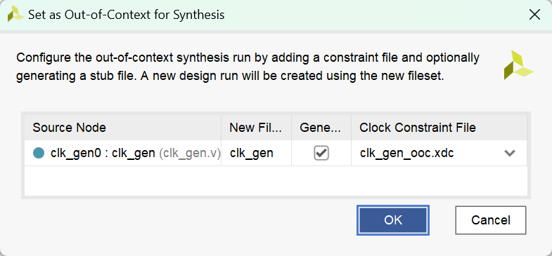

# Vivado

## 下载

连接校网，打开文件资源管理器，地址栏输入 `ftp://10.78.18.205/`。里面有 Vivado 2020.2 软件安装等资料

<figure markdown="span">
    { width="600" }
</figure>

## 提高综合速度

<figure markdown="span">
    { width="600" }
</figure>

右键模块，点击 ^^Set as Out-of-Context for Synthesis...^^

<figure markdown="span">
    { width="600" }
</figure>

> 这个演示图片里 Clock Constraint File 那一栏显示的东西不用管，直接点 OK 就行

之后什么都不用动，点击 OK 即可

<figure markdown="span">
    { width="400" }
</figure>

成功以后，模块左侧有一个小黄方块的标识。有些模块不能这样操作，可能是因为它是某些模块的顶层模块等等

这个东西的意思简单理解就是，文件综合一次之后，只要文件内部的代码不变，下一次综合时，这个文件就不用再综合一遍了，只需要和外部模块做连接就好了，提高综合速度

> 更详细的解释，互联网自行搜索

很容易发现，我们生成的 IP 核如果是保持默认设置的话，左边也有这个小黄方块标识，因为 IP 核本身内部的东西就不会变（在当前工程文件中，无法直接修改 IP 核内部代码）