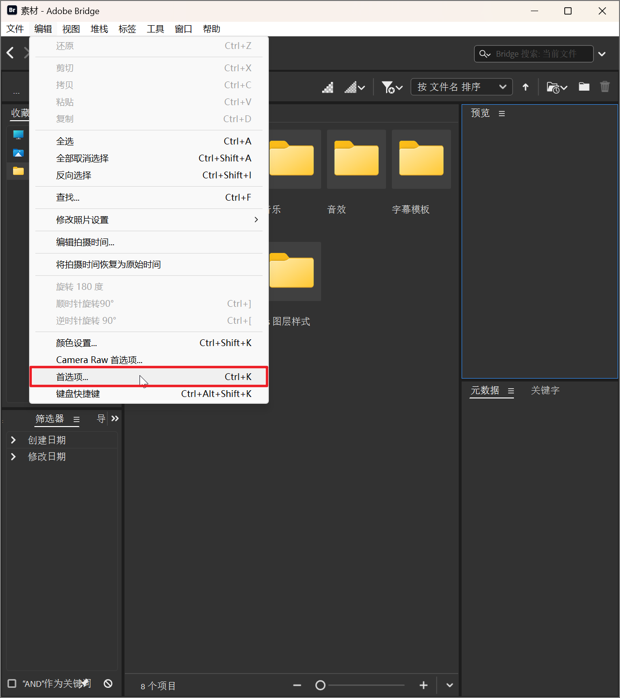
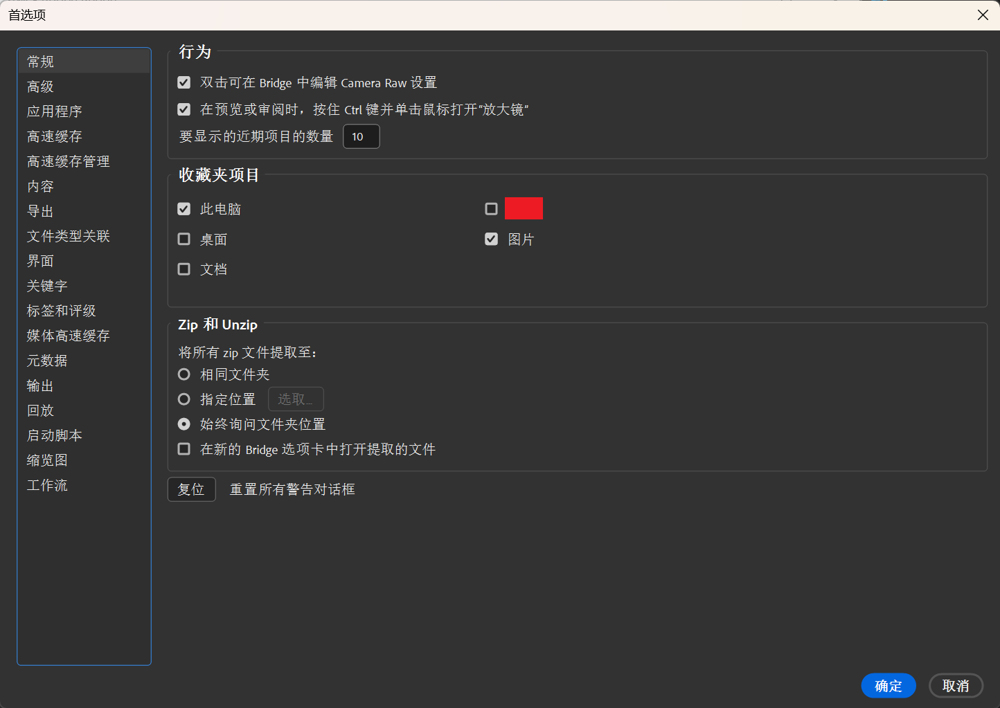
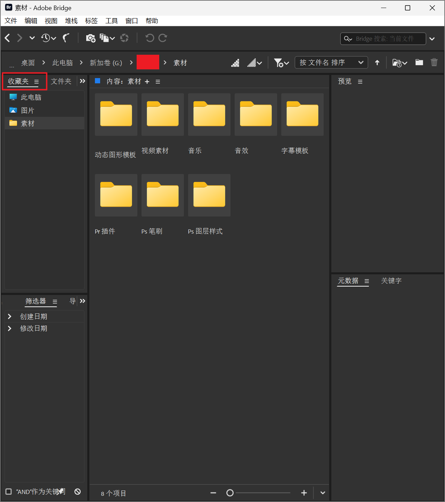
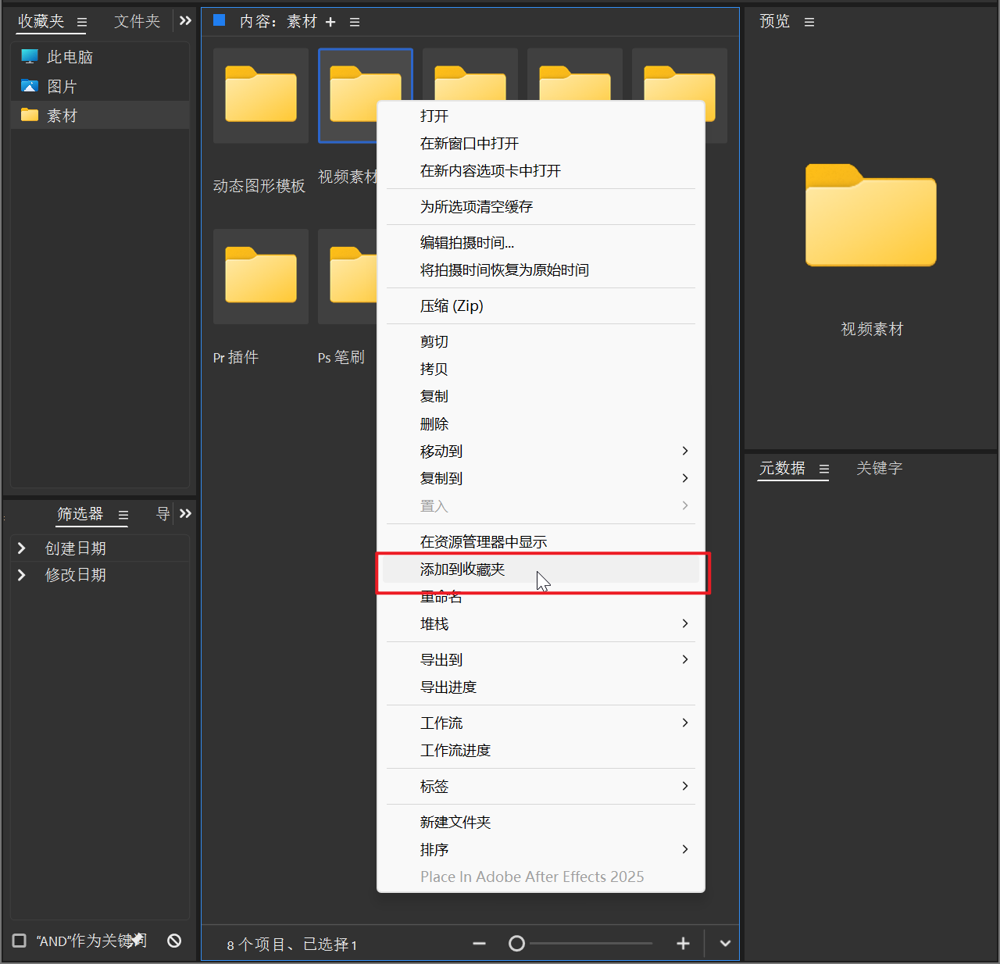
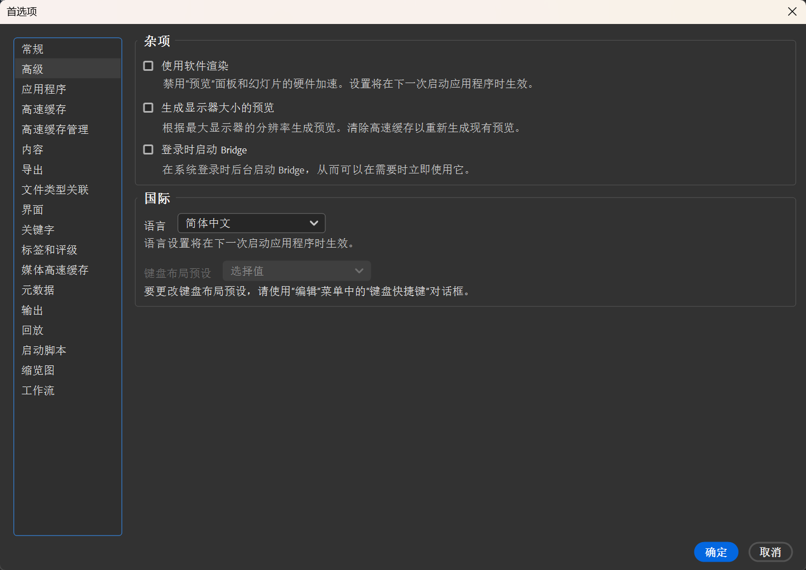
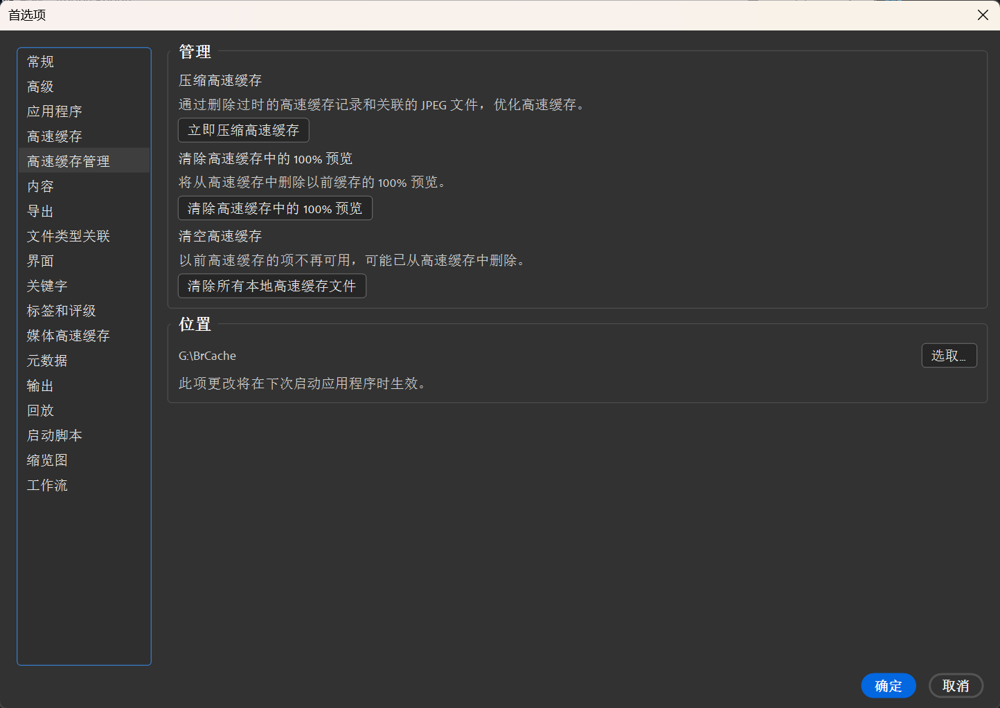
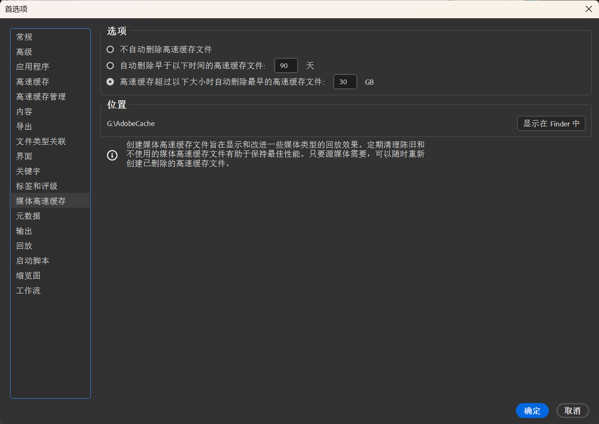
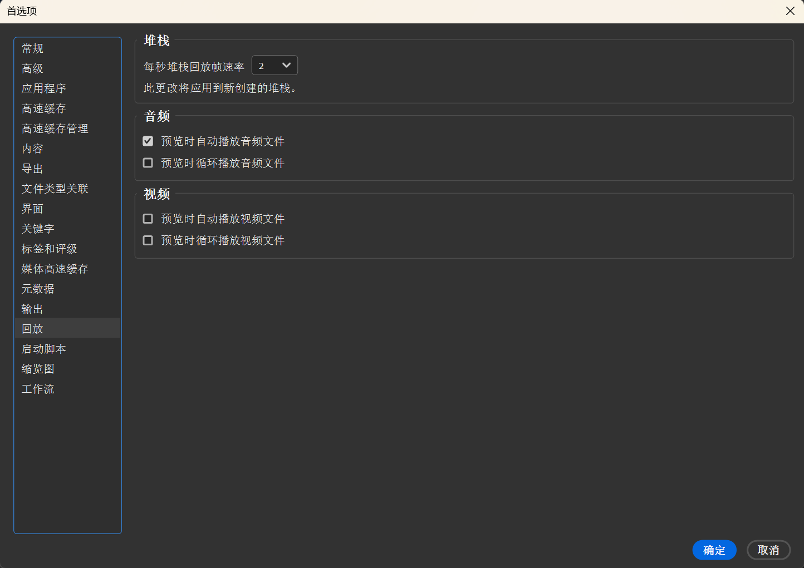

# 1 首选项

!!! warning "说明"

    本文档已停止更新

!!! info "说明"

    仅讲解我认为重要的设置，没有涉及到的设置和选项自己研究研究也能看懂

<figure markdown="span">
{ width="600" }
</figure>

^^编辑 -> 首选项^^，打开首选项设置

## 常规

<figure markdown="span">
{ width="700" }
</figure>

**行为：**

根据自己使用习惯设置即可

**收藏夹项目：**

选择在 ^^收藏夹^^ 中展示的文件夹

<figure markdown="span">
{ width="600" }
</figure>

如果想将其他文件夹放入 ^^收藏夹^^ 栏，可以右键文件夹，选择 ^^添加到收藏夹^^ 即可

<figure markdown="span">
{ width="600" }
</figure>

**Zip 和 Unzip：**

选择解压 zip 文件时的存储路径

## 高级

<figure markdown="span">
{ width="800" }
</figure>

**杂项：**

1. **使用软件渲染：** 勾选后，图片预览使用 CPU；不勾选，图片预览使用 GPU。==使用 GPU 速度更快==，根据电脑情况选择勾选

## 高速缓存

<figure markdown="span">
{ width="800" }
</figure>

1. **高速缓存大小：** 设置缓存文件的大小
2. **缓存位置：** 建议更改缓存位置到非 C 盘的地方，更改方式见下文
3. 最后一个设置，可以选择自动清理早于设置时间的缓存文件

## 高速缓存管理

<figure markdown="span">
{ width="800" }
</figure>

**位置：**

更改缓存文件位置。点击选取按钮，选择一个文件夹即可，可以参考我的文件名 `BrCache`。==建议更改缓存位置到非 C 盘的地方==

## 媒体高速缓存

<figure markdown="span">
{ width="800" }
</figure>

**选项：**

根据情况选择自动删除缓存文件。我选择的是根据文件大小自动删除

> 我 ^^高速缓存^^ 那个界面选的是根据天数，我这里选的是根据文件大小，应该会同时生效吧（不太清楚）

**位置：**

!!! tip "注意"

    此设置的文件夹位置，对所有与此设置相关的 Adobe 软件都生效，所以我的文件夹名称为 `AdobeCache`

在 Br 软件里，好像无法设置这个路径。可以打开 Ps、Pr 等软件设置一下（只在一个软件里设置即可，其他软件会自动同步的）。如果你暂时没有这些软件，不改也没关系的

## 回放

<figure markdown="span">
{ width="800" }
</figure>

这里根据自身需求勾选一下即可

**堆栈：**

这个暂时看不懂可以先不用管，后面会讲

> 这个和数据结构的堆栈可不是一个东西哈。可以理解为文件夹或者组，归纳图片的东西