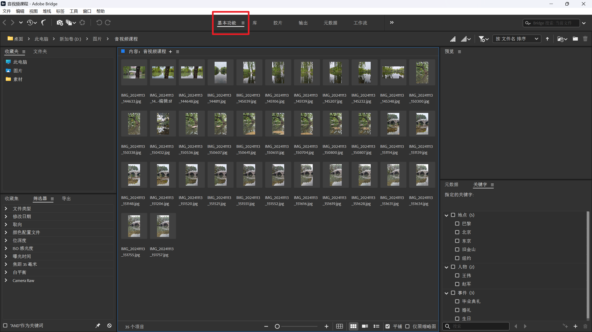
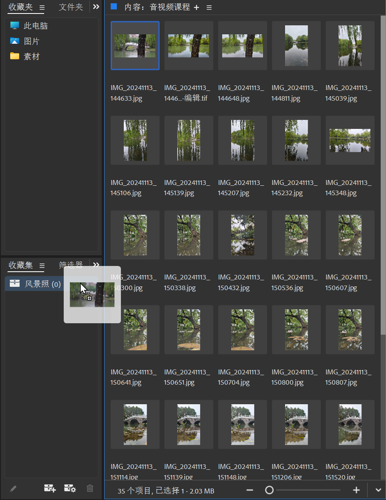
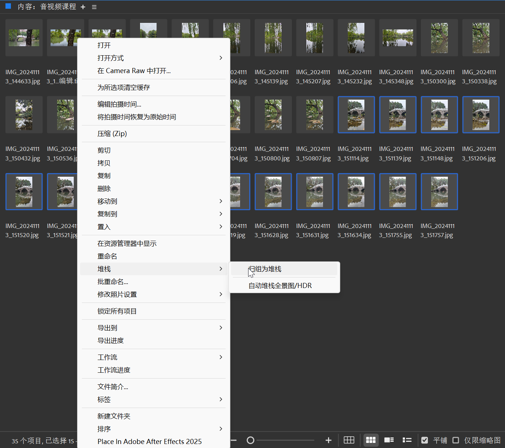
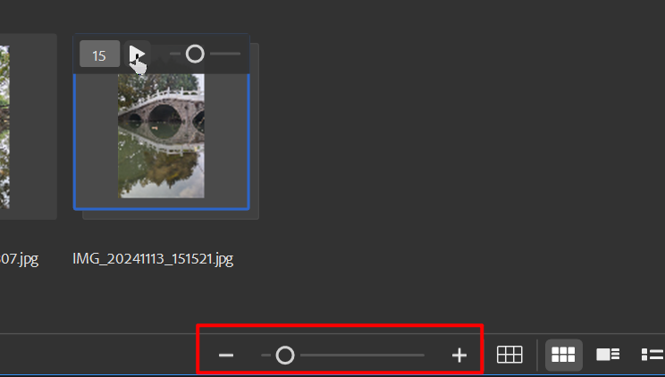
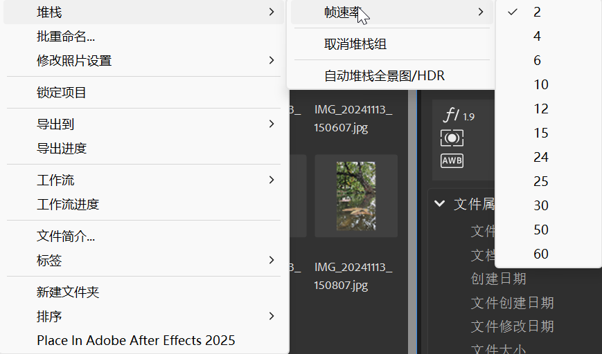

# 2 基本操作

!!! tip "说明"

    此文档正在更新中……

!!! info "说明"
    
    很多功能自己捣鼓捣鼓都能搞明白

## 常用窗口

<figure markdown="span">

</figure>

在 ^^基本功能^^ 面板下

这里的功能就和文件资源管理器差不多

左边 ^^收藏夹^^，^^文件夹^^ 就是浏览电脑中的文件夹，中间 ^^内容^^ 则显示文件夹中的文件

<figure markdown="span">
{ width="600" }
</figure>

左下角 ^^收藏集^^，比如新建收藏集叫“风景照”，然后将你想放入的东西拖到里面就行

左下角 ^^筛选器^^，根据各种信息筛选文件

左下角 ^^导出^^，选择设置导出预设，将文件拖入进去，可以批量导出

右上角 ^^预览^^ 窗口，预览图片、视频、音频等等

右下角 ^^元数据^^，查看编辑文件的元数据

右下角 ^^关键字^^，为文件添加关键字等等

## 右键菜单

> 各种快捷键可以在 ^^编辑 -> 键盘快捷键^^ 中查看

选中某一文件

1. 按 空格键 进行放大预览（如果可以的话）
2. Enter/双击 打开文件
3. 右键有各种各样的选项，到处点一点试一试
4. 图片的话可以使用 Camera Raw 打开进行调色操作

### 堆栈

<figure markdown="span">
{width="600"}
</figure>

选中多个文件，选择 ^^归组为堆栈^^，比如有一些场景你重复拍了很多张照片，可以通过这种方式将这些照片叠在一起

<figure markdown="span">
{width="600"}
</figure>

选中某一堆栈，还可以像幻灯片一样播放堆栈中的图片

> 如果没有进度条，可以通过下方的按钮放大，放大后就应该有了

<figure markdown="span">
{width="600"}
</figure>

同时可以设置帧速率

!!! tip "小技巧"

    延时摄影可以通过这种方式预览成片效果哦

