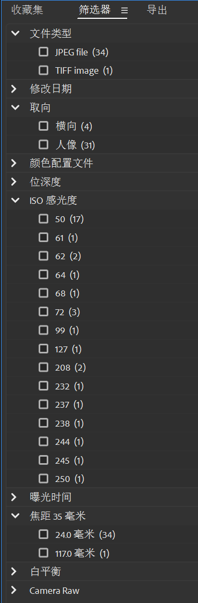
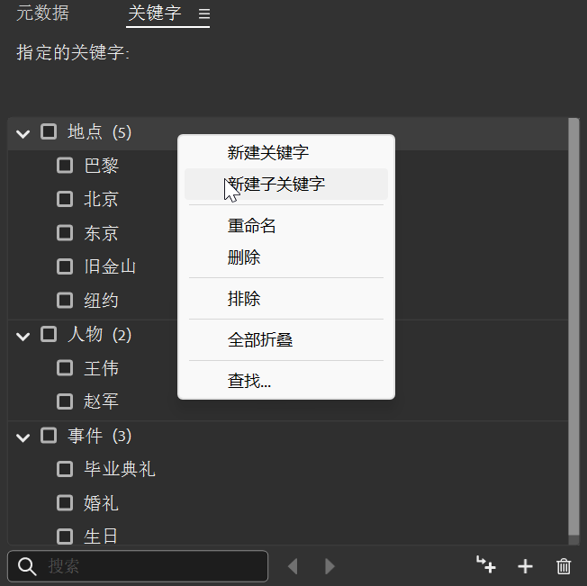
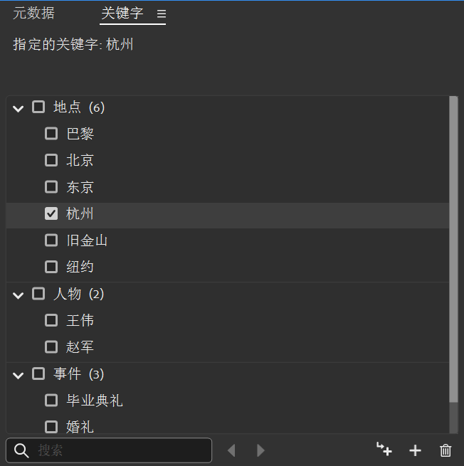
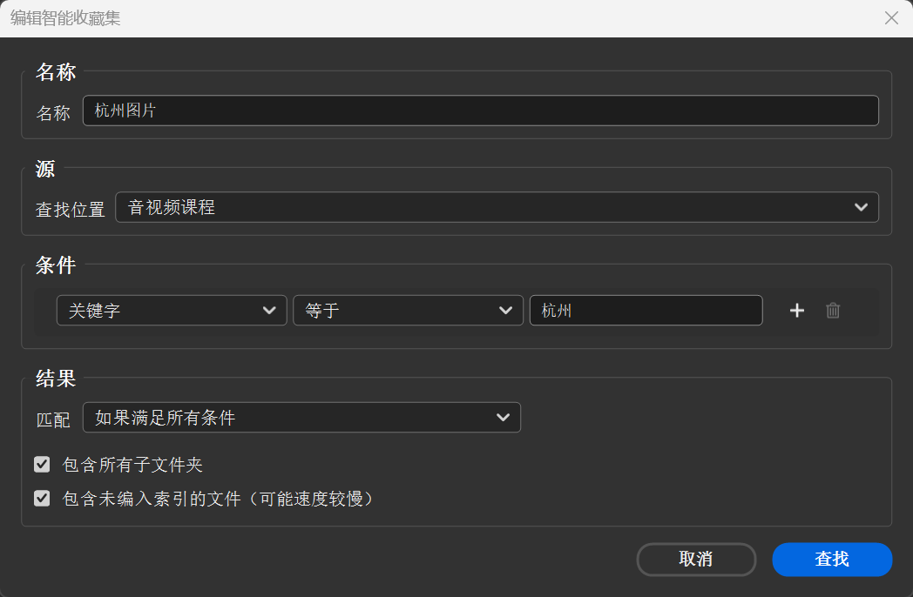
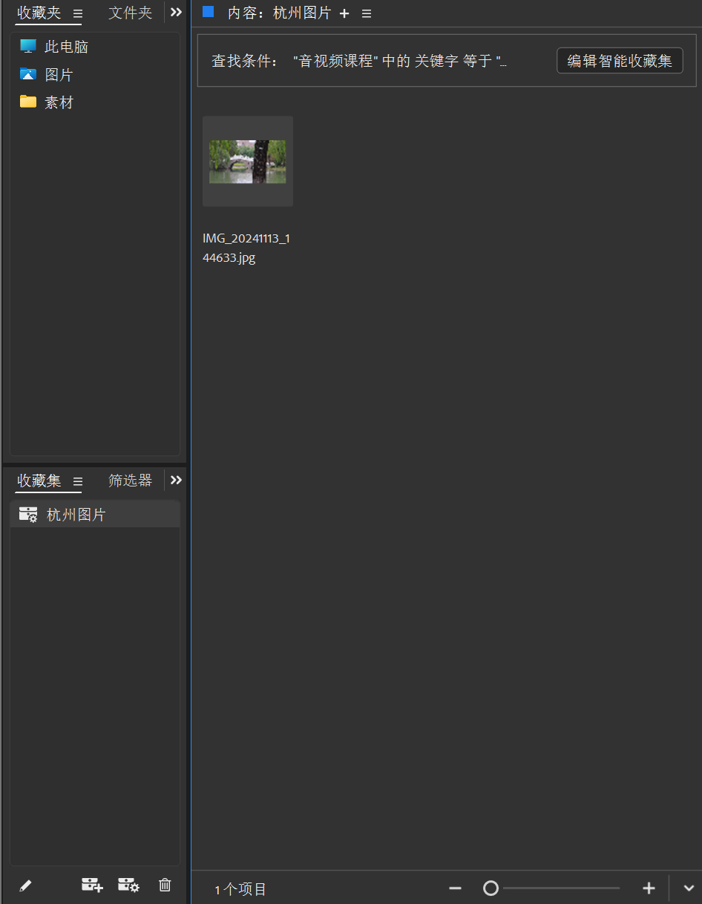

# 3 文件整理/归纳/筛选

!!! tip "说明"

    此文档正在更新中……

!!! info "说明"
    
    很多功能自己捣鼓捣鼓都能搞明白

<figure markdown="span">

</figure>

在 ^^基本功能^^ 面板下

这里的功能就和文件资源管理器差不多

左边 ^^收藏夹^^，^^文件夹^^ 就是浏览电脑中的文件夹，中间 ^^内容^^ 则显示文件夹中的文件

<figure markdown="span">
{ width="600" }
</figure>

左下角 ^^收藏集^^，比如新建收藏集叫“风景照”，然后将你想放入的东西拖到里面就行

> 还有一个智能收藏集，点一下新建智能收藏集，出来的面板里面的设置选项可以先自己捣鼓捣鼓，我放到后面说

左下角 ^^筛选器^^，根据各种信息筛选文件

左下角 ^^导出^^，选择设置导出预设，将文件拖入进去，可以批量导出

右上角 ^^预览^^ 窗口，预览图片、视频、音频等等

右下角 ^^元数据^^，查看编辑文件的元数据

右下角 ^^关键字^^，为文件添加关键字等等

## 根据元数据筛选文件

<figure markdown="span">
{ width="300" }
</figure>

左下角 ^^筛选器^^ 窗口，可以根据很多不同的选项来筛选文件

拿照片举例，照片的元数据有很多，比如曝光时间、ISO 感光度，尺寸，拍摄时间等等

比如你想找晚上拍的照片，一般来说晚上的照片，曝光时间应该长一些，你可以在曝光时间选项卡里，勾选前几个选项，进行筛选

## 根据关键字筛选文件

<figure markdown="span">
{ width="600" }
</figure>

<figure markdown="span">
{ width="600" }
</figure>

还是拿照片举例，比如我为这些照片设置 ^^地点->杭州^^ 这一关键字

在筛选器这里，就可以通过勾选 杭州 这一关键字来筛选照片了

除了设置地点关键字，你还可以自定义其他关键字和子关键字对文件进行标记

## 利用智能收藏集归纳文件

还是拿照片举例，我现在想将此文件夹中的所有带有 杭州 这一关键字的图片，放到一个地方去，可以新建智能收藏集

<figure markdown="span">
{ width="600" }
</figure>

通过这样设置选项就可以了

<figure markdown="span">
{ width="600" }
</figure>

除此之外，还可以新增条件，改变查找位置等等来归纳文件