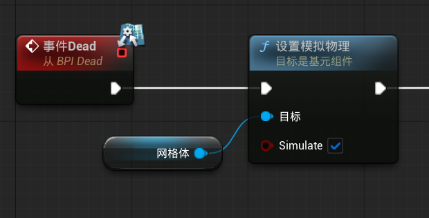
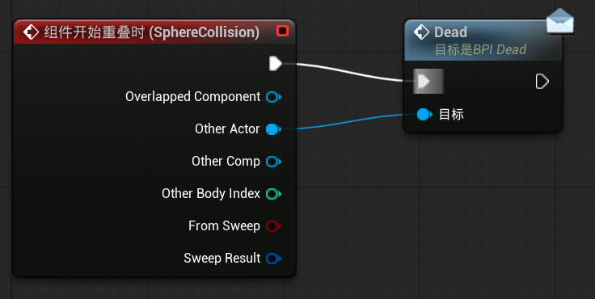
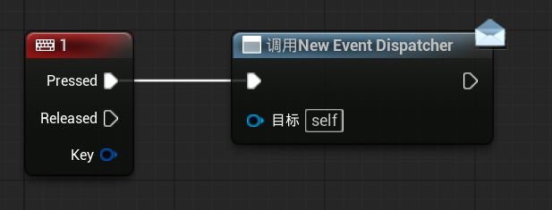
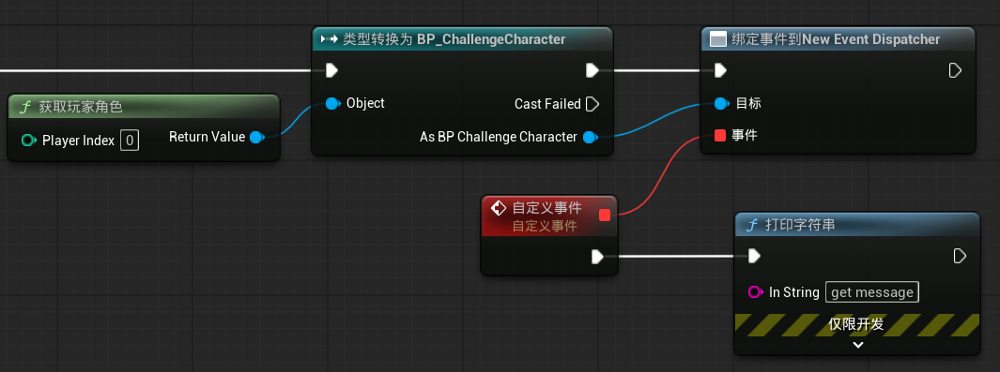
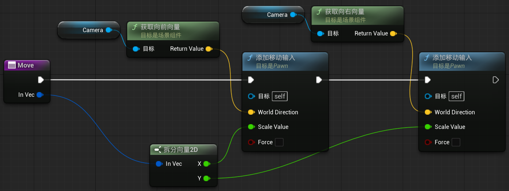
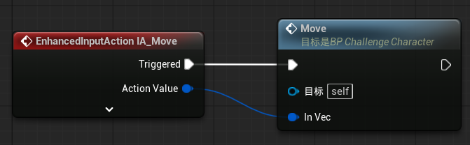
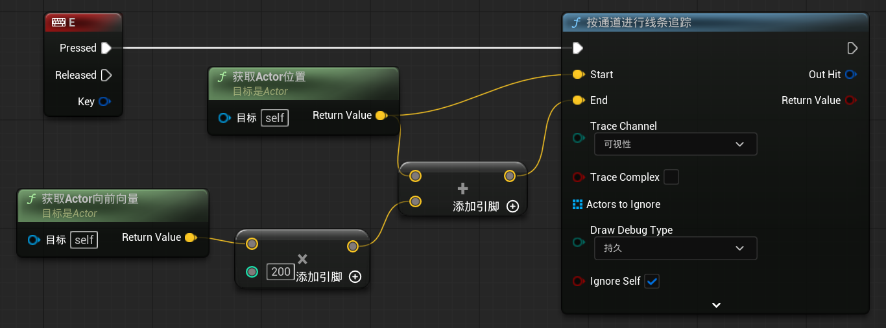

# 蓝图进阶

## 1 蓝图通信之蓝图接口

> [蓝图通信用法](https://dev.epicgames.com/documentation/unreal-engine/blueprint-communication-usage-in-unreal-engine#%E8%93%9D%E5%9B%BE%E6%8E%A5%E5%8F%A3){ :target="_blank" }

创建一个蓝图接口 BPI_Dead，在 BP_ChallengeCharacter 的类设置中，添加已实现的接口 BPI_Dead

编辑 BP_ChallengeCharacter 事件图表，修改死亡逻辑

<figure markdown="span">
  { width="600" }
</figure>

现在 BP_ChallengeCharacter 类实现了 BPI_Dead 接口，可以修改物体碰撞角色使得角色死亡的逻辑，例如编辑 BP_Sphere 事件图表

<figure markdown="span">
  { width="600" }
</figure>

> BP_Sphere 的组件重叠事件发生后，会向 Other Actor 类（已实现 BPI_Dead 接口）发送消息，BP_ChallengeCharacter 接收到消息后，会执行它所实现的逻辑

可以给蓝图接口添加输入变量和输出变量，实现变量传递的功能

> BP_Sphere 发送消息时，可以将输入变量传递给 BP_ChallengeCharacter，BP_ChallengeCharacter 可以将输出变量传递给 BP_Sphere

## 2 蓝图通信之事件分发器

> [蓝图通信用法](https://dev.epicgames.com/documentation/unreal-engine/blueprint-communication-usage-in-unreal-engine#%E4%BA%8B%E4%BB%B6%E5%88%86%E9%85%8D%E5%99%A8){ :target="_blank" }

在 BP_ChallengeCharacter 中添加一个事件分发器，修改 BP_ChallengeCharacter 事件图表

<figure markdown="span">
  { width="600" }
</figure>

修改 BP_Sphere 事件图表

<figure markdown="span">
  { width="600" }
</figure>

## 3 父子类之间的继承

创建一个蓝图类后，可以右键创建子蓝图类

## 4 函数与宏的应用

打开 BP_ChallengeCharacter，创建新函数 Move，将之前的移动逻辑放到 Move 函数当中

<figure markdown="span">
  { width="600" }
</figure>

<figure markdown="span">
  { width="600" }
</figure>

## 5 射线检测基础

编辑 BP_ChallengeCharacter 的事件图表

<figure markdown="span">
  { width="600" }
</figure>

按下 E 键后，玩家面前一定距离会显示一条射线（调试用），可以检测其他物体

其他“按通道进行...追踪”节点的逻辑是类似的
