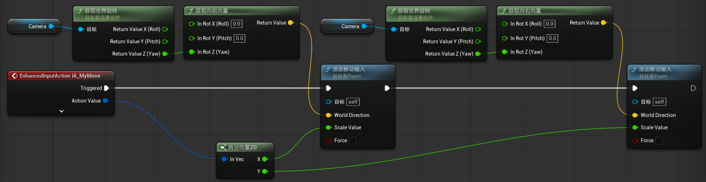
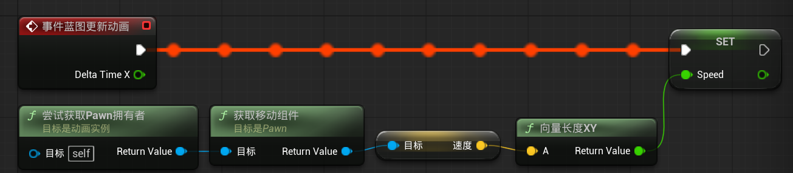
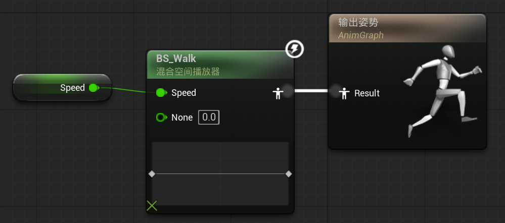

# 蓝图基础

构造脚本相当于构造函数，事件图表是触发器 + 函数的组合，左下角可以添加变量

<figure markdown="span">
  { width="800" }
  <figcaption markdown>事件开始时，打印字符串 `StringTest`</figcaption>
</figure>

框选蓝图节点，按 ++c++ 可以添加注释

## 1 实现玩家移动功能

创建第一人称模板项目

将默认控制的角色设置为自己的：

1. 创建自己的 BP_Character 和 BP_GameMode
2. 修改 BP_GameMode 的默认 Pawn 类为 BP_Character
3. 修改世界场景设置和项目设置中的默认游戏模式为 BP_GameMode

创建输入操作 IA_MyMove，修改值类型为 Vector2D

创建输入映射情景 IMC_Input，设置 WASD 按键映射

<figure markdown="span">
  { width="600" }
</figure>

<figure markdown="span">
  { width="600" }
</figure>

将 IMC_Input 绑定到 BP_Character 上，让 IMC_Input 控制 BP_Character

<figure markdown="span">
  { width="600" }
</figure>

在 BP_Character 中添加移动输入，实现玩家移动功能

<figure markdown="span">
  { width="600" }
</figure>

## 2 实现玩家视角移动功能

创建输入操作 IA_MyLook，修改值类型为 Vector2D

在 IMC_Input 中增加 IA_MyLook，设置鼠标的映射

<figure markdown="span">
  { width="600" }
</figure>

在 BP_Character 中添加 yaw 和 pitch 输入，实现玩家视角移动功能

<figure markdown="span">
  { width="600" }
</figure>

!!! tip "pitch, roll, yaw"

    1. 俯仰（Pitch）：控制沿水平（X）轴的旋转。更改此值会使对象向上或向下旋转，类似于点头
    2. 偏转（Yaw）：控制沿垂直（Y）轴的旋转。更改此值会使对象向左或向右旋转，类似于向左或向右转
    3. 滚动（Roll）：控制沿纵向（Z）轴的旋转。更改此值会使对象左右滚动，类似于将头向左或向右倾斜

    <figure markdown="span">
      { width="600" }
    </figure>

## 3 实现自动门功能

在 Fab 中添加 Wooden Door（@kellett66）到项目中

打开门框的网络体，修改视图模式为玩家碰撞，会发现门框中间的部分是实心的。点击碰撞 → 移除碰撞，会发现整个门框都变成了空的。点击碰撞 → 自动凹凸碰撞，ue 会自动帮我们生成碰撞范围

门和玩家是有交互的，不能单纯的拖到场景当中。

1. 创建一个 Actor 蓝图类 BP_Door
2. 组件中添加两个静态网络体组件 Door 和 DoorFrame（两者同级），并在右侧指定对应的模型，调整两者的位置
3. 添加一个 Box Collision，调整盒体范围和位置使其覆盖门，在事件中添加组件开始重叠时、组件结束重叠时触发器

在事件图表中添加“添加时间轴...”组件，打开后添加浮点型轨道，创建关键帧

<figure markdown="span">
  { width="600" }
</figure>

在事件图表中调整蓝图

<figure markdown="span">
  { width="600" }
</figure>

## 4 常用流程控制节点

1. branch：if-else 语句
2. flip flop：循环执行 A 语句和 B 语句
3. do once：只执行一次
4. sequence：依次执行后面的所有语句
5. delay：延迟一定的时间后执行后面的语句
6. for loop：for 循环
7. gate：open 引脚控制开，close 引脚控制关，toggle 引脚切换开关状态

## 5 制作第三人称运动系统

打开 BP_Character，选择网络体资产 SKM_Manny_Simple。胶囊体就是碰撞范围，调整网络体位置到胶囊体当中，胶囊体中间的箭头表示正前方

添加弹簧臂组件和摄像机组件（弹簧臂是摄像机的父类）

> 当视角移动到墙体的位置，摄像机会自动的往前移动，不会进到墙体里面，就像弹簧一样能够调节长度

在弹簧臂组件中勾选“使用Pawn控制旋转”，在类默认值中取消勾选“使用控制器旋转Yaw”，勾选“将旋转朝向运动”

调整蓝图角色移动的逻辑

<figure markdown="span">
  { width="800" }
</figure>

## 6 制作第三人称角色动画

创建动画蓝图 ABP_Main 和混合空间 BS_Walk，选择 SK_Mannequin 骨骼

> 混合空间可以将不同的动画混合起来，实现丝滑地过渡

打开 BS_Walk，水平坐标名称为 Speed，最大轴值 600，网格划分 2，勾选与网格对齐，平滑时间 0.2，平滑类型为立方；垂直坐标勾选与网格对齐

最左边拖入 MM_Idle，最右边拖入 MF_Unarmed_Jog_Fwd。++ctrl++ 预览发现，站立动作能够平滑过渡到跑步动作

打开 ABP_Main，在事件图表中编辑蓝图

<figure markdown="span">
  { width="600" }
</figure>

在 AnimGraph 中编辑蓝图

<figure markdown="span">
  { width="600" }
</figure>

回到 BP_Character 选择动画类为 ABP_Main