# 蓝图实战

## 1 创建项目并导入素材

创建一个空白项目，在项目根目录的 content 文件夹下导入素材

## 2 实现基础操作及动画

创建 IA_Look，IA_Move，IMC_Challenge。添加 WSAD 和鼠标映射

创建 BP_ChallengeMode，BP_ChallengeCharacter。BP_ChallengeCharacter 的网络体选择 SK_Adventure

打开 BP_ChallengeCharacter，添加弹簧体和摄像机组件

编辑 BP_ChallengeCharacter 事件图表蓝图，添加映射上下文

<figure markdown="span">
  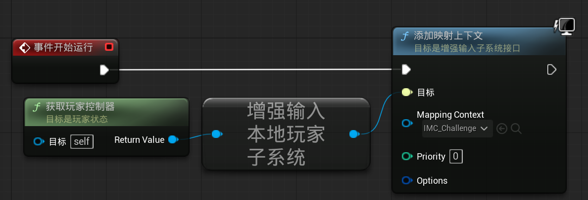{ width="600" }
</figure>

添加移动逻辑

<figure markdown="span">
  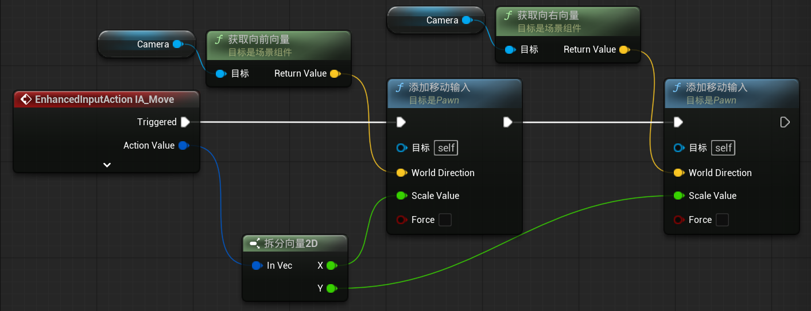{ width="600" }
</figure>

添加视角朝向逻辑

<figure markdown="span">
  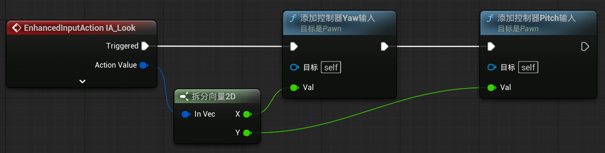{ width="600" }
</figure>

创建 ABP_ChallengeCharacter，混合空间 1D BS1D_Challenge

打开 BS1D_Challenge，创建从静止到跑动状态的动画

打开 ABP_ChallengeCharacter，编辑事件图表蓝图

<figure markdown="span">
  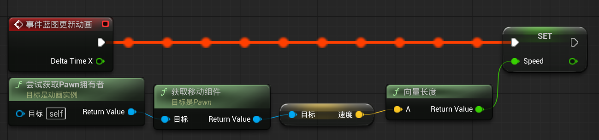{ width="600" }
</figure>

编辑 AnimGraph 蓝图

<figure markdown="span">
  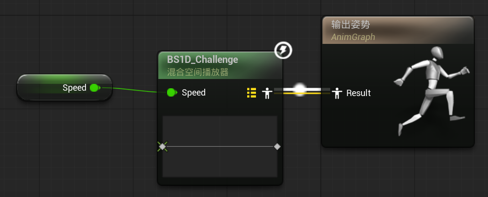{ width="600" }
</figure>

## 3 实现跳跃功能及 BUG 调试

创建 IA_Jump，在 IMC_Challenge 添加空格键的映射

打开 BP_ChallengeCharacter，编辑跳跃蓝图

<figure markdown="span">
  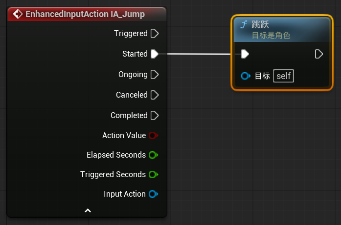{ width="600" }
</figure>

打开 ABP_ChallengeCharacter，编辑 AnimGraph，添加一个状态机 Basic

<figure markdown="span">
  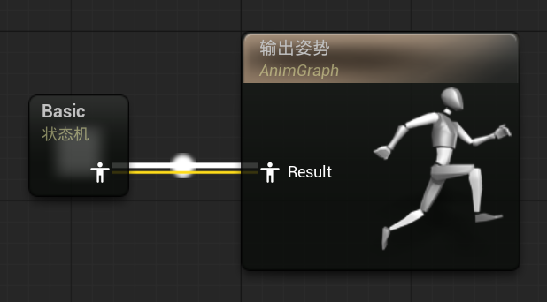{ width="600" }
</figure>

进入事件图表，编辑蓝图

<figure markdown="span">
  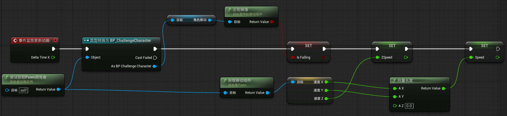{ width="800" }
</figure>

进入 Basic，编辑跳跃状态

<figure markdown="span">
  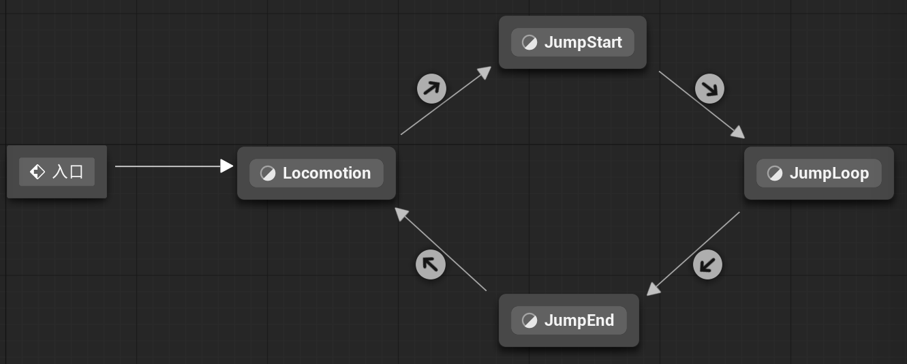{ width="600" }
</figure>

=== "Locomotion"

    <figure markdown="span">
      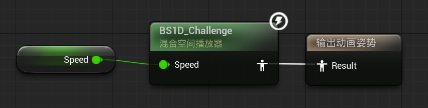{ width="600" }
    </figure>

=== "JumpStart"

    <figure markdown="span">
      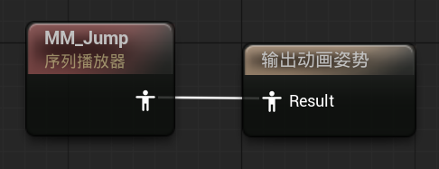{ width="600" }
    </figure>

=== "JumpLoop"

    <figure markdown="span">
      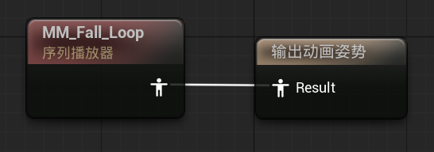{ width="600" }
    </figure>

=== "JumpEnd"

    <figure markdown="span">
      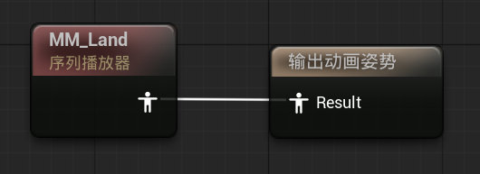{ width="600" }
    </figure>

编辑状态之间转移的条件

=== "Locomotion -> JumpStart"

    <figure markdown="span">
      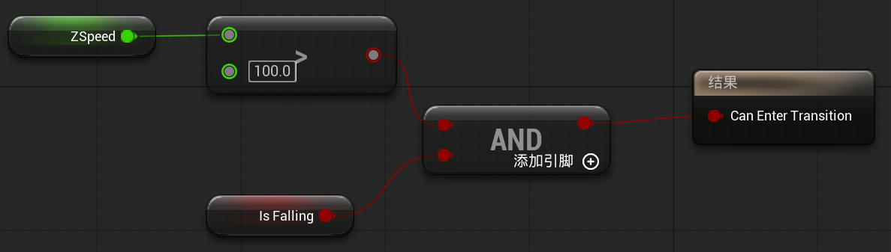{ width="600" }
    </figure>

=== "JumpStart -> JumpLoop"

    <figure markdown="span">
      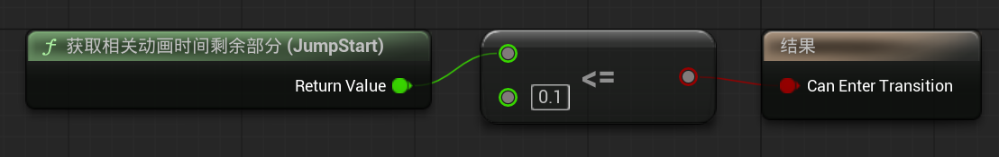{ width="600" }
    </figure>

=== "JumpLoop -> JumpEnd"

    <figure markdown="span">
      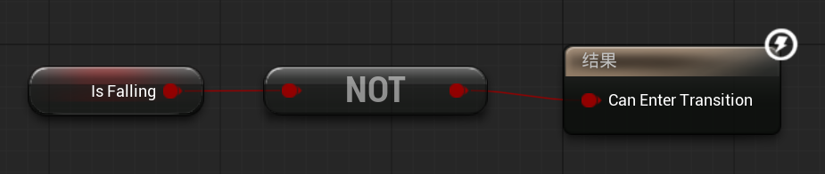{ width="600" }
    </figure>

=== "JumpEnd -> Locomotion"

    <figure markdown="span">
      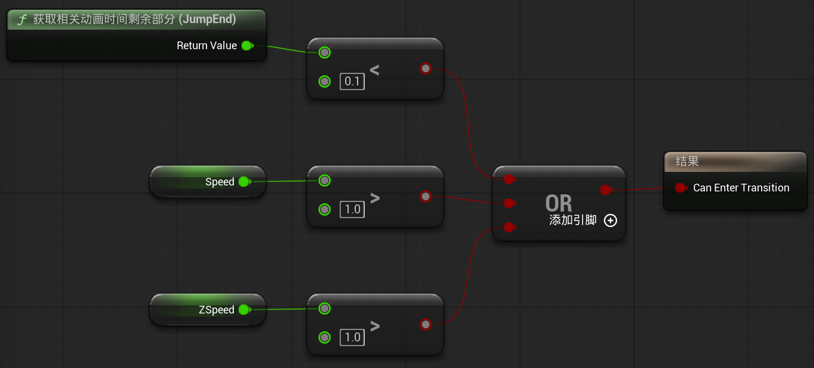{ width="600" }
    </figure>

## 4 实现场景机关陷阱的逻辑

创建 BP_Sphere，添加网络体组件 SM_Sphere，添加 Sphere Collision（SM_Sphere 是父类），移动到合适的位置

打开事件图表，编辑蓝图

<figure markdown="span">
  { width="600" }
</figure>

<figure markdown="span">
  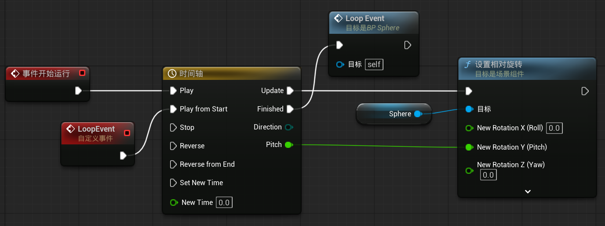{ width="600" }
</figure>

## 5 实现角色死亡布娃娃效果

打开 BP_ChallengeCharacter，编辑事件图表

<figure markdown="span">
  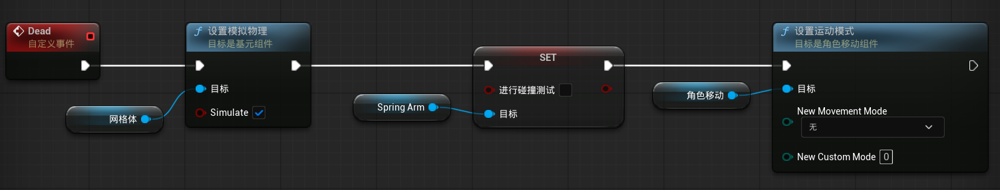{ width="600" }
</figure>

打开 BP_Sphere，编辑事件图表

<figure markdown="span">
  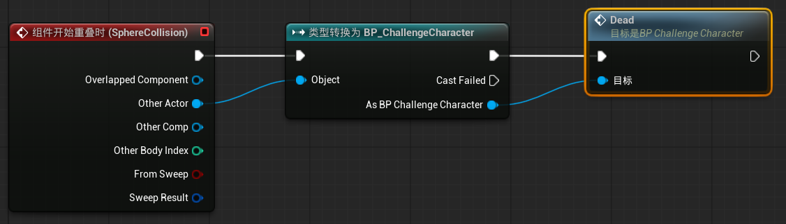{ width="600" }
</figure>

> 这是实现蓝图之间通信的一种方式，后面会介绍更高效、更专业的方式

打开 SK_Adventurer，选择物理资产 SK_Adventurer_Physics

打开 BP_ChallengeCharacter，修改碰撞预设为 PhysicsActor，将弹簧体组件作为网格体的子类
