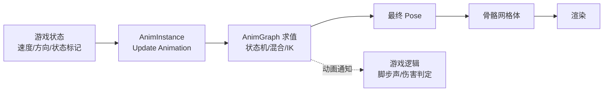
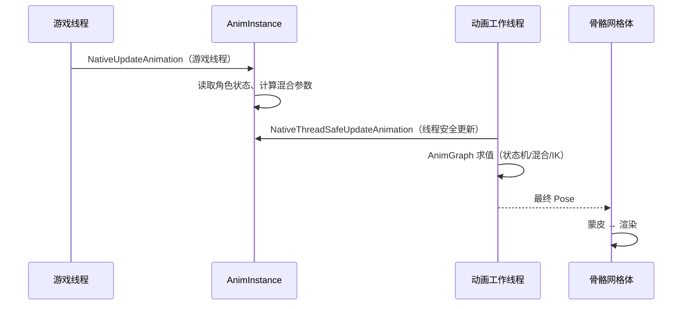

# 动画系统

UE5 的动画系统可以概括为：**资产（骨架 + 动画数据）→ 动画蓝图（决定"这一帧摆成什么姿态"）→ 骨骼网格体（渲染）**，再配合 **蒙太奇 + 动画通知** 与游戏逻辑打通、用 **IK / Control Rig** 做程序化修正

!!! info "一句话总结"

    - **资产层**：Skeleton（骨架）、Skeletal Mesh、Animation Sequence、Blend Space、Montage
    - **逻辑层**：**Animation Blueprint**（EventGraph 更新数据 + AnimGraph 计算姿态）
    - **交互层**：**AnimNotify / Montage**（把动画时刻暴露给游戏逻辑）
    - **程序化层**：**IK / Control Rig / Motion Warping**（让动画适应环境）



## 1 资产基础

| 资产 | 作用 |
| --- | --- |
| **Skeleton（骨架）** | 骨骼层级 + **Socket（挂点）** + Virtual Bone + 曲线，是动画资产的"公共骨架" |
| **Skeletal Mesh（骨骼网格体）** | 网格模型 + **蒙皮权重** + 材质 + LOD |
| **Animation Sequence（动画序列）** | 关键帧动画数据（从DCC 导入），最基本的一段动画 |
| **Blend Space（混合空间）** | 按参数（如速度/方向）在 **多个序列间连续插值**（1D/2D） |
| **Aim Offset** | 瞄准偏移混合空间（按俯仰/偏航叠加瞄准姿态） |
| **Animation Montage（蒙太奇）** | 可 **分段（Section）触发**、可叠加播放的动画集合，用于技能/连招 |
| **Curve（曲线）** | 动画携带的附加值（驱动变形、脚步、蒙太奇时间） |

!!! note "Socket 与蒙太奇的两大高频用途"

    - **Socket**：在骨骼上挂武器/特效/挂点（"右手武器槽"）
    - **Montage**：不做"一镜到底"的整段动画，而是切成 Section 随时跳转（连招、技能打断）

## 2 动画蓝图（Animation Blueprint）

### 2.1 两张图，各司其职

| 图 | 作用 | 能做什么 |
| --- | --- | --- |
| **EventGraph（事件图）** | 更新"动画要用到的数据" | 读角色状态、算混合参数、逻辑判断（普通蓝图逻辑） |
| **AnimGraph（动画图）** | 用数据 **算出这一帧的姿态（Pose）** | 状态机、混合、IK、程序化节点 |

**核心设计原则：EventGraph 负责"知道什么"，AnimGraph 负责"摆成什么样"**——状态机里只判断参数，不写游戏逻辑。

### 2.2 更新流程与线程模型



| 概念 | 说明 |
| --- | --- |
| `NativeUpdateAnimation` | **游戏线程** 执行，可自由访问 UObject |
| `NativeThreadSafeUpdateAnimation` | **工作线程** 执行，**只能访问线程安全的数据**（性能关键路径） |
| **AnimGraph 求值** | 在 **动画工作线程** 上并行进行（多个角色可并行） |
| `FAnimInstanceProxy` | 工作线程侧的代理对象，AnimGraph 实际在它上面求值 |
| **Property Access** | 把游戏线程的数据"搬"到动画线程的安全通道 |

!!! warning "工作线程里不能随便访问 UObject"

    AnimGraph 与线程安全更新运行在工作线程，**直接访问 UObject 属性是不安全的**。正确做法：

    1. 在 `NativeUpdateAnimation`（游戏线程）里把需要的数据 **算好并缓存到普通成员变量**
    2. 线程安全更新 / AnimGraph 只读这些缓存值
    3. 或使用 **Property Access** 节点声明"要到哪个对象的哪个属性"

    这也是"动画蓝图里访问角色数据常常很别扭"的根本原因——**线程模型限制**

### 2.3 AnimGraph 常用节点

| 节点 | 作用 |
| --- | --- |
| **State Machine** | 动画状态机（走/跑/跳/落地） |
| **Blend / Blend Poses** | 按 alpha 混合两个姿态 |
| **Blend Space Player** | 播放混合空间（速度+方向） |
| **Layered Blend Per Bone** | **按骨骼分层混合**（上半身射击 + 下半身跑） |
| **Aim Offset** | 叠加瞄准偏移 |
| **Slot** | 播放蒙太奇的目标槽位 |
| **Save / Use Cached Pose** | 缓存姿态，避免重复求值（性能优化） |
| **Modify Bone / Bone Transform** | 程序化修改单根骨骼 |
| **Two Bone IK / FABRIK / Leg IK** | 手/脚 IK 与地面贴合 |
| **Look At** | 骨骼朝向注视目标 |
| **Control Rig** | 接入 Control Rig 做程序化动画 |
| **Make / Break Transform 等工具节点** | 空间变换计算 |

## 3 动画状态机

- **State（状态）**：一段姿态来源（通常是 Blend Space 或 Sequence）
- **Transition（过渡）**：两个状态之间的切换规则（条件 + 混合时间 + 优先级）
- **Blend**：过渡时按时间插值
- 常用做法：状态机用"速度/是否落地/是否瞄准"等参数驱动，**参数在 EventGraph 里算好**

!!! info "状态机设计要点"

    1. 过渡条件尽量只依赖几个 **明确参数**（速度、状态枚举），避免复杂表达式
    2. 用好 **过渡的优先级与中断**，防止来回抖动（类似行为树的抢占）
    3. 复杂角色可拆成多个状态机（如"全身状态机 + 上半身状态机"）分别混合

## 4 蒙太奇与动画通知

### 4.1 蒙太奇（Montage）

| 概念 | 说明 |
| --- | --- |
| **Slot（槽位）** | 蒙太奇播放的"通道"（如 `UpperBody`、`FullBody`、`Additive`），AnimGraph 里用 Slot 节点接入 |
| **Section（段落）** | 蒙太奇的分段，可 **随时跳转**（连招第 2 段） |
| **Rate / Loop** | 播放速率、循环设置 |

```cpp
// C++ 播放蒙太奇
if (UAnimInstance* Anim = GetMesh()->GetAnimInstance())
{
    Anim->Montage_Play(AttackMontage, 1.2f);          // 播放
    Anim->Montage_JumpToSection(TEXT("Combo2"));       // 跳到某段
    Anim->Montage_Stop(0.2f, AttackMontage);           // 停止（带淡出）
}
```

### 4.2 动画通知（AnimNotify）

| 类型 | 特点 | 用途 |
| --- | --- | --- |
| **AnimNotify** | 某一 **时刻** 触发一次 | 脚步声、播放特效、生成弹道 |
| **AnimNotifyState** | 一段时间内 **持续**（有 Begin/End） | 武器碰撞体开关、无敌帧、伤害窗口 |

!!! tip "经典用法：技能 = 蒙太奇 + 通知"

    技能动画播放期间，用 **AnimNotifyState** 打开武器碰撞体（伤害判定窗口），用 **AnimNotify** 在准确时刻播放特效/音效/屏幕震动。这样**表现与判定精确对齐**，且美术改动画不用改代码

## 5 混合与分层

| 方式 | 说明 | 典型场景 |
| --- | --- | --- |
| **Blend Space** | 多段动画按参数 **连续插值** | 移动（速度 × 方向） |
| **Layered Blend Per Bone** | 按骨骼掩码 **上下身分层** | 边跑边射击、边跑边换弹 |
| **Aim Offset** | 在基础姿态上 **叠加** 瞄准偏移 | 身体不动、上半身看向目标 |
| **Additive（叠加）** | 在基础动画上加"增量"（如呼吸、受伤抖动） | 状态叠加 |

!!! note "本质：都在做局部空间插值"

    姿态由每根骨骼相对父骨骼的 Transform 组成；混合就是 **对每个骨骼的这些 Transform 做插值**。所以混合"上下身"才可行——按骨骼层级切开，各混各的

## 6 IK 与程序化动画

| 系统 | 作用 |
| --- | --- |
| **Two Bone IK / FABRIK / Leg IK** | 传统 IK 节点：让手/脚到达目标点（贴地、握持） |
| **IK Rig / IK Retargeter（UE5）** | 定义骨架的 IK 目标与重定向规则，**替代旧的 Retarget Manager**；不同骨架间复用动画 |
| **Control Rig（UE5）** | 用节点图 **程序化控制骨骼**（可接入 AnimGraph 或 Sequencer），做面部、尾巴、程序化姿态 |
| **Motion Warping（UE5）** | 运行时 **扭曲根运动** 去对齐目标（攻击贴住敌人、翻越贴住墙） |
| **Full Body IK** | 多骨骼联合 IK 求解（UE5 内置于 Control Rig） |

!!! info "为什么需要程序化动画"

    纯采样动画无法适应所有情况（地面高低不平、敌人位置不同、武器大小各异）。**IK 与运动扭曲负责"把动画对齐到真实世界"**，这是现代游戏"动画不穿帮"的关键

## 7 UE5 新特性速览

| 特性 | 说明 |
| --- | --- |
| **IK Rig / IK Retargeter** | 新的重定向与 IK 框架，跨骨架复用动画更省事 |
| **Control Rig** | 程序化动画图，可用于 AnimGraph 与 Sequencer |
| **Motion Warping** | 运行时对齐目标位置/朝向 |
| **Motion Matching（Pose Search）** | UE5.4+ 引入的数据驱动动画选择（按当前姿态与输入从动画库中"匹配"最合适的片段），大幅减少状态机复杂度 |
| **Animation Sharing** | 大量同类角色共享动画更新（人群、杂兵），显著省 CPU |
| **Animation Insights** | 动画性能剖析工具（配合 Unreal Insights） |
| **Anim Budget Allocator** | 动画预算分配器，控制大量角色动画的总开销 |

## 8 性能与优化

!!! warning "动画常见性能瓶颈"

    1. 复杂 AnimGraph（大量混合、IK）逐个角色求值 → CPU 压力
    2. 大量角色 **全帧率** 更新动画 → 应该降频
    3. 复杂的 AnimNotify 逻辑（每帧触发的通知）
    4. 动画蓝图里访问 UObject 导致线程切换/限制

| 优化手段 | 说明 |
| --- | --- |
| **URO（Update Rate Optimization）** | 远处角色 **降低动画更新频率**（`bEnableUpdateRateOptimizations`） |
| **LOD / 骨骼 LOD** | 远处减少骨骼数与求值复杂度 |
| **Animation Budget Allocator** | 按全局预算分配动画更新，动态降级 |
| **Animation Sharing** | 同类角色共享一次求值结果 |
| **Cached Pose** | 复用重复计算的姿态 |
| **压缩（Compression）** | 动画序列压缩，降低内存与采样成本 |
| **Anim Insights** | 定位哪段 AnimGraph 最耗 |

## 9 常见坑与最佳实践

!!! warning "常见坑"

    1. **在 AnimGraph 里写游戏逻辑**：应在 EventGraph 或角色类里算好，AnimGraph 只消费参数
    2. **忘记线程限制**：线程安全更新里访问 UObject → 报错或行为异常
    3. **Notify 逻辑过重**：Notify 会在每个播放该动画的角色上触发，别做遍历全场景的事
    4. **蒙太奇不设 Slot 或 Slot 未接入 AnimGraph**：播放了但看不到效果
    5. **所有角色都全帧更新**：大量 NPC 应启用 URO / Budget Allocator
    6. **改动骨骼结构后不重定向**：直接换骨架会导致动画错位（用 IK Retargeter）

!!! info "最佳实践"

    1. **EventGraph 算数据、AnimGraph 摆姿态**，职责清晰
    2. 状态机过渡条件**简单明确**，避免抖动
    3. 技能演出统一走 **Montage + Notify**，让表现与判定对齐
    4. 上下身分层用 **Layered Blend Per Bone**，而不是做两套完整动画
    5. 每加一个复杂 AnimGraph 节点都问一句"这对性能值不值"

!!! note "与其它笔记的联系"

    - **网络同步**：动画本身通常不复制，只复制"驱动动画的状态"（速度、状态标记），各端各自播放
    - **Gameplay 框架**：`ACharacter` 通过 `USkeletalMeshComponent` 承载动画
    - **角色/技能系统**：GAS 的技能通过 `PlayMontageAndWait` 等任务驱动蒙太奇
