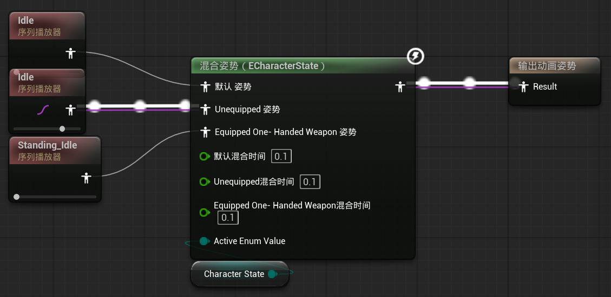
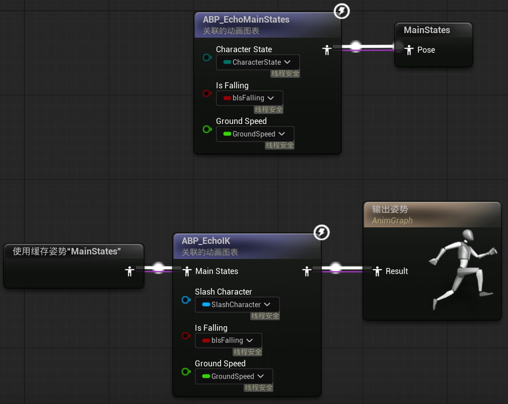
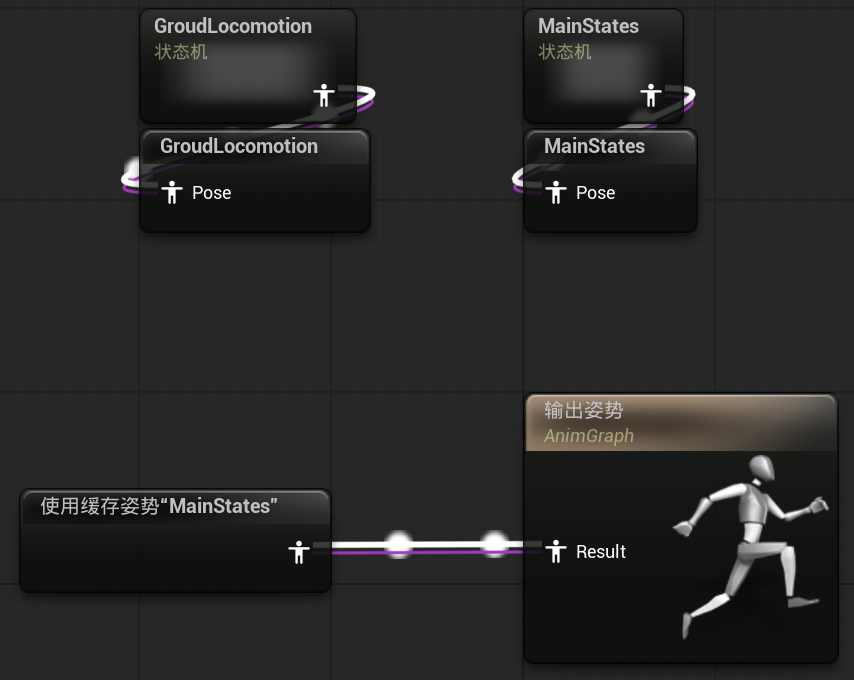
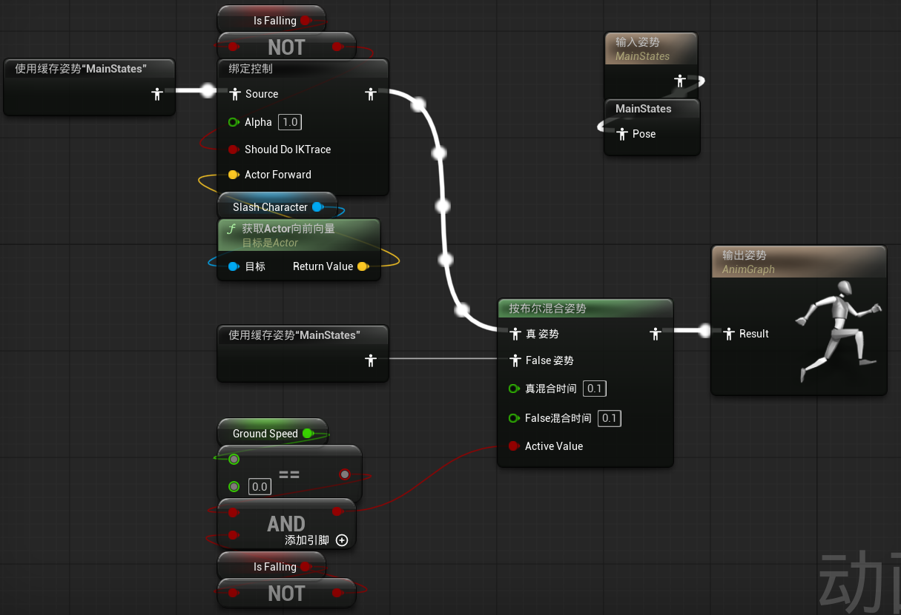

# 11 Weapon and IK Retargeter

## 090 The Weapon Class

基于 Item 类创建 C++ 文件 `Items/Weapons/Weapon.cpp`

```cpp linenums="1" title="Item.h"
class SLASH_API AItem : public AActor
{
protected:
	UFUNCTION()
	virtual void OnSphereOverlap(
		UPrimitiveComponent* OverlappedComponent, 
		AActor* OtherActor, 
		UPrimitiveComponent* OtherComp, 
		int32 OtherBodyIndex, 
		bool bFromSweep, 
		const FHitResult& SweepResult
	);
	UFUNCTION()
	virtual void OnSphereEndOverlap(
		UPrimitiveComponent* OverlappedComponent, 
		AActor* OtherActor, 
		UPrimitiveComponent* OtherComp, 
		int32 OtherBodyIndex
	);
};
```

```cpp linenums="1" title="Weapon.h"
class SLASH_API AWeapon : public AItem
{
	GENERATED_BODY()
	
protected:
	virtual void OnSphereOverlap(
		UPrimitiveComponent* OverlappedComponent, 
		AActor* OtherActor, 
		UPrimitiveComponent* OtherComp, 
		int32 OtherBodyIndex, 
		bool bFromSweep, 
		const FHitResult& SweepResult
	) override;
	
	virtual void OnSphereEndOverlap(
		UPrimitiveComponent* OverlappedComponent, 
		AActor* OtherActor, 
		UPrimitiveComponent* OtherComp, 
		int32 OtherBodyIndex
	) override;
};
```

```cpp linenums="1" title="Weapon.cpp"
void AWeapon::OnSphereOverlap(UPrimitiveComponent* OverlappedComponent, AActor* OtherActor,
	UPrimitiveComponent* OtherComp, int32 OtherBodyIndex, bool bFromSweep, const FHitResult& SweepResult)
{
	Super::OnSphereOverlap(OverlappedComponent, OtherActor, OtherComp, OtherBodyIndex, bFromSweep, SweepResult);
}

void AWeapon::OnSphereEndOverlap(UPrimitiveComponent* OverlappedComponent, AActor* OtherActor,
	UPrimitiveComponent* OtherComp, int32 OtherBodyIndex)
{
	Super::OnSphereEndOverlap(OverlappedComponent, OtherActor, OtherComp, OtherBodyIndex);
}
```

## 091 Sockets

## 092 Downloading Animations

可以从 Mixamo 上下载

## 093 IK Rig

创建 IK 绑定文件 IK_XBot，给 XBot 创建骨骼链的重定向

创建 IK 绑定文件 IK_Echo，给 Echo 创建骨骼链的重定向

## 094 IK Retargeter

## 095 Attaching the Sword

```cpp linenums="1" title="Item.h"
class SLASH_API AItem : public AActor
{
protected:
	UPROPERTY(VisibleAnywhere, BlueprintReadOnly)
	TObjectPtr<UStaticMeshComponent> ItemMesh;
};
```

```cpp linenums="1" title="Weapon.cpp"
void AWeapon::OnSphereOverlap(UPrimitiveComponent* OverlappedComponent, AActor* OtherActor,
                              UPrimitiveComponent* OtherComp, int32 OtherBodyIndex, bool bFromSweep, const FHitResult& SweepResult)
{
	Super::OnSphereOverlap(OverlappedComponent, OtherActor, OtherComp, OtherBodyIndex, bFromSweep, SweepResult);

	ASlashCharacter* SlashCharacter = Cast<ASlashCharacter>(OtherActor);
	if (SlashCharacter)
	{
		FAttachmentTransformRules TransformRules(EAttachmentRule::SnapToTarget, true);
		ItemMesh->AttachToComponent(SlashCharacter->GetMesh(), TransformRules, FName("RightHandSocket"));
	}
}
```

## 096 Picking Up Items

```cpp linenums="1" title="Item.cpp"
void AItem::OnSphereOverlap(UPrimitiveComponent* OverlappedComponent, AActor* OtherActor,
	UPrimitiveComponent* OtherComp, int32 OtherBodyIndex, bool bFromSweep, const FHitResult& SweepResult)
{
	ASlashCharacter* SlashCharacter = Cast<ASlashCharacter>(OtherActor);
	if (SlashCharacter)
	{
		SlashCharacter->SetOverlappingItem(this);
	}
}

void AItem::OnSphereEndOverlap(UPrimitiveComponent* OverlappedComponent, AActor* OtherActor,
	UPrimitiveComponent* OtherComp, int32 OtherBodyIndex)
{
	ASlashCharacter* SlashCharacter = Cast<ASlashCharacter>(OtherActor);
	if (SlashCharacter)
	{
		SlashCharacter->SetOverlappingItem(nullptr);
	}
}
```

```cpp linenums="1" title="SlashCharacter.h"
class SLASH_API ASlashCharacter : public ACharacter
{
public:
	FORCEINLINE void SetOverlappingItem(AItem* Item) { OverlappingItem = Item; }
	
protected:
	UPROPERTY(EditDefaultsOnly, Category = "CInput")
	TObjectPtr<UInputAction> EquipAction;
	
	void Equip(const FInputActionValue& Value);
	
private:
	UPROPERTY(VisibleInstanceOnly)
	TObjectPtr<AItem> OverlappingItem;
};
```

```cpp linenums="1" title="SlashCharacter.cpp"
void ASlashCharacter::Equip(const FInputActionValue& Value)
{
	AWeapon* OverlappingWeapon = Cast<AWeapon>(OverlappingItem);
	if (OverlappingWeapon)
	{
		OverlappingWeapon->Equip(GetMesh(), FName("RightHandSocket"));
	}
}

void ASlashCharacter::SetupPlayerInputComponent(UInputComponent* PlayerInputComponent)
{
	Super::SetupPlayerInputComponent(PlayerInputComponent);
	
	if (UEnhancedInputComponent* EnhancedInputComponent= CastChecked<UEnhancedInputComponent>(PlayerInputComponent))
	{
		EnhancedInputComponent->BindAction(EquipAction, ETriggerEvent::Triggered, this, &ASlashCharacter::Equip);
	}
}
```

```cpp linenums="1" title="Weapon.h"
class SLASH_API AWeapon : public AItem
{
public:
	void Equip(USceneComponent* InParent, FName InSocketName);
};
```

```cpp linenums="1" title="Weapon.cpp"
void AWeapon::Equip(USceneComponent* InParent, FName InSocketName)
{
	FAttachmentTransformRules TransformRules(EAttachmentRule::SnapToTarget, true);
	ItemMesh->AttachToComponent(InParent, TransformRules, InSocketName);
}
```

## 097 Enum for Character State

```cpp linenums="1" title="CharacterTypes.h"
UENUM(BlueprintType)
enum class ECharacterState : uint8
{
	ECS_Unequipped UMETA(DisplayName = "Unequipped"),
	ECS_EquippedOneHandedWeapon UMETA(DisplayName = "Equipped One-Handed Weapon"),
	ECS_EquippedTwoHandedWeapon UMETA(DisplayName = "Equipped Two-Handed Weapon")
};
```

```cpp linenums="1" title="SlashCharacter.h"
class SLASH_API ASlashCharacter : public ACharacter
{
public:
	FORCEINLINE void SetOverlappingItem(AItem* Item) { OverlappingItem = Item; }
	FORCEINLINE ECharacterState GetCharacterState() const { return CharacterState; }
}
```

```cpp linenums="1" title="SlashAnimInstance.h"
class SLASH_API USlashAnimInstance : public UAnimInstance
{
public:
	ECharacterState CharacterState;
};
```

```cpp linenums="1" title="SlashAnimInstance.cpp"
void USlashAnimInstance::NativeUpdateAnimation(float DeltaTime)
{
	Super::NativeUpdateAnimation(DeltaTime);
	
	if (SlashCharacterMovement)
	{
		GroundSpeed = UKismetMathLibrary::VSizeXY(SlashCharacterMovement->Velocity);
		bIsFalling = SlashCharacterMovement->IsFalling();
		CharacterState = SlashCharacter->GetCharacterState();
	}
}
```

## 098 Switching Animation Poses

<figure markdown="span">
  { width="600" }
</figure>

## 099 Equipped Animations

## 100 Multiple Animation Blueprints

ABP_Echo

<figure markdown="span">
  { width="600" }
</figure>

ABP_EchoMainStates

<figure markdown="span">
  { width="600" }
</figure>

ABP_EchoIK

<figure markdown="span">
  { width="600" }
</figure>