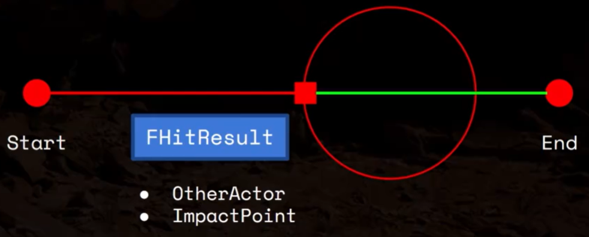
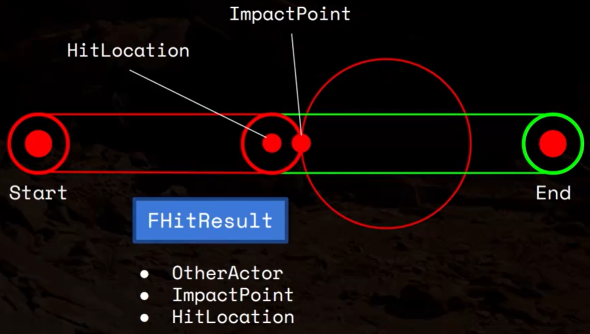
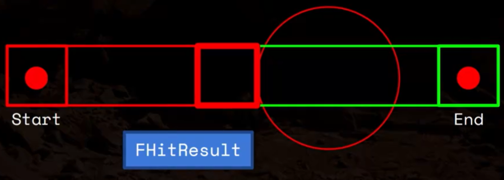

# 13 Collision Detection

## 117 Collision Box

## 118 Tracing

<figure markdown="span">
  { width="600" }
</figure>

<figure markdown="span">
  { width="600" }
</figure>

<figure markdown="span">
  { width="600" }
</figure>

## 119 Box Trace in C++

## 120 Dynamic Arrays

## 121 Disabling Weapon Box Collision

## 122 Unreal Interfaces

UInterface 是给虚幻引擎的“反射系统”看的，IInterface 是给 C++ 程序员“真正使用”的

## 123 Enemies

## 124.1 Root Motion Animations

## 124.2 Implementing Interfaces

## 125 Hit React Montage

## 126 Playing the Hit React Montage

## 127 Dot Product

## 128 Cross Product

## 129 Directional Hit Reactions

## 130 One Hit Per Swing

## 131 Hit Sounds

## 132 Hit Particles

## 133 Weapon Trails
