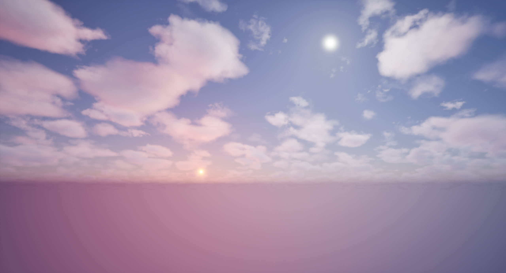
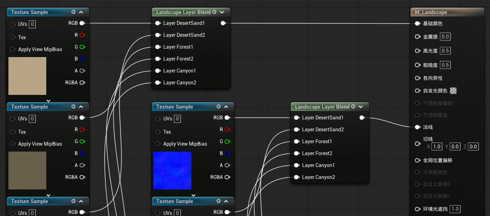

# Section 2

## 010 Open World

创建一个空的开放世界地图并保存为 Maps/SlashOpenWorld

## 011 Lighting and Atmosphere

!!! info "Sky Atmosphere（天空大气）"

    这是一个基于物理的体积大气模型，用于模拟行星（如地球）的大气层对光线的散射

    1. 生成动态天空：根据太阳的位置、大气成分自动计算天空颜色（晴天蓝色、日落橙红色）
    2. 产生大气透视：远处物体因空气散射而变得模糊、偏蓝（或偏暖）
    3. 模拟星球曲率：可控制大气高度、衰减方式，甚至表现火星等其他行星的大气
    4. 影响雾和体积云：与 Exponential Height Fog、Volumetric Cloud 交互，使效果一致
    
    Sky Atmosphere 本身不是光源，它必须配合 Directional Light 才能显示正确颜色

!!! info "Directional Light（定向光源）"

    这是模拟太阳或月亮的平行光源，光线方向一致、强度均匀

    1. 提供直接照明：照亮场景中的所有物体（漫反射和高光）
    2. 投射阴影：产生锐利或柔和的长阴影
    3. 控制天色核心：它的角度、颜色、强度是 Sky Atmosphere 计算散射的依据

打开放置 Actor 面板

<figure markdown="span">
  { width="200" }
</figure>

1. 添加天空大气、2 个定向光源
2. 设置 DirectionalLight2 的大气太阳光索引为 1
3. ++ctrl+l++ 旋转第一个太阳，++ctrl+shift+l++ 旋转第二个太阳
4. 分别命名为 Sun0，Sun1
5. 都修改为可移动

!!! info "Sky Light（天空光照）"

    模拟来自天空（以及环境中其他大型物体）的间接/环境光照（来自四面八方，很柔和）

    1. 填充阴影：避免背光面或阴影区域完全死黑，提供基础照明
    2. 捕捉天空颜色：将天空（包括 Sky Atmosphere 计算的天空球）的颜色和亮度，作为环境光投射到场景中
    3. 产生漫反射环境光：光线均匀地从各个方向照射物体，产生柔和、无方向性的照明

    Sky Light 会捕获一张环境立方体贴图，代表它周围 360 度的光照信息。实时捕获（Real-time）会每帧重新捕获场景上半球（天空+远处物体）的亮度，适用于动态天气、昼夜变化

添加天空光照，设置为可移动，勾选实时捕获

!!! info "Exponential Height Fog（指数高度雾）"

    这是一个基于物理的大气雾效，模拟雾、霾、烟尘等随高度指数衰减的视觉效果。与传统的线性雾不同，它的密度随高度指数级减少（地面最浓，越往上越稀薄）

    1. 大气透视增强：远处物体逐渐融入背景色（雾的颜色），强化距离感
    2. 层次感：山峰、高楼底部被雾笼罩，顶部清晰可见
    3. 柔和背景：隐藏远处的 LOD 切换或物体突然出现的边缘
    4. 性能优化：可配合距离剔除，减少远处物体的渲染开销

!!! info "Volumetric Clouds（体积云）"

    这是一个真正的三维云系统，使用噪声和体积渲染技术生成具有厚度、光影和动态变化的云层。不同于传统的云贴图（始终面向摄像机），体积云是真实存在于三维空间中的体积

    1. 真实的云形状：基于程序化噪声生成（并非预制模型）
    2. 光影交互：云会接受 Directional Light 的光照，产生自阴影和高光
    3. 与大气融合：颜色受 Sky Atmosphere 影响（日出日落时云变成橙红色）
    4. 动态变化：云可以飘移、消散、改变形状
    5. 性能可控：通过分辨率、采样次数等参数平衡画质和性能

1. 添加指数级高度雾，调整雾密度为 0.01
2. 添加体积云

---

1. 选择 Sun0，勾选使用色温，可以调整太阳的温度，设置为 3000
2. 选择 Sun1，设置温度为 10000

移动他们两个的位置，会产生不同的光照效果

<figure markdown="span">
  { width="600" }
</figure>

## 012 Landscape

在地形模式下，创建一个组件数量为 32 x 32 的地形，开始雕刻地形！

## 013 Landscape Material

去 Fab 下载一些材质资源

创建一个材质 Landscape/M_Landscape，打开编辑

1. 勾选完全粗糙
2. 创建一个 Landscape Layer Blend 节点

    1. 添加图层 DesertSand1、DesertSand2、Forest1、Forest2、Canyon1、Canyon2

3. 把下载的各个材质资源的基础颜色纹理资源拖到蓝图编辑器里，经过 Landscape Layer Blend 节点连接到基础颜色
4. 把下载的各个材质资源的法线纹理资源拖进来，经过 Landscape Layer Blend 节点连接到法线

<figure markdown="span">
  { width="600" }
</figure>

1. 把 M_Landscape 填入关卡的 Landscape 的地形材质中
2. 打开地形模式，绘制模式，从现有材质创建层，点击每个图层的小加号，创建层信息，修改这些层信息文件的混合方法为 Advanced Weight Blending
3. 接下来就可以给地形绘制材质了

## 014 Landscape Painting
