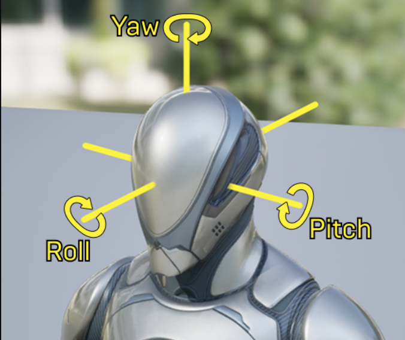

# 3 向量

## 031 Rotators

!!! tip "pitch, roll, yaw"

    1. 俯仰（Pitch）：控制沿水平（X）轴的旋转。更改此值会使对象向上或向下旋转，类似于点头
    2. 偏转（Yaw）：控制沿垂直（Y）轴的旋转。更改此值会使对象向左或向右旋转，类似于向左或向右转
    3. 滚动（Roll）：控制沿纵向（Z）轴的旋转。更改此值会使对象左右滚动，类似于将头向左或向右倾斜

    <figure markdown="span">
      { width="600" }
    </figure>

旋转向量 (pitch, yaw, roll)