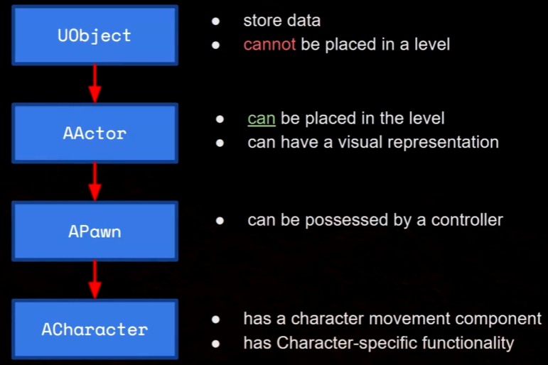
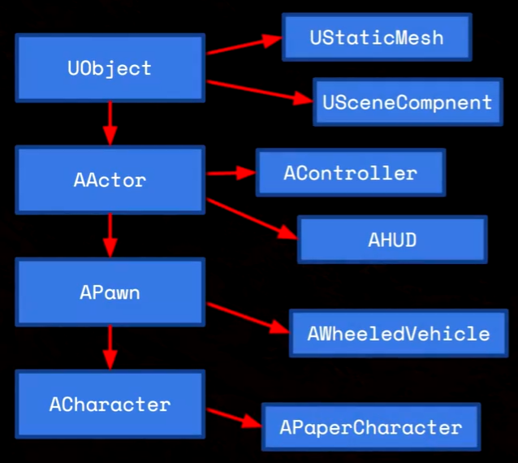
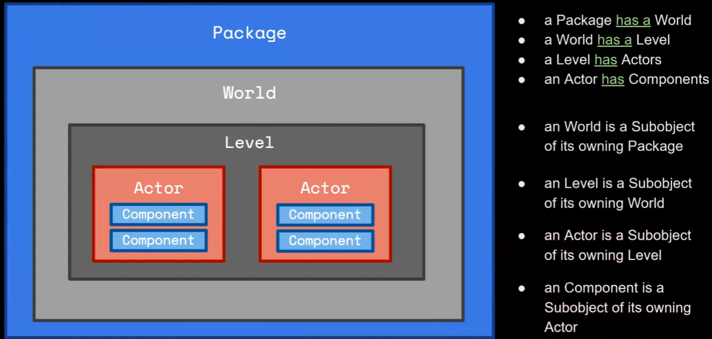
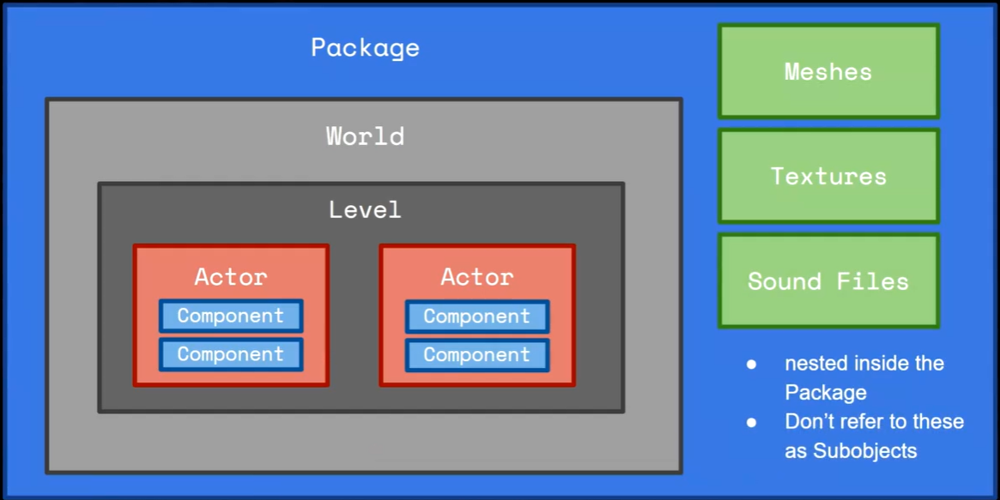

# 4 C++

## 034 Setting Up Visual Studio

工作负载选择：

1. Desktop development with C++
2. .NET desktop development
3. Game development with C++

## 035 C++ Refresher

UE5 中的继承

<figure markdown="span">
  { width="600" }
</figure>

<figure markdown="span">
  { width="600" }
</figure>

UE5 中类之间的关系

<figure markdown="span">
  { width="600" }
</figure>

<figure markdown="span">
  { width="600" }
</figure>

## 036 Reflection and Garbage Collection

UE5 通过反射机制从 C++ 代码中获取信息到蓝图当中

1. 在类声明顶部写上 `UCLASS` 宏，这个类就可以参与反射系统和垃圾回收
2. 变量用 `UPROPERTY`
3. 函数用 `UFUNCTION`

使用反射系统的文件顶部都有一个特殊的包含文件 `ClassName.generated.h`，里面是 UE5 因为这些宏自动生成的代码

U 类内部有 `GENERATED_BODY` 宏，这是一段 UE5 头工具自动生成的代码