# 9

## 078 The Animation Blueprint

基于 Echo_Skeleton 创建动画蓝图 ABP_Echo

<figure markdown="span">
  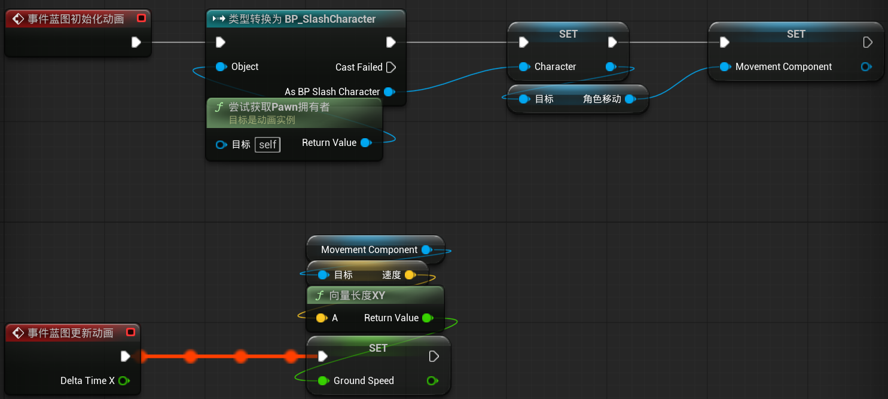{ width="600" }
</figure>

<figure markdown="span">
  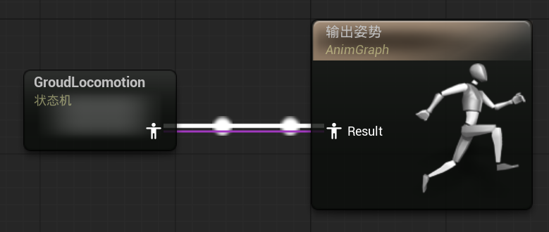{ width="600" }
</figure>

<figure markdown="span">
  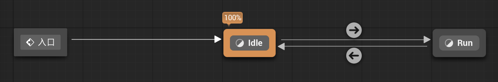{ width="600" }
</figure>

=== "Idle"

    <figure markdown="span">
      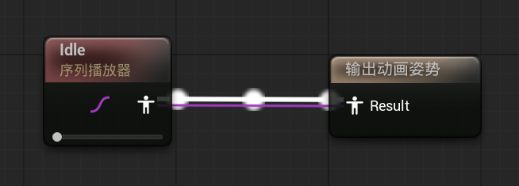{ width="600" }
    </figure>

=== "Run"

    <figure markdown="span">
      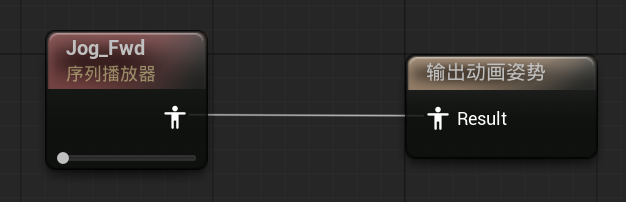{ width="600" }
    </figure>

=== "Idle to Run"

    <figure markdown="span">
      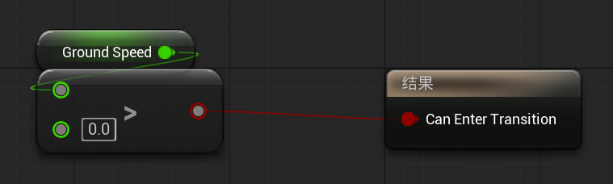{ width="600" }
    </figure>

=== "Run to Idle"

    <figure markdown="span">
      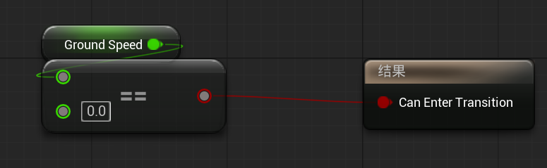{ width="600" }
    </figure>

## 079 The Anim Instance

基于 AnimInstance 创建一个 C++ 文件 `SlashAnimInstance`

```cpp linenums="1" title="SlashAnimInstance.h"
class SLASH_API USlashAnimInstance : public UAnimInstance
{
	GENERATED_BODY()
	
public:
	virtual void NativeInitializeAnimation() override;
	virtual void NativeUpdateAnimation(float DeltaTime) override;
	
	UPROPERTY(BlueprintReadOnly)
	TObjectPtr<ASlashCharacter> SlashCharacter;
	UPROPERTY(BlueprintReadOnly, Category = "CMovement")
	TObjectPtr<UCharacterMovementComponent> SlashCharacterMovement;
	UPROPERTY(BlueprintReadOnly, Category = "CMovement")
	float GroundSpeed;
};
```

```cpp linenums="1" title="SlashAnimInstance.cpp"
void USlashAnimInstance::NativeInitializeAnimation()
{
	Super::NativeInitializeAnimation();
	
	SlashCharacter = Cast<ASlashCharacter>(TryGetPawnOwner());
	if (SlashCharacter)
	{
		SlashCharacterMovement = SlashCharacter->GetCharacterMovement();
	}
}

void USlashAnimInstance::NativeUpdateAnimation(float DeltaTime)
{
	Super::NativeUpdateAnimation(DeltaTime);
	
	if (SlashCharacterMovement)
	{
		GroundSpeed = UKismetMathLibrary::VSizeXY(SlashCharacterMovement->Velocity);
	}
}
```

## 090 Jumping

```cpp linenums="1" title="SlashCharacter.h"
class SLASH_API ASlashCharacter : public ACharacter
{
protected:
	UPROPERTY(EditDefaultsOnly, Category = "CInput")
	TObjectPtr<UInputAction> JumpAction;
	
	void Jump(const FInputActionValue& Value);
};
```

```cpp linenums="1" title="SlashCharacter.cpp"
void ASlashCharacter::Jump(const FInputActionValue& Value)
{
	ACharacter::Jump();
}

void ASlashCharacter::SetupPlayerInputComponent(UInputComponent* PlayerInputComponent)
{
	Super::SetupPlayerInputComponent(PlayerInputComponent);
	
	if (UEnhancedInputComponent* EnhancedInputComponent= CastChecked<UEnhancedInputComponent>(PlayerInputComponent))
	{
		EnhancedInputComponent->BindAction(JumpAction, ETriggerEvent::Triggered, this, &ASlashCharacter::Jump);
	}
}
```

## 091 Jump Animations

```cpp linenums="1" title="SlashAnimInstance.h"
class SLASH_API USlashAnimInstance : public UAnimInstance
{
public:
	UPROPERTY(BlueprintReadOnly, Category = "CMovement")
	bool bIsFalling;
};
```

```cpp linenums="1" title="SlashAnimInstance.cpp"
void USlashAnimInstance::NativeUpdateAnimation(float DeltaTime)
{
	Super::NativeUpdateAnimation(DeltaTime);
	
	if (SlashCharacterMovement)
	{
		GroundSpeed = UKismetMathLibrary::VSizeXY(SlashCharacterMovement->Velocity);
		bIsFalling = SlashCharacterMovement->IsFalling();
	}
}
```

<figure markdown="span">
  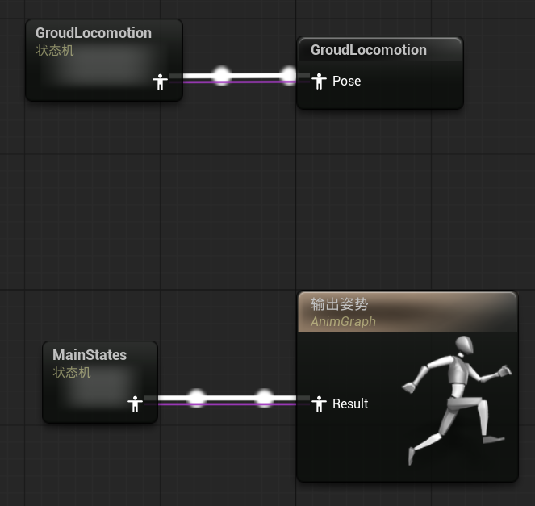{ width="600" }
</figure>

<figure markdown="span">
  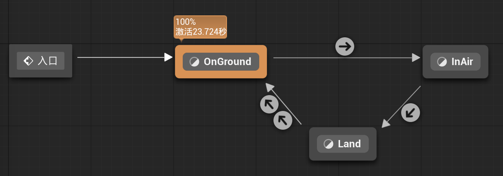{ width="600" }
</figure>

=== "OnGround"

    <figure markdown="span">
      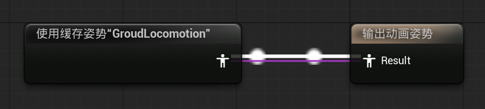{ width="600" }
    </figure>

=== "InAir"

    <figure markdown="span">
      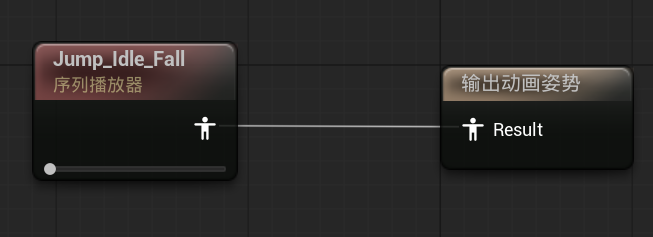{ width="600" }
    </figure>

=== "Land"

    <figure markdown="span">
      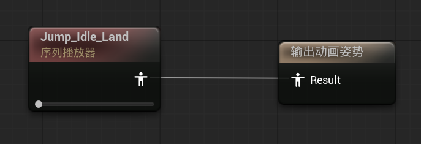{ width="600" }
    </figure>

=== "OnGround to InAir"

    <figure markdown="span">
      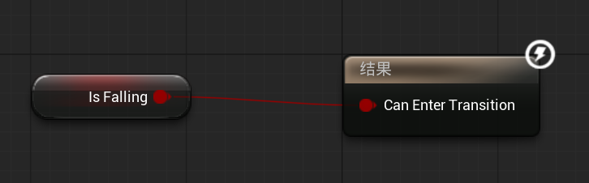{ width="600" }
    </figure>

=== "InAir to Land"

    <figure markdown="span">
      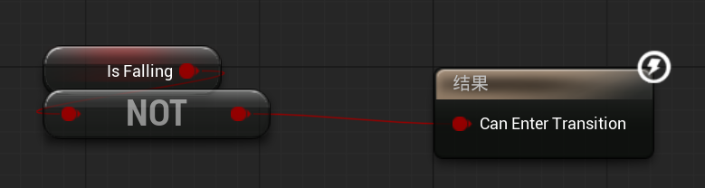{ width="600" }
    </figure>

=== "Land to OnGround"

    其中一个勾选基于状态中序列播放器的自动规则

    另外一个

    <figure markdown="span">
      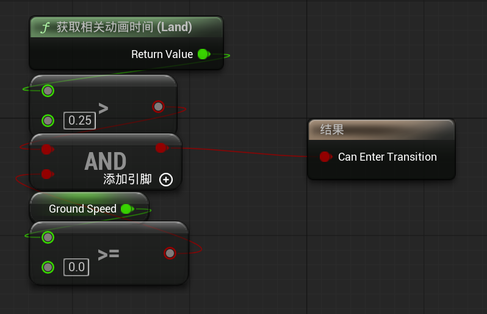{ width="600" }
    </figure>

## 082 Inverse Kinematics

