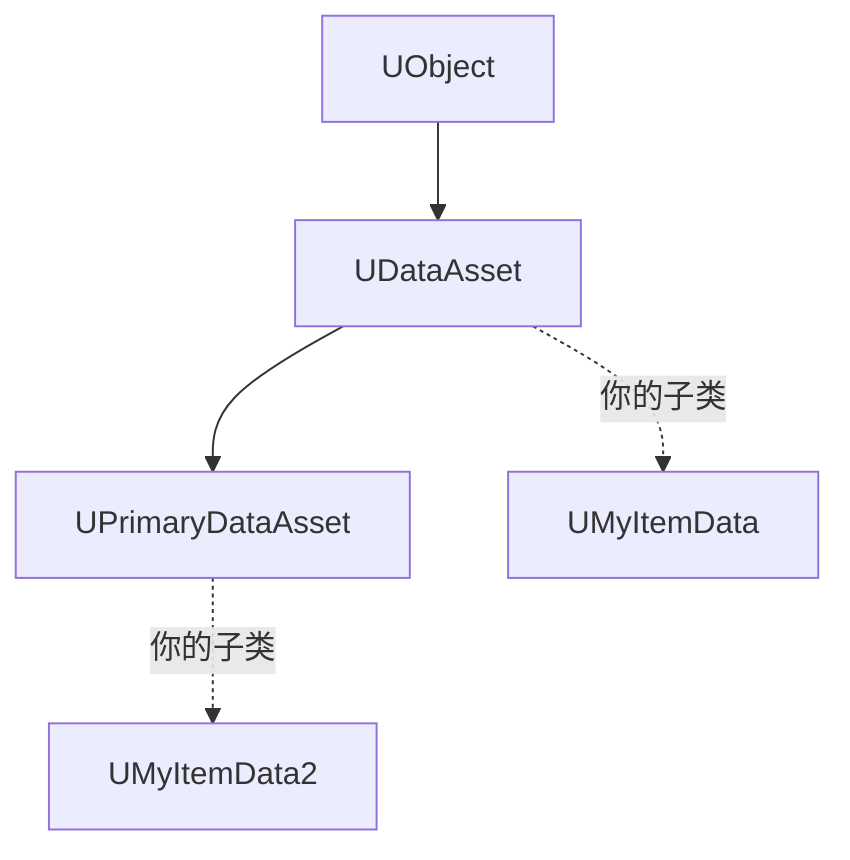

# UDataAsset

**UDataAsset** 是 UE 中专门用于存放 **静态配置数据** 的 `UObject` 基类：它本身 **不含逻辑**，只是"数据的容器"，可以在内容浏览器中被创建为 **独立资产**、用编辑器可视化配置、被代码和其他资产引用

!!! info "一句话总结"

    UDataAsset = **把配置从代码里搬出来变成资产**：C++ 定义"有哪些字段"，设计师在编辑器里填值；它是 **只读的定义（Definition）**，运行时状态应放到 UObject 实例上

## 1 是什么

### 1.1 两个关键类

| 类 | 说明 |
| --- | --- |
| `UDataAsset` | 基础数据资产。可被引用、可加载，但 **Asset Manager 不识别**（没有主资产 ID） |
| `UPrimaryDataAsset` | 继承自 `UDataAsset`，额外实现 `GetPrimaryAssetId()`，可交给 **Asset Manager** 做按需加载、打包分组 |

### 1.2 继承链位置



因为它是 `UObject`，所以它天然享有反射、GC、序列化、编辑器集成等一切 UObject 能力

## 2 为什么需要它

| 做法 | 问题 |
| --- | --- |
| **硬编码在 C++** | 改数值要改代码、重编译；策划无法参与 |
| **放在 Config/ini** | 无类型检查、无引用能力、无编辑器 UI |
| **UDataAsset** | 类型安全、可视化配置、支持嵌套与引用、支持继承、可被资源管理器管理 |

一句话：它是 **数据驱动设计** 的标准载体——用"资产"描述"这一类东西是什么"，代码只负责读取和使

## 3 基本用法

### 3.1 定义 C++ 子类

```cpp
#include "Engine/DataAsset.h"

UCLASS(BlueprintType)
class UMyItemData : public UPrimaryDataAsset
{
    GENERATED_BODY()

public:
    UPROPERTY(EditAnywhere, Category = "Item")
    FName Id;                                  // mymod:diamond_sword

    UPROPERTY(EditAnywhere, Category = "Item")
    FText DisplayName;                         // 本地化文本

    UPROPERTY(EditAnywhere, Category = "Item")
    int32 StackSize = 64;

    UPROPERTY(EditAnywhere, Category = "Item")
    float AttackDamage = 7.f;

    // 软引用：不强制加载，避免打包连锁
    UPROPERTY(EditAnywhere, Category = "Item")
    TSoftObjectPtr<UTexture2D> Icon;

    // 让 Asset Manager 能管理它
    virtual FPrimaryAssetId GetPrimaryAssetId() const override
    {
        return FPrimaryAssetId(TEXT("Item"), GetFName());
    }
};
```

### 3.2 创建资产实例（编辑器）

内容浏览器 → 右键 → **Miscellaneous → Data Asset** → 选择 `UMyItemData` 类 → 命名（如 `DA_DiamondSword`）→ 在细节面板填值。

- 也可以创建 C++ 类的 **蓝图子类**，再基于蓝图创建 Data Asset 实例
- 每个配置一个资产文件（`.uasset`）

### 3.3 在代码中使用

```cpp
// 硬引用：加载包含它的对象时，资产一起加载
UPROPERTY(EditAnywhere)
TObjectPtr<UMyItemData> DefaultWeapon;

// 使用
const float Damage = DefaultWeapon->AttackDamage;
```

!!! warning "必须标 UPROPERTY"

    不加 `UPROPERTY()` 的指针不会被序列化、不会被 GC 追踪、编辑器里也不显示——DataAsset 的所有配置字段都必须加

## 4 引用方式：硬引用 vs 软引用

| 方式 | 行为 | 适用 |
| --- | --- | --- |
| **硬引用**（`TObjectPtr<T>`） | 加载/打包时 **连带** 拉入目标资产 | 一定用得到的依赖 |
| **软引用**（`TSoftObjectPtr<T>`） | 只存路径，**需要时才加载** | 图标、模型、大资源、可选依赖 |
| **软类引用**（`TSoftClassPtr<T>`） | 同上，针对类 | 需要生成时才加载的类 |

```cpp
// 软引用加载
if (UTexture2D* Tex = Icon.LoadSynchronous()) { /* 用 */ }
// 或异步：Icon.ToSoftObjectPath() + StreamableManager
```

!!! info "为什么强调软引用"

    DataAsset 之间的硬引用会把一堆资产"串"在一起，最终导致 **打包体积膨胀、加载变慢**。表现层资源（图标、网格、音效）通常应该用软引用按需加载

## 5 UPrimaryDataAsset 与 Asset Manager

`UPrimaryDataAsset` 的价值在于能被 **Asset Manager** 管理：

1. **Project Settings → Asset Manager → Primary Asset Types to Scan** 里注册类型（如 `Item`）
2. 代码中按主资产 ID 做批量/异步加载：

```cpp
UAssetManager& AM = UAssetManager::Get();
const FPrimaryAssetId ItemId(TEXT("Item"), TEXT("DA_DiamondSword"));

TArray<FName> Bundles;   // 可指定要加载的 bundle
AM.LoadPrimaryAsset(ItemId, Bundles,
    FStreamableDelegate::CreateUObject(this, &UMyClass::OnItemLoaded));

// 加载完成后
UMyClass::OnItemLoaded() { /* AM.GetPrimaryAssetObject(ItemId) */ }
```

带来的能力：

| 能力 | 说明 |
| --- | --- |
| **按需加载** | 只在需要时加载某类数据资产，减少启动开销 |
| **批量加载** | 一次性加载某类型的全部资产 |
| **打包分组（Chunk）** | 控制资产进哪个包，服务 DLC / 分卷下载 |
| **统一 ID** | 用"类型 + 名称"引用资产，而非硬路径 |

## 6 DataAsset vs DataTable：如何选

| 维度 | **DataTable** | **DataAsset** |
| --- | --- | --- |
| 形态 | 一张表，每行一条数据（结构统一） | 一个资产一条数据 |
| 适合 | **大量同构简单数据**（上千种物品的数值） | **复杂、异构、需引用** 的配置 |
| 编辑 | CSV/JSON 导入导出，批量改方便 | 逐个配置，批量改麻烦 |
| 类型安全 | 行结构固定 | 强，每个类独立 |
| 嵌套/继承 | 弱 | **强**（可引用其他资产、可继承） |
| 版本管理 | 文本（差异可读、易合并） | 二进制 `.uasset`（不易合并） |
| 资源管理 | — | `UPrimaryDataAsset` 可被 Asset Manager 管理 |

!!! note "实践中常常混用"

    - **DataTable**：物品数值表、掉落表、本地化表这类"大批量同构"数据
    - **DataAsset**：怪物配置、技能配置、关卡配置这类"每项都不同、需要引用其他资产"的数据
    - 两者也能互相引用（DataTable 行里放软引用指向某个 DataAsset）

## 7 典型使用场景

| 场景 | 用法 |
| --- | --- |
| **物品/装备定义** | 每种物品一个 `UPrimaryDataAsset`（对应物品系统文档里的"物品定义"） |
| **敌人/怪物配置** | 属性、AI 参数、掉落、模型引用 |
| **技能/能力配置** | 数值、图标、特效引用、GameplayTag |
| **全局设置** | 游戏规则、平衡参数集中一处 |
| **UI 主题/皮肤** | 颜色、字体、边框资源（软引用） |

## 8 常见坑与最佳实践

!!! warning "最容易踩的坑"

    1. **存运行时状态**：DataAsset 是 **共享的定义**，改它会影响所有使用者，且改动不该被保存 → 运行时状态请放 `UObject` 实例（如物品实例/组件）
    2. **忘记 `UPROPERTY()`**：字段不序列化、不参与 GC、编辑器不可见
    3. **滥用硬引用**：导致打包膨胀、加载变慢 → 表现资源用软引用
    4. **用 `UDataAsset` 却指望 Asset Manager 管理**：需要 `UPrimaryDataAsset`
    5. **误以为改了资产就是"改了这一件"**：它是引用语义，所有引用方共享同一份数据
    6. **二进制资产难做版本管理**：`.uasset` 不易 diff/合并，团队协作时注意（大量同构数据优先 DataTable）

!!! info "最佳实践"

    1. **只读约定**：DataAsset 视为"加载后只读"，逻辑层不修改它
    2. **字段设计对应"定义"**：不可变属性放 DataAsset，可变属性放实例
    3. 大项目用 `UPrimaryDataAsset` + Asset Manager **按需加载**，控制包体与启动时间
    4. 用 `Category`、`meta=(...)` 让编辑器体验更好（分组、范围限制、显示名）
    5. 与 GAS 配合时，可把数值配置放 DataAsset，运行时用 GameplayEffect 应用

!!! note "与其它笔记的联系"

    - **反射系统**：DataAsset 的字段靠 `UPROPERTY` 反射暴露给编辑器与序列化
    - **垃圾回收**：DataAsset 是 UObject，被引用时不会被 GC
    - **物品系统（游戏设计）**：设计里的"物品定义 / 模板"在 UE 中通常就是 `UPrimaryDataAsset` 实例
