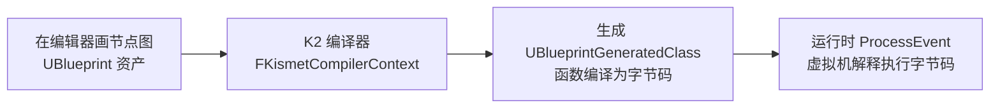
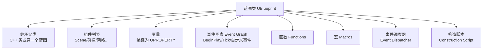
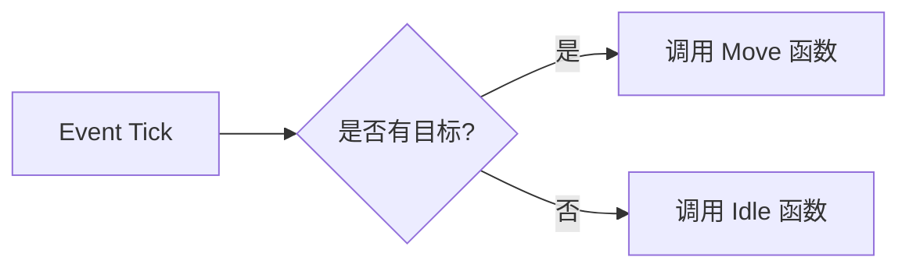
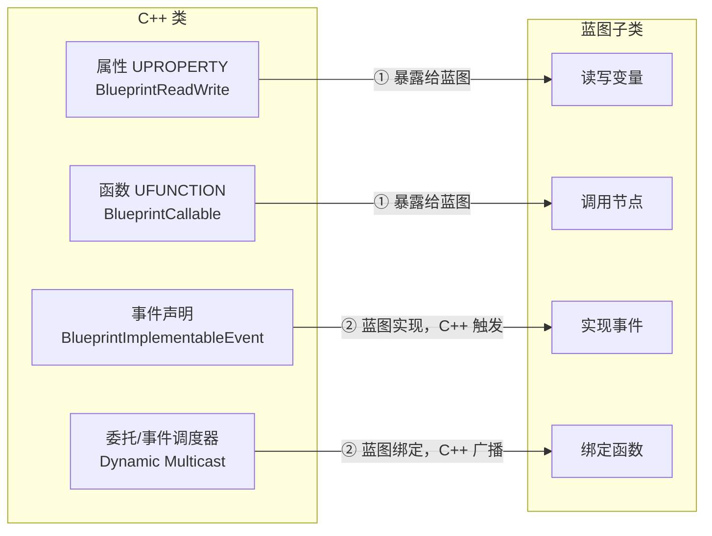

# 蓝图系统

## 1 认识蓝图：可视化脚本

**蓝图（Blueprint）** 是 UE 的 **可视化脚本（Visual Scripting）系统**：用"节点 + 连线"代替手写 C++ 来定义逻辑，同时它又是一套完整的 **资产系统**（可继承、可保存、可被引擎加载）

!!! info "一句话总结"

    蓝图 = 一套 **以节点图为载体** 的脚本语言 + 资产体系：编辑器里画图 → **K2 编译器** 把图编译成 **字节码** → 运行时由 **蓝图虚拟机（VM）** 解释执行



为什么用它：

| 优势 | 说明 |
| --- | --- |
| **面向设计师** | 不需要写代码即可做玩法、AI、UI 逻辑 |
| **快速迭代** | 改完点 Compile 立即生效，无需编译整个工程 |
| **数据驱动** | 属性即配置，可在细节面板调整 |
| **可视化** | 逻辑以图呈现，便于阅读、演示 |

代价是 **性能低于原生 C++**、大型蓝图难以维护/合并冲突，因此引擎鼓励"C++ 写核心，蓝图做表现与配置"

## 2 蓝图资产类型

| 类型 | 作用 |
| --- | --- |
| **蓝图类（Blueprint Class）** | 最常用。继承任意 UObject 派生类（Actor、Character、Component…），是"新的类" |
| **关卡蓝图（Level Blueprint）** | 只属于某个关卡的全局事件（开灯、门、流程） |
| **蓝图接口（Blueprint Interface）** | 定义一组函数签名，供多个蓝图/C++ 实现（跨类通信） |
| **蓝图宏库（Macro Library）** | 存放可复用的宏（调用处内联展开） |
| **蓝图函数库（Function Library）** | 存放全局静态函数（如自定义工具节点） |
| **动画蓝图 / 控件蓝图** | 专用于动画状态机、UMG 界面 |
| **仅数据蓝图（Data-only）** | 不写逻辑，只当"带类型的数据配置"用（如数据资产） |

## 3 蓝图类内部结构

一个蓝图类 = **组件 + 各类图 + 变量**：



##### 3.1 变量

- 蓝图变量本质是 **生成类上的 `UPROPERTY`**——因此天然参与反射、序列化、GC、网络复制
- 访问级别（Public / Private）对应是否暴露给外部与细节面板

##### 3.2 事件图表（Event Graph）

- 蓝图的主逻辑图。常见入口：`Event BeginPlay`、`Event Tick`、自定义事件
- 事件是 **异步触发入口**：由引擎/其他对象在"某个时刻"调用

##### 3.3 函数 / 宏 / 事件调度器

| 类型 | 触发方式 | 返回值 | 复用 | 编译产物 | 适用 |
| --- | --- | --- | --- | --- | --- |
| **事件** | 由引擎/他人触发，异步 | 无 | 图内可有多个事件 | 并入 Ubergraph | 响应时机（BeginPlay、被击中） |
| **函数** | 被调用，同步执行 | 有 | 可多次调用 | 独立 UFunction | 可复用的有输入输出逻辑 |
| **宏** | 被调用 | 多个 | 调用处 **内联展开** | 无独立产物 | 复用一段"连线片段"（不产生调用开销） |
| **事件调度器** | 绑定者后广播触发 | 无 | 一声明多绑定 | 动态多播委托 | 一对多通知（血量变化） |

##### 3.4 构造脚本（Construction Script）

- 在 **编辑器放置时** 以及 **运行时生成 Actor 时** 执行的初始化脚本
- 常用于按数据动态摆放组件、根据属性调整外观

## 4 节点图的组成

节点图由"节点 + 引脚 + 连线"构成：

| 元素 | 说明 |
| --- | --- |
| **执行引脚（白色）** | 表示控制流顺序，用白线串联 |
| **数据引脚（彩色）** | 传数据（值/引用），按类型着色 |
| **纯函数（Pure）** | 无执行引脚、无副作用，取个值就连走（如 `Get Actor Location`） |
| **事件节点** | 图的入口（红色"事件"标题） |
| **Cast（类型转换）** | 把基类引用转成具体类型后访问其成员 |



## 5 蓝图运行原理：从节点图到字节码

!!! info "关键对象"

    - **`UBlueprint`**：编辑器里的"资产对象"，保存节点图等源码级信息
    - **`UBlueprintGeneratedClass`**：编译后生成的运行时 `UClass`（蓝图类的"真身"）
    - **`FKismetCompilerContext`**：K2 编译器上下文，负责把图转成字节码

编译过程：

1. 编辑器点 **Compile** → K2 编译器遍历所有图
2. **事件图表** 被编译进一个统一的 Ubergraph 函数（事件在内部按编号分派）；**蓝图函数** 各自编译为独立的 `UFunction`
3. 函数体生成 **字节码（Bytecode）**，存放在对应 `UFunction` 上
4. 运行时调用蓝图函数 = 调 `ProcessEvent` → **虚拟机解释执行字节码**

这正说明蓝图逻辑本质仍跑在"UObject + UFunction + 反射"之上

!!! note "虚拟机与性能"

    蓝图字节码由引擎的 **蓝图虚拟机** 逐条解释执行，因此比编译成机器码的 C++ **慢不少**。早期提供过"Nativization（把蓝图编译为 C++ 原生代码）"，UE5 已移除该方案，现更推荐把热路径逻辑写进 C++，蓝图只做调用与组合

!!! warning "蓝图常见性能问题"

    1. 每帧 `Event Tick` 里做大量逻辑 → 尽量关闭 Tick 或改用定时器
    2. 巨型事件图表（几百个节点）难以维护 → 拆成函数/宏/子蓝图
    3. 热路径（每帧、批量单位）用蓝图 → 应下沉到 C++
    4. 频繁 Cast、字符串操作、每帧创建临时对象 → 缓存复用

!!! info "何时用蓝图 / 何时用 C++"

    - **用 C++**：核心规则、计算密集、需要稳定性能与版本管理的底层
    - **用蓝图**：一次性玩法、AI 行为、UI、动画逻辑、数值微调
    - **混合**：C++ 提供"钩子"（事件/委托/接口），蓝图在钩子上做扩展，这是官方推荐的协作模式

## 6 蓝图与 C++ 的通信

!!! tip "蓝图与 C++ 的分工与通信"

    **C++ 负责规则与性能，蓝图负责表现与配置**；两者之间通过 `UPROPERTY` / `UFUNCTION` 及 `BlueprintImplementableEvent` / `BlueprintNativeEvent` / 委托 / 接口互相调用

UE 允许同一个类用 **C++ 写逻辑**、用 **蓝图（Blueprint）做表现与调整**。C++ 类和它的蓝图子类是"同一个对象"——蓝图类本质就是一个被 `UClass` 描述的 C++ 派生类。因此"通信"并非两个系统互相发消息，而是 **通过反射宏暴露接口**，让两边能互相调用。关键在于理解 **两个方向**：

!!! info "一句话总结"

    - **C++ → 蓝图**：C++ 用 `UPROPERTY` / `UFUNCTION` 把变量、函数"暴露"出来，蓝图负责读取、调用
    - **蓝图 → C++**：蓝图用 `BlueprintImplementableEvent` / `BlueprintNativeEvent` / **委托** 提供逻辑，C++ 负责触发它



!!! tip "通信方式对比"

    | 机制 | 声明位置 | 实现位置 | 调用方向 | 典型用途 |
    | --- | --- | --- | --- | --- |
    | `UPROPERTY(BlueprintReadWrite)` | C++ | C++ | 蓝图读/写 C++ 变量 | 配置、状态读取 |
    | `UFUNCTION(BlueprintCallable)` | C++ | C++ | 蓝图调用 C++ | 把 C++ 逻辑暴露成节点 |
    | `BlueprintImplementableEvent` | C++ | 蓝图 | C++ 触发蓝图 | C++ 逻辑里让蓝图"响应"事件 |
    | `BlueprintNativeEvent` | C++ | C++ + 蓝图可选覆写 | C++ 触发 | 默认 C++ 行为、蓝图可定制 |
    | 动态多播委托 | C++ / 蓝图 | 绑定端 | C++ 广播 → 蓝图函数 | 灵活的事件通知（血量变化等） |
    | 蓝图接口 | 共享 | C++ / 蓝图均可 | C++ 统一调用 | 多类型对象执行同一套逻辑 |
    | 蓝图函数库 | C++ | C++ | 蓝图调用静态函数 | 全局工具函数 |

### 6.1 C++ 暴露给蓝图（蓝图使用 C++）

##### 6.1.1 暴露变量：UPROPERTY

```cpp
UCLASS(Blueprintable)   // 允许被创建为蓝图子类
class AMyActor : public AActor
{
    GENERATED_BODY()

    // 蓝图可读可写
    UPROPERTY(EditAnywhere, BlueprintReadWrite, Category = "Stats")
    float Health;

    // 蓝图只能读，不能写
    UPROPERTY(BlueprintReadOnly, VisibleAnywhere)
    int32 MaxHealth;
};
```

| 说明符 | 蓝图能力 |
| --- | --- |
| `BlueprintReadWrite` | 蓝图里可读、可写（Get / Set 节点） |
| `BlueprintReadOnly` | 蓝图里只读 |
| `EditAnywhere` / `VisibleAnywhere` | 决定是否出现在细节面板、是否可编辑 |

##### 6.1.2 暴露函数：UFUNCTION(BlueprintCallable)

```cpp
UFUNCTION(BlueprintCallable, Category = "Action")
void TakeDamage(float Amount);          // 蓝图可调用，有执行连线

UFUNCTION(BlueprintPure, Category = "Stats")
float GetHealth() const;                // 纯函数：无副作用，直接取值连线
```

| 说明符 | 蓝图节点形态 |
| --- | --- |
| `BlueprintCallable` | 有执行引脚，需连线触发 |
| `BlueprintPure` | 无执行引脚，像"取变量"一样直接输出值 |

##### 6.1.3 暴露类型：UCLASS / USTRUCT / UENUM

`UCLASS(BlueprintType)` 让 C++ 类可作为蓝图变量类型；`USTRUCT` / `UENUM` 加 `BlueprintType` 后，蓝图里能声明对应的结构体变量、枚举变量

##### 6.1.4 蓝图函数库（BlueprintFunctionLibrary）

把一批静态工具函数暴露给蓝图（不需要实例）：

```cpp
UCLASS()
class UMyFuncLib : public UBlueprintFunctionLibrary
{
    GENERATED_BODY()

    UFUNCTION(BlueprintCallable, Category = "MyLib")
    static float Clamp01(float Value) { return FMath::Clamp(Value, 0.f, 1.f); }
};
```

### 6.2 蓝图提供逻辑（C++ 调用蓝图）

要让"C++ 主动调用蓝图里写的东西"，必须用下面三种"回调式"机制——它们都在 **C++ 里以基类函数形式声明**，C++ 不需要知道具体蓝图类是谁

##### 6.2.1 BlueprintImplementableEvent（纯蓝图实现）

C++ **只声明、不实现**，逻辑完全写在蓝图里；C++ 调用这个函数时，实际触发蓝图实现：

```cpp
UCLASS()
class AMyActor : public AActor
{
    GENERATED_BODY()

    // C++ 只有声明，不能有实现
    UFUNCTION(BlueprintImplementableEvent)
    void OnKilled();

    void Die()
    {
        // 在 C++ 逻辑里触发蓝图实现的事件
        OnKilled();
    }
};
```

!!! info "本质"

    这类调用走反射的 `ProcessEvent`——C++ 把"函数名 + 参数"交给蓝图虚拟机执行对应实现，因此它比直接调用虚函数略慢，适合"低频事件"（死亡、受伤、通关），不要放进每帧热路径

##### 6.2.2 BlueprintNativeEvent（C++ 有默认实现，蓝图可选覆写）

C++ 提供默认实现（写在 `_Implementation` 后缀函数里），蓝图子类 **可以选择覆写**：

```cpp
// 声明
UFUNCTION(BlueprintNativeEvent)
void OnHit(float Damage);
void OnHit_Implementation(float Damage);   // C++ 默认实现写这里

void AMyActor::OnHit_Implementation(float Damage)
{
    Health -= Damage;   // 默认行为
}
```

蓝图覆写后若 **不调用父节点**（Call to Parent Function），C++ 默认实现就不会执行——这给了蓝图完全的控制权

##### 6.2.3 动态多播委托（Event Dispatcher）

C++ 声明一个可被蓝图 **绑定** 的委托，然后由 C++ **广播** 触发。这是"蓝图响应 C++ 事件"最灵活的方式：

```cpp
// 头文件：声明一个动态多播委托类型（蓝图里称为 Event Dispatcher）
DECLARE_DYNAMIC_MULTICAST_DELEGATE_OneParam(FOnHealthChanged, float, NewHealth);

UCLASS()
class AMyActor : public AActor
{
    GENERATED_BODY()

    // 暴露给蓝图绑定
    UPROPERTY(BlueprintAssignable, Category = "Events")
    FOnHealthChanged OnHealthChanged;

    void SetHealth(float NewHealth)
    {
        Health = NewHealth;
        OnHealthChanged.Broadcast(Health);   // C++ 广播，蓝图已绑定的函数被调用
    }
};
```

!!! note "委托与"事件调度器""

    蓝图里的 Event Dispatcher 就是动态多播委托的蓝图形态。C++ 暴露的 `BlueprintAssignable` 委托，蓝图里可以像 Event Dispatcher 一样 Bind 自定义事件；反之蓝图里创建的 Event Dispatcher 也可通过 `BindEventTo...` 之类在 C++ 中绑定（较少见）

##### 6.2.4 引擎事件的"Receive"映射

蓝图里常见的 `Event BeginPlay`、`Event Tick` 等，本质是引擎为 C++ 虚函数（`BeginPlay()`、`Tick()`）预先定义的 `BlueprintImplementableEvent`。C++ 调用 `BeginPlay()` 时，蓝图对应的事件实现会被触发。这是"引擎 → 蓝图"通信的典型例子

### 6.3 双向统一通信：蓝图接口（Interface）

当 C++ 需要调用"可能是 C++ 类也可能是蓝图类"实现同一组函数时，用 **接口** 最干净，避免 C++ 强依赖具体蓝图类：

```cpp
UINTERFACE(MinimalAPI, Blueprintable)
class UMyInterface : public UInterface
{
    GENERATED_BODY()
};

class IMyInterface
{
    GENERATED_BODY()
public:
    UFUNCTION(BlueprintCallable, BlueprintImplementableEvent)
    void DoThing();
};
```

C++ 侧通过引擎生成的 `Execute_` 函数调用 **任意实现了该接口的对象**（无论实现来自 C++ 还是蓝图）：

```cpp
if (OtherActor->GetClass()->ImplementsInterface(UMyInterface::StaticClass()))
{
    IMyInterface::Execute_DoThing(OtherActor);   // 触发蓝图或 C++ 的实现
}
```

### 6.4 双方如何引用对方

| 场景 | 推荐做法 |
| --- | --- |
| **蓝图引用 C++ 对象** | 蓝图把 C++ Actor 拖进关卡即可；用 `Cast`（类型转换）到具体 C++ 类后读写/调用 |
| **C++ 引用蓝图实例** | 用 **C++ 基类指针** 或 **接口** 持有，不要硬编码依赖某个具体蓝图类（`BP_xxx`） |
| **C++ 想引用某个特定蓝图类** | 用 `TSubclassOf`、软对象引用（`TSoftObjectPtr`）或 `LoadClass` 加载其 `UClass` |

!!! warning "避免 C++ 直接依赖具体蓝图类"

    在 C++ 里 `#include "BP_MyChar.h"` 或强引用某个蓝图生成类会让代码脆弱、难重构。正确做法：把需要被 C++ 调用的逻辑收进 C++ 的 **事件（Implementable/NativeEvent）、委托或接口**，让蓝图去实现/覆写，C++ 只调用基类函数

!!! info "推荐分工"

    **C++ 负责"规则与性能"**（核心逻辑、计算、网络权威、数据），**蓝图负责"表现与配置"**（事件接线、动画、特效、数值微调）。C++ 里用 `BlueprintImplementableEvent` / 委托 / 接口留出"钩子"，让设计师在不改 C++ 的情况下扩展

!!! warning "性能注意"

    - `BlueprintImplementableEvent` 走反射 `ProcessEvent`，有额外开销，不要在每帧热路径高频触发
    - 每帧需要大量读取 C++ 数据到蓝图（如逐 Actor 取位置做 UI）尽量在 C++ 侧聚合计算，减少跨边界调用
    - 纯逻辑优先放 C++ `BlueprintCallable` 函数，少用蓝图逐帧循环

!!! note "与反射的关系"

    所有通信都建立在前述 **反射系统** 上：`UPROPERTY` / `UFUNCTION` 的元数据让蓝图虚拟机（`FKismetCompiler`）能识别 C++ 暴露的成员，而 `ProcessEvent` / `Execute_` 则是蓝图侧逻辑被 C++ 调用的运行时通道
