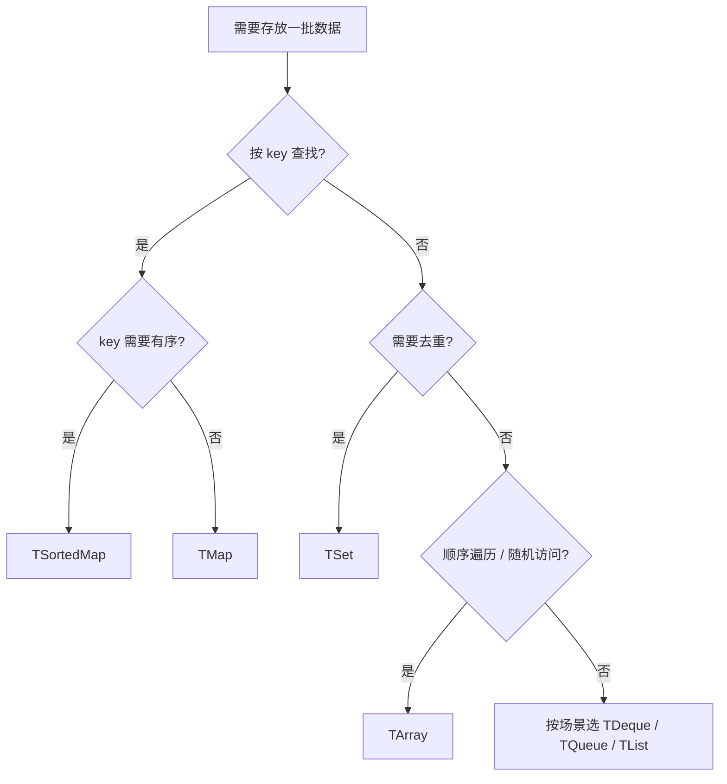

# 容器体系

UE 提供了一整套自研容器（不是 STL）：以 **TArray（动态数组）**、**TMap（哈希映射）**、**TSet（哈希集合）** 为三大主力，另有 `TStaticArray`、`TDeque`、`TQueue`、`TArrayView` 等针对特定场景的类型

!!! info "一句话总结"

    - **TArray** → 顺序存储、随机访问、遍历为主（≈ `std::vector`）
    - **TMap** → 按 key 查找/更新（≈ `std::unordered_map`）
    - **TSet** → 去重与存在性判断（≈ `std::unordered_set`）
    - **TArrayView / TConstArrayView** → 零拷贝只读视图（≈ `std::span`）



## 1 三大主力容器

| | **TArray** | **TMap** | **TSet** |
| --- | --- | --- | --- |
| 结构 | 连续内存数组 | 哈希表（key→value） | 哈希表（元素即 key） |
| 访问 | 下标 O(1) | key 查找 O(1) 均摊 | 存在性 O(1) 均摊 |
| 有序性 | **保持插入顺序** | **无序**（哈希顺序） | **无序** |
| 允许重复 | ✅ | key 唯一 | 元素唯一 |
| 典型 | 列表、批量数据、遍历 | 字典、缓存、索引 | 去重、标记、集合运算 |

## 2 完整容器清单

| 容器 | 说明 | 适用 |
| --- | --- | --- |
| `TArray<T>` | 动态数组（引擎最常用） | 绝大多数"一批东西" |
| `TMap<K,V>` | 哈希映射 | 按 key 查/改 |
| `TSet<T>` | 哈希集合 | 去重、存在性 |
| `TSortedMap<K,V>` | 有序映射（内部数组 + 二分） | 数据量小、需要 **有序遍历** |
| `TMultiMap<K,V>` | 一键多值 | 一键对应多个结果 |
| `TStaticArray<T,N>` | 固定大小（可栈上） | 数量已知，免堆分配（≈ `std::array`） |
| `TArray<T, TInlineAllocator<N>>` | 小数组 **内联** 优化 | 大多数情况元素很少，避免堆分配 |
| `TDeque<T>` | 双端队列 | 两端频繁插入删除 |
| `TQueue<T>` | **无锁** 队列（单生产者单消费者） | 跨线程传递数据 |
| `TCircularBuffer` / `TCircularQueue` | 环形缓冲 | 固定容量、覆盖最旧数据 |
| `TBitArray` | 位数组（位压缩） | 布尔标志大批量、掩码 |
| `TSparseArray<T>` | 稀疏数组（引擎内部大量使用） | 频繁增删且需稳定索引 |
| `TList<T>` | 双向链表 | 极少用（缓存不友好） |
| `TArrayView<T>` / `TConstArrayView<T>` | 非拥有视图 | 零拷贝传参 |

## 3 TArray：动态数组

### 3.1 常用 API

| 操作 | API | 备注 |
| --- | --- | --- |
| 添加 | `Add` / `Emplace` | `Emplace` 原地构造，省一次拷贝 |
| 插入 | `Insert(Item, Index)` | O(n)，会移动元素 |
| 批量追加 | `Append` / `Append(TArray)` | — |
| 删除（保序） | `RemoveAt(Index)` | O(n) |
| 删除（不保序） | `RemoveAtSwap(Index)` | **O(1)**，速度快但打乱顺序 |
| 删除匹配项 | `Remove(Item)` / `RemoveSingle` / `RemoveAll(Pred)` | — |
| 删除末尾 | `Pop(bAllowShrinking)` | O(1) |
| 查找 | `Find` / `IndexOfByKey` / `FindByPredicate` / `Contains` | `Find` 返回下标，`FindByPredicate` 返回指针 |
| 排序 | `Sort`（不稳定）/ `StableSort` / `HeapSort` | 传谓词可自定义 |
| 容量 | `Reserve` / `Empty` / `Reset` / `Shrink` | `Reset` 保容量，`Empty` 释放 |
| 状态 | `Num` / `IsValidIndex` / `IsEmpty` | `Num` 是元素数（不是容量） |

```cpp
TArray<FString> Names;
Names.Reserve(100);                  // 预分配，避免反复扩容
Names.Emplace(TEXT("Alice"));        // 原地构造
Names.Add(TEXT("Bob"));

if (Names.IsValidIndex(0)) { /* ... */ }

Names.Sort([](const FString& A, const FString& B) { return A < B; });

// 高效移除：不关心顺序时用 RemoveAtSwap
Names.RemoveAtSwap(0);
```

### 3.2 迭代中删除的正确写法

```cpp
// ✅ 方式一：倒序遍历
for (int32 i = Array.Num() - 1; i >= 0; --i)
{
    if (ShouldRemove(Array[i])) { Array.RemoveAtSwap(i); }
}

// ✅ 方式二：RemoveAll（推荐，内部处理索引）
Array.RemoveAll([](const T& E) { return E.bShouldRemove; });

// ✅ 方式三：迭代器
for (auto It = Array.CreateIterator(); It; ++It)
{
    if (ShouldRemove(*It)) { It.RemoveCurrent(); }
}

// ❌ 正序遍历 + RemoveAt：会漏掉元素
```

### 3.3 自定义分配器

```cpp
// 小数组内联优化：元素少时不分配堆内存
TArray<int32, TInlineAllocator<8>> SmallList;
SmallList.Reserve(8);     // 直接放在栈上的内联缓冲区里

// 固定容量（永不重新分配）
TArray<int32, TFixedAllocator<16>> FixedList;
```

对"通常只有几个元素"的容器，`TInlineAllocator` 能显著减少堆分配次数。

!!! warning "TArray 最大的坑：引用失效"

    ```cpp
    T* Ptr = &Array[0];
    Array.Add(NewItem);      // 可能触发重新分配
    *Ptr = ...;              // ❌ Ptr 已悬垂
    ```

    **只要可能发生增删，就不要长期持有元素指针/引用**；需要稳定引用请改用 `TArray<TObjectPtr<T>>`（存指针）或 `TSparseArray`

## 4 TMap：哈希映射

```cpp
TMap<FName, int32> ScoreMap;
ScoreMap.Reserve(64);

ScoreMap.Add(TEXT("Alice"), 100);
ScoreMap.Emplace(TEXT("Bob"), 80);

// 查找：返回指针，找不到返回 nullptr（最常用）
if (int32* Score = ScoreMap.Find(TEXT("Alice")))
{
    *Score += 10;
}

// 不存在则插入并返回引用
int32& Ref = ScoreMap.FindOrAdd(TEXT("Carol"));    // 默认构造 0
Ref = 50;

// 一定存在时才用（不存在会断言）
int32 Val = ScoreMap.FindChecked(TEXT("Bob"));

// 不存在时返回默认值副本（不是指针）
int32 Copy = ScoreMap.FindRef(TEXT("Nobody"));     // 0

// 遍历：注意 TMap 是无序的
for (const TPair<FName, int32>& Pair : ScoreMap)
{
    UE_LOG(LogTemp, Log, TEXT("%s: %d"), *Pair.Key.ToString(), Pair.Value);
}
```

| 关键点 | 说明 |
| --- | --- |
| **无序** | 迭代顺序由哈希决定，**不同运行/不同平台可能不同** |
| **需要有序** | 用 `TSortedMap`，或取出 keys 自己排序 |
| **Key 要求** | 必须支持 `GetTypeHash(Key)` 与 `operator==` |
| **Key 类型选择** | 优先 `FName`/整数；避免用 `FString` 做高频 key |
| **性能** | 提前 `Reserve` 能减少 rehash |

!!! warning "TMap 迭代顺序影响确定性"

    依赖 TMap 迭代顺序的逻辑（尤其 **帧同步/回放/随机**）会导致不同步：需要确定性的场合请对 key 排序后再遍历，或改用有序容器

## 5 TSet / TSortedMap / TMultiMap

```cpp
// TSet：去重 + 快速存在性判断
TSet<FName> Visited;
Visited.Add(TEXT("RoomA"));
if (Visited.Contains(TEXT("RoomA"))) { }
Visited.Remove(TEXT("RoomA"));

// TSortedMap：需要按 key 有序遍历的小数据量场景
TSortedMap<int32, FString> SortedByLevel;
SortedByLevel.Add(3, TEXT("High"));
SortedByLevel.Add(1, TEXT("Low"));
// 遍历时按 key 升序

// TMultiMap：一个 key 对应多个 value
TMultiMap<FName, AActor*> ActorsByTag;
ActorsByTag.Add(TEXT("Enemy"), EnemyA);
ActorsByTag.Add(TEXT("Enemy"), EnemyB);
```

| 容器 | 查找 | 插入 | 有序 | 适用 |
| --- | --- | --- | --- | --- |
| `TMap` | O(1) | O(1) | ❌ | 通用字典 |
| `TSortedMap` | O(log n) | O(n) | ✅ | 数据量小 + 必须有序 |
| `TSet` | O(1) | O(1) | ❌ | 去重、标记 |
| `TMultiMap` | O(1) | O(1) | ❌ | 一键多值 |

## 6 视图：零拷贝传参

```cpp
// 接受任意数组的只读视图，不产生拷贝
void ProcessItems(TConstArrayView<FItem> Items)
{
    for (const FItem& Item : Items) { /* 只读 */ }
}

// 从 TArray 或裸数组构造
TArray<FItem> MyItems;
ProcessItems(MyItems);                     // 隐式转换
ProcessItems(MakeArrayView(RawPtr, Count)); // 从指针 + 长度

// 需要可写视图
void ModifyItems(TArrayView<FItem> Items) { Items[0].Value = 1; }
```

!!! warning "视图的生命周期"

    `TArrayView` **不拥有数据**，只是"指向某段数组的引用"。被指向的容器一旦被修改（尤其是增删导致重分配）或销毁，视图立刻失效

## 7 与反射 / GC / 网络的关系

!!! important "容器里的对象引用必须用 UPROPERTY"

    ```cpp
    // ✅ GC 会追踪容器里的对象引用
    UPROPERTY()
    TArray<TObjectPtr<AActor>> SpawnedActors;

    UPROPERTY()
    TMap<FName, TObjectPtr<UItemInstance>> ItemsById;

    // ❌ 不加 UPROPERTY：GC 看不见，对象可能被回收 → 悬垂指针
    TArray<AActor*> BadActors;
    ```

| 关系 | 说明 |
| --- | --- |
| **GC** | 带 `UPROPERTY` 的容器会被 GC 遍历，追踪其中的对象引用 |
| **序列化** | `TArray` / `TMap` / `TSet` 均支持 `UPROPERTY` 存读档 |
| **网络复制** | 容器可作为 `Replicated` 属性整体复制 |
| **反射** | 容器类型有对应的 `FArrayProperty` / `FMapProperty` / `FSetProperty` |

## 8 性能与最佳实践

!!! info "优化要点"

    1. **预分配**：已知规模就 `Reserve`，避免反复扩容 + 拷贝
    2. **`Emplace` 优于 `Add`**：原地构造，省一次临时对象
    3. **不需要顺序就用 `RemoveAtSwap`**（O(1) 换 O(n)）
    4. **大对象别按值存**：存 `TObjectPtr<T>` 或指针，避免拷贝
    5. **小数组用 `TInlineAllocator`**：省堆分配
    6. **传参用 `TConstArrayView`**：零拷贝
    7. **高频 key 用 `FName`/整数**，别用 `FString`
    8. **能用 TArray 就别用 TMap**：连续内存遍历快得多，只有真需要按 key 查才用映射

!!! warning "线程安全"

    UE 容器 **默认不是线程安全的**。跨线程访问同一容器必须加锁（`FCriticalSection` 等）；跨线程传递数据用 `TQueue`（无锁）这类专门容器

## 9 常见坑汇总

| 坑 | 说明 |
| --- | --- |
| **元素引用失效** | 持有 `&Array[i]` 后增删导致重分配 → 悬垂 |
| **迭代中修改** | 遍历时增删 → 迭代器失效；用 `RemoveAll` 或倒序/迭代器方式 |
| **忘记 `UPROPERTY`** | 容器内对象引用不被 GC 追踪 |
| **依赖 TMap 顺序** | 迭代顺序不稳定，破坏确定性 |
| **正序 `RemoveAt`** | 循环中删元素会跳元素 |
| **`Num()` 当成容量** | `Num()` 是元素数，容量要 `Max()` |
| **按值传大数组** | 函数签名写 `TArray<T> Param` 会整体拷贝 |
| **频繁重分配** | 循环里 `Add` 却不 `Reserve` |

## 10 如何选择

| 需求 | 选择 |
| --- | --- |
| 一批有序数据、遍历 | `TArray` |
| 按 key 查/改 | `TMap` |
| 去重、判断存在 | `TSet` |
| 需要按 key 有序遍历（量小） | `TSortedMap` |
| 一键多值 | `TMultiMap` |
| 元素数固定且少 | `TStaticArray` / `TArray + TInlineAllocator` |
| 两端增删 | `TDeque` |
| 跨线程传递 | `TQueue`（无锁） |
| 固定容量的历史/缓冲 | `TCircularBuffer` / `TCircularQueue` |
| 大量布尔标志 | `TBitArray` |
| 只读传参 | `TConstArrayView` |

!!! note "与其它笔记的联系"

    - **垃圾回收**：容器里的对象引用必须 `UPROPERTY` 才会被追踪
    - **反射系统**：容器对应 `FArrayProperty` / `FMapProperty` / `FSetProperty`
    - **字符串体系**：做 key 优先 `FName`，做展示用 `FText`
    - **网络同步**：容器可作为复制属性，但要注意带宽与顺序确定性
