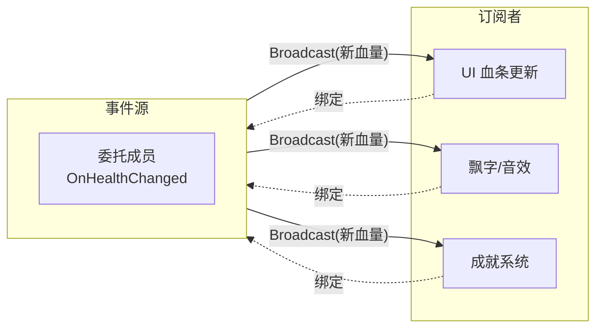

# 委托系统

**委托（Delegate）** 是 UE 的 **类型安全的回调/事件机制**：它把"一个函数"封装成可 **绑定、存储、传递、调用** 的对象。事件发出方不需要知道"谁会响应、有几个响应"，只负责"广播"，从而把两个模块彻底解耦

!!! info "一句话总结"

    委托 = **类型安全的函数指针 + 观察者模式**：一方"广播事件"，零到多个订阅方"绑定函数"并自动被调用；静态委托跑 C++（快），动态多播委托可暴露给蓝图（基于反射）



| 传统做法的问题 | 委托的解决方式 |
| --- | --- |
| 到处"直接调用别人"，模块互相强耦合 | 广播方不依赖监听方，两边只依赖"一个委托类型" |
| 一个事件需要通知 N 处，代码写死 | 多播委托随意增删订阅者 |
| 裸函数指针不安全、难读 | 类型安全、参数与返回值有编译期检查 |
| 蓝图无法接收 C++ 事件 | 动态多播委托暴露 `BlueprintAssignable`，蓝图可绑定 |

引擎内部到处是委托：按钮 `OnClicked`、Actor 重叠、定时器回调、动画通知、GAS 效果变化…… 它是 UE 里最基础的"事件总线"

## 1 两大分类

### 1.1 单播（Single-cast）vs 多播（Multicast）

| 类型 | 绑定数量 | 触发 | 能否返回值 | 典型 |
| --- | --- | --- | --- | --- |
| **单播** | 只能绑 **1 个** | `Execute()` | 可以（`_RetVal`） | 定时器回调、异步完成回调 |
| **多播** | 可绑 **多个** | `Broadcast()` | **不能**（无意义） | 事件通知（血量变化、死亡） |

### 1.2 静态（C++）vs 动态（可给蓝图）

| 维度 | 静态委托 | 动态委托 |
| --- | --- | --- |
| 声明 | `DECLARE_DELEGATE` / `DECLARE_MULTICAST_DELEGATE` | `DECLARE_DYNAMIC_MULTICAST_DELEGATE` |
| 绑定方式 | 模板 + 函数指针 | **UObject + 函数名（反射）** |
| 性能 | 快 | 慢（字符串查函数 + 反射） |
| 蓝图绑定 | ❌ | ✅（`BlueprintAssignable`） |
| 序列化/存档 | ❌ | ✅ |
| 使用范围 | C++ 内部 | 跨 C++ ↔ 蓝图 |

!!! info "动态委托为何能进蓝图"

    动态委托绑定的不是裸函数指针，而是 **某个 UObject 上名为 X 的函数**，靠反射按名字查找调用——这正是它能在 C++ 与蓝图间传递的原因，代价是比静态委托慢

## 2 C++ 中的静态委托

### 2.1 声明委托类型与成员

```cpp
// 声明一个"无参单播委托"类型
DECLARE_DELEGATE(FOnFinished);

// 声明一个"带一个 float 参数的多播委托"类型
DECLARE_MULTICAST_DELEGATE_OneParam(FOnHealthChanged, float, NewHealth);

UCLASS()
class AMyActor : public AActor
{
    GENERATED_BODY()

    FOnFinished OnFinished;           // 单播：一个订阅者
    FOnHealthChanged OnHealthChanged; // 多播：多个订阅者
};
```

参数/返回值宏后缀：`_OneParam`、`_TwoParams`…；返回值用 `_RetVal`（如 `DECLARE_DELEGATE_RetVal(int32, FGetScore)`，只能单播）

### 2.2 单播：绑定与执行

```cpp
// 某处订阅
MyActor->OnFinished.BindUObject(this, &AMyHUD::ShowResult);

// 事件源触发
OnFinished.ExecuteIfBound();   // 已绑定才执行（安全）
// OnFinished.Execute();       // 未绑定直接 Execute 会触发断言，一般用 ExecuteIfBound
```

### 2.3 多播：增删订阅者与广播

```cpp
// 订阅
Player->OnHealthChanged.AddUObject(this, &AMyHUD::OnPlayerHealth);
Player->OnHealthChanged.AddUObject(GameAudio, &AGameAudio::PlayHurt);

// 事件源广播：所有订阅者被依次调用
OnHealthChanged.Broadcast(Health);

// 退订
Player->OnHealthChanged.Remove(this);
```

常用绑定方式：

| 方式 | 说明 |
| --- | --- |
| `BindUObject / AddUObject` | 绑定 UObject 成员函数（最常见） |
| `BindUFunction` | 绑定到 `UFUNCTION`（按名字） |
| `BindRaw / AddRaw` | 绑定裸对象/普通类（**不防销毁**，慎用） |
| `BindLambda / AddLambda` | 绑定 Lambda |
| `BindSP / AddSP` | 绑定共享指针对象 |
| `BindStatic / AddStatic` | 绑定静态/全局函数 |

## 3 动态多播：通向蓝图

要让 **蓝图能订阅 C++ 事件**，用动态多播委托，并把它声明为可暴露成员：

```cpp
DECLARE_DYNAMIC_MULTICAST_DELEGATE_OneParam(FOnHealthChanged, float, NewHealth);

UCLASS()
class AMyActor : public AActor
{
    GENERATED_BODY()

    // 暴露给蓝图：蓝图里可像 Event Dispatcher 一样绑定
    UPROPERTY(BlueprintAssignable, Category = "Events")
    FOnHealthChanged OnHealthChanged;

    void SetHealth(float NewHealth)
    {
        Health = NewHealth;
        OnHealthChanged.Broadcast(Health);   // C++ 广播，蓝图绑定者被调用
    }
};
```

- `BlueprintAssignable`：允许蓝图 **绑定/解绑**
- 蓝图侧用 **Assign** / **Bind Event to …** 节点把自定义事件绑上去；事件发生时 C++ `Broadcast` 触发它们

!!! warning "动态委托的生命周期"

    动态委托绑定的是"UObject + 函数名"。绑定的目标对象 **被销毁/回收后，若还广播会访问已失效对象**。因此：持有动态/多播委托的成员尽量加 `UPROPERTY()`，并在对象销毁前 `Clear` / `RemoveAll`，避免悬垂

## 4 蓝图里的 Event Dispatcher

蓝图内部自带的 **Event Dispatcher（事件调度器）** 本质就是动态多播委托的蓝图形态：

- 在蓝图里声明一个 Event Dispatcher（可带参数）
- 需要响应的地方 **Bind Event to** 绑定自定义事件（可多处绑定 = 一绑多）
- 需要触发的地方 **Call** 该 Event Dispatcher，所有订阅者被执行
- 与 C++ 动态多播委托、`BlueprintAssignable` 是同一套机制

## 5 内部原理

| 委托类型 | 底层机制 |
| --- | --- |
| **静态委托** | 模板类封装 **函数指针/成员函数指针 + 目标对象指针**，编译期内联、直接调用，速度快 |
| **静态多播** | 内部持有"委托绑定"的数组，广播时遍历调用 |
| **动态委托** | 保存 **UObject\* + 函数名字符串**，广播时经 **反射** 查找到 `UFunction` 再调用（`ProcessEvent`）——比静态慢，但换来蓝图可用与可序列化 |

一句话：**静态委托把"性能"给 C++，动态委托把"灵活性"给蓝图**，二者都建立在 UE 的对象模型之上

## 6 委托 vs 其他通信方式

| 方式 | 关系 | 适用 |
| --- | --- | --- |
| **单播委托** | 一对一回调 | 回调、异步完成、定时器 |
| **多播/动态多播委托** | 一对多通知 | 状态变化广播（血量、死亡） |
| **Event Dispatcher** | 蓝图版动态多播 | 蓝图内部的事件通知 |
| **接口（Interface）** | 多类型对象"能力统一" | 不同类执行同一组函数 |
| **`BlueprintImplementableEvent`** | C++ 调蓝图实现的"钩子" | 由 C++ 触发的蓝图表现 |

## 7 常见坑与最佳实践

!!! warning "容易踩的坑"

    1. **未绑定就 `Execute`**：单播未绑定直接 Execute 会触发断言，用 `ExecuteIfBound`
    2. **悬垂引用**：`BindRaw/AddRaw` 绑裸对象、或目标 UObject 已销毁仍广播 → 崩溃。尽量 `BindUObject`，并在对象销毁前清理
    3. **多播想返回值**：多播广播给多人，返回值无意义，因此 **多播委托不支持返回值**
    4. **高频路径用动态委托**：动态委托走反射+名字查找，慢；C++ 内部热路径用静态委托

!!! info "最佳实践"

    1. 事件命名 `On…`，参数只传"必要的新值/上下文"，保持委托类型简单
    2. 需要蓝图订阅 → `BlueprintAssignable` 动态多播；纯 C++ → 静态（多播）委托
    3. 持有委托的 UPROPERTY 成员记得清理；谁广播谁负责生命周期
    4. 解耦的两端只共享"委托类型"，不互相 include 具体类——这正是委托的价值
