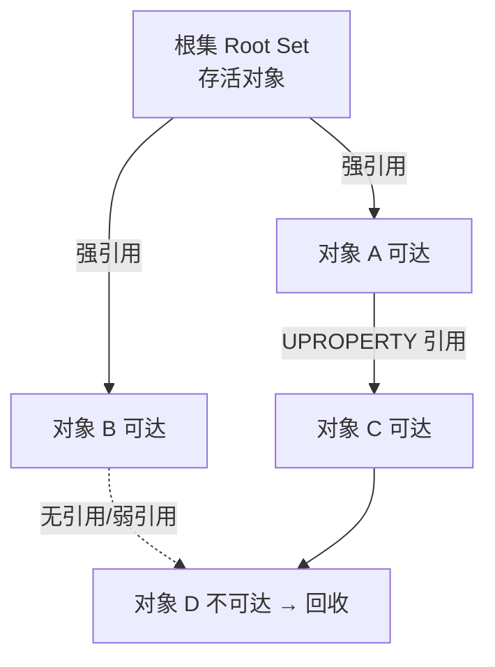

# 垃圾回收

游戏世界中对象数量庞大且生命周期复杂（蓝图、关卡、异步加载、网络生成……）。如果像传统 C++ 那样手动 `new` / `delete`，极易出现 **内存泄漏**（忘记释放）和 **悬垂指针**（释放后仍被访问）。UE 为 `UObject` 对象实现了一套基于 **可达性分析（Reachability Analysis）** 的自动垃圾回收（GC，Garbage Collection）机制，开发者无需手动释放大多数对象

!!! info "一句话总结"

    UE 的 GC = 从 **根集（Root Set）** 出发，借助 **反射** 遍历对象间的引用图，标记所有仍可达的对象，然后回收那些不可达（不再被任何根引用的）UObject

!!! warning "GC 只管理 UObject"

    只有继承自 `UObject` 的对象（及其 `UPROPERTY` 引用的对象）才受 GC 管理。普通 C++ 类、结构体、`TSharedPtr` / `TUniquePtr` 管理的内存 **不参与** UObject GC，仍需要你手动管理

为什么需要垃圾回收：

| 痛点 | 说明 |
| --- | --- |
| **生命周期复杂** | 对象可能被蓝图、编辑器、多个模块同时持有，很难确定"何时该释放" |
| **防止泄漏** | 手动 `delete` 容易漏删，长期运行（服务器、编辑器）会积累内存 |
| **防止悬垂** | 手动释放后其他引用方可能仍在使用，导致崩溃 |
| **跨语言** | 蓝图里的对象由 C++ 对象支撑，GC 让蓝图无需关心释放 |
| **异步/热重载** | 关卡切换、蓝图重载时能统一安全地清理旧对象 |

UE 没有选择引用计数（Reference Counting），而是选择 **跟踪式（Tracing）GC**，即周期性"从根出发扫描可达对象、回收其余对象"。引用计数在环形引用时会泄漏，而跟踪式 GC 能正确回收环

!!! tip "谁参与 GC"

    - **被管理**：`UObject` 及其所有派生类（`AActor`、`UActorComponent`、`UDataAsset`……），以及它们的 **被 `UPROPERTY` 声明的** 对象引用
    - **不被管理**：非 `UObject` 的 C++ 对象、`UPROPERTY` 之外的裸指针引用（GC 看不到它们）

!!! info "引用必须被声明才可见"

    GC 并不知道你代码里某个普通 `AActor* Foo;` 成员。只有通过反射宏 `UPROPERTY()` 声明的成员，GC 才能发现并追踪它对其他对象的引用

## 1 核心原理：可达性分析（Mark-Sweep）



GC 大致分三个阶段：

### 1.1 根集（Root Set）

所有"绝对不允许被回收"的对象起点。常见来源：

- 通过 `AddToRoot()` 显式加入根集的对象
- 实现了 `FGCObject` 的对象（如 `TStrongObjectPtr`）注册的引用
- 类默认对象（CDO）、加载中的 Package、被编辑器/引擎持有的对象
- 正在执行流程中、被引擎临时保护的对象

### 1.2 标记（Mark）

从根集出发，沿着每个对象的 `UPROPERTY` 强引用做 **传递闭包** 遍历——凡是能"走到的"对象都标记为 **可达（Reachable）**，永远不会被回收

### 1.3 清除 / 回收（Sweep）

没有被标记为可达的对象即为 **不可达（Unreachable）**。GC 将它们销毁并释放内存

!!! info "GC Cluster（GC 集群）"

    引擎会把"彼此强引用、同生共死"的一组对象聚成集群（Cluster），以集群为单位做可达性判断，避免逐个对象分析，显著降低 GC 开销。默认开启

## 2 对象引用的所有权声明

### 2.1 UPROPERTY 强引用（最常用）

只要把成员声明为 `UPROPERTY()`，它对该对象的引用就是 **强引用**，会阻止被引用对象被回收：

```cpp
UCLASS()
class AMyActor : public AActor
{
    GENERATED_BODY()

    // 强引用：确保指向的组件/对象不被 GC
    UPROPERTY()
    TObjectPtr<USceneComponent> RootComp;

    // 数组里存放的对象引用同样需要 UPROPERTY 才会被追踪
    UPROPERTY()
    TArray<TObjectPtr<AActor>> SpawnedActors;
};
```

!!! warning "容器 / 裸指针的坑"

    `TArray<AActor*>` 这类容器成员 **如果没加 `UPROPERTY()`，里面的引用不会被 GC 追踪**，指向的对象可能随时被回收。成员里存放对象引用一律要加 `UPROPERTY()`

### 2.2 TObjectPtr / TWeakObjectPtr / TStrongObjectPtr

| 类型 | 是否阻止 GC | 说明 |
| --- | --- | --- |
| `TObjectPtr<T>`（UE5 默认） | 是（强引用） | `UPROPERTY` 中普遍使用；支持延迟加载，编辑器里显示为对象路径 |
| `UObject*` | 需配合 `UPROPERTY` | 4.25 前写法的裸指针，语义同上 |
| `TWeakObjectPtr<T>` | 否（弱引用） | 不阻止 GC；对象被回收后指针自动变为无效，用前需 `IsValid()` 判断，常用于避免循环引用 |
| `TStrongObjectPtr<T>` | 是 | **非 UPROPERTY 场合**（如纯 C++ 类里）想保活 UObject 时使用 |

```cpp
UPROPERTY()
TWeakObjectPtr<AActor> WeakTarget;   // 不会阻止回收，但安全

void Tick()
{
    if (AActor* Target = WeakTarget.Get())
    {
        // 对象还活着，安全使用
    }
}
```

### 2.3 FGCObject 与 AddToRoot

当 **非 UObject 的 C++ 类** 需要长期持有 UObject 引用时，让它继承 `FGCObject` 并在 `AddReferencedObjects` 里注册这些引用，GC 就能看到它们：

```cpp
class FMyManager : public FGCObject
{
    UObject* HeldObject = nullptr;

    virtual void AddReferencedObjects(FReferenceCollector& Collector) override
    {
        Collector.AddReferencedObject(HeldObject);
    }
    virtual FString GetReferencerName() const override
    {
        return TEXT("FMyManager");
    }
};
```

更简单的临时方案是把对象 `AddToRoot()`（强烈不推荐长期使用）加入根集强制保活，用完记得 `RemoveFromRoot()`

## 3 GC 触发时机

- **周期性自动触发**：游戏主循环按时间/内存压力自动调度（增量 GC，分多帧执行，避免单帧卡顿）
- **关卡切换 / 流送**：卸载关卡时集中回收不再需要的对象
- **内存不足**：可用内存低于阈值时强制收集
- **显式触发**：编辑器操作、`GEngine->ForceGarbageCollection(true)` 或控制台命令 `obj gc`（`gc`）

!!! info "增量 GC（Incremental GC）"

    全量标记一帧做完会有明显卡顿（Spike）。UE 默认把可达性分析 **分摊到多帧** 执行（`gc.IncrementalReachabilityAnalysis`，默认开启），并在每帧限制工作耗时，以此平滑 GC 开销

常用调试命令：`obj gc` 强制 GC、`obj list` 列出对象、`memreport` 生成内存报告

## 4 对象销毁的生命周期

UObject 不允许你手动 `delete`。对象的销毁由 GC 统一驱动：

1. 对象被判定不可达（或显式标记为待销毁）
2. 引擎通知相关系统，调用 `BeginDestroy()`：解绑委托、通知监听者、释放外部资源
3. 分帧调用 `FinishDestroy()`，随后释放原生内存并调用 C++ 析构

!!! info "旧 PendingKill 与新的 MarkAsGarbage"

    旧版本中对象会先被标记为 **`PendingKill`**（等待清理、`IsValid` 返回 false）；较新的 UE5 推荐直接调用 `MarkAsGarbage()` 让对象尽快进入待回收状态。**不要对 UObject 调用 `delete`**

Actor 与普通 UObject 略有不同：Actor 归 `UWorld` 管理，需要立即移除时用 `AActor::Destroy()`（从世界中移除并标记销毁），最终内存仍由 GC 回收

## 5 与反射系统的关系

GC 的标记阶段依赖 **反射系统**：GC 需要枚举一个对象内部所有 `UObject*` 字段才能知道它引用了谁。这正是 `FObjectProperty`（反射属性）的价值——它记录了该引用字段在对象内的偏移，GC 借此读取并遍历引用图

!!! info "联系"

    反射系统（引擎核心）→ 提供字段级类型信息 → GC 基于这些信息做可达性分析。反射文档中提到的"GC 通过反射找到对象内引用的其他 UObject"，指的就是这条依赖链

## 6 实践建议与常见坑

!!! warning "悬垂引用 / Access None"

    最常见的错误是持有对象却没声明引用（没加 `UPROPERTY`），对象被 GC 回收后指针变成"野指针"，运行时访问报 **Access None**。长期持有的引用务必用 `UPROPERTY()`、`TStrongObjectPtr` 或 `TWeakObjectPtr`。

!!! warning "不要在 Lambda / 委托里裸捕获 UObject"

    蓝图事件、定时器、`FTimerHandle` 回调里如果裸捕获 `this` 或 UObject，触发回调时对象可能已被回收。应捕获 `TWeakObjectPtr` 并在回调里先 `IsValid()` 判断：

    ```cpp
    TWeakObjectPtr<AActor> WeakSelf(this);
    GetWorld()->GetTimerManager().SetTimer(TimerHandle, [WeakSelf]()
    {
        if (WeakSelf.IsValid())
        {
            // 安全使用
        }
    }, 1.0f, false);
    ```

!!! info "性能建议"

    1. 大量使用 UObject（尤其每帧创建/销毁的临时对象）会显著增加 GC 开销，可改用结构体（`USTRUCT`）或对象池
    2. 能用原生数组/结构体解决的问题不要堆 UObject
    3. GC 虽有增量模式，但对象越多标记成本越高，保持对象数量合理
