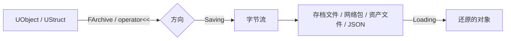

# 序列化

**序列化（Serialization）** 是把对象/数据转成 **字节流**（或反过来，从字节流还原）的过程。UE 用 **统一的一套接口** 支撑存档、网络复制、资产保存、配置导入导出等全部场景——核心抽象是 **`FArchive`**

!!! info "一句话总结"

    UE 序列化 = **`FArchive`（统一的"流"接口）** + **`operator<<`（读写一个值）** + **`UPROPERTY` 反射驱动（自动遍历成员）**；同一套机制同时服务于存档、网络、资产、配置



## 1 核心抽象：FArchive

`FArchive` 是一个"可读可写的流"，统一入口是 `operator<<`：

```cpp
Ar << MyInt;        // 保存方向：写入；加载方向：读出
Ar << MyString;
Ar << MyVector;
```

| API | 说明 |
| --- | --- |
| `Ar << Value` | 序列化一个值（自动判断读写方向） |
| `Ar.IsLoading()` / `Ar.IsSaving()` | 当前是加载还是保存 |
| `Ar.IsPersistent()` | 是否用于持久化（存档/资产） |
| `Ar.Tell()` / `Ar.Seek()` / `Ar.TotalSize()` | 流位置控制 |
| `Ar.ArIsSaveGame` | 是否是 SaveGame 序列化（只存 `SaveGame` 标记属性） |
| `Ar.UEVer()` / `Ar.CustomVer(GUID)` | 版本查询（用于兼容旧数据） |

常见 `FArchive` 实现：

| Archive | 用途 |
| --- | --- |
| `FMemoryWriter` / `FMemoryReader` | 内存缓冲（存档、快照） |
| `FNetBitWriter` / `FNetBitReader` | **位级** 流，网络复制/RPC |
| `FObjectAndNameAsStringProxyArchive` | 把对象引用存成 **路径字符串**（存档必备） |
| `FArchiveSaveCompressedProxy` / `FArchiveLoadCompressedProxy` | 压缩/解压序列化 |
| `FStructuredArchive` | 结构化归档（可序列化成 JSON/XML） |
| `FReferenceCollector` | **GC 遍历对象引用**（也派生自 `FArchive`） |

!!! note "一个很有意思的事实"

    GC 用的 `FReferenceCollector` 也是 `FArchive` 的子类——这意味着 **"遍历 UPROPERTY" 和 "序列化 UPROPERTY" 用的是同一套反射机制**。这也解释了为什么只有 `UPROPERTY` 成员才会被存档、被 GC 追踪

## 2 UObject 的默认序列化：反射驱动

`UObject::Serialize` 的默认实现会 **遍历所有 `UPROPERTY` 成员** 逐个序列化——你不用手写任何代码：

```cpp
UCLASS()
class AMyActor : public AActor
{
    GENERATED_BODY()

    UPROPERTY()
    float Health = 100.f;          // ✅ 会被序列化

    UPROPERTY(Transient)
    float TempCache = 0.f;         // ❌ Transient：不写入存档

    UPROPERTY(SaveGame)
    int32 PlayerLevel = 1;         // ✅ 仅 SaveGame 序列化时写入

    float LooseFloat = 0.f;        // ❌ 没有 UPROPERTY：完全不参与
};
```

| 属性标记 | 影响 |
| --- | --- |
| 无 `UPROPERTY` | **完全不参与** 序列化（也不被 GC 追踪） |
| `Transient` | 不写入持久化数据（但网络仍可复制） |
| `SaveGame` | 只在使用 SaveGame 归档时序列化 |
| `Config` | 与配置文件关联 |
| `Replicated` | 参与网络复制 |

## 3 自定义序列化

需要存储非 `UPROPERTY` 的数据、或要做 **版本兼容** 时，重写 `Serialize`：

```cpp
void AMyActor::Serialize(FArchive& Ar)
{
    Super::Serialize(Ar);          // 先让父类序列化所有 UPROPERTY

    Ar << CustomInt;               // 追加自定义数据
    Ar << CustomString;

    // 版本兼容：老数据没有 NewField 时跳过
    if (Ar.CustomVer(FMyCustomVersion::GUID) >= FMyCustomVersion::AddedNewField)
    {
        Ar << NewField;
    }
}
```

!!! warning "不要在 Serialize 里做副作用"

    `Serialize` 会被 **多种场景** 调用：存档、读档、对象复制（Duplicate）、网络、GC 引用遍历、编辑器加载……在里面改状态、发事件、创建对象都会造成难以排查的问题。**它只应该读写数据**

## 4 五种典型用途

| 用途 | 使用的 Archive | 说明 |
| --- | --- | --- |
| **存档（SaveGame）** | `FMemoryWriter` + `FObjectAndNameAsStringProxyArchive` | 对象引用存成路径，`ArIsSaveGame = true` |
| **网络复制 / RPC** | `FNetBitWriter` / `FNetBitReader` | 位级压缩，自定义类型需实现 `NetSerialize` |
| **资产保存（.uasset）** | 包内归档 | 编辑器保存资产，引用存为包内索引 |
| **配置 / 表格导入导出** | `FStructuredArchive`（JSON/CSV） | DataTable 的 CSV/JSON 导入导出 |
| **对象复制 / 克隆** | 内存归档 | `StaticDuplicateObject` 等 |

## 5 存档系统（SaveGame）实战

```cpp
UCLASS()
class UMySaveGame : public USaveGame
{
    GENERATED_BODY()

public:
    UPROPERTY(SaveGame)              // ⚠️ 必须标 SaveGame 才会被存
    int32 PlayerLevel = 1;

    UPROPERTY(SaveGame)
    FString PlayerName;

    UPROPERTY(SaveGame)
    TArray<FName> UnlockedItems;
};
```

```cpp
// 保存
UMySaveGame* Save = Cast<UMySaveGame>(UGameplayStatics::CreateSaveGameObject(UMySaveGame::StaticClass()));
Save->PlayerLevel = 10;
UGameplayStatics::SaveGameToSlot(Save, TEXT("Slot1"), 0);

// 读取
if (UGameplayStatics::DoesSaveGameExist(TEXT("Slot1"), 0))
{
    UMySaveGame* Loaded = Cast<UMySaveGame>(UGameplayStatics::LoadGameFromSlot(TEXT("Slot1"), 0));
}
```

内部原理：

1. 创建 `FMemoryWriter`
2. 包一层 `FObjectAndNameAsStringProxyArchive` → **对象引用被写成"路径字符串"**（跨存档仍能解析回对象）
3. 设置 `ArIsSaveGame = true` → 只序列化 `SaveGame` 标记的属性
4. 得到 `TArray<uint8>` 写入 slot 文件

!!! info "引用类成员怎么存"

    存档里 **不要** 指望存住 `TObjectPtr` 指向的"某个具体实例"——它会被序列化成路径，读档时按路径重新解析（指向类默认对象或已存在的对象）。要"记住状态"，应存值（ID、数值、坐标），而不是存实例指针

## 6 结构化归档（FStructuredArchive）

`FStructuredArchive` 把"数据"与"格式"分离，可以让同一份序列化代码输出成二进制、**JSON 或 XML**：

```cpp
void FMyData::Serialize(FStructuredArchive::FRecord Record)
{
    Record << SA_VALUE(TEXT("Health"), Health);
    Record << SA_VALUE(TEXT("Name"), Name);
}
```

它也是 DataTable 的 CSV/JSON 导入导出、编辑器内数据交换的基础。

## 7 版本兼容与迁移

!!! warning "改了字段结构就必须处理版本"

    老存档是用 **旧结构** 写出来的字节流。如果不做版本判断，新增字段就会读到错位的数据，导致存档损坏或行为异常

| 版本机制 | 说明 |
| --- | --- |
| `Ar.UEVer()` | 引擎版本（如 `EUnrealEngineObjectUE5Version`），用于随引擎升级的变化 |
| **`FCustomVersion`**（推荐） | 自定义 GUID + 版本号，专为你的数据结构定义 |

```cpp
// 1. 定义
struct FMyCustomVersion
{
    enum Type
    {
        BeforeFieldAdded,
        AddedNewField,
        LatestVersion = AddedNewField,
    };
    static const FGuid GUID;
    static const TArray<FGuid> Versions;
};

// 2. 注册（模块启动时）
FCustomVersionRegistration GRegister(
    FMyCustomVersion::GUID, FMyCustomVersion::LatestVersion, TEXT("MyCustomVersion"));

// 3. 使用：按版本读写
void FMyData::Serialize(FArchive& Ar)
{
    Ar << OldField;

    if (Ar.CustomVer(FMyCustomVersion::GUID) >= FMyCustomVersion::AddedNewField)
    {
        Ar << NewField;      // 只有新数据才有这个字段
    }
    else if (Ar.IsLoading())
    {
        NewField = DefaultValue;   // 老数据：补默认值（迁移）
    }
}
```

常见迁移策略：**新增字段 → 老数据补默认值**；**改名/改类型 → 按版本读旧格式再转换**；**删除字段 → 读但丢弃**

## 8 让自定义类型支持序列化 / 网络

自定义 `USTRUCT` 想支持 `Ar << ` 或网络复制，用 `TStructOpsTypeTraits` 声明能力：

```cpp
bool FMyStruct::NetSerialize(FArchive& Ar, UPackageMap* Map, bool& bOutSuccess)
{
    Ar << IntField;
    Ar << StringField;
    bOutSuccess = true;
    return true;
}

template <>
struct TStructOpsTypeTraits<FMyStruct> : public TStructOpsTypeTraitsBase2<FMyStruct>
{
    enum
    {
        WithSerializer     = true,   // 支持 operator<<
        WithNetSerializer  = true,   // 支持网络序列化
        WithIdenticalViaEquality = true,
    };
};
```

## 9 性能与压缩

| 手段 | 说明 |
| --- | --- |
| **压缩归档** | `FArchiveSaveCompressedProxy` / `LoadCompressedProxy`（Zlib / Oodle） |
| **位级序列化** | 网络用 `FNetBitWriter`，布尔值只占 1 bit（引擎会自动做位打包） |
| **Delta 序列化** | 属性与 CDO/默认值比较，只写差异（网络复制与编辑器常用） |
| **避免冗余** | 不存可推导的数据；大数组考虑分块/增量 |
| **对象引用优化** | 网络复制用 `UPackageMap` 把对象压成索引而非路径 |

## 10 常见坑与最佳实践

!!! warning "最常见的坑"

    1. **字段忘了 `UPROPERTY`**：静默不序列化（存档丢失数据、GC 不追踪）
    2. **存档属性忘了 `SaveGame`**：`SaveGameToSlot` 时不会写入
    3. **改了结构不做版本判断**：老存档读出来是垃圾数据
    4. **在 `Serialize` 里做副作用**：它会被调用很多次（GC、复制、网络）
    5. **用 `IsLoading()` 写反分支**：读档时走了保存逻辑
    6. **存 UObject 实例指针并期望"记住这一件"**：会被存成路径，读档后指向不同对象
    7. **序列化顺序不一致**：同一类型必须保证读写顺序完全对称

!!! info "最佳实践"

    1. **只存数据、不存逻辑**；状态需要"记住"就存 ID/值，不存指针
    2. **自定义结构尽量用 `USTRUCT` + `UPROPERTY`**，让反射帮你序列化
    3. **任何结构变更配一个 CustomVersion**，从第一天就养成习惯
    4. 大存档用 **压缩归档**；网络数据用 **位流 + Delta**
    5. `Serialize` 中始终 **成对读写**，用同一个分支结构保证对称

!!! note "与其它笔记的联系"

    - **反射系统**：默认序列化靠反射遍历 `UPROPERTY`
    - **垃圾回收**：GC 的 `FReferenceCollector` 也是 `FArchive`，与序列化共用机制
    - **网络同步**：属性复制与 RPC 参数都走网络序列化
    - **UDataTable / UDataAsset**：数据资产与表格的存读也依赖序列化
