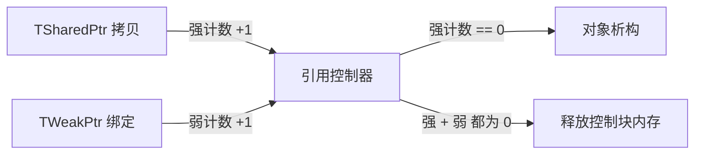

# 智能指针

UE **没有直接使用 `std::shared_ptr` 等 STL 智能指针**，而是自带一套实现（`Templates/SharedPointer.h`、`UniquePtr.h`），用于管理 **非 UObject 的普通 C++ 对象** 的生命周期。它与 UObject 的 GC 体系 **并存但互不替代**

!!! info "一句话总结"

    四个核心类型：**TUniquePtr**（独占）/ **TSharedPtr**（共享引用计数）/ **TSharedRef**（不可为空的共享引用）/ **TWeakPtr**（弱引用，不延长生命周期）；创建优先用 `MakeShared` / `MakeUnique`

!!! warning "绝不要用 TSharedPtr 管理 UObject"

    UObject 的生命周期由 **GC** 管理，而 `TSharedPtr` 会在引用归零时 `delete` 对象——两者混用会导致崩溃或重复释放。UObject 请用 `UPROPERTY` / `TWeakObjectPtr` / `TStrongObjectPtr`

## 1 与 STL 的对照

| UE 类型 | STL 对应 | 说明 |
| --- | --- | --- |
| `TUniquePtr<T>` | `std::unique_ptr` | 独占所有权，不可拷贝、可移动 |
| `TSharedPtr<T>` | `std::shared_ptr` | 共享所有权，引用计数归零即释放 |
| `TWeakPtr<T>` | `std::weak_ptr` | 弱引用，可检测对象是否已释放 |
| `TSharedRef<T>` | 无直接对应 | **不能为空** 的共享指针（语义约束） |

UE 自研的原因：与引擎内存分配器、Slate、反射体系统一，并提供 `TSharedRef` 这类更强的语义保证

## 2 四个核心类型

### 2.1 TUniquePtr：独占所有权

```cpp
TUniquePtr<FMyData> Data = MakeUnique<FMyData>();

// 访问
if (Data.IsValid()) { Data->Value = 1; }

// 转移所有权（不可拷贝，只能移动）
TUniquePtr<FMyData> Other = MoveTemp(Data);   // Data 变为空
```

- 同一时刻只有一个持有者，离开作用域自动释放
- 可与共享体系互转（单向）：`TSharedPtr<FMyData> Shared = MoveTemp(Data);`

### 2.2 TSharedPtr：共享所有权

```cpp
TSharedPtr<FMyData> Ptr = MakeShared<FMyData>();

TSharedPtr<FMyData> Copy = Ptr;    // 引用计数 +1
if (Ptr.IsValid()) { Ptr->Value = 10; }

Ptr.Reset();                       // 引用计数 -1（直到归零才释放对象）
```

- 引用计数归零 → 对象析构
- 可空（`IsValid()` 判断）、可拷贝赋值
- `Get()` 取裸指针（不改变计数，慎用）

### 2.3 TSharedRef：不可为空的共享引用

```cpp
TSharedRef<FMyData> Ref = MakeShared<FMyData>();   // 一定有效

TSharedPtr<FMyData> Ptr = Ref;      // Ref → Ptr：可以
TSharedRef<FMyData> Ref2 = Ptr.ToSharedRef();  // 若 Ptr 为空会断言崩溃
```

- 用途：**函数签名中表达"这个参数一定有效"**，省掉判空、也向调用者声明契约
- 反过来的转换（`TSharedPtr` → `TSharedRef`）需保证非空，否则断言

### 2.4 TWeakPtr：弱引用，不延长生命周期

```cpp
TWeakPtr<FMyData> Weak = Ptr;   // 不影响引用计数

// 使用前必须 Pin 成 TSharedPtr 并判空
if (TSharedPtr<FMyData> Pinned = Weak.Pin())
{
    Pinned->Value++;
}
```

- **作用一：打破循环引用**（避免 A→B→A 互持导致永不释放）
- **作用二：非持有者的安全观察**（缓存引用、回调目标）
- `Pin()` 是"原子地尝试升级为强引用"，失败返回空

!!! info "Ptr 与 WeakPtr 的关系"

    `TSharedPtr` = 强引用（决定生死）；`TWeakPtr` = 弱引用（只观察、不决定生死）。判断弱引用是否有效，唯一的正确方式是 `Pin()`（`IsValid()` 也可能被并发释放，Pin 之后拿到强引用才安全使用）

## 3 创建方式与内存差异

| 方式 | 说明 | 内存分配 |
| --- | --- | --- |
| `MakeShared<T>()` | **推荐**，对象与引用控制器**同一块内存** | 1 次分配 |
| `MakeShareable(new T())` | 接管已有裸指针，支持**自定义删除器** | 2 次分配 |
| `MakeUnique<T>()` | 创建独占指针 | 1 次分配 |

```cpp
// 推荐
TSharedPtr<FMyData> A = MakeShared<FMyData>();

// 需要自定义删除器 / 接管已有对象时
TSharedPtr<FMyData> B = MakeShareable(RawPtr, [](FMyData* P) { /* 自定义释放 */ });
```

!!! warning "同一个裸指针不要创建两个 TSharedPtr"

    ```cpp
    FMyData* Raw = new FMyData();
    TSharedPtr<FMyData> P1 = MakeShareable(Raw);
    TSharedPtr<FMyData> P2 = MakeShareable(Raw);  // 两个独立控制块 → 双重释放
    ```

    需要"从对象自身获取自身指针"时，用 `TSharedFromThis`

## 4 TSharedFromThis：从 `this` 安全获取自身

让对象自己就能拿到管理它的共享指针，避免"双重控制块"：

```cpp
class FNode : public TSharedFromThis<FNode>
{
public:
    TSharedPtr<FNode> GetSelf()
    {
        return AsShared();        // 返回管理 this 的共享指针
    }

    void Notify()
    {
        if (TSharedPtr<FNode> Self = AsShared()) { /* 安全，因为自身仍被持有 */ }
    }
};
```

- 前提：对象 **必须已经由 `TSharedPtr` 管理**（`MakeShared<FNode>()`）
- `SharedThis(this)` / `AsShared()`：拿到自身共享指针的入口

## 5 引用计数机制



- 控制块维护 **强引用计数 + 弱引用计数**
- **强计数归零 → 对象析构**；**弱计数也归零 → 控制块释放**
- 因此 `TWeakPtr` 可以在对象销毁后依然安全地"发现自己失效"，而不会访问已释放内存
- 计数增减使用 **原子操作**（跨线程增删引用是安全的），但 **对象本身的读写仍需你自己同步**

## 6 常用 API 速查

| API | 说明 |
| --- | --- |
| `IsValid()` | 是否为有效非空指针 |
| `Get()` | 取裸指针（不增加计数） |
| `Reset()` | 释放当前引用 |
| `ToSharedRef()` | 转为不可空引用（空则断言） |
| `Pin()` | （TWeakPtr）尝试升级为 TSharedPtr |
| `StaticCastSharedPtr<T>()` | 共享指针之间的静态类型转换 |
| `ConstCastSharedPtr<T>()` | 去 const 转换 |
| `MoveTemp()` | 转移所有权（unique → shared 等） |

## 7 与 UObject 体系的三组对照

| 需求 | 非 UObject（C++ 对象） | UObject |
| --- | --- | --- |
| **独占所有权** | `TUniquePtr<T>` | 由 GC 管理，无需此概念 |
| **强引用（防止失效）** | `TSharedPtr<T>` | `UPROPERTY()` 引用 / `TStrongObjectPtr<T>` |
| **弱引用（观察）** | `TWeakPtr<T>` | **`TWeakObjectPtr<T>`** |

!!! important "两套体系不能混用"

    - `TWeakObjectPtr<T>` 是 UObject 专用的弱引用：不影响 GC，对象被回收后自动失效（用法同样是 `IsValid()` / `Get()`），但它 **不是** `TWeakPtr`
    - `TStrongObjectPtr<T>` 用于"非 UPROPERTY 场合想保住 UObject 不被 GC"（底层是 `FGCObject`）
    - 在 UObject 内部用 `TSharedPtr` 持有另一个 UObject 是典型错误：共享指针会试图 `delete` 它，而它本该由 GC 处理

## 8 典型使用场景

| 场景 | 推荐 |
| --- | --- |
| 纯 C++ 数据模型、树/图节点 | `TSharedPtr` / `TUniquePtr` |
| 父子互相引用（树结构） | 父 → 子 `TSharedPtr`，子 → 父 **`TWeakPtr`** |
| Slate / UMG 底层（Slate 大量使用） | `TSharedRef` / `TSharedPtr` |
| 异步任务共享数据对象 | `TSharedPtr`（配合 `TSharedFromThis`） |
| 想让类支持"从 this 取自身指针" | 继承 `TSharedFromThis<T>` |
| 观察一个可能被释放的 C++ 对象 | `TWeakPtr` |
| 观察一个可能被 GC 的 UObject | `TWeakObjectPtr` |

## 9 常见坑与最佳实践

!!! warning "最常踩的坑"

    1. **用 TSharedPtr 管 UObject**：与 GC 冲突，可能重复释放/崩溃
    2. **同一个裸指针建两个 TSharedPtr**：双重控制块 → 双重释放；用 `MakeShared` 或 `TSharedFromThis`
    3. **循环引用**：A、B 互持 `TSharedPtr` 永不释放 → 环上至少一边改 `TWeakPtr`
    4. **TSharedRef 断言**：把可能为空的 `TSharedPtr` 直接 `ToSharedRef()` 会崩溃，先判空
    5. **拿 `Get()` 后长期保存**：裸指针不受计数保护，对象可能已被释放

!!! info "最佳实践"

    1. **创建一律用 `MakeShared` / `MakeUnique`**，别裸 `new` 后手工包
    2. **函数参数用 `TSharedRef` 表达"绝不为空"**，可空才用 `TSharedPtr`
    3. **弱引用使用前必须 `Pin()`**，不要 `Get()` 后直接访问
    4. 只做"观察/缓存"的引用一律用弱引用，天然避免生命周期问题
    5. 记住边界：**C++ 对象 → 智能指针；UObject → GC + UPROPERTY/弱引用**
