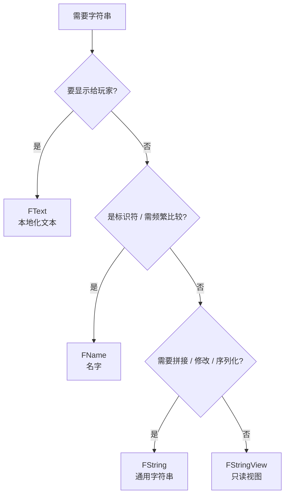

# 字符串体系

UE 没有"一种字符串"，而是按用途分成三类：**FString（通用字符串）**、**FName（名字）**、**FText（本地化文本）**，另有 **FStringView / TStringBuilder** 等轻量补充。**选错类型是常见的性能与本地化 bug 来源**

!!! info "一句话总结"

    - **FText** → 所有 **给玩家看的文本**（本地化）
    - **FName** → **标识符与频繁比较**（对象名、属性名、资产名、Tag）
    - **FString** → **拼接、处理、序列化**（真正的"字符串"）
    - **FStringView** → 只读、零拷贝地"看一眼"字符串



## 1 三类核心类型对比

| | **FString** | **FName** | **FText** |
| --- | --- | --- | --- |
| 本质 | 动态 `TCHAR` 数组 | 全局名字表中的 **索引** | 带命名空间/Key 的本地化文本 |
| 可变 | ✅ | ❌（不可变） | ❌ |
| 比较 | 逐字符（慢） | **索引比较（极快）** | 不宜用 `==` 做逻辑 |
| 构造成本 | 低（分配内存） | **较高（需查表）** | 中 |
| 大小写 | 敏感 | **不敏感** | — |
| 本地化 | ❌ | ❌ | ✅ **唯一正确选择** |
| 典型用途 | 拼接、解析、序列化、调试输出 | 对象名、类名、属性名、Tag | UI 文本、提示、对话、数值格式化 |

## 2 FString：通用字符串

- 可动态增删、拼接、查找、替换，是处理文本的主力
- 字面量必须用 `TEXT()` 宏：

```cpp
FString Str = TEXT("Hello");
Str += TEXT(" World");

// 格式化
FString Msg = FString::Printf(TEXT("HP: %d / %d"), Health, MaxHealth);

// 常用操作
Str.Contains(TEXT("World"));
Str.StartsWith(TEXT("Hel"));
Str.Replace(TEXT("World"), TEXT("UE"));
Str.ToUpper();
Str.Mid(0, 5);

// 数值互转
int32 N = FCString::Atoi(*Str);
FString S = FString::FromInt(42);
```

!!! warning "两个高频坑"

    1. **`Contains` 默认大小写不敏感**：`FString::Contains(Sub, ESearchCase::IgnoreCase)` 是默认值，需要敏感匹配要显式传 `ESearchCase::CaseSensitive`
    2. **`*Str` 取的是内部缓冲区指针**，一旦 FString 重新分配就失效，不要长期保存

## 3 FName：名字

`FName` 把字符串存进 **全局名字表（name pool）**，自身只保存索引——所以 **比较极快**（比整数），但 **创建较贵**（要查表）

```cpp
FName Name = FName(TEXT("MyActor"));     // 查表创建（有开销）

// 只查找、不创建（找不到返回 NAME_None）
FName Found = FName(*Str, FNAME_Find);

if (Name == FName(TEXT("MyActor"))) { }  // 索引比较，极快
FString AsString = Name.ToString();       // 转回字符串（有开销）
```

特点与用途：

| 特点 | 说明 |
| --- | --- |
| **大小写不敏感** | `FName("abc") == FName("ABC")` 为 true |
| **不可变** | 创建后不能改，天然适合做 key |
| **比较极快** | 索引/哈希比较，适合字典键与高频判断 |
| **用于标识符** | UObject 名、类名、属性/函数名（反射元数据）、资产路径、`FGameplayTag` 内部就是 FName |
| `NAME_None` | 空名字常量 |

!!! tip "FName 的使用原则"

    **"创建一次，比较无数次"** 才是 FName 的正确姿势。在 **高频循环里从 FString 构造 FName** 会把它的优势全变成开销

## 4 FText：本地化文本

**任何玩家能看到的文本都必须是 FText**——它携带"命名空间 + Key"，打包时可被提取翻译；直接显示 FString 就等于放弃了本地化

```cpp
// 文件头定义命名空间
#define LOCTEXT_NAMESPACE "MyGameUI"

// 创建（必须是字面量，编译期提取）
FText Title = NSLOCTEXT("MyGameUI", "Title", "开始游戏");
FText Hint  = LOCTEXT("Hint", "按空格跳跃");

#undef LOCTEXT_NAMESPACE
```

```cpp
// 带参数的格式化（支持参数重排，不同语言语序不同）
FText Format = LOCTEXT("KillMsg", "{0} 击败了 {1}");
FText Msg = FText::Format(Format,
    FText::FromString(PlayerName),
    FText::FromString(EnemyName));

// 本地化的数字/百分比/货币
FText Num = FText::AsNumber(1234567);      // 按地区加千分位
FText Pct = FText::AsPercent(0.75);
```

从字符串表取文本（适合大量文本、可外包翻译）：

```cpp
FText FromTable = FText::FromStringTable(TEXT("/Game/StringTables/UI"), TEXT("Title"));
```

!!! warning "FText 的三条铁律"

    1. **不要用 `==` 比较 FText 来做逻辑判断**（它可能因语言不同而不等）——要判断请比较 Key 或用 `FGameplayTag`
    2. **不要拿 FText 做拼接运算**——需要组合时用 `FText::Format`
    3. **不要用 FString 直接喂给 UI**——先 `FText::FromString`，但更好的做法是全程 FText

## 5 轻量视图与构建器

### 5.1 FStringView / FUtf8StringView

只读、不拥有、零拷贝的"字符串视图"，适合 **函数参数**（避免构造 FString）：

```cpp
void PrintName(FStringView Name)   // 不产生拷贝
{
    UE_LOG(LogTemp, Log, TEXT("%.*s"), Name.Len(), Name.GetData());
}

PrintName(TEXTVIEW("Hello"));      // 字面量直接变视图
```

### 5.2 TStringBuilder：高效拼接

避免 `+=` 造成的反复分配：

```cpp
TStringBuilder<256> Builder;       // 栈上缓冲
Builder << TEXT("Player: ") << PlayerName << TEXT(" Lv.") << Level;
FString Result = Builder.ToString();
```

!!! info "三种"字符串参数"的推荐"

    | 场景 | 推荐 |
    | --- | --- |
    | 只读、不保存 | `FStringView`（零拷贝） |
    | 需要保存/修改 | `const FString&` 传入，内部拷贝 |
    | 需要作为哈希键 | `FName` |

## 6 转换与编码

### 6.1 三类之间的转换

| 从 → 到 | 方式 | 备注 |
| --- | --- | --- |
| FString → FName | `FName(*Str)` | 有查表开销 |
| FName → FString | `Name.ToString()` | 有开销 |
| FString → FText | `FText::FromString(Str)` | 不做本地化，仅作显示兜底 |
| FText → FString | `Text.ToString()` | **仅用于调试**，不可逆本地化 |
| 名字查找（不创建） | `FName(*Str, FNAME_Find)` | 找不到返回 `NAME_None` |

### 6.2 与 C 风格字符的转换

```cpp
FString Str = TEXT("你好");

// 宏形式：产生"临时对象"，指针生命周期只到当前表达式结束
const char* Utf8 = TCHAR_TO_UTF8(*Str);  // ⚠️ 不能保存到下一行使用

// 正确做法：显式持有转换对象
FTCHARToUTF8 Converter(*Str);
const char* SafeUtf8 = Converter.Get();  // ✅ 生命周期跟随 Converter
```

常用宏：`TCHAR_TO_ANSI` / `ANSI_TO_TCHAR` / `TCHAR_TO_UTF8` / `UTF8_TO_TCHAR`

!!! warning "编码与字面量"

    1. `TCHAR` 在 Windows 上是 **UTF-16**（wchar_t），UE5 在源码/网络层大量使用 **UTF-8**（`UTF8CHAR`、`FUtf8StringView`）
    2. **所有字符串字面量都要用 `TEXT("...")`**，否则在不同平台可能出现编码问题
    3. `TCHAR_TO_*` 宏返回的是 **临时对象内部指针**，切勿长期保存

## 7 如何选择

| 场景 | 选择 |
| --- | --- |
| UI / 提示 / 对话 / 任务描述 | **FText** |
| 数值显示、百分比、货币 | **FText::AsNumber / AsPercent** |
| 对象名、类名、资产路径、字典键 | **FName** |
| GameplayTag 与标签比较 | **FName**（GameplayTag 内部） |
| 日志、拼接、解析、序列化 | **FString** |
| 函数参数只读 | **FStringView** |
| 高频拼接 | **TStringBuilder** |
| 配置表里的文本字段 | 显示给玩家用 FText，纯标识用 FName |

## 8 性能与最佳实践

!!! info "优化要点"

    1. **比较频繁 → FName**（比 FString 快一个量级）
    2. **避免循环内构造 FName**（查表开销大）；循环外算好再进循环
    3. **拼接用 `TStringBuilder` 或一次 `Printf`**，少用连续 `+=`
    4. **函数参数用 `FStringView` 或 `const FString&`**，避免按值传参产生拷贝
    5. 需要预留容量时用 `Reserve`
    6. 大量文本放 **String Table**，便于翻译与热更新，避免散落在代码里

!!! warning "常见坑汇总"

    1. `TCHAR_TO_UTF8` / `TCHAR_TO_ANSI` 的 **临时指针悬垂**
    2. 用 `FText::ToString()` 后当真值使用（丢掉本地化信息）
    3. 用 `==` 比较 FText 做逻辑分支
    4. 可见文本硬编码 FString，后期无法本地化
    5. `FString::Contains` 忘记默认忽略大小写
    6. 在热路径里 `FName ⇄ FString` 反复转换

!!! note "与其它笔记的联系"

    - **反射系统**：`UClass` / `UFunction` / `FProperty` 的名字都是 `FName`
    - **FGameplayTag**：内部即 `FName`，所以标签比较才那么快
    - **UDataTable / UDataAsset**：表格与资产中的显示名用 `FText`、ID 用 `FName`
