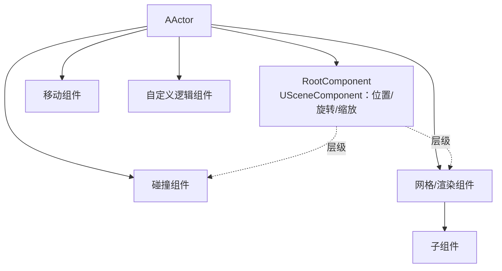
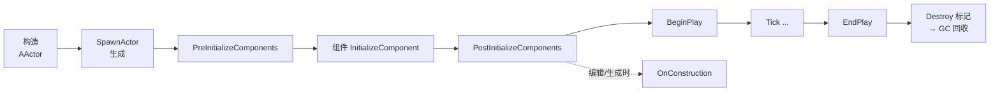

# AActor

**AActor** 是 UE 中"**能存在于游戏世界里的东西**"的基类：它可以被放到关卡中、能在运行时生成（Spawn）、有位置（Transform）、参与每帧更新（Tick）、能参与网络复制。它的核心设计是 **组合**——Actor 本身只是个"容器 + 骨架"，具体能力由 **组件** 拼装

!!! info "一句话总结"

    `AActor` = **RootComponent（决定位置）** + **一组组件（决定能力）** + **生命周期回调（生成/开始/更新/销毁）**；`ACharacter`、`APawn`、`AController`、`AGameMode`、`AHUD` 全都是它的子类



## 1 与普通 UObject 的区别

| 能力 | `UObject` | **`AActor`** |
| --- | --- | --- |
| 存在于世界 | ❌ | ✅ 可放置在关卡 / Spawn 到 World |
| Transform（位置） | ❌ | ✅ 由 RootComponent 提供 |
| 每帧更新 | ❌ | ✅ Tick |
| 网络复制 | 有限 | ✅ 完整的复制与相关性体系 |
| 所有权 Owner | ❌ | ✅ |
| 生命周期回调 | 构造/析构 | ✅ 生成、BeginPlay、EndPlay、销毁 |
| 典型 | 数据对象、UClass、组件 | 角色、道具、触发器、机关、控制器、游戏模式 |

## 2 组件系统：Actor = 组件的容器

### 2.1 RootComponent 与 Transform

- 每个 Actor 有一个 **`RootComponent`**（类型为 `USceneComponent`），**Actor 的位置/旋转/缩放就是它的 Transform**
- 其他组件 `SetupAttachment` 挂在 Root 或彼此之下，形成 **层级**；父组件移动会带动子组件

```cpp
AMyActor::AMyActor()
{
    // 1) 创建根组件
    Root = CreateDefaultSubobject<USceneComponent>(TEXT("Root"));
    SetRootComponent(Root);

    // 2) 挂子组件
    Mesh = CreateDefaultSubobject<UStaticMeshComponent>(TEXT("Mesh"));
    Mesh->SetupAttachment(Root);
}
```

### 2.2 组件类型的三个层次

| 层 | 类 | 特点 | 例子 |
| --- | --- | --- | --- |
| 逻辑组件 | `UActorComponent` | **无 Transform**，纯逻辑 | 自定义功能组件 |
| 场景组件 | `USceneComponent` | **有 Transform**，可挂层级 | `USceneComponent`、`USpringArmComponent` |
| 图元组件 | `UPrimitiveComponent` | 有 **渲染/碰撞** | `UStaticMeshComponent`、`UCapsuleComponent`、`UParticleSystemComponent` |

!!! note "组件也能复制"

    组件内标记为 `Replicated` 的属性默认不会单独复制，需要组件自己开启：`SetIsReplicatedByDefault(true)`（在构造函数里做）

### 2.3 创建与注册组件

| 时机 | 方式 |
| --- | --- |
| **构造函数**（推荐） | `CreateDefaultSubobject<T>(TEXT("Name"))` —— 成为 CDO 的一部分，自动注册 |
| **运行时** | `NewObject<T>(this)` → `SetupAttachment(...)` → **`RegisterComponent()`** |

```cpp
// 运行时动态加组件
UStaticMeshComponent* Comp = NewObject<UStaticMeshComponent>(this, TEXT("RuntimeMesh"));
Comp->SetupAttachment(GetRootComponent());
Comp->RegisterComponent();     // ⚠️ 忘记注册 = 组件不生效
```

### 2.4 查询组件

```cpp
UCapsuleComponent* Capsule = FindComponentByClass<UCapsuleComponent>();
TArray<UStaticMeshComponent*> Meshes;
GetComponents<UStaticMeshComponent>(Meshes);
```

| API | 说明 |
| --- | --- |
| `FindComponentByClass<T>()` | 找第一个 |
| `GetComponentByClass<T>()` | 同上（UE5 推荐） |
| `GetComponents<T>(OutArray)` | 找全部 |
| `ForEachComponent<T>(Lambda)` | 遍历 |

## 3 生命周期



| 回调 | 时机 | 常见用途 |
| --- | --- | --- |
| 构造函数 | 创建默认组件、设参数 | **只做创建配置，别访问世界** |
| `OnConstruction(Transform)` | 编辑器放置/运行时生成时 | 按数据动态调整组件（Construction Script） |
| `PreInitializeComponents` | 组件初始化前 | 少见 |
| `PostInitializeComponents` | 所有组件初始化后 | 组件之间的初始化 |
| **`BeginPlay()`** | 进入游戏后 **调用一次** | 初始化逻辑（此时世界已就绪） |
| `Tick(DeltaSeconds)` | 每帧 | 更新逻辑 |
| **`EndPlay(Reason)`** | 销毁/关卡切换/移出世界/退出 | 清理（解绑委托、停止定时器） |

!!! warning "构造函数 vs BeginPlay"

    - **构造函数**：可能在世界还不存在时执行（CDO 创建、蓝图编译），**不要** 访问 `GetWorld()`、其他 Actor、Spawn 对象
    - **BeginPlay**：世界已就绪，适合做真正的初始化

### 3.1 EndPlay 的结束原因

| `EEndPlayReason` | 触发场景 |
| --- | --- |
| `Destroyed` | 被 `Destroy()` |
| `LevelTransition` | 关卡切换 |
| `RemovedFromWorld` | 流送卸载 / 移出世界 |
| `EndPlayInEditor` | 编辑器停止运行 |
| `Quit` | 游戏退出 |

## 4 Transform 与移动

| API | 作用 |
| --- | --- |
| `GetActorLocation()` / `GetActorRotation()` / `GetActorTransform()` | 读取 |
| `SetActorLocation(New, bSweep, OutHit, Teleport)` | 设置位置（可选扫掠/瞬移） |
| `AddActorWorldOffset(Delta)` / `AddActorLocalOffset(Delta)` | 增量移动 |
| `SetActorRotation` / `SetActorScale3D` | 设置旋转/缩放 |

```cpp
FHitResult Hit;
const bool bSweep = true;      // 扫掠：撞到东西会停住并给出 Hit
SetActorLocation(NewLocation, bSweep, &Hit, ETeleportType::None);
```

!!! tip "移动的正确姿势"

    - **瞬移**（传送门、出生）→ `SetActorLocation` + `ETeleportType::TeleportPhysics`
    - **持续移动** → 用移动组件（如 `UCharacterMovementComponent`）或在 Tick 里 `AddActorWorldOffset` 带扫掠
    - **网络角色** → 交给移动组件（它内置预测与纠正），别手动设位置

## 5 Tick 机制

```cpp
AMyActor::AMyActor()
{
    PrimaryActorTick.bCanEverTick = true;      // 允许 Tick（默认 false！）
    PrimaryActorTick.TickInterval = 0.1f;      // 每 0.1 秒 Tick 一次（降频，省性能）
    PrimaryActorTick.TickGroup = TG_PrePhysics;// 决定在哪个阶段 Tick
}
```

| 配置 | 说明 |
| --- | --- |
| `PrimaryActorTick.bCanEverTick` | **是否参与 Tick（默认关闭）** |
| `bStartWithTickEnabled` | 是否默认启用 |
| `TickInterval` | Tick 间隔（>0 即降频） |
| `TickGroup` | Tick 阶段（`TG_PrePhysics` / `TG_DuringPhysics` / `TG_PostPhysics` / `TG_PostUpdateWork`） |
| `bTickEvenWhenPaused` | 暂停时是否仍 Tick |
| `SetActorTickEnabled(bool)` | 运行时开关 |

- **组件** 用各自的 `PrimaryComponentTick`，组件 Tick 在其所属 Actor Tick **之后**
- Tick 顺序由 `TickGroup` 决定（如角色移动通常在物理前，摄像机跟随在物理后）

!!! warning "Tick 是性能开销大户"

    大量 Actor 每帧 Tick 会显著吃 CPU。原则：**默认不开 Tick；需要就开，能降频就降频（`TickInterval`），不需要就关（`SetActorTickEnabled(false)`）**；长时间不用的东西用定时器替代轮询

## 6 生成 Actor（Spawn）

```cpp
FActorSpawnParameters Params;
Params.Owner = this;                                   // 所有权（RPC/相关性）
Params.Instigator = GetInstigator();                   // 归因者（伤害来源）
Params.SpawnCollisionHandlingOverride =
    ESpawnActorCollisionHandlingMethod::AdjustIfPossibleButAlwaysSpawn;

ABullet* Bullet = GetWorld()->SpawnActor<ABullet>(
    BulletClass, MuzzleLocation, MuzzleRotation, Params);
```

### 6.1 SpawnActorDeferred：先生成、配置好、再"开场"

```cpp
ABullet* Bullet = GetWorld()->SpawnActorDeferred<ABullet>(
    BulletClass, SpawnTransform, Owner, Instigator,
    ESpawnActorCollisionHandlingMethod::AlwaysSpawn);

Bullet->Damage = 50.f;          // ✅ 在 BeginPlay 之前完成配置
Bullet->Speed  = 3000.f;

Bullet->FinishSpawning(SpawnTransform);   // 触发 BeginPlay
```

> 用 `SpawnActor` 时对象 **立即 BeginPlay**，之后再设属性可能会被初始化逻辑覆盖；需要"生成前配置"就用 **Deferred**

| 碰撞处理方式 | 含义 |
| --- | --- |
| `AlwaysSpawn` | 直接生成（可能重叠） |
| `AdjustIfPossibleButAlwaysSpawn` | 尽量调整位置，实在不行也生成 |
| `AdjustIfPossibleButDontSpawnIfColliding` | 调整不了就不生成 |
| `DontSpawnIfColliding` | 碰撞就不生成 |

## 7 所有权、Instigator 与标签

| 机制 | 说明 |
| --- | --- |
| `SetOwner(Actor)` / `GetOwner()` | **所有权**：影响网络相关性、RPC 发送目标、GC 引用链 |
| `SetInstigator(APawn*)` / `GetInstigator()` | **归因**：谁"造成"了它（伤害/击杀记在谁头上） |
| `Tags` / `ActorHasTag(Tag)` | Actor 标签：批量筛选（`UGameplayStatics::GetAllActorsWithTag`） |
| `GetWorld()` / `GetLevel()` | 所在世界与关卡 |
| `GetLifeSpan()` / `SetLifeSpan(Seconds)` | 定时自动销毁（子弹、特效、掉落物） |

## 8 网络相关（简述）

| 属性 | 作用 |
| --- | --- |
| `bReplicates` | 是否参与复制（`SetReplicates(true)`） |
| `bAlwaysRelevant` / `bOnlyRelevantToOwner` | 相关性策略（谁能收到） |
| `NetCullDistanceSquared` | 距离剔除 |
| `NetUpdateFrequency` / `NetPriority` | 更新频率 / 带宽优先级 |
| `Role` / `RemoteRole` | 网络角色（Authority / Autonomous / Simulated） |
| `SetReplicateMovement(true)` | 是否同步移动（角色通常由移动组件处理） |

!!! warning "复制 Actor 必须由服务器生成"

    客户端 `SpawnActor` 出来的对象 **只有自己能看到**。要同步给所有人，必须由 **服务器** 生成（或客户端发 Server RPC 请求服务器生成）

## 9 销毁

```cpp
Destroy();               // 标记销毁（帧末处理），随后交给 GC
SetLifeSpan(3.f);        // 3 秒后自动 Destroy
SetLifeSpan(0.f);        // 取消定时销毁

if (IsActorBeingDestroyed()) { /* 正在销毁 */ }
if (IsPendingKillPending())  { /* 已标记待回收 */ }
```

`Destroy()` 的语义：

1. 标记 Actor（及其组件）为待销毁，停止 Tick
2. 触发生命周期：`Destroyed()` → `EndPlay(Destroyed)`
3. **内存由 GC 回收**（不是立即释放）——所以销毁后仍然可能短暂存在，但不应再使用

!!! note "Actor 的销毁与 GC"

    Actor 是 `UObject`，受 **GC** 管理。`Destroy()` 只是"标记 + 通知"，真正的内存回收发生在 GC 阶段

## 10 常见坑与最佳实践

!!! warning "最常见的坑"

    1. **构造函数里访问世界**：`GetWorld()` 可能为 null（CDO/蓝图编译阶段）→ 用 `BeginPlay`
    2. **忘了 `PrimaryActorTick.bCanEverTick = true`**：`Tick` 根本不会被调用
    3. **运行时创建组件忘了 `RegisterComponent()`**：组件不生效
    4. **Tick 里做重活**：遍历、加载、字符串拼接 → 降频或用定时器
    5. **手动 `SetActorLocation` 同步网络角色**：破坏移动预测 → 交给移动组件
    6. **`Destroy()` 后继续访问**：对象已失效，应判 `IsValid()` / `IsActorBeingDestroyed()`
    7. **客户端 Spawn 复制对象**：别的机器看不到
    8. **忘记设置 `Owner`**：RPC 发送目标与网络相关性出错
    9. **`EndPlay` 里不清理**：委托/定时器未解绑 → 崩溃或泄漏

!!! info "最佳实践"

    1. **组合优于继承**：能力做成组件（可复用、可组装），而不是不断加 Actor 子类
    2. **构造函数只创建组件、设默认值**；初始化逻辑放 `BeginPlay`
    3. **能不开 Tick 就不开**；必须开就设 `TickInterval` 或用定时器
    4. 生成对象需要"先配置后启动"时用 **`SpawnActorDeferred`**
    5. 需要"临时存在"的对象用 **`SetLifeSpan`**，比手动管理更省心
    6. 用 **`Tags`** 做轻量筛选，避免维护一堆自研列表

!!! note "与其它笔记的联系"

    - **GamePlay 框架**：`APawn` / `ACharacter` / `AController` / `AGameMode` / `AGameState` / `AHUD` 都是 `AActor` 的子类
    - **反射 / GC**：Actor 是 `UObject`，`UPROPERTY` 成员才被序列化与 GC 追踪
    - **网络同步**：`bReplicates` / 相关性 / 频率 / 优先级都在 Actor 层定义
    - **容器 / 字符串**：`Tags` 用 `FName`，列表用 `TArray`
