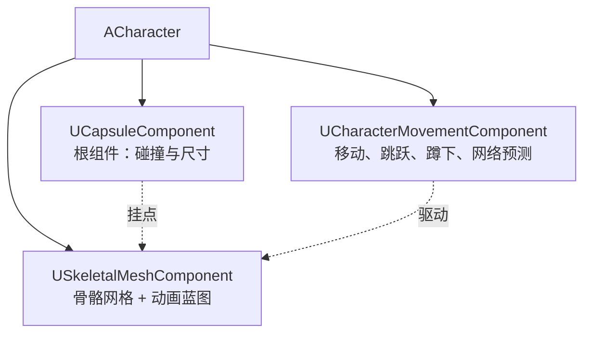

# ACharacter

**ACharacter** 是 `APawn` 的子类，专门为 **两足人形角色** 设计：它预置了 **胶囊体碰撞 + 骨骼网格体 + 角色移动组件** 三件套，把"走路、跳跃、蹲下、爬台阶、贴地、网络移动预测"这些通用能力全都封装好了

!!! info "一句话总结"

    `ACharacter` = **`UCapsuleComponent`（根，碰撞）** + **`USkeletalMeshComponent`（模型）** + **`UCharacterMovementComponent`（灵魂，移动求解）**；它提供 `Jump` / `Crouch` / `LaunchCharacter` 等接口，真正的移动逻辑在移动组件里



## 1 继承关系与定位

```text
UObject → AActor → APawn → ACharacter
```

| 类 | 定位 |
| --- | --- |
| `AActor` | 世界中的实体 |
| `APawn` | **可被 Controller 控制** 的实体（"身体"，不含具体移动方式） |
| **`ACharacter`** | **会走路的两足角色**（预置胶囊体 + 骨骼网格 + 人形移动组件） |

| 你的角色是… | 应该继承 |
| --- | --- |
| 人形玩家/AI 角色 | **`ACharacter`** |
| 载具、飞船、球体、自定义移动 | `APawn` + 自定义 `UPawnMovementComponent` |
| 只有逻辑不需要"身体" | `AActor` 或 `AController` |

## 2 默认组件构成

| 组件 | 角色 | 说明 |
| --- | --- | --- |
| **`UCapsuleComponent`** | **根组件** | 角色的碰撞体（胶囊体），决定"身高与半径"、与其他物体的碰撞、能否进门 |
| **`USkeletalMeshComponent`** | 模型 | 骨骼网格体（含材质、动画蓝图）；**相对胶囊体有偏移**，需要对齐 |
| **`UCharacterMovementComponent`** | 移动 | 走路/跳跃/蹲下/游泳/飞行、贴地检测、网络预测 |
| `UArrowComponent` | 编辑器辅助 | 仅编辑器可见的朝向箭头 |

```cpp
AMyCharacter::AMyCharacter()
{
    // 组件已由 ACharacter 创建，这里通常只做参数配置
    GetCapsuleComponent()->InitCapsuleSize(42.f, 96.f);   // 半径 / 半高

    GetMesh()->SetRelativeLocation(FVector(0.f, 0.f, -96.f));  // 让模型脚底对齐胶囊底部
    GetMesh()->SetRelativeRotation(FRotator(0.f, -90.f, 0.f)); // 让模型面朝 X 轴

    GetCharacterMovement()->MaxWalkSpeed = 600.f;
    GetCharacterMovement()->JumpZVelocity = 600.f;
    GetCharacterMovement()->AirControl = 0.2f;
}
```

!!! warning "模型与胶囊体必须对齐"

    胶囊体才是"真实的角色"，骨骼网格体只是"长在上面的一层皮"。若 Mesh 的相对位置没调好，就会出现 **角色悬浮、穿地、动画与碰撞不一致**。这是新手最常见的视觉问题

## 3 ACharacter 自身提供的 API

| API | 作用 |
| --- | --- |
| `Jump()` / `StopJumping()` | 起跳 / 松开跳跃（松开可让跳跃高度可变） |
| `CanJump()` | 当前能否跳跃（可重写定制） |
| `Crouch()` / `UnCrouch()` | 蹲下 / 站起（需移动组件允许） |
| **`LaunchCharacter(Velocity, bXYOverride, bZOverride)`** | 施加冲量（击飞、弹射） |
| `Landed(const FHitResult& Hit)` | **落地时调用**（虚函数，可重写做落地特效/音效） |
| `OnJumped()` | 起跳瞬间（可重写） |
| `GetMesh()` / `GetCapsuleComponent()` / `GetCharacterMovement()` | 获取三大组件 |
| `bIsCrouched` | 是否处于蹲下（复制属性） |

```cpp
// 常见用法
Jump();
StopJumping();
Crouch();
LaunchCharacter(FVector(0.f, 0.f, 1200.f), false, true);   // 向上击飞

void AMyCharacter::Landed(const FHitResult& Hit)
{
    Super::Landed(Hit);
    // 落地：播放音效、生成尘土、播放落地动画
}
```

## 4 UCharacterMovementComponent（核心）

### 4.1 移动模式（MovementMode）

| 模式 | 含义 |
| --- | --- |
| `MOVE_Walking` | 在地面上行走 |
| `MOVE_NavWalking` | 通过导航网格行走（AI） |
| `MOVE_Falling` | 空中/下落 |
| `MOVE_Swimming` | 游泳 |
| `MOVE_Flying` | 飞行（无重力约束） |
| `MOVE_Custom` | 自定义（如攀爬、滑翔） |
| `MOVE_None` | 禁用移动 |

```cpp
GetCharacterMovement()->SetMovementMode(MOVE_Flying);   // 切换移动模式
GetCharacterMovement()->DisableMovement();              // 冻结角色
```

### 4.2 常用参数

| 参数 | 作用 |
| --- | --- |
| `MaxWalkSpeed` / `MaxWalkSpeedCrouched` | 走/蹲速度（**改速度就改这里**） |
| `MaxAcceleration` / `BrakingDecelerationWalking` | 加速与刹车（手感的关键） |
| `GroundFriction` | 地面摩擦 |
| `JumpZVelocity` | 起跳初速度（决定跳跃高度） |
| `AirControl` | 空中操控程度 |
| `GravityScale` | 重力倍率（做"低重力"改这里） |
| `MaxStepHeight` | 能自动迈上的台阶高度 |
| `WalkableFloorAngle` | 可站立的 **最大坡度**（超过就滑落） |
| `bOrientRotationToMovement` | **面朝移动方向** 旋转（第三人称常用） |
| `RotationRate` | 跟随移动方向旋转的速度 |
| `bUseControllerDesiredRotation` | 平滑转向到 Controller 的朝向 |
| `NetworkSmoothingMode` | 网络平滑模式（模拟代理插值） |

### 4.3 移动是怎么算出来的（原理）

!!! info "关键：这是"运动学移动"，不是物理模拟"

    角色 **不是** 刚体物理对象——移动组件用 **胶囊体扫掠（sweep）** 求解：

    1. 计算本帧的 **期望位移**（加速度、摩擦、重力、输入方向）
    2. 用胶囊体沿期望方向 **扫掠移动**（`SafeMoveUpdatedComponent`），遇到阻挡就停下或沿表面滑动（`SlideAlongSurface`）
    3. 向下 **检测地板**（`FindFloor`）决定是否还在地面、是否贴地
    4. 更新移动模式（如从 Walking 变 Falling）

    因为是运动学的，所以 **稳定、可预测、好做网络同步**——这也是 UE 角色操控手感可靠的底层原因，代价是不像物理那样"真实"（不能被外力自然推动，需要显式 `LaunchCharacter`）

### 4.4 网络预测与纠正

| 机制 | 说明 |
| --- | --- |
| **客户端预测** | 自主代理的客户端 **立即本地移动**（手感不卡） |
| **保存移动** | 每次移动记录到 `FSavedMove_Character` 列表 |
| **服务器权威** | 服务器跑同样的移动逻辑（打包在 `ServerMovePacked` 类 RPC 中） |
| **纠正与重放** | 服务器发现偏差 → 发回纠正（`ClientMoveResponsePacked`）→ 客户端 **回滚** 到权威状态并 **重放** 后续输入 |
| **远端平滑** | 其他人（Simulated Proxy）用 `NetworkSmoothingMode` 做插值，看起来平滑 |

!!! note "所以…"

    移动的网络同步是 **引擎内置** 的，你只需在 C++/蓝图中正常调用移动相关接口，**不要直接 `SetActorLocation` 传送角色**（除非确需瞬移，如出生、传送门），否则会破坏预测与纠正

### 4.5 关键方法

| 方法 | 作用 |
| --- | --- |
| `PerformMovement(DeltaTime)` | 每帧移动求解主循环 |
| `IsFalling()` / `IsMovingOnGround()` | 状态查询 |
| `AddImpulse` / `AddForce` / `Launch` | 施加外力（速度/加速度层面） |
| `FindFloor` / `CurrentFloor` | 地面检测与结果 |
| `SetWalkableFloorAngle` / `GetWalkableFloorZ` | 可行走坡度控制 |
| `SetMovementMode` / `DisableMovement` | 移动模式切换 |

## 5 旋转控制（最容易混淆的一块）

角色"朝哪转"由三个开关配合，**不要同时开冲突的组合**：

| 属性（在哪） | 含义 |
| --- | --- |
| `bUseControllerRotationYaw`（`APawn`） | Actor 的朝向 **直接跟随 Controller 朝向**（控制器转头角色立刻转） |
| `bOrientRotationToMovement`（`CharacterMovement`） | 角色 **转向移动方向**（松手后朝向保留） |
| `bUseControllerDesiredRotation`（`CharacterMovement`） | 平滑转向 Controller 期望的朝向（有 `RotationRate` 过渡） |

常见组合：

| 玩法 | 推荐设置 |
| --- | --- |
| **第三人称动作**（镜头转向、角色朝移动方向跑） | `bUseControllerRotationYaw = false` + `bOrientRotationToMovement = true` |
| **第一人称/射击**（角色朝向跟随镜头横摆） | `bUseControllerRotationYaw = true`，并关闭 `bOrientRotationToMovement` |
| **俯视角/双摇杆** | `bOrientRotationToMovement = true` + 固定镜头 |

!!! warning "同时开 `bUseControllerRotationYaw` 和 `bOrientRotationToMovement`"

    两者会 **互相打架**（一个要跟随控制器，一个要跟随移动方向），表现为角色 **抖动或旋转异常**。二选一，或用 `bUseControllerDesiredRotation` 做平滑过渡

## 6 与动画系统的衔接

- 骨骼网格体的 **Anim Class** 决定动画蓝图
- 动画蓝图通过 **读取移动组件的状态** 驱动动画：速度（`GetVelocity().Size2D()` / `MaxWalkSpeed` 比值）、`IsFalling()`、`bIsCrouched` 等
- 所以"角色跑得慢但动画在跑"这类问题，本质是 **移动参数与动画阈值不匹配**

# 5 常见坑与最佳实践

!!! warning "最常见的坑"

    1. **直接改 Actor 位置**：`SetActorLocation` 传送会破坏移动预测与碰撞 → 用移动组件正常移动，只有瞬移才用 `Teleport` 类接口
    2. **Mesh 与胶囊体不对齐**：悬浮、穿地、步伐高度不对
    3. **旋转开关冲突**：`bUseControllerRotationYaw` 与 `bOrientRotationToMovement` 同时开启导致抖动
    4. **速度改错地方**：想改移动速度却去改动画播放速率；应为 `MaxWalkSpeed`
    5. **台阶/坡度参数不匹配关卡**：`MaxStepHeight` 太小卡在台阶前，`WalkableFloorAngle` 太小导致坡上滑落
    6. **在客户端手动同步位置**：会被服务器纠正覆盖
    7. **胶囊体尺寸改动后没调 Mesh 偏移**：视觉错位

!!! info "最佳实践"

    1. 在**构造函数**里配好胶囊体尺寸、Mesh 对齐、移动参数默认值
    2. 需要"速度变化"（加速跑、减速 debuff）时 **乘系数作用于 `MaxWalkSpeed`**，而不是每秒传送
    3. 落地/起跳用 `Landed` / `OnJumped` 钩子做表现，逻辑与表现分离
    4. 击飞、爆炸推力统一走 `LaunchCharacter`（会正确处理网络与碰撞）
    5. 换个移动方式（飞行、游泳、攀爬）时优先 **切 `MovementMode`**，而不是另写位移逻辑
    6. NPC 大量存在时注意 `NetworkSmoothingMode` 与移动组件的 Tick 开销

!!! note "与其它笔记的联系"

    - **GamePlay 框架**：`ACharacter` 是 `APawn` 的常用子类，由 `PlayerController` / `AAIController` 控制
    - **网络同步**：移动预测/纠正由 `UCharacterMovementComponent` 内置（第 4.4 节）
    - **动画系统**：移动组件提供数据，动画蓝图消费数据驱动姿态
    - **输入系统**：输入在 Controller/PlayerController 绑定，转发给 `ACharacter` 的 `Jump`/`Crouch` 等接口
