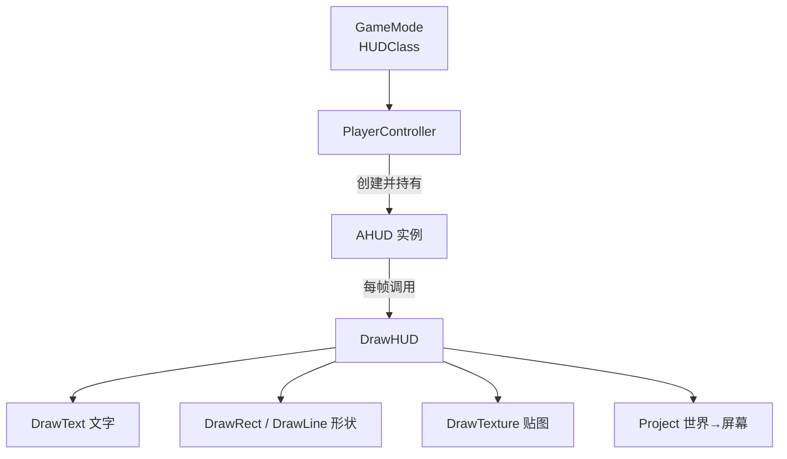

# AHUD

**AHUD** 是 UE 中负责 **屏幕上 2D 绘制** 的 Actor：每个 `PlayerController` 对应一个 HUD 实例，引擎每帧调用它的 `DrawHUD()`，用 **Canvas API** 直接在屏幕上画文字、形状、贴图。它是 UE3 时代 UI 的主力，现在更多用于 **调试绘制** 与 **简单叠加显示**

!!! info "一句话总结"

    `AHUD` = **每帧调用的屏幕绘制入口**（`DrawHUD()`）+ **Canvas 即时绘制 API**（`DrawText`/`DrawRect`/`DrawLine`/`DrawTexture`）+ **世界坐标转屏幕坐标**（`Project`）；复杂界面请交给 **UMG**



## 1 在框架中的位置

| 关系 | 说明 |
| --- | --- |
| 继承 | `AActor → AHUD` |
| 谁创建 | `PlayerController`（依据 GameMode 的 `HUDClass`） |
| 关联对象 | `PlayerOwner`（所属 PlayerController）、`Canvas`（绘制画布） |
| 是否复制 | **不复制**，纯本地绘制（每个客户端各自画自己的界面） |

```cpp
// GameMode 中指定自定义 HUD 类
AMyGameMode::AMyGameMode()
{
    HUDClass = AMyHUD::StaticClass();
}
```

```cpp
// 任意位置获取
if (APlayerController* PC = GetWorld()->GetFirstPlayerController())
{
    if (AMyHUD* HUD = PC->GetHUD<AMyHUD>())
    {
        // 使用
    }
}
```

## 2 生命周期与关键虚函数

| 函数 | 时机 | 用途 |
| --- | --- | --- |
| `BeginPlay()` | HUD 创建后 | 初始化 |
| **`DrawHUD()`** | **每帧** | 主要绘制入口（可重写） |
| `ShowDebugInfo(FName DebugType)` | 执行 `ShowDebug` 命令时 | 自定义调试信息显示 |
| `PostRender()` | 底层渲染回调 | 相比 `DrawHUD` 更底层，少见 |

!!! warning "DrawHUD 是每帧重绘（立即模式）"

    Canvas 绘制 **不保留** 任何内容：上一帧画的这一帧全部重画。因此：

    - 不要在 `DrawHUD` 里做重逻辑或分配资源
    - 想"保留"的 UI 元素必须每帧重新绘制
    - 复杂界面用 UMG（保留模式，只更新变化的部分）

## 3 Canvas 绘制 API

```cpp
void AMyHUD::DrawHUD()
{
    Super::DrawHUD();
    if (!Canvas) { return; }

    const float CX = Canvas->SizeX * 0.5f;
    const float CY = Canvas->SizeY * 0.5f;

    // 准星：两条线
    DrawLine(CX - 12, CY, CX + 12, CY, FLinearColor::White, 2.f);
    DrawLine(CX, CY - 12, CX, CY + 12, FLinearColor::White, 2.f);

    // 半透明底 + 文字
    DrawRect(FLinearColor(0, 0, 0, 0.5f), 20.f, 20.f, 240.f, 40.f);
    DrawText(TEXT("Health: 100"), FLinearColor::Red, 30.f, 28.f, nullptr, 1.2f, false);
}
```

常用 API：

| API | 作用 |
| --- | --- |
| `DrawText(Text, Color, X, Y, Font, Scale, bScalePosition)` | 绘制文字 |
| `DrawRect(Color, X, Y, W, H)` | 绘制矩形（可做底色/进度条） |
| `DrawLine(X1, Y1, X2, Y2, Color, Thickness)` | 绘制线段 |
| `DrawTexture(Tex, X, Y, W, H, U, V, UW, VH, ...)` | 绘制贴图 |
| `DrawMaterial(...)` | 用材质绘制（可做复杂效果） |
| `GetTextSize(Text, OutW, OutH, Font, Scale)` | 预先测量文字尺寸 |
| **`Project(WorldLocation)`** | **世界坐标 → 屏幕坐标** |
| `Canvas->SizeX / SizeY` | 屏幕尺寸（注意 DPI） |

### 3.1 世界坐标转屏幕

```cpp
FVector Screen = Project(EnemyLocation);
if (Screen.Z > 0.f)   // Z > 0 表示在摄像机前方（可见）
{
    DrawText(TEXT("敌人"), FLinearColor::Yellow, Screen.X, Screen.Y);
}
```

这是 AHUD 至今仍常用的能力：**把 3D 世界里的位置标注到屏幕上**（敌人标记、任务指引、伤害数字锚点）。

!!! note "调试信息也是 AHUD 画的"

    引擎控制台的 `ShowDebug` 命令（AI、碰撞、物理等信息）就是通过 `AHUD::ShowDebugInfo` 用 Canvas 绘制出来的。所以即使项目 UI 全用 UMG，保留 `AHUD` 做调试绘制依然有价值

## 4 蓝图使用

1. 内容浏览器 → 新建蓝图类 → 继承 **HUD**
2. 在 GameMode（或世界设置里的 GameMode Override）中把 `HUD Class` 设为该蓝图
3. 在 HUD 蓝图的事件图中实现 **Event Receive Draw HUD**（提供 `Size X` / `Size Y`）
4. 从中连出 **Draw Text**、**Draw Rect**、**Draw Line**、**Draw Texture**、**Project** 等节点

## 5 AHUD/Canvas vs UMG：怎么分工

| 维度 | **AHUD（Canvas）** | **UMG（Widget）** |
| --- | --- | --- |
| 模式 | **立即模式**（每帧重画，无保留） | **保留模式**（控件树，只更新变化） |
| 布局 | 手算坐标 | 锚点/布局/自适应 |
| 交互 | 需自己实现命中检测 | 内置按钮、事件、焦点 |
| 动画 | 自己写 | 动画系统 |
| 本地化 | 需自己处理 | 原生支持（FText） |
| 适合 | 调试信息、准星、世界坐标标注、极简叠加 | **所有正式界面**（HUD、菜单、血条、背包） |
| 性能 | 简单但无缓存 | 更优（局部更新） |

!!! info "现代实践建议"

    - **正式 UI 全部用 UMG**（`CreateWidget` + `AddToViewport`，血条/技能栏/小地图）
    - **AHUD 保留两类用途**：① 引擎/自研调试绘制；② 用 `Project` 做世界→屏幕坐标换算，驱动 UMG 里的跟随控件（例如"敌人头顶血条"）
    - 准星这类极小元素，Canvas 也完全够用

## 6 典型用途

| 用途 | 做法 |
| --- | --- |
| 屏幕准星 | `DrawLine` 两条交叉线 |
| 调试信息 | 覆写 `DrawHUD` 或 `ShowDebugInfo` |
| 敌人/目标标记 | `Project` + `DrawText`/`DrawTexture` |
| 简单提示条 | `DrawRect` + `DrawText` |
| 显示帧率/网络统计 | 引擎已有 `stat` 命令；自研可在此绘制 |

## 7 性能与常见坑

!!! warning "注意点"

    1. **每帧执行**：`DrawHUD` 每帧都跑，别在里面分配内存、查表、加载资源
    2. **立刻模式无缓存**：所有内容每帧重画，元素多了开销上升 → 复杂界面用 UMG
    3. **分辨率与 DPI**：`Canvas->SizeX/SizeY` 是实际像素；直接用像素坐标在小屏会错位，应按比例换算并考虑 DPI 缩放
    4. **`Project` 要判 Z**：Z ≤ 0 表示在摄像机后方，此时不应绘制
    5. **`GetTextSize` 每帧调用有开销**：文本不变时可缓存测量结果
    6. **不要在 HUD 里做游戏逻辑**：HUD 是纯展示层，逻辑应在 GameMode/PlayerController/组件中
    7. **HUD 不复制**：需要跨端一致的状态必须来自已复制的数据（PlayerState/GameState）

!!! info "最佳实践"

    1. UI 主体交给 UMG，`AHUD` 只做调试与坐标投影
    2. 需要"世界定位的 UI"（头顶血条、标记）→ `Project` 拿屏幕坐标，再驱动 UMG 控件位置
    3. 绘制尺寸一律 **按屏幕比例** 计算，避免分辨率适配问题
    4. 用 `GetOwningPlayerController()` / `GetOwningPawn()` 取上下文，不要硬找全局对象

!!! note "与其它笔记的联系"

    - **GamePlay 框架**：`GameMode.HUDClass` 决定 HUD 类，`PlayerController` 持有实例
    - **网络同步**：HUD 不复制，显示的数据来自复制的 `PlayerState` / `GameState`
    - **字符串体系**：显示文本应用 `FText`，但 Canvas 的 `DrawText` 接收 `FString`——正式 UI 请用 UMG 以保留本地化能力
