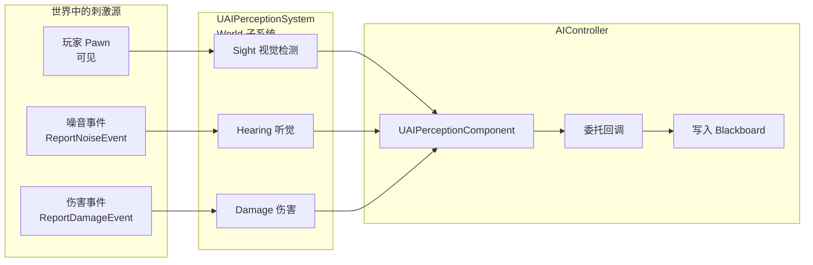
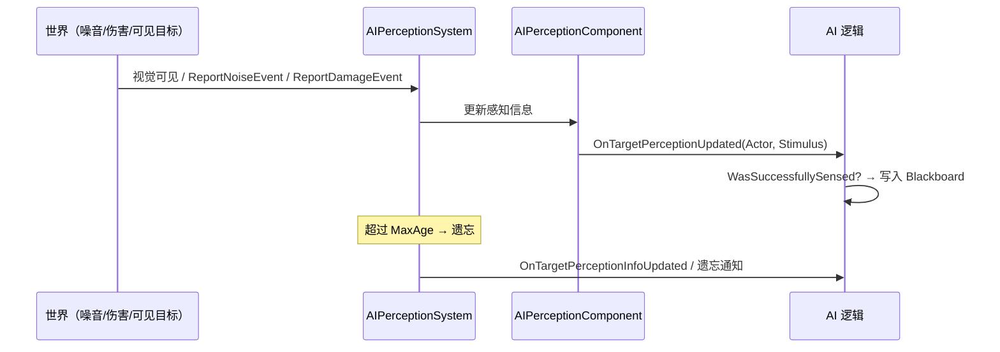
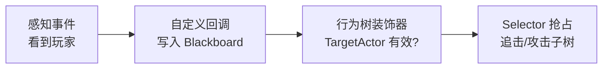

# AI Perception

**AI Perception（AI 感知系统）** 是 UE 提供的"让 AI 感知世界"的框架：无需自己每帧写射线检测和距离判断，只需在 **AIController** 上挂一个 **感知组件**、配置若干 **感官（Sense）**，引擎就会持续检测并把"看到 / 听到 / 被伤害"等结果以 **事件** 形式通知 AI，还自带 **记忆与遗忘** 机制

!!! info "一句话总结"

    AI Perception = **AIPerceptionComponent（感知者）** + **Sense 配置（视觉/听觉/伤害/触觉…）** + **Stimulus 刺激（感知到的事件）**；由 World 的 **AIPerceptionSystem** 统一调度，产出"谁被感知到"并通过 **委托回调** 通知 AI



| 手写做法的痛点 | AI Perception 的做法 |
| --- | --- |
| 自己写视锥 + 射线 + 遮挡检测 | 配置 **Sight** 感官即可 |
| 自己传播"枪声/脚步"给附近 AI | 用 **ReportNoiseEvent** 广播噪音，引擎按范围分发 |
| 目标丢失立刻忘记，行为抖动 | 内置 **记忆（Age）** 与 **遗忘** 机制 |
| 敌我不分，看到队友也追击 | **阵营（Team）与 Affiliation** 过滤 |
| 分散的检测逻辑难调试 | 内置可视化调试工具 |

## 1 核心组成

### 1.1 UAIPerceptionComponent（感知组件）

- 挂在 **AIController** 上（`GetPerceptionComponent()` / `PerceptionComponent` 成员）
- 职责：注册感官、收集感知结果、广播感知事件
- 提供查询接口：`GetPerceivedActors()`、`GetCurrentlyPerceivedActors()`、`GetKnownPerceivedActors()`

### 1.2 感官（Sense）

| 感官 | 配置类 | 感知方式 |
| --- | --- | --- |
| **视觉 Sight** | `UAISenseConfig_Sight` | 视距 + 视锥角 + 视线 trace（遮挡判定） |
| **听觉 Hearing** | `UAISenseConfig_Hearing` | 接受 `ReportNoiseEvent` 广播，按距离衰减 |
| **伤害 Damage** | `UAISenseConfig_Damage` | 接受 `ReportDamageEvent`，感知伤害来源 |
| **触觉 Touch** | `UAISenseConfig_Touch` | 物理接触事件 |
| **队伍 Team** | `UAISenseConfig_Team` | 队伍层面的共享感知（UE5） |
| **预测 Prediction** | `UAISenseConfig_Prediction` | 感知移动目标的**未来位置**（UE5 新增） |
| **自定义** | 继承 `UAISense` / `UAISense_Blueprint` | 自己实现感知规则 |

视觉常用参数：

| 参数 | 含义 |
| --- | --- |
| `SightRadius` | 视野半径 |
| `LoseSightRadius` | 超出此距离就判定"失去目标"（避免边缘抖动） |
| `PeripheralVisionAngleDegrees` | 视锥半角（决定视野宽窄） |
| `AutoSuccessRangeFromLastSeenLocation` | 最后一次看到的位置附近，自动视为仍可见 |
| `DetectionByAffiliation` | 是否感知敌人 / 中立 / 友方 |

### 1.3 刺激（Stimulus）

感知结果封装为 `FAIStimulus`，包含：

- **是否成功感知**（`WasSuccessfullySensed()`）
- **刺激来源 Actor**、位置、类型（`FName` 如 `"Default"`）
- **强度**、**年龄（Age）**

对应的事件结构有 `FAISightEvent`、`FAINoiseEvent`、`FAIDamageEvent`、`FAITouchEvent`

### 1.4 感知系统与记忆

- `UAIPerceptionSystem`：World 级子系统，统一收集刺激、分发给各感知者
- **Max Age（刺激最大存活时间）**：感知到的信息会随时间"变旧"，超时后 **遗忘**（触发遗忘事件）——这就是 AI 的"短期记忆"
- 所有感知都以 **事件驱动**，不需要你每帧轮询

## 2 感知生命周期与回调



常用回调：

| 回调 | 时机 |
| --- | --- |
| `OnTargetPerceptionUpdated(Actor, Stimulus)` | 某个目标的感知状态更新（看到 ↔ 失去） |
| `OnPerceptionUpdated(TArray<AActor*>)` | 批量更新（哪些 Actor 有变化） |
| `OnTargetPerceptionInfoUpdated(...)` | 带完整感知信息的更新（UE5 新签名） |
| `OnTargetPerceptionForgotten(Actor)` | 目标被遗忘 |

判断"是看到还是丢失"，用 `Stimulus.WasSuccessfullySensed()`：

```cpp
void AMyAIController::OnTargetPerceptionUpdated(AActor* Actor, FAIStimulus Stimulus)
{
    if (Stimulus.WasSuccessfullySensed())
    {
        // 感知到目标：写入黑板
        GetBlackboardComponent()->SetValueAsObject(TEXT("TargetActor"), Actor);
    }
    else
    {
        // 失去感知：清空黑板
        GetBlackboardComponent()->ClearValue(TEXT("TargetActor"));
    }
}
```

## 3 配置实操

### 3.1 蓝图配置

1. AIController 蓝图里添加 **AI Perception** 组件
2. 在 `AIPerception` 的 **Senses Config** 数组里 `+` 添加 **AI Sight config**（可再加 Hearing）
3. 勾选 `Detect Enemies` / `Detect Neutrals` 等，设置视距与视锥角
4. 在 **BeginPlay** 里 `Bind Event to OnTargetPerceptionUpdated`，在事件里写黑板

### 3.2 C++ 配置

```cpp
AMyAIController::AMyAIController()
{
    PerceptionComponent = CreateDefaultSubobject<UAIPerceptionComponent>(TEXT("PerceptionComp"));

    UAISenseConfig_Sight* Sight = CreateDefaultSubobject<UAISenseConfig_Sight>(TEXT("SightConfig"));
    Sight->SightRadius = 2000.f;
    Sight->LoseSightRadius = 2400.f;                 // 迟滞，避免边界抖动
    Sight->PeripheralVisionAngleDegrees = 60.f;
    Sight->DetectionByAffiliation.bDetectEnemies = true;
    Sight->DetectionByAffiliation.bDetectNeutrals = true;
    Sight->DetectionByAffiliation.bDetectFriendlies = false;
    Sight->MaxAge = 5.f;                             // 记忆时长

    PerceptionComponent->ConfigureSense(*Sight);
    PerceptionComponent->SetDominantSense(Sight->GetSenseImplementation());
    PerceptionComponent->OnTargetPerceptionUpdated.AddDynamic(
        this, &AMyAIController::OnTargetPerceptionUpdated);
}
```

!!! note "需要 AIModule"

    `UAIPerceptionComponent` 属于 `AIModule`，`Build.cs` 里添加 `"AIModule"` 依赖即可

### 3.3 阵营与敌我判定（Afiliation）

- 通过 `IGenericTeamAgentInterface`（`GetGenericTeamId()` / `SetGenericTeamId()`）给 Pawn/Controller 分配队伍
- 引擎据此计算 **Attitude（友好/中立/敌对）**，配合 `DetectionByAffiliation` 决定"感知到谁"
- 队伍还能配合 `FGenericTeamId::AttitudeSolver` 自定义"谁和谁是敌人"

### 3.4 主动产生刺激

```cpp
// 噪音：让附近 AI"听到"（脚步声、枪声）
UAISense_Hearing::ReportNoiseEvent(GetWorld(), GetActorLocation(),
    /*Loudness=*/1.f, /*Instigator=*/this, /*MaxRange=*/1500.f, TEXT("Gunshot"));

// 伤害：让被攻击者"感知到"攻击来源
UAISense_Damage::ReportDamageEvent(GetWorld(), DamagedActor, Instigator,
    DamageAmount, EventLocation, HitLocation);
```

Pawn 的 `MakeNoise()` 也会自动报告噪音事件

## 4 与行为树 / 状态树配合

!!! warning "感知结果不会自动进黑板"

    这是最常见的误解：AI Perception **只负责通知"感知到了什么"**，不会自动写黑板。你必须在回调里 **手动写入黑板键**（如 `TargetActor`），行为树/状态树的装饰器才能据此判断

典型链路：



## 5 调试

| 工具 | 用途 |
| --- | --- |
| **Gameplay Debugger**（`'` 键） | 查看 AI 当前感知到的目标、感官范围 |
| **Visual Logger** | 记录感知事件时间线（何时看到/丢失） |
| 感知范围可视化 | 运行时显示视锥与听觉范围 |
| `ShowDebug AI` | 命令行快速查看当前 AI 调试信息 |

## 6 常见坑与最佳实践

!!! warning "常见坑"

    1. **忘记手动写黑板**：感知到了但行为树"没反应"
    2. **视觉检测被遮挡**：视线 trace 走碰撞通道，目标被碰撞体/隐藏设置挡住会看不到
    3. **`LoseSightRadius` 未设置**：等于 `SightRadius` 时，边界处会"看到-丢失"反复抖动
    4. **阵营没配**：`DefaultTeamId` 相同导致"把队友当敌人"或"谁都不感知"
    5. **忘记 `MaxAge`/记忆**：目标一闪而过就遗忘，AI 立刻丢失追击目标
    6. **噪音范围过大**：全地图 AI 同时被惊动

!!! info "最佳实践"

    1. 感知配置 **做成数据/蓝图可调**（视距、视锥、记忆时长），便于按 AI 类型调整
    2. 视觉 + 听觉组合更真实：看不到但听得到 → 进入"警戒/搜索"状态
    3. 使用 `LoseSightRadius` 制造迟滞，用 `MaxAge` 实现"最后已知位置"记忆
    4. 高精度感知（高频 trace）成本不低，**合理设置视距与队伍过滤**，减少无效检测
    5. 感知回调里只做"数据更新"（写黑板），决策交给行为树/状态树
