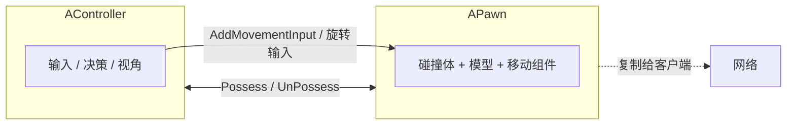
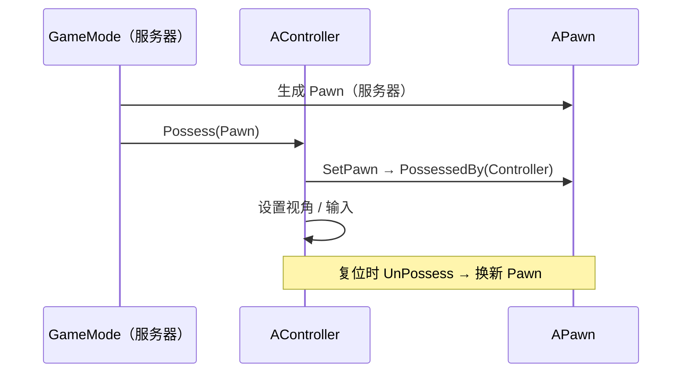
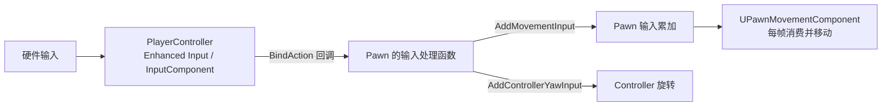

# APawn

**APawn** 是"**可被 Controller 控制的实体**"——也就是玩家或 AI 在游戏世界里的"**身体**"。它提供碰撞、外观、移动的载体，而 **输入与决策在 Controller 里**。这种"**身心分离**"是 UE 框架最关键的设计之一

!!! info "一句话总结"

    `APawn` = **可被 Possess 的身体**：`AController` 负责"想干什么"（输入、视角、决策），`APawn` 负责"是什么样子、怎么移动"（碰撞、网格、移动组件）；两者可自由组合与替换



## 1 继承关系与定位

```text
UObject → AActor → APawn → ACharacter / ADefaultPawn / ASpectatorPawn / 自定义
```

| 类 | 说明 |
| --- | --- |
| `AActor` | 世界中的任意实体 |
| **`APawn`** | **可被 Controller 控制** 的实体（身体） |
| `ACharacter` | Pawn + 胶囊体 + 骨骼网格 + 人形移动组件 |
| `ADefaultPawn` | 引擎自带的最简 Pawn（球形碰撞，可自由飞） |
| `ASpectatorPawn` | 观战 Pawn（通常无碰撞、可自由飞行） |

**选型**：人形角色用 `ACharacter`；载具/飞行器/特殊移动用 `APawn` + 自定义 `UPawnMovementComponent`

## 2 核心思想：Controller 与 Pawn 分离

### 2.1 为什么分离

| 好处 | 说明 |
| --- | --- |
| **换身体不换人** | 角色死亡重生：Controller 与 PlayerState 保留，只换一个新 Pawn（分数/名字不丢） |
| **换人不换身体** | 玩家掉线后 AI 接管同一个 Pawn（`AIController::Possess`） |
| **观战/自由摄像机** | 换成一个 `ASpectatorPawn` 即可 |
| **输入与身体解耦** | 同一个 Pawn 可被玩家或 AI 控制，逻辑一致 |

### 2.2 控制流程（Possess）



| 方法 | 位置 | 说明 |
| --- | --- | --- |
| `Possess(APawn*)` / `UnPossess()` | `AController` | 建立/解除控制关系 |
| **`PossessedBy(AController*)`** | `APawn` | 被控制时调用（**服务器与客户端都会调用**） |
| `UnPossessed()` | `APawn` | 解除控制时调用 |
| `GetController()` | `APawn` | 取当前控制者 |

!!! note "客户端初始化顺序的经典坑"

    `PossessedBy` 在客户端也会被调用，但此时 **客户端的 PlayerState 可能还没到达**（复制顺序不保证）。所以常见做法：

    - `PossessedBy`：做 **服务器** 初始化（如把 Pawn 与 PlayerState 关联、初始化 GAS）
    - `OnRep_PlayerState()`：做 **客户端** 初始化（这时 PlayerState 才可用）

## 3 关键 API

### 3.1 状态查询

| API | 作用 |
| --- | --- |
| `GetController()` | 取控制者（**未 Possess 时为 nullptr**） |
| `IsPossessed()` | 是否被控制 |
| **`IsLocallyControlled()`** | 是否 **本机** 控制（自主代理，做本地表现时常用） |
| `IsPlayerControlled()` | 是否被玩家控制（而非 AI） |
| `IsLocallyViewed()` | 是否本机视角 |
| `GetPlayerState()` | 取玩家档案（通过 Controller） |
| `GetMovementComponent()` / `FindComponentByClass<UPawnMovementComponent>()` | 取移动组件 |

### 3.2 输入接口（Controller → Pawn 的通道）

!!! info "输入为什么在 Pawn 上有一组接口？"

    Controller 负责"绑按键"，但真正改变身体的是 Pawn。所以 `APawn` 提供了一组 **标准输入接口**，Controller 只管调用它们

| API | 作用 |
| --- | --- |
| **`AddMovementInput(Direction, Scale)`** | 累加 **移动输入**（世界方向 × 强度），由移动组件消费 |
| `AddControllerYawInput(Val)` / `AddControllerPitchInput(Val)` / `AddControllerRollInput(Val)` | 累加 **旋转输入**（相机/身体朝向） |
| `GetPendingMovementInputVector()` / `ConsumeMovementInputVector()` | 读取/消费本帧输入向量 |
| `SetupPlayerInputComponent(UInputComponent*)` | **绑定输入的地方**（引擎自动调用） |

```cpp
// UE5 推荐用增强输入（Enhanced Input）
void AMyPawn::SetupPlayerInputComponent(UInputComponent* PlayerInputComponent)
{
    Super::SetupPlayerInputComponent(PlayerInputComponent);

    if (UEnhancedInputComponent* EIC = Cast<UEnhancedInputComponent>(PlayerInputComponent))
    {
        EIC->BindAction(MoveAction,  ETriggerEvent::Triggered, this, &AMyPawn::OnMove);
        EIC->BindAction(LookAction,  ETriggerEvent::Triggered, this, &AMyPawn::OnLook);
        EIC->BindAction(JumpAction,  ETriggerEvent::Started,   this, &AMyPawn::OnJump);
    }
}

void AMyPawn::OnMove(const FInputActionValue& Value)
{
    const FVector2D Axis = Value.Get<FVector2D>();

    // 用 Controller 的朝向算"前/右"，实现"以镜头为基准的移动"
    const FRotator YawOnly(0.f, GetControlRotation().Yaw, 0.f);
    const FVector Forward = FRotationMatrix(YawOnly).GetUnitAxis(EAxis::X);
    const FVector Right   = FRotationMatrix(YawOnly).GetUnitAxis(EAxis::Y);

    AddMovementInput(Forward, Axis.Y);
    AddMovementInput(Right,   Axis.X);
}
```

!!! warning "`AddMovementInput` 是"累加"的"

    一帧内可多次调用（前 + 右），引擎自动累加；**不需要你自己清零**，移动组件每帧消费后会重置。这也是为什么"每帧调一次"是正确用法

### 3.3 视角与瞄准

```cpp
FRotator AimRotation  = GetControlRotation();   // 相机/瞄准方向（Controller 的旋转）
FRotator BodyRotation = GetActorRotation();     // 身体朝向（Actor 自己）

FVector ViewLocation = GetPawnViewLocation();   // 射击/射线起点
FRotator BaseAim     = GetBaseAimRotation();    // 基础瞄准旋转
```

| 属性（`APawn` 上） | 作用 |
| --- | --- |
| `bUseControllerRotationYaw` / `Pitch` / `Roll` | 身体是否跟随 Controller 的旋转 |
| `BaseEyeHeight` | 视线高度（视角参考） |
| `NavAgentProps` | 导航代理属性（半径/高度，影响寻路） |

!!! warning "别把"身体朝向"和"相机朝向"搞混"

    **射击射线、相机方向** 用 `GetControlRotation()`；**身体朝向** 用 `GetActorRotation()`。用错会导致"枪口方向不对"、"人物背对镜头跑"

### 3.4 自动控制（放关卡里就能玩）

```cpp
AMyPawn::AMyPawn()
{
    // 关卡中放置时自动被玩家 0 控制
    AutoPossessPlayer = EAutoReceiveInput::Player0;

    // 或：生成/放置时自动由 AI 控制
    AutoPossessAI = EAutoPossessAI::PlacedInWorldOrSpawned;
    AIControllerClass = AAIController::StaticClass();
}
```

| 属性 | 取值 |
| --- | --- |
| `AutoPossessPlayer` | `Disabled`（默认）/ `Player0` / `Player1` … |
| `AutoPossessAI` | `Disabled` / `PlacedInWorld` / `Spawned` / `PlacedInWorldOrSpawned` |

## 4 输入流程全景



要点：**Controller 绑输入、Pawn 提供接口、移动组件执行移动**——三层各管一段，互不越界。

## 5 移动组件（UPawnMovementComponent）

`APawn` 通过 `UPawnMovementComponent` 及其子类实现"怎么动"：

| 类 | 用途 |
| --- | --- |
| `UPawnMovementComponent` | 基类：提供 `AddInputVector` / `ConsumeInputVector` / `GetPendingInputVector` |
| **`UCharacterMovementComponent`** | 人形（走路/跳/蹲/贴地/网络预测） |
| `UFloatingPawnMovement` | 自由飞行（观战、调试、无重力） |
| `USpectatorPawnMovement` | 观战 Pawn 专用 |
| `UNavMovementComponent` | AI 导航移动的基础（配合寻路） |
| 自定义 | 载具、攀爬、滑翔等自己实现 |

!!! tip "自定义 Pawn 的套路"

    1. 继承 `APawn`（或 `ACharacter`）
    2. 加一个自定义 `UPawnMovementComponent` 子类（在 `TickComponent` 里消费输入向量、做位移与碰撞）
    3. 输入处理函数里调用 `AddMovementInput` 即可——**不需要自己写位移**

## 6 生命周期与初始化时机

```text
服务器 Spawn Pawn → Controller::Possess → Pawn::PossessedBy
                                   ↳ 复制到客户端 → 客户端 Pawn::PossessedBy
→ BeginPlay → SetupPlayerInputComponent（本地玩家）
→ ... → UnPossess → Destroy
```

| 时机 | 适合做什么 |
| --- | --- |
| 构造函数 | 创建组件、设默认参数 |
| `PossessedBy` | 服务器侧初始化（关联 PlayerState、初始化能力） |
| `OnRep_PlayerState` | **客户端**侧初始化（此时 PlayerState 才可用） |
| `SetupPlayerInputComponent` | 绑定输入（仅本地玩家） |
| `BeginPlay` | 通用初始化（注意此时可能还没被 Possess） |

## 7 网络视角

| 概念 | 说明 |
| --- | --- |
| `AController::Pawn` | **在 Controller 上复制**；客户端收到后建立本地的控制关系 |
| `IsLocallyControlled()` | 本机（自主代理）为 true，其他人看到的是模拟代理 |
| `bReplicates` | Pawn 通常需要开启（`ACharacter` 默认已开） |
| **位置同步** | 由移动组件处理（预测 + 纠正），**不要手动同步位置** |
| 客户端生成 | Pawn 必须 **由服务器生成** 才会同步给客户端 |

## 8 常见坑与最佳实践

!!! warning "最常见的坑"

    1. **在 Pawn 里写决策/输入绑定逻辑**：输入绑定应在 `SetupPlayerInputComponent`（或被 Controller 调用），决策在 Controller；Pawn 只做"身体"
    2. **用 `GetActorRotation()` 当相机方向**：射击/视角应该用 `GetControlRotation()`
    3. **`GetController()` 为空就调用**：未 Possess 时为空，先判空
    4. **在客户端 Spawn Pawn**：只有服务器生成的才会同步
    5. **客户端初始化顺序**：`PossessedBy` 时 PlayerState 可能还没到 → 用 `OnRep_PlayerState`
    6. **手动清零移动输入**：`AddMovementInput` 由引擎管理累加与消费，不要自己重置
    7. **忘了 `AutoPossessPlayer`**：关卡里放的 Pawn "放上去没反应"

!!! info "最佳实践"

    1. **身心分离**：Pawn 管"身体与表现"，Controller 管"输入与决策"，规则放 GameMode/组件
    2. 换移动方式（飞、游、爬）优先**换移动组件/移动模式**，而不是在 Pawn 里重写位移
    3. 需要"自定义的移动/碰撞"时，写一个 `UPawnMovementComponent` 子类，复用标准输入接口
    4. 死亡重生用 **Respawn 新 Pawn + 重新 Possess**，不要复用旧 Pawn 硬改状态
    5. 用 `IsLocallyControlled()` 区分"本机玩家"与"远端代理"，避免客户端表现错乱

!!! note "与其它笔记的联系"

    - **GamePlay 框架**：`GameMode` 决定 `DefaultPawnClass`，`PlayerController` 负责 Possess
    - **ACharacter**：`APawn` 的人形特化子类（预置胶囊体 + 骨骼网格 + `CharacterMovementComponent`）
    - **网络同步**：Pawn 的移动预测、`IsLocallyControlled` 与自主/模拟代理
    - **AI 系统**：`AIController` Possess Pawn，行为树/状态树在 Controller 侧运行
