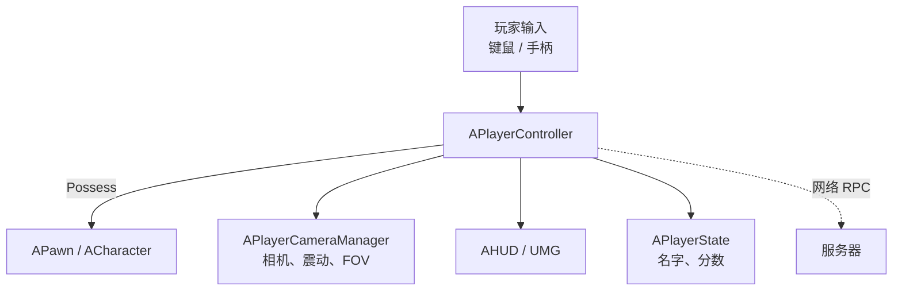
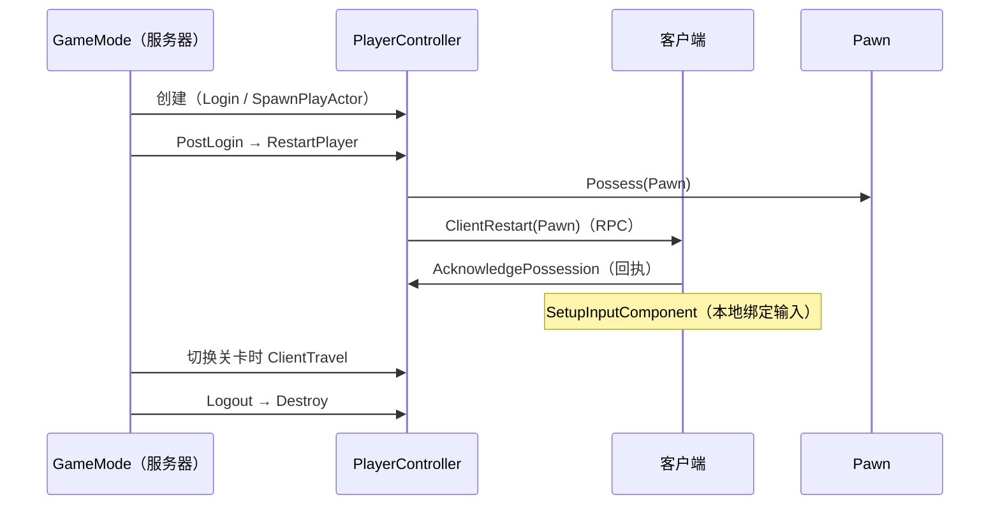

# APlayerController

**APlayerController** 是 `AController` 的子类，代表"**人类玩家的意志**"——它是玩家与游戏世界之间的桥：负责 **输入、视角、控制哪个 Pawn、显示什么 UI**。与 `AAIController` 并列（一个由人驱动，一个由 AI 逻辑驱动）

!!! info "一句话总结"

    `APlayerController` 是玩家的"遥控器"：**收输入**（InputComponent / Enhanced Input）、**管视角**（`PlayerCameraManager` + ViewTarget）、**控 Pawn**（Possess）、**显示 UI**（HUD / UMG + 输入模式）、**代表玩家身份**（`PlayerState` + 网络 RPC）



## 1 在框架中的位置

```text
UObject → AActor → AController → APlayerController
                                └─ AAIController
```

| | `APlayerController` | `AAIController` |
| --- | --- | --- |
| 意图来源 | **人类输入** | 行为树 / 状态树 / 代码 |
| 输入组件 | ✅ `InputComponent` | 通常无 |
| 相机管理 | ✅ `PlayerCameraManager` | 通常不用（只用 Pawn 视角） |
| HUD | ✅ 拥有 `MyHUD` | ❌ |
| 玩家档案 | ✅ 对应 `APlayerState` | 可有可无 |
| 共同点 | 都能 **Possess Pawn**、都继承 `AController` | 同左 |

!!! note "谁创建 PlayerController"

    **服务器** 在玩家登录时创建（`GameMode::Login` → `SpawnPlayActor`），随后复制给 **对应客户端** 一份。所以：

    - **服务器** 上：每个玩家都有一个 PlayerController
    - **客户端** 上：只有 **自己** 的那个 PlayerController（其他玩家的只有 Pawn/PlayerState 被复制过来）

## 2 五大职责

### 2.1 输入处理

| 内容 | 说明 |
| --- | --- |
| `InputComponent` | 控制器持有的输入组件 |
| `SetupInputComponent()` | **绑定输入的地方**（引擎自动调用，仅本地玩家） |
| **Enhanced Input（UE5 推荐）** | `UEnhancedInputComponent` + `UInputMappingContext` + `UInputAction` |
| 输入转发 | 处理函数里调用 `Pawn->AddMovementInput`、`AddYawInput` 等 |

```cpp
void AMyPlayerController::BeginPlay()
{
    Super::BeginPlay();

    // 添加输入映射上下文（本地玩家）
    if (UEnhancedInputLocalPlayerSubsystem* Subsystem =
        ULocalPlayer::GetSubsystem<UEnhancedInputLocalPlayerSubsystem>(GetLocalPlayer()))
    {
        Subsystem->AddMappingContext(DefaultMappingContext, 0);
    }
}

void AMyPlayerController::SetupInputComponent()
{
    Super::SetupInputComponent();

    if (UEnhancedInputComponent* EIC = Cast<UEnhancedInputComponent>(InputComponent))
    {
        EIC->BindAction(FireAction, ETriggerEvent::Started, this, &AMyPlayerController::OnFire);
    }
}
```

!!! warning "绑定输入必须用 `SetupInputComponent`"

    在 `BeginPlay` 里手动绑定 `InputComponent` 可能被引擎后续重建覆盖。**标准做法是重写 `SetupInputComponent()`**

### 2.2 视角与摄像机

- 每个 PlayerController 拥有一个 **`APlayerCameraManager`**：真正决定"玩家看到什么"
- **ViewTarget**：当前视角的 Actor（通常是自己的 Pawn，也可切到别的 Actor）

| API | 作用 |
| --- | --- |
| `PlayerCameraManager` / `GetPlayerCameraManager()` | 取相机管理器 |
| `SetViewTarget(Actor)` / `SetViewTargetWithBlend(Actor, Time)` | 本地切换视角 |
| `ClientSetViewTarget(Actor, Params)` | **RPC**：服务器要求某客户端切换视角 |
| `GetPlayerViewPoint(Loc, Rot)` | 取当前视角位置与朝向（做射线用） |
| `GetHitResultUnderCursor(...)` / `GetHitResultUnderFinger(...)` | 光标/手指下的拾取 |
| `ProjectWorldLocationToScreen` / `DeprojectScreenPositionToWorld` | 世界 ↔ 屏幕坐标换算 |

### 2.3 控制 Pawn

| API | 说明 |
| --- | --- |
| `Possess(Pawn)` / `UnPossess()` | 建立/解除控制（继承自 `AController`） |
| `GetPawn()` | 当前控制的 Pawn（**可能为空**） |
| `SetControlRotation(Rot)` / `GetControlRotation()` | 相机/瞄准朝向（与身体朝向不同） |
| `ClientRestart(Pawn)` | **Server→Client RPC**：通知客户端重启并接管 Pawn |
| `AcknowledgePossession(Pawn)` | 客户端确认已接管（会回传 `ServerAcknowledgePossession`） |

!!! info "Possess 的两端时序"

    服务器：`Possess(Pawn)` → `Pawn->PossessedBy(this)` → RPC `ClientRestart(Pawn)` 通知客户端
    客户端：收到后 `AcknowledgePossession` → `Pawn->PossessedBy(this)`（**客户端也会调用**）

    所以"客户端初始化"要注意时机（PlayerState 可能还没到 → 配合 `OnRep_PlayerState`）

### 2.4 HUD / UI 与输入模式

| API | 作用 |
| --- | --- |
| `MyHUD` / `GetHUD<T>()` | 当前 HUD |
| `ClientSetHUD(TSubclassOf<AHUD>)` | RPC：服务器指定客户端使用哪个 HUD 类 |
| `SetInputMode(Mode)` | 切换输入模式（游戏 / UI / 两者） |
| `bShowMouseCursor` | 显示鼠标 |
| `SetIgnoreMoveInput(bool)` / `SetIgnoreLookInput(bool)` | 临时禁用移动/视角输入 |

| 输入模式 | 用途 |
| --- | --- |
| `FInputModeGameOnly` | 纯游戏（FPS/TPS 常态） |
| `FInputModeUIOnly` | 纯 UI（全屏菜单，游戏输入屏蔽） |
| `FInputModeGameAndUI` | 两者兼得（背包、对话框，游戏仍在跑） |

```cpp
// 打开背包：允许鼠标 + 允许 3D 拾取
FInputModeGameAndUI Mode;
Mode.SetLockMouseToViewportBehavior(EMouseLockMode::DoNotLock);
SetInputMode(Mode);
bShowMouseCursor = true;

// 关闭背包：回到纯游戏
SetInputMode(FInputModeGameOnly());
bShowMouseCursor = false;
```

### 2.5 玩家档案与网络

| 内容 | 说明 |
| --- | --- |
| `PlayerState` | 名字、分数等（`GetPlayerState<T>()`） |
| `IsLocalController()` | **是否本机玩家的控制器**（客户端表现的关键判断） |
| `GetLocalPlayer()` | 本地玩家对象（输入子系统入口） |
| `NetPlayerIndex` | 本地多人（分屏）索引 |
| RPC | `Client*`（服务器→客户端）、`Server*`（客户端→服务器） |
| `ClientTravel(URL, ...)` | 让客户端切换地图 |

## 3 关键 API 速查

| 分类 | API |
| --- | --- |
| **状态** | `IsLocalController()`、`IsLocalPlayerController()`、`GetPawn()`、`GetPlayerState<T>()`、`GetLocalPlayer()` |
| **输入** | `SetupInputComponent()`、`SetInputMode()`、`bShowMouseCursor`、`SetIgnoreMoveInput/LookInput`、`IsInputKeyDown()` |
| **视角** | `PlayerCameraManager`、`SetViewTarget()`、`GetPlayerViewPoint()`、`GetHitResultUnderCursor()` |
| **控制旋转** | `GetControlRotation()`、`SetControlRotation()`、`AddYawInput/PitchInput/RollInput` |
| **UI** | `GetHUD<T>()`、`SetInputMode()` |
| **暂停** | `SetPause(bool)`、`IsPaused()`、`CanPause()` |
| **网络** | `ClientRestart()`、`ClientSetViewTarget()`、`ClientSetHUD()`、`ClientTravel()`、`AcknowledgePossession()` |

## 4 生命周期与网络时序



## 5 Local vs Remote（最容易混淆）

| 判断 | 含义 | 使用场景 |
| --- | --- | --- |
| **`IsLocalController()`** | 这是 **本机玩家** 的控制器 | 输入、相机、UI、本地表现 |
| `HasAuthority()` | 这在本机是 **服务器** | 权威逻辑（改状态、算伤害） |
| `IsLocalPlayerController()` | 等同 `IsLocalController()` | 同上 |

!!! warning "两个正交的概念"

    - **Authority** 回答"我是不是服务器"（同一台机器上，服务器视角为 true）
    - **Local** 回答"我是不是这个玩家自己"（客户端机器上，只有自己为 true）

    监听服务器（Listen Server）上，房主的 PlayerController 两者都为 true；其他客户端上两者都为 false。

## 6 常见实操

### 6.1 从屏幕中心做射线（射击）

```cpp
FVector ViewLoc; FRotator ViewRot;
GetPlayerViewPoint(ViewLoc, ViewRot);       // 要射击就用"相机朝向"，不是身体朝向

const FVector End = ViewLoc + ViewRot.Vector() * 10000.f;

FHitResult Hit;
FCollisionQueryParams Params;
Params.AddIgnoredActor(GetPawn());          // 别打到自己
GetWorld()->LineTraceSingleByChannel(Hit, ViewLoc, End, ECC_Visibility, Params);
```

### 6.2 鼠标拾取（策略/RTS）

```cpp
FHitResult Hit;
if (GetHitResultUnderCursor(ECC_Visibility, false, Hit))
{
    // Hit.GetActor() / Hit.ImpactPoint
}
```

### 6.3 切换视角

```cpp
SetViewTargetWithBlend(NewTargetActor, 0.5f);   // 本地（如狙击镜、过场）
// 需要服务器驱动时用 ClientSetViewTarget(NewTargetActor, Params)
```

## 7 常见坑与最佳实践

!!! warning "最常见的坑"

    1. **在客户端访问 GameMode**：客户端没有 GameMode → 共享状态请用 `GameState`
    2. **混淆 `IsLocalController()` 与 `HasAuthority()`**：导致逻辑在错误的一端执行
    3. **客户端过早访问 `GetPawn()`**：Possess 完成前为空 → 判空或用 `OnPossess` / `AcknowledgePossession`
    4. **输入绑定写在 `BeginPlay`**：应重写 `SetupInputComponent()` 并在其中绑定
    5. **打开 UI 不切输入模式**：菜单出现但角色还在动 / 鼠标不可见
    6. **用 `GetPlayerController(0)` 处理多本地玩家**：分屏时应按 `GetLocalPlayer()` / `NetPlayerIndex`
    7. **客户端直接改游戏状态**：必须走 `Server RPC`（属性复制是单向的）
    8. **射击用 `GetActorRotation()`**：应使用 `GetControlRotation()` / `GetPlayerViewPoint()`

!!! info "最佳实践"

    1. **输入在 PlayerController 绑定，动作转发给 Pawn**（`AddMovementInput` 等）
    2. **视角与相机** 统一通过 `PlayerCameraManager` / `ViewTarget` 管理，别手动改 Pawn 旋转去模拟相机
    3. **UI 打开时切输入模式**，并注意 `bShowMouseCursor`
    4. 需要"每个玩家各自不同"的逻辑（视角、UI、输入）放 PlayerController；需要"全局共享"的放 `GameState`
    5. 客户端代码习惯先问一句"**我这里有没有权限**"（Authority）与"**我是不是自己**"（Local）

!!! note "与其它笔记的联系"

    - **AActor / APawn**：PlayerController 是 Actor，控制的是 Pawn（身心分离）
    - **GamePlay 框架**：`GameMode` 创建它，`PlayerState` 存玩家数据，`AHUD` 负责绘制
    - **网络同步**：`ClientRestart` / `ClientSetViewTarget` 等 RPC、`IsLocalController` 与自主代理判断
    - **动画 / 输入系统**：Enhanced Input 在 PlayerController 里接入
