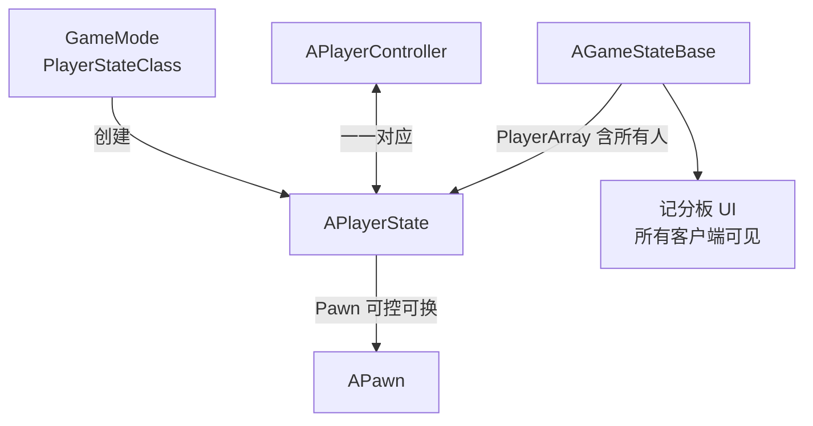
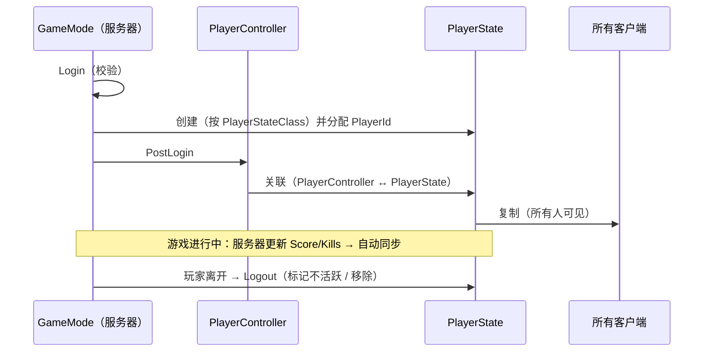

# APlayerState

**APlayerState** 保存"**一个玩家的持久数据**"：名字、分数、队伍、Ping……它在 **玩家连接期间一直存在**，并且 **复制给所有客户端**——所以它既是"跨死亡重生保留数据"的地方，也是 **记分板的数据源**

!!! info "一句话总结"

    `APlayerState` = **每个玩家一份、复制给所有人、跨 Pawn 重生保留的数据档案**；服务器写入，所有客户端读取



## 1 为什么需要它

游戏里要存"玩家数据"，有三个候选位置，各有致命问题：

| 放在哪 | 问题 |
| --- | --- |
| **Pawn** | 死亡/重生/换角色会 **重建 Pawn** → 数据丢失 ❌ |
| **PlayerController** | 客户端上 **只有自己的那一个**（别人的不复制过来）→ 做不了记分板 ❌ |
| **PlayerState** | ✅ 复制给所有人 + 跨 Pawn 生命周期存活 |

一句话：**"跟人走，不跟身体走"的数据放 PlayerState**

## 2 在框架中的位置

```text
UObject → AActor → AInfo → APlayerState
                            └─ 你的 AMyPlayerState
```

| 关系 | 说明 |
| --- | --- |
| 谁创建 | **服务器**（玩家登录时，由 `GameMode` 按 `PlayerStateClass` 创建） |
| 谁持有 | 对应的 `APlayerController`（`PlayerController->PlayerState`，双向引用） |
| 谁能看到 | **所有客户端**（复制给所有人） |
| 谁的 Pawn | `PS->GetPawn()`（当前控制的身体，可换） |

### GameState vs PlayerState（必须分清）

| | `AGameStateBase` | `APlayerState` |
| --- | --- | --- |
| 数量 | **一份**（整个世界一个） | **每个玩家一份** |
| 内容 | 比赛全局状态：比分、剩余时间、比赛阶段 | 玩家个人数据：名字、击杀、队伍、Ping |
| 关系 | 持有 `PlayerArray`（所有 PlayerState 的列表） | 被 GameState 收录 |
| 典型用途 | 比赛倒计时、队伍总分 | 记分板、名字标签、个人统计 |

## 3 内置属性与常用方法

| 属性 | 说明 |
| --- | --- |
| `PlayerName` | 玩家名（复制） |
| `Score` | 分数（float，复制） |
| `PlayerId` | 服务器分配的唯一数字 ID（复制） |
| `bIsABot` | 是否机器人 |
| `bIsSpectator` / `bOnlySpectator` | 是否观战 |
| `bIsInactive` | 已断开但记录仍保留 |
| `UniqueId`（`FUniqueNetIdRepl`） | 平台账号唯一标识（在线游戏） |
| `StartTime` | 加入时间（可用于"游玩时长"） |
| `Ping` / `CompressedPing` | 延迟（毫秒） |
| `SavedNetworkAddress` | 网络地址（调试用） |

| 方法 | 说明 |
| --- | --- |
| `GetPlayerName()` / `SetPlayerName(Name)` | 名字 |
| `GetScore()` / `SetScore(S)` / `AddScore(D)` | 分数 |
| `GetPlayerId()` / `SetPlayerId(Id)` | ID |
| `GetPingInMilliseconds()` | 当前 Ping |
| `GetPawn()` / `GetPlayerController()` | 关联对象 |
| `IsABot()` | 是否 AI |
| `GetUniqueId()` | 平台唯一 ID |
| `GetStartTime()` | 加入时间 |
| **`OverrideWith(Other)`** | **用另一个 PlayerState 覆盖本对象数据**（无缝切关卡时保数据的关键） |

!!! warning "写入只能在服务器"

    `PlayerState` 是 **服务器权威** 的复制对象：服务器上 `AddScore()` 会同步到所有客户端；**客户端调用不会同步**（单向复制）。客户端读到的是副本，只应展示、不应修改。

## 4 复制与网络行为

| 机制 | 说明 |
| --- | --- |
| **复制范围** | 复制给 **所有客户端**（默认对所有连接相关，才能做记分板） |
| **方向** | 服务器 → 客户端（单向） |
| **Ping 更新** | 引擎周期性更新（`Ping` 是压缩值，`ExactPing` 更精确但代价高） |
| **跨关卡保留** | 无缝切图时，`PlayerState` 会重建并通过 `OverrideWith` / `bFromPreviousLevel` 保留数据 |
| **玩家离开** | `Logout` 时可能标记 `bIsInactive` 或移除（可配置保留一段时间） |

## 5 实战：自定义 PlayerState（做记分板）

### 5.1 定义子类

```cpp
UCLASS()
class AMyPlayerState : public APlayerState
{
    GENERATED_BODY()

public:
    UPROPERTY(ReplicatedUsing = OnRep_Kills, BlueprintReadOnly, Category = "Stats")
    int32 Kills = 0;

    UPROPERTY(Replicated, BlueprintReadOnly, Category = "Stats")
    int32 Deaths = 0;

    UPROPERTY(Replicated, BlueprintReadOnly, Category = "Stats")
    int32 TeamId = 0;

    UFUNCTION()
    void OnRep_Kills();            // 客户端：刷新 UI / 播特效

    // 只在服务器调用
    void AddKill()  { Kills++;  }
    void AddDeath() { Deaths++; }

    virtual void GetLifetimeReplicatedProps(TArray<FLifetimeProperty>& OutLifetimeProps) const override;
};

void AMyPlayerState::GetLifetimeReplicatedProps(TArray<FLifetimeProperty>& OutLifetimeProps) const
{
    Super::GetLifetimeReplicatedProps(OutLifetimeProps);

    DOREPLIFETIME(AMyPlayerState, Kills);
    DOREPLIFETIME(AMyPlayerState, Deaths);
    DOREPLIFETIME(AMyPlayerState, TeamId);
}
```

### 5.2 在 GameMode 中指定

```cpp
AMyGameMode::AMyGameMode()
{
    PlayerStateClass = AMyPlayerState::StaticClass();   // 全项目改用自定义 PlayerState
}
```

### 5.3 服务器写入 / 客户端读取

```cpp
// 服务器：击杀发生时
if (AMyPlayerState* PS = Killer->GetPlayerState<AMyPlayerState>())
{
    PS->AddKill();          // 自动同步给所有人
}
```

```cpp
// 客户端：遍历 GameState 的玩家列表做记分板
if (AGameStateBase* GS = GetWorld()->GetGameState())
{
    for (APlayerState* PS : GS->PlayerArray)
    {
        const FString Name = PS->GetPlayerName();
        const float  Score = PS->GetScore();
        const int32  PingMs = PS->GetPingInMilliseconds();
        // 填充 UI 行……
    }
}
```

!!! tip "记分板的正确做法"

    不要自己维护"玩家列表"——直接用 **`GameState->PlayerArray`**（引擎已维护、自动增删、已复制）。UI 只需监听其变化并重建列表

## 6 生命周期时序



## 7 常见坑与最佳实践

!!! warning "最常见的坑"

    1. **在客户端修改 PlayerState**：不会同步（单向复制），必须走 Server RPC 让服务器改
    2. **把玩家数据放在 Pawn 上**：重生后丢失 → 应放 PlayerState
    3. **客户端想访问 GameMode 拿玩家列表**：客户端没有 GameMode → 用 `GameState->PlayerArray`
    4. **时机问题**：`PossessedBy` 时客户端 `PlayerState` 可能还没到 → 用 `OnRep_PlayerState` 做客户端初始化
    5. **自定义属性忘了 `DOREPLIFETIME`**：不会复制
    6. **把全局状态放 PlayerState**：比赛倒计时、队伍总分属于 `GameState`
    7. **玩家离开后继续访问其 PlayerState**：可能已销毁/不活跃，需判空或检查 `bIsInactive`

!!! info "最佳实践"

    1. **一眼判断数据归属**：跟人走的（名字/统计/队伍）→ `PlayerState`；全局的（比分/阶段）→ `GameState`
    2. 统计更新一律在 **服务器** 做，客户端只读 + `OnRep` 驱动表现
    3. 记分板 UI 绑定 **`GameState->PlayerArray`**，不要自建列表
    4. 需要跨无缝切关卡保留的数据，确认 `OverrideWith` / 保留逻辑生效
    5. 用 `PlayerId` 做玩家间关联标识（比 Pawn 指针稳定）

!!! note "与其它笔记的联系"

    - **APlayerController**：与 PlayerState 一一对应，是它的持有者
    - **GamePlay 框架**：`GameMode.PlayerStateClass` 决定类；`GameState.PlayerArray` 汇总所有人
    - **网络同步**：PlayerState 是典型的"服务器写、所有人读"复制对象
    - **APawn / ACharacter**：Pawn 会换，PlayerState 不换——这正是两者分工的核心
