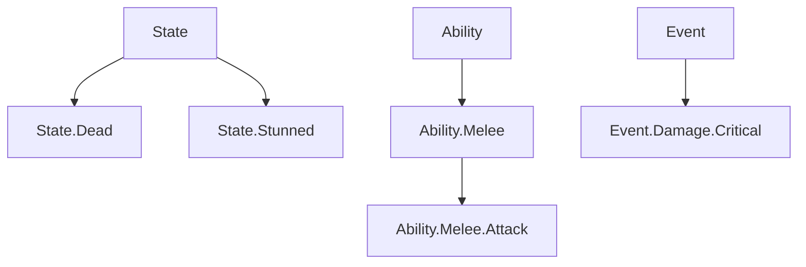

# FGameplayTag

**FGameplayTag** 是 UE 的 **层级化标签** 系统：标签形如 `State.Dead`、`Ability.Melee.Attack`，用点号分层。它不是普通字符串，而是 **在中央注册表里注册过的结构化名字**，因此既能做 **分层匹配**，又有数据类型安全和编辑器支持

!!! info "一句话总结"

    `FGameplayTag` = **一个注册过的层级名字**（本质是 `FName`，比较极快）；`FGameplayTagContainer` = **一组标签**，支持"是否包含某标签（含其子标签）"的层级查询；配套 `FGameplayTagQuery` 做复杂组合查询



**层级语义**：越往下越具体。容器里若有 `State.Dead`，则"是否有 `State`"的查询返回 true（父级能匹配子级）

## 1 为什么要用标签

| 传统做法 | 问题 | GameplayTag |
| --- | --- | --- |
| 一堆 `bool bIsDead; bIsStunned; ...` | 状态多了字段爆炸，组合判断复杂 | 一个标签表达一个状态，可任意组合 |
| 枚举 | 无法表达"层级"与"任意组合"；加值要改代码重编 | 层级 + 可扩展 + 数据驱动 |
| 字符串比较 | 拼写错误无检查、无编辑器提示 | 注册表校验、编辑器下拉选择 |
| `if (state == A \|\| state == B ...)` | 硬编码，难维护 | `HasTag(State)` 一次匹配整个子树 |

它被广泛用于：**GAS 技能状态、GameplayCue 匹配、AI 状态、动画/音效变体、UI 条件、事件标识**

## 2 与 FName / FString 的区别

| | `FString` | `FName` | `FGameplayTag` |
| --- | --- | --- | --- |
| 比较成本 | 逐字符 | 索引比较（快） | 索引比较（快） |
| 层级匹配 | 需自己写 | 需自己写 | **内置** |
| 注册校验 | 无 | 无 | **必须在注册表注册** |
| 编辑器支持 | 无 | 无 | **下拉选择、层级展示** |

## 3 核心类型

### 3.1 FGameplayTag：单个标签

```cpp
// 获取标签（运行时查找，可能失败）
FGameplayTag Tag = FGameplayTag::RequestGameplayTag(FName("State.Dead"));

if (Tag.IsValid()) { /* 使用 */ }

// 判断
bool bExact = Tag.MatchesTagExact(FGameplayTag::RequestGameplayTag(FName("State.Dead")));
```

| API | 说明 |
| --- | --- |
| `RequestGameplayTag(Name)` | 按名字从注册表获取（**找不到会报警/断言**） |
| `IsValid()` | 是否有效标签 |
| `GetTagName()` | 取 `FName` |
| `MatchesTag(Other)` | 本标签是否为 `Other` 或其**子标签**（更具体） |
| `MatchesTagExact(Other)` | 是否完全相同 |
| `FGameplayTag::EmptyTag` | 空标签 |

### 3.2 FGameplayTagContainer：标签容器

```cpp
FGameplayTagContainer Tags = MyComponent->GetOwnedTags();

Tags.HasTag(State_Dead);        // 层级匹配：容器里有 State.Dead 或更具体的子标签即 true
Tags.HasTagExact(State_Dead);   // 精确匹配：必须完全是 State.Dead
Tags.HasAny(Others);            // 与另一容器有任意交集
Tags.HasAll(Required);          // 包含另一容器的全部标签
```

!!! warning "HasTag 与 HasTagExact 是最容易搞错的一对"

    ```text
    容器 = { "State.Dead" }

    容器.HasTag("State")        → true    （父级匹配子级）
    容器.HasTag("State.Dead")   → true
    容器.HasTagExact("State")   → false   （没有精确等于 State 的标签）
    ```

    想表达 **就是某个具体状态** 用 `HasTagExact`；想表达 **属于某一类** 用 `HasTag`

常用 API：`AddTag`、`AddTags`、`RemoveTag`、`Clear`、`Num`、`IsEmpty`、`Filter`、`GetGameplayTagArray`、`ToStringSimple`

### 3.3 FGameplayTagQuery：复杂查询

当条件不是"有/没有"而是"满足一组逻辑组合"时使用：

```cpp
// 有全部 / 有任意 / 没有
FGameplayTagQuery QueryAll  = FGameplayTagQuery::MakeQuery_MatchAllTags(RequiredTags);
FGameplayTagQuery QueryAny  = FGameplayTagQuery::MakeQuery_MatchAnyTags(AnyTags);
FGameplayTagQuery QueryNone = FGameplayTagQuery::MakeQuery_MatchNoTags(ForbiddenTags);

bool bMatch = QueryAll.Matches(Tags);
```

也可以构建嵌套逻辑（All / Any / None 表达式组合），在编辑器里可视化编辑

### 3.4 FGameplayTagRequirements（GAS 专用）

GAS 中常见的 **需要什么 + 忽略什么** 结构：

```cpp
FGameplayTagRequirements Reqs;
Reqs.RequireTags.AddTag(Ability_Melee);   // 必须有
Reqs.IgnoreTags.AddTag(State_Stunned);    // 必须没有
```

GAS 的技能激活条件、效果免疫等都用它

## 4 标签的注册与定义

标签 **必须在注册表中存在**，否则 `RequestGameplayTag` 失败。四种方式：

| 方式 | 适用 |
| --- | --- |
| **编辑器 Project Settings → Gameplay Tags** | 常用，图形化增删（底层写 ini） |
| **`DefaultGameplayTags.ini`** | 直接编辑配置文件，便于版本管理 |
| **DataTable（GameplayTagTable）** | 策划在表格里维护标签，ini 中登记该表 |
| **C++ 原生标签宏（UE5）** | 代码定义，编译期可用、无运行时查找 |

### 4.1 推荐的 C++ 方式（UE5 原生标签）

```cpp
#include "NativeGameplayTags.h"

// 头文件：声明
UE_DECLARE_GAMEPLAY_TAG_EXTERN(Ability_Melee_Attack);

// 源文件：定义（第一个参数是 C++ 名字，第二个是标签字符串）
UE_DEFINE_GAMEPLAY_TAG(Ability_Melee_Attack, "Ability.Melee.Attack");

// 文件内使用的静态标签
UE_DEFINE_GAMEPLAY_TAG_STATIC(State_Dead, "State.Dead");
```

!!! tip "为什么推荐宏"

    `RequestGameplayTag(FName("..."))` 每次调用都要 **按名字查找**，且拼错只会在运行时静默失败；用宏定义的标签是 **编译期生成 + 直接引用**，既快又安全，适合代码里频繁使用的标签

## 5 在 GAS 与 GameplayCue 中的应用

| 场景 | 用到的标签 |
| --- | --- |
| 技能能否激活 | `ActivationRequiredTags` / `ActivationBlockedTags` |
| 技能互相打断 | `CancelAbilitiesWithTag` / `BlockAbilitiesWithTag` |
| 角色当前状态 | ASC 的 `OwnedTags`（如 `State.Stunned`） |
| 效果免疫/赋予 | GameplayEffect 的 `GrantedTags` / `AssetTags` |
| 表现通知 | GameplayCue 按 `GameplayCue.*` 标签匹配 |
| 事件标识 | `Event.Damage.Critical` 等 |

标签把"**条件判断**"从代码里搬到了数据里：改玩法规则常常只需改某个技能配置上的标签，而不是改代码

## 6 性能与网络

| 关注点 | 说明 |
| --- | --- |
| **单个标签比较** | 本质是 `FName` 比较（整数），非常快 |
| **`RequestGameplayTag`** | 需要哈希查找名字，**不要在每帧热路径反复调用** → 缓存或改用宏 |
| **层级匹配代价** | `HasTag` 比 `HasTagExact` 略慢（需沿父链比对），但仍属轻量 |
| **网络复制** | 标签在复制时会映射为 **网络索引**（net index）而非字符串，开销可控 |
| **标签数量** | 数量本身影响不大（都是 FName），但层级过深、命名混乱会影响可维护性 |

## 7 命名规范与最佳实践

!!! info "推荐的命名分层"

    ```text
    Ability.<类型>.<技能>       Ability.Melee.Attack
    State.<状态>                State.Dead / State.Stunned
    Effect.<效果>               Effect.Burning
    Event.<事件>                Event.Damage.Critical
    Input.<输入>                Input.Jump
    UI.<界面>                   UI.HUD.Health
    Item.<物品分类>             Item.Weapon.Sword
    GameplayCue.<表现>          GameplayCue.Damage.Hit
    ```

    规则：**域前缀统一、层级不超过 4~5 层、同一级别用一致词性、避免同义重复**

!!! warning "常见坑"

    1. **标签未注册**：`RequestGameplayTag` 返回空标签并报警，逻辑静默失效
    2. **`HasTag` / `HasTagExact` 混用**：以为在判"精确状态"，实际父标签也能匹配上
    3. **拼写错误**：字符串写标签没有编译检查 → 尽量用 `UE_DEFINE_GAMEPLAY_TAG` 宏
    4. **热路径反复请求**：每次 `RequestGameplayTag` 都有查找开销 → 缓存为静态变量
    5. **随意改名**：标签是配置与存档的"数据契约"，改名要同步 ini/表格/代码，必要时配置 **GameplayTagRedirects** 做重定向
    6. **用标签存数据**：标签只表达"**是什么/属于什么**"，数值应放 DataAsset / DataTable / 属性
