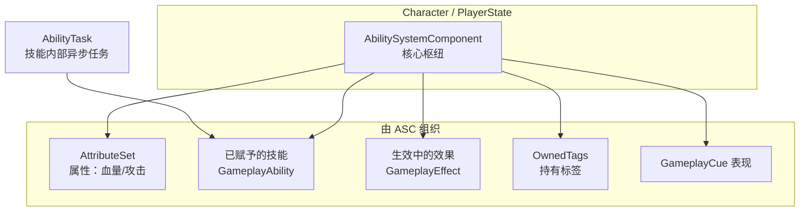
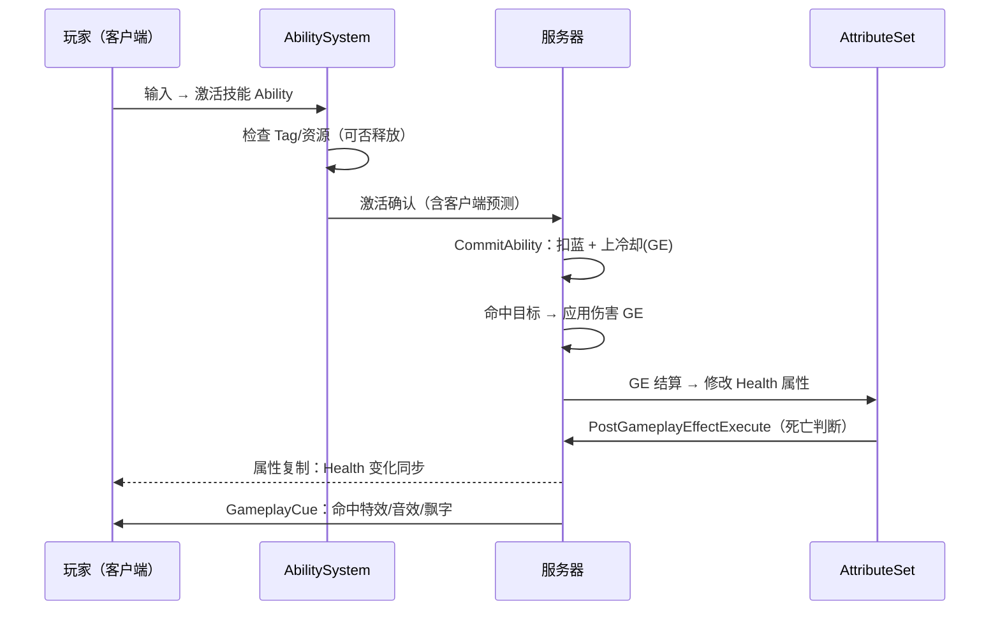

# GameplayAbilitySystem

Gameplay Ability System 通常简称 **GAS（游戏能力系统）**，是 Epic 官方随引擎提供的一套 **通用技能/属性框架**（Lyra、Fortnite、Paragon 等均基于它）

!!! info "一句话总结"

    GAS = **AbilitySystemComponent（枢纽）** + **AttributeSet（属性）** + **GameplayEffect（改属性的效果）** + **GameplayAbility（技能）** + **GameplayTag（标签）** + **AbilityTask（异步任务）** + **GameplayCue（表现通知）**，一套把"技能、数值、Buff、冷却、状态"统一起来并 **原生支持网络与预测** 的框架

!!! note "不是默认启用的功能"

    GAS 是独立插件/模块。使用前需在项目的 `Build.cs` 中添加依赖并启用插件：

    ```cpp
    PublicDependencyModuleNames.AddRange(new string[]
    {
        "Core", "...",
        "GameplayAbilities",   // GAS 主模块
        "GameplayTags",        // 标签
        "GameplayTasks"        // 异步任务
    });
    ```

为什么需要 GAS：

| 传统做法的痛点 | GAS 的解决方式 |
| --- | --- |
| 每个技能自己写一套冷却/消耗/Buff，代码爆炸 | 统一的 Ability / Effect 结构，配置驱动 |
| 状态判定（眩晕中不能放技能）散落各处 | **GameplayTag** 统一标记与拦截 |
| 属性（血量/攻击）修改逻辑重复、易出错 | AttributeSet + GameplayEffect 统一结算 |
| 多人同步 + 客户端预测极难自己写 | 框架内置网络复制与能力预测 |

## 1 核心组成与对象关系



### 1.1 AbilitySystemComponent（ASC，枢纽）

一个参与 GAS 的角色身上挂一个 `UAbilitySystemComponent`，它是 **一切的中转站**：持有属性集、已赋予的技能、生效中的效果、标签、并负责网络复制。

```cpp
// 角色构造函数中创建（示意）
AbilitySystemComponent = CreateDefaultSubobject<UAbilitySystemComponent>(TEXT("AbilitySystemComponent"));
AttributeSet = CreateDefaultSubobject<UMyAttributeSet>(TEXT("AttributeSet"));
```

常用操作都通过它发起：`GiveAbility`（赋予技能）、`TryActivateAbilitiesByTag`（按标签激活）、`ApplyGameplayEffectToSelf`（对自己应用效果）、`ExecuteGameplayCue`（触发表现）、属性变化的委托回调等

!!! note "ASC 挂在谁身上"

    简单单机可放 `Character` 上；**多人游戏推荐挂在 `PlayerState` 上**，这样角色死亡重生后能力/效果状态仍在（类比：PlayerState 是跨重生保留的档案）。挂在不同对象上时 `InitAbilityActorInfo(OwnerActor, AvatarActor)` 的职责不同

### 1.2 AttributeSet（属性集）

`UAttributeSet` 定义这个角色"有哪些属性"（血量、法力、攻击力……）。每个属性是 `FGameplayAttributeData`（内含当前值与基础值）：

```cpp
UCLASS()
class UMyAttributeSet : public UAttributeSet
{
    GENERATED_BODY()
public:
    // 声明属性并提供访问宏
    UPROPERTY(BlueprintReadOnly, ReplicatedUsing = OnRep_Health, Category = "Attributes")
    FGameplayAttributeData Health;
    ATTRIBUTE_ACCESSORS(UMyAttributeSet, Health)

    // 属性变化前钳制（如血量不超上限、不为负）
    virtual void PreAttributeChange(const FGameplayAttribute& Attribute, float& NewValue) override;
    // GE 真正结算后处理（判断死亡、记录伤害等）
    virtual void PostGameplayEffectExecute(const FGameplayEffectModCallbackData& Data) override;
};
```

!!! info "常见做法"

    属性分"当前值 + 最大值"：GE 通过 Modifier 修改它们。若想让伤害走统一入口，可声明一个瞬时 **Meta 属性（如 Damage）**，GE 把伤害灌进 Damage，再由 `PostGameplayEffectExecute` 转扣到 Health 并清零——便于统计伤害、做死亡判定

### 1.3 GameplayEffect（GE，效果 / 数值配方）

`UGameplayEffect` **不是一段会执行的代码，而是一份"数据配方"**：描述"修改哪些属性、加还是乘、持续多久"。真正的修改由 ASC 统一结算

按持续时间分为三类：

| 时长类型 | 含义 | 例子 |
| --- | --- | --- |
| **Instant** | 瞬时生效一次，不保留 | 一次攻击的伤害 |
| **HasDuration** | 持续一段时间（可周期触发） | 燃烧（每 0.5s 掉血）、短暂加速 |
| **Infinite** | 无限持续，直到被移除 | 常驻 Buff、装备加成 |

- **Modifier**：指定要修改的属性与运算（加/乘等）
- 通过 `MakeOutgoingEffectSpec` + `ApplyGameplayEffectSpecToSelf/Target` 应用（可在服务器上指定目标）
- 应用后得到一个 `ActiveGameplayEffectHandle`，可据此移除效果
- 可配置 Stacking（叠加）、Chance（概率）、Tag 相关条件
- 更复杂公式用 `GameplayEffectExecutionCalculation` 或 `SetByCaller` 传入自定义数值

### 1.4 GameplayAbility（GA，技能）

`UGameplayAbility` 描述"一个能主动激活的动作"，是技能的载体（施法、攻击连段、冲刺）

```cpp
UCLASS()
class UMyGameplayAbility : public UGameplayAbility
{
    GENERATED_BODY()
public:
    // 激活入口（蓝图版通常直接做 Activate Ability 事件）
    virtual void ActivateAbility(const FGameplayAbilitySpecHandle Handle,
        const FGameplayAbilityActorInfo* ActorInfo,
        const FGameplayAbilityActivationInfo ActivationInfo,
        const FGameplayEventData* TriggerEventData) override;

    // 结束技能（结束时记得调用）
    void EndAbility(...);

    // 应用消耗(蓝耗)与冷却 —— 内部即 Apply 两个 GameplayEffect
    virtual bool CommitAbility(...) override;
};
```

技能需要：**赋予**（`GiveAbility` 到 ASC）、**激活**（输入/标签/事件）、以及 **约束**（用 Tag 表示）。蓝图方式创建 GameplayAbility 子类蓝图，配置 Tag、Cost、Cooldown 后赋予即可

### 1.5 GameplayTag（标签）

分层的短字符串（`State.Stunned`、`Ability.Fire.Cooldown`），是 GAS 的"通用语言"，广泛用于：

| 用途 | 说明 |
| --- | --- |
| 技能前提/拦截 | `ActivationRequiredTags` / `ActivationBlockedTags`（如眩晕时不能放技能） |
| 技能互相打断 | `CancelAbilitiesWithTag` / `BlockAbilitiesWithTag` |
| GE 免疫 | GE 携带的 Tag 决定能否被应用 |
| 状态标记 | ASC 的 `OwnedTags` 表示"正在眩晕/无敌" |
| GameplayCue 匹配 | 表现通知按 Tag 广播 |

### 1.6 AbilityTask（异步任务）

技能内部常有"等待一段时间 / 等待输入 / 移动 / 播放动画"这类异步操作。GAS 用 **`UAbilityTask`** 把它们封装成可等待的节点（蓝图中表现为向下延伸的接线）：

```cpp
// 示意：技能里等待一个输入按键
if (UAbilityTask_WaitInputPress* Wait = UAbilityTask_WaitInputPress::WaitInputPress(this))
{
    Wait->OnPress.AddDynamic(this, &UMyAbility::OnInputPressed);
    Wait->ReadyForActivation();
}
```

常用内置任务：`WaitInputPress`、`WaitTargetData`（索敌）、`PlayMontageAndWait`（播动画等结束）等，也可自定义。技能结束时应一并结束其任务

### 1.7 GameplayCue（表现通知）

负责特效/音效/飘字等 **表现层**，与数值逻辑解耦

## 2 一次伤害的完整旅程



要点：**技能在客户端可预测地本地响应，但伤害结算等权威逻辑在服务器完成**，结果通过属性复制与 Cue 同步给所有人

## 3 网络与预测

GAS 对"拥有者客户端"内置了相当强的 **能力激活与属性变化预测**（按下技能立即有反馈，服务器稍后确认/纠正）。要做到正确，需要遵循：

- 所有 **实际结算（伤害、扣蓝、状态变更）放服务器**；客户端只发"意图"做表现
- ASC、AttributeSet、Active Effects 都要正确配置复制
- 预测与回滚是 GAS 最复杂的部分——初学者建议先保证"服务器权威、复制状态"，再逐步引入预测

!!! warning "网络红线"

    客户端直接 `ApplyGameplayEffect` 修改伤害/扣血在权威模型下不可靠，应通过 RPC 请服务器执行，或使用 GAS 提供的预测式 API

!!! warning "最常见的错误"

    1. **忘记 `InitAbilityActorInfo`**：ASC 未初始化，赋予的技能/属性不工作
    2. **属性没配复制**：`ReplicatedUsing` + `GetLifetimeReplicatedProps` 都注册，客户端才看得到变化
    3. **客户端直接结算伤害**：应在服务器权威执行
    4. **GE 当代码用 / 到处动态改数值**：把效果写成数据资产，便于策划配置
    5. **技能 EndAbility 遗漏**：技能不结束会导致状态卡死

!!! info "最佳实践"

    1. 属性通过 `PreAttributeChange` 钳制边界、用 `PostGameplayEffectExecute` 处理副作用（死亡、日志）
    2. 用 GameplayTag 管理"能不能放技能"，别用一堆 bool 手动判断
    3. 消耗与冷却统一做成 **GE**，随 Level 缩放，方便复用与显示
    4. 数值公式走 `ExecutionCalculation` / `SetByCaller`，保持 AttributeSet 纯净
    5. 表现一律走 **GameplayCue**，逻辑层不直接碰特效/音效
