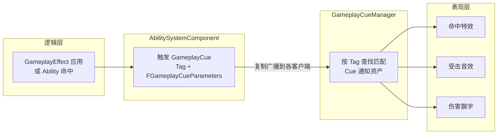

# GameplayCue

**GameplayCue（游戏提示）** 是 Gameplay Ability System（GAS）中用于 **触发"表现层"反馈** 的轻量通知机制——比如命中特效、受击音效、飘字伤害数字、屏幕震动

它最大的特点是：**逻辑层只"广播一个带 GameplayTag 的通知"，完全不关心表现具体怎么播放**；任何注册了匹配 Tag 的 Cue 表现资产会自动响应。

!!! info "一句话总结"

    GameplayCue = 用 **GameplayTag 标记、可跨网络触发的表现事件**：逻辑（Ability / GameplayEffect）发出 `GameplayCue.Damage.Hit`，负责播放特效/音效/飘字的 Cue 资产自动响应，逻辑与表现彻底解耦



| 痛点 | GameplayCue 的解决方式 |
| --- | --- |
| **表现逻辑混乱** | 特效/音效散落在 Ability、Effect 各处 → 统一收进"以 Tag 为标识"的 Cue 资产 |
| **网络表现不一致 / 重复触发** | Cue 由 **服务器触发一次**，靠复制广播到各客户端 **本地播放一次** |
| **复用难** | 一个 `GameplayCue.Damage` 可被普攻、火球、陷阱复用；支持父 Tag 通配子 Tag |
| **策划改动成本高** | 换特效/加音效只改 Cue 资产，不动逻辑代码 |

## 1 触发方式

1. **GameplayEffect 自动触发**（最常用）：GE 上配置了 Cue（带 Tag 与强度），该 GE 被应用 / 移除时自动触发
2. **Ability 手动触发**：攻击命中瞬间调用"执行 GameplayCue"节点，适合即时的单次表现
3. **蓝图 / C++ 直接调用**：

```cpp
FGameplayCueParameters Params;
Params.SourceObject  = GetSourceObject();
Params.Instigator    = GetInstigator();
Params.EffectCauser  = this;
Params.Location      = HitLocation;   // 特效出现位置
Params.Normal        = HitNormal;     // 命中法向（决定特效朝向）
Params.RawMagnitude  = Damage;        // 携带的数值（如飘字内容）

AbilitySystemComponent->ExecuteGameplayCue(
    FGameplayTag::RequestGameplayTag(FName("GameplayCue.Damage.Hit")), Params);
```

## 2 谁来接收并表现

表现侧通过 **GameplayCue 通知资产（GameplayCueNotify）** 实现，分两种：

| 类型 | 形态 | 适用 |
| --- | --- | --- |
| `UGameplayCueNotify_Static` | 非 Actor、无状态 | 一次性"即发即忘"表现（受击火花、音效），性能好、最常用 |
| `AGameplayCueNotify_Actor` | Actor、有状态与生命周期 | 需要持续存在/管理特效的表现（火焰灼烧光环、Buff 视觉） |

创建方式：内容浏览器右键 → **Gameplay Ability System → GameplayCueNotify**，在资产里设置对应的 GameplayTag（如 `GameplayCue.Damage.Hit`），然后在蓝图中实现表现逻辑

Cue 通知蓝图中可处理的四类时机（视类型而定）：`OnActive`（激活）、`WhileActive`（持续中）、`OnRemove`（移除时）、`OnExecute`（执行瞬间）

!!! tip "持续型 Cue：Add / Remove"
    
    表现需要"持续一段时间"（如中毒变绿、无敌金色护罩）时，用 **AddGameplayCue**（开始）与 **RemoveGameplayCue**（结束），期间走 `WhileActive`，由 `AGameplayCueNotify_Actor` 维持该表现

!!! info "关键：服务器触发、本地表现"

    GameplayCue 设计上 **只在服务器触发（权威）**，通过复制把"Tag + 参数"广播给相关客户端，由各客户端 **在本地播放一次表现**。这样既保证一致，又避免每台机器各自判断导致重复。对"客户端预测"的需求，GAS 也提供预测执行的支持（如本地先出特效，服务器确认）

!!! example "典型用例"

    | 场景 | 用到的 Cue |
    | --- | --- |
    | 普攻/技能命中 | `GameplayCue.Damage.Hit`（火花 + 音效 + 伤害飘字） |
    | 暴击 | `GameplayCue.Damage.Critical`（红色大数字 + 震动） |
    | 施加中毒 | GE 附带 `GameplayCue.Status.Poison`（`WhileActive` 变绿/持续跳字） |
    | 施法前摇/命中爆炸 | `GameplayCue.Ability.Fire`、`GameplayCue.Ability.Explosion` |

!!! warning "注意事项"

    1. **GameplayCue 只做表现**：不要在 Cue 里改数值、判胜负等逻辑，那是 GameplayEffect / Ability 的职责
    2. **Tag 命名规范**：统一用 `GameplayCue.*` 前缀，方便按子树管理
    3. **网络触发**：保证在**服务器/权威端**触发（除非使用预测），否则表现会缺失或重复
    4. **性能**：一次性表现优先用 `GameplayCueNotify_Static`；`Actor` 版有生成开销，留给确需持久的场合
    5. 需要确认 Cue 资产在 GameplayCueManager 的扫描/注册路径内，才能按 Tag 被找到
