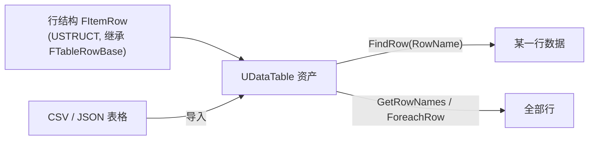
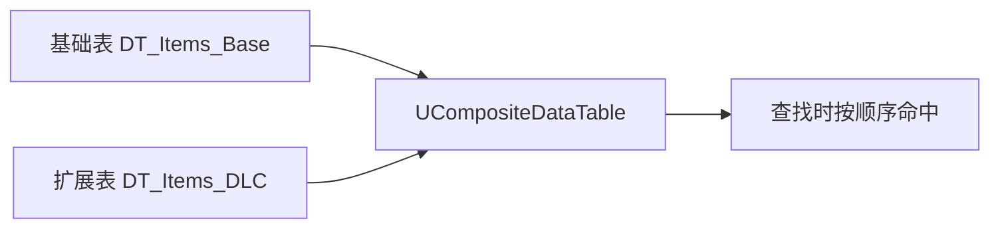

# UDataTable

**UDataTable** 是 UE 中以 **行结构** 为模板的 **二维数据表资产**：先定义一个 `USTRUCT` 描述"一行有哪些字段"，然后表里可以放成百上千行数据，每行用唯一的 **行名（Row Name）** 索引。它专为 **大批量、同构、简单** 的数据设计

!!! info "一句话总结"

    UDataTable = **行结构（Row Struct，定义字段）** + **多行数据（以 RowName 为键）**；用 Excel/CSV 就能编辑，代码里像查字典一样 `FindRow` 取数据



## 1 三个核心概念

| 概念 | 说明 |
| --- | --- |
| **行结构（Row Struct）** | `USTRUCT` 定义"一行有哪些字段"，**必须继承 `FTableRowBase`** |
| **行名（Row Name）** | 每行的唯一 `FName` 键（类似字典的 key），如 `DiamondSword` |
| **UDataTable 资产** | 保存全部行的表资产，可在内容浏览器创建、可从 CSV/JSON 导入 |

## 2 为什么用它

| 做法 | 适合度 |
| --- | --- |
| **硬编码在 C++** | 改数值要重编译，策划无法参与 ❌ |
| **DataTable** | **大量同构数据**（上千种物品/怪物），Excel 批量编辑 |
| **DataAsset** | 少量、**异构、需复杂引用** 的配置（每项都不同 |

DataTable 的最大优势是 **批量编辑与表格化**：把 CSV 丢给策划用 Excel 改，导回来即可；还能进版本管理做 diff

## 3 定义行结构

```cpp
// 必须继承 FTableRowBase
USTRUCT(BlueprintType)
struct FItemRow : public FTableRowBase
{
    GENERATED_BODY()

    UPROPERTY(EditAnywhere, BlueprintReadOnly)
    FText DisplayName;                      // 本地化文本

    UPROPERTY(EditAnywhere, BlueprintReadOnly)
    int32 MaxStack = 64;

    UPROPERTY(EditAnywhere, BlueprintReadOnly)
    float AttackDamage = 0.f;

    UPROPERTY(EditAnywhere, BlueprintReadOnly)
    TSoftObjectPtr<UTexture2D> Icon;        // 软引用，避免打包连锁
};
```

!!! warning "行结构的两个硬性要求"

    1. **必须继承 `FTableRowBase`**，否则无法用于 DataTable
    2. **每个字段都要 `UPROPERTY()`**，否则 CSV 里这一列会被忽略（既不导入也不导出）

!!! note "蓝图结构体也能当行结构"

    在蓝图里新建结构体时，可以设置"继承基础结构体"为 `TableRowBase`，这样纯蓝图项目也能用 DataTable

## 4 创建与导入数据

### 4.1 编辑器流程

1. 内容浏览器 → 右键 → **Miscellaneous → Data Table**
2. 选择行结构（如 `FItemRow`）
3. 在表编辑器中直接加行、填值；或点 **Reimport** 从 CSV/JSON 导入
4. 支持 **Export as CSV / JSON** 导出编辑

### 4.2 CSV 示例

```csv
Name,DisplayName,MaxStack,AttackDamage
DiamondSword,"钻石剑",1,7
IronSword,"铁剑",1,6
GoldenSword,"金剑",1,4
```

!!! tip "格式以编辑器导出为准"

    UE 导出的 CSV 中，行名列表头通常是 `---`，第二行可能是类型提示（如 `String`、`Integer`）。**最稳妥的做法：先由 UE 导出一份空表作为模板，再照格式填数据**，避免手写格式不被识别

### 4.3 JSON 导入

结构复杂的行（含数组、嵌套结构体）用 JSON 更合适，可在导入设置里通过 `ImportKeyField`（默认 `Name`）指定行名来源

### 4.4 改完 CSV 要重新导入

CSV 只是 **源文件**，改完必须在编辑器中 **Reimport**（或开启自动重新导入）才会更新资产

## 5 读取数据

### 5.1 C++

```cpp
// 引用表
UPROPERTY(EditAnywhere)
TObjectPtr<UDataTable> ItemTable;

// 查单行（哈希查找，快）
if (const FItemRow* Row = ItemTable->FindRow<FItemRow>(TEXT("DiamondSword"), TEXT("ItemLookup")))
{
    float Damage = Row->AttackDamage;   // 7
}

// 遍历所有行
ItemTable->ForeachRow<FItemRow>(TEXT("Init"), [](const FName& Key, const FItemRow& Row)
{
    UE_LOG(LogTemp, Log, TEXT("%s -> Stack %d"), *Key.ToString(), Row.MaxStack);
});

// 取所有行名
TArray<FName> Names = ItemTable->GetRowNames();
```

### 5.2 蓝图

| 节点 | 作用 |
| --- | --- |
| **Get Data Table Row** | 按行名取一行（返回值 + 是否找到） |
| **Get Data Table Row Names** | 取所有行名（做列表/下拉） |
| **Does Data Table Row Exist** | 判断行是否存在 |

蓝图节点来自 `UDataTableFunctionLibrary`，也可在 C++ 中调用这些静态函数

## 6 UCompositeDataTable：合并多张表

把 **多张同结构表** 合成一张逻辑表（按顺序查找），非常适合 **DLC / 模组 / 分层覆盖**：



- 基础表定义原有内容，扩展表只写新增/覆盖的行
- 查找逻辑不变，代码无需感知"来自哪张表"

## 7 DataTable vs DataAsset：怎么选

| 维度 | DataTable | DataAsset |
| --- | --- | --- |
| 数量级 | **大量**（几百~几千行） | 少量~中等 |
| 结构 | 每行 **结构完全相同** | 每个资产可不同、可继承 |
| 编辑方式 | Excel/CSV，批量改很方便 | 逐个资产配置 |
| 嵌套/引用 | 支持但不如 DataAsset 灵活 | **强**（引用其他资产、嵌套） |
| 版本管理 | CSV 可 diff/合并 ✅ | 二进制 `.uasset` 不易合并 |
| 资源管理 | 整表加载 | `UPrimaryDataAsset` 可按需加载 |
| 典型 | 物品数值表、掉落表、技能表 | 怪物配置、关卡配置、复杂技能 |

!!! info "实践建议：混用"

    - **数值/同构数据 → DataTable**（策划 Excel 编辑、批量平衡调整）
    - **需要引用大量资产、结构各异的配置 → DataAsset**
    - 两者可互相引用：DataTable 的行里放 `TSoftObjectPtr<UMyConfigAsset>`，或 DataAsset 里引用一张表

## 8 典型使用场景

| 场景 | 说明 |
| --- | --- |
| 物品/装备数值表 | 上千种物品的堆叠、伤害、图标 |
| 怪物属性表 | 血量、攻击、AI 参数、掉落引用 |
| 技能/效果表 | 数值、冷却、消耗、Tag |
| 掉落表（Loot Table） | 权重、条目、数量范围 |
| 对话/任务表 | 文本、跳转 ID |
| 本地化文本 | 通常用更专门的 **String Table**，但小规模也可用 DataTable |

## 9 常见坑与最佳实践

!!! warning "最容易踩的坑"

    1. **行结构没继承 `FTableRowBase`**：无法被 DataTable 使用
    2. **字段忘了 `UPROPERTY`**：CSV 列被静默忽略
    3. **改字段名/类型后不更新 CSV**：导入时列对不上，数据丢失 → 改结构后 **同步更新表格** 并重新导入
    4. **改了 CSV 忘记 Reimport**：运行时读到的还是旧数据
    5. **行名重复**：后导入的会覆盖前者
    6. **运行时 `AddRow`/`RemoveRow`**：会修改资产内存中的表，容易造成编辑器/热重载混乱，慎用（需要运行时动态数据请自己维护一份 `TMap`）
    7. **每帧 `GetAllRows`/`ForeachRow`**：遍历成本高，应缓存或只在初始化时做一次
    8. **行里硬引用大资产**：导致打包连锁、加载膨胀 → 用软引用

!!! info "最佳实践"

    1. 结构设计时 **预留字段**（如通用 `TMap<FName,float> Params`），减少未来改结构导致的表格迁移
    2. `FindRow` 结果 **缓存指针** 用于高频访问，避免反复哈希查找
    3. 复杂的嵌套行数据用 **JSON** 而非 CSV
    4. 大项目按功能拆表（物品表/技能表/掉落表分开），配合 `UCompositeDataTable` 做扩展
    5. 表格名称与行名遵循稳定命名规范（行名即 ID，改行名等于改 ID，会影响存档）

!!! note "与其它笔记的联系"

    - **UDataAsset**：DataTable 的"表格式"对照方案
    - **反射系统**：行结构靠 `UPROPERTY` 暴露，导入导出依赖反射
    - **物品系统设计**：物品数值表在 UE 中通常就是 DataTable；复杂行为配置再用 DataAsset
