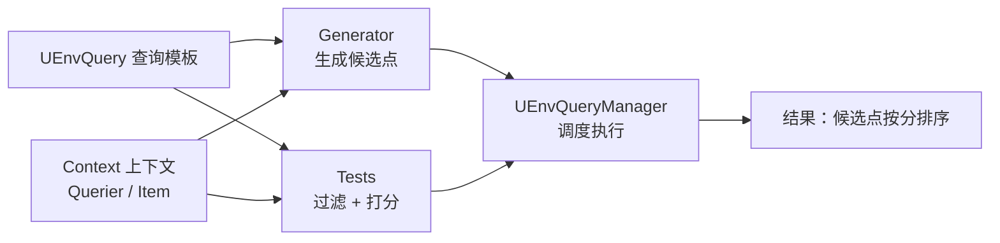
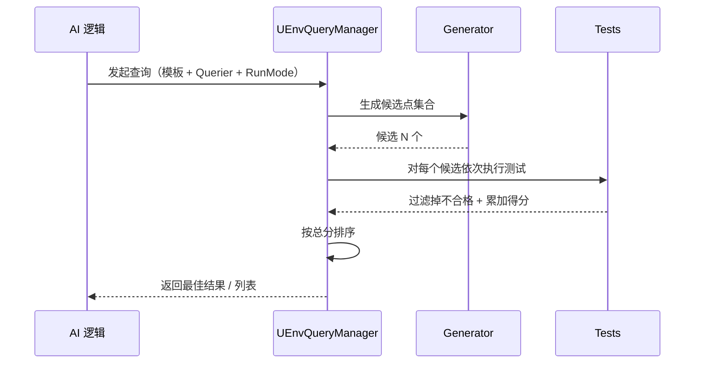

# UEnvQuery

**UEnvQuery** 是 EQS（Environment Query System，**环境查询系统**）中的"查询模板"资产。它描述一种 **环境扫描 + 打分选优** 的规则：**生成一批候选位置/对象 → 逐个测试打分 → 排序 → 取最佳结果**，是 AI 做"找个好位置/好目标"的核心工具

!!! info "一句话总结"

    `UEnvQuery`（查询模板）= **生成器（Generator：生成候选）** + **一组测试（Test：打分/过滤）**；由 **UEnvQueryManager** 在世界中调度执行，用 **Context（上下文）** 指定"相对谁查询"，产出按分数排序的候选结果



解决 AI 常见的"空间决策"问题：

| 需求 | 查询思路 |
| --- | --- |
| 找 **掩体** | 在自身周围生成点 → 过滤/打分：被敌人看到的分低、离自己近的分高 |
| 找 **射击点** | 生成点 → 测试能看见目标、距离合适、导航可达 |
| 找 **巡逻点** | 生成点 → 测试远离其他巡逻点（分散）、可达 |
| 找 **撤退点** | 生成点 → 远离敌人、靠近队友、血量安全区 |
| 找 **可交互对象** | 生成器用"某类 Actor"，再按距离/朝向打分 |

这类逻辑手写会很杂（采样、检测、打分、排序），EQS 把它 **数据化** 成可复用资产

## 1 核心组成

### 1.1 查询资产（UEnvQuery）

一个 `UEnvQuery` 资产（在编辑器里创建为 **Environment Query**）保存：

- 一个 **生成器**（或组合生成器）
- 一个 **测试列表**（有序，可设权重与评分曲线）
- 每个生成器/测试各自的 **上下文（Context）** 设置

### 1.2 生成器（Generator）

| 生成器 | 生成的候选 |
| --- | --- |
| **Actors Of Class** | 场景中某个类的所有 Actor |
| **Points: Grid** | 在查询者周围按网格采样点（最常用） |
| **Points: Circle / Cone / Donut** | 圆形 / 锥形 / 环形范围内采样 |
| **Current Location** | 只有一个候选：当前位置 |
| **Pathing Grid** | 沿导航网格生成点（保证可达） |
| **Composite** | 组合两个生成器（并集 / 交集） |
| **自定义生成器** | 蓝图/C++ 继承生成器基类，自己产出候选 |

候选点类型由 **Item Type** 决定：Actor、Point、Vector 等。

### 1.3 测试（Test）

每个测试对 **所有候选** 逐个求值，可以做两件事：

- **过滤（Filter）**：直接淘汰不合格候选（如"必须可达"）
- **打分（Score）**：给候选一个分数，最终按加权总分排序

常见测试：

| 测试 | 作用 |
| --- | --- |
| **Distance** | 距离某上下文（目标/自己）多远 |
| **Dot** | 候选点相对朝向的角度（是否在正面） |
| **Trace** | 射线检测（是否有视线、是否被遮挡） |
| **Pathfinding** | 寻路距离、是否可达（比直线距离更真实） |
| **Overlap** | 是否落在某个危险/安全区域内 |
| **Random** | 加随机扰动、打破平局（避免所有 AI 挤同一个点） |

打分细节可配置：**权重（Weight）**、**评分方程（线性 / 平方 / 反比）**、**归一化范围**、以及过滤类型（最小值 / 最大值 / 区间）

!!! warning "测试越多越贵"

    每个测试都要对 **所有候选点** 执行。生成器产出的点数 × 测试数是主要开销，因此要点：

        - 便宜的测试（Distance）放前面，昂贵的（Trace、Pathfinding）放后面
        - 控制网格密度与采样半径，别一上来生成几千个点
        - 必须可达的需求用 **Pathing Grid** 生成器，比事后 Pathfinding 测试更省

### 1.4 上下文（Context）

Context 告诉生成器/测试"参照物是谁"：

| Context | 含义 |
| --- | --- |
| **Querier** | 发起查询者（通常是 AI 自己） |
| **Item** | 候选点自身（用于"候选之间的间距"等测试） |
| **自定义 Context** | 蓝图/C++ 继承 `UEnvQueryContext`，返回任意 Actor 集合（如"最近的队友"） |

例如"距离目标多远"这个测试，就需要一个返回"目标 Actor"的自定义 Context

### 1.5 管理器（UEnvQueryManager）

- World 级的查询调度器，负责 **执行、限流、缓存**
- 有 **每帧预算** 与超时保护：查询多了不会一帧卡死，而是排队分帧执行
- 因此 EQS 查询通常是 **异步** 的：发起后回调/延迟拿结果

### 1.6 结果

查询完成后得到 **按分数排序的候选列表**。常用 **Run Mode**：

| Run Mode | 结果 |
| --- | --- |
| `SingleResult` | 只要最佳的一个 |
| `AllMatching` | 返回全部（自行挑选） |
| `RandomBest5Pct` / `RandomBest25Pct` | 在最好的前 5%/25% 中随机取一个（增加行为多样性） |

## 2 工作流程



## 3 如何运行

### 3.1 行为树中（最常见）

用 **Run EQS Query** 任务节点：指定查询模板、Run Mode 与"结果写入哪个黑板键"（如 `MoveToLocation`），后续 `MoveTo` 任务直接使用

### 3.2 蓝图（异步）

蓝图节点 **Run EQS Query** 返回一个查询实例包装器，可绑定 **On Query Finished** 事件拿结果：

```text
Run EQS Query (Query Template, Querier, Run Mode)
   └─ OnQueryFinished → 取结果 → 使用/写入黑板
```

### 3.3 C++

```cpp
UEnvQueryManager* EQS = UEnvQueryManager::GetCurrent(GetWorld());

FEnvQueryRequest Request(MyQueryTemplate, this);   // 第二参：Querier
Request.SetFloatParam(TEXT("Range"), 1500.f);      // 可选：传入参数

Request.Execute(EEnvQueryRunMode::SingleResult,
    FQueryFinishedSignature::CreateUObject(this, &AMyAIController::OnQueryFinished));
```

回调里从 `FEnvQueryResult` 取结果项（`GetItemAsActor` / `GetItemLocation` 等）

## 4 调试

| 工具 | 用途 |
| --- | --- |
| **EQS Testing Pawn** | 放置到关卡，选择查询模板，**可视化** 所有候选点及其得分（调试 EQS 的主力工具） |
| 编辑器内 EQS 面板 | 直接测试某个查询并查看每个测试的分数贡献 |
| **Gameplay Debugger** | 运行时查看 AI 的查询结果与当前行为 |

## 5 常见坑与最佳实践

!!! warning "常见坑"

    1. **候选点爆炸**：Grid 半径大 + 密度高 → 数千点 × 多个测试 → 卡顿
    2. **过滤太晚**：能用生成器/早期测试排除的，别留到最后
    3. **忽略寻路**：用直线 `Distance` 选出的点可能隔着墙，需要 `Pathfinding` 或 `Pathing Grid`
    4. **每帧发起查询**：应结合定时器/服务，按需查询（如每 0.5~1s）
    5. **所有 AI 选同一点**：用 `RandomBest5Pct` 或 **Random** 测试制造差异

!!! info "最佳实践"

    1. 查询模板 **做成可复用资产**，参数化（半径、类型、权重）后用 `SetFloatParam` 等传入
    2. 与行为树/状态树配合：**EQS 负责"在哪"，行为树/状态树负责"做什么"**
    3. 结果通常写到黑板键，交给 `MoveTo` 等任务消费
    4. 线上注意查询频率与预算，必要时自定义更省的自定义生成器/测试
