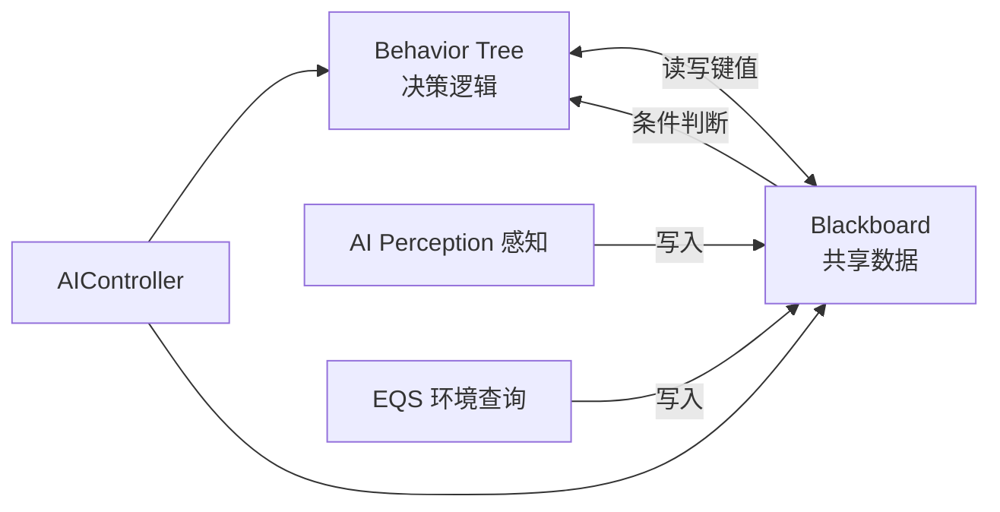
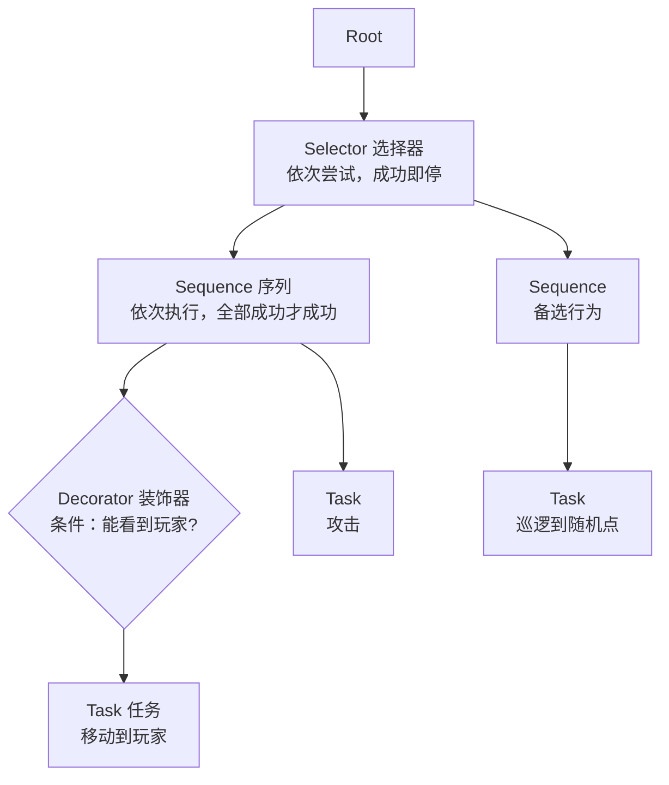
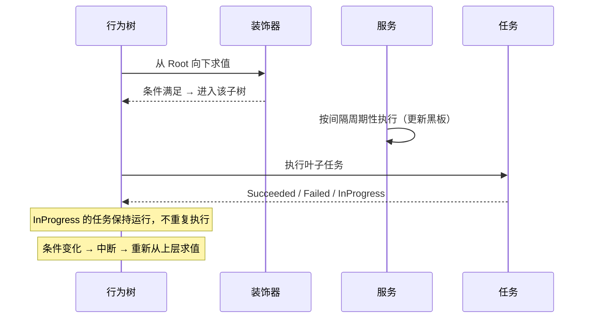
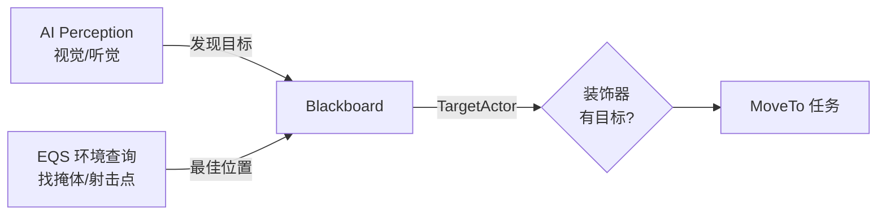

# 行为树

**行为树（Behavior Tree，BT）** 是 UE 用来驱动 AI 决策的 **层次化逻辑树**：把"AI 该做什么"拆成可组合的节点，由引擎按顺序求值执行。它本身不存数据，数据放在 **黑板（Blackboard）** 里，由 **AIController** 运行

!!! info "一句话总结"

    UE 的 AI 决策三件套 = **行为树**（逻辑：做什么）+ **黑板**（数据：知道什么）+ **AIController**（执行者：驱动行为树、持有黑板）



| 方案 | 问题 / 优点 |
| --- | --- |
| **硬编码 / if-else** | AI 稍复杂就变成"意大利面"，无法复用 |
| **状态机（FSM）** | 状态多、转移多时爆炸式增长，复用差 |
| **行为树** | 层次化、可组合、节点可复用、可视化调试，天然表达"优先级 + 顺序" |

行为树适合表达 **"优先做 A，不行就 B，都不行就 C"** 这类决策；精细的每帧动作控制（物理、动画细节）仍应交给 C++ 逻辑

## 1 结构：从根到叶



### 1.1 三类节点

| 类别 | 作用 | 是否能执行动作 |
| --- | --- | --- |
| **组合节点（Composite）** | 控制子节点的执行顺序与逻辑组合 | ❌ 只调度 |
| **任务（Task）** | **叶子节点**，真正干活的 | ✅ |
| **装饰器（Decorator）** | 附加在节点上，**条件判断 / 中断 / 循环** | ❌ 只附加 |
| **服务（Service）** | 附加在节点上，**周期性执行**（常更新黑板） | ❌ 只辅助 |

### 1.2 组合节点

| 节点 | 语义 | 类比 |
| --- | --- | --- |
| **Sequence（序列）** | 依次执行子节点；**全部成功** 才算成功，任一失败立即失败 | 逻辑与（AND） |
| **Selector（选择器）** | 依次尝试子节点；**任一成功** 即成功，全失败才失败 | 逻辑或（OR） |
| **Simple Parallel（简单并行）** | 一个主任务 + 一个辅助子树同时跑 | 边做 A 边做 B |

**Selector 是"优先级"的载体**：放在前面的子树优先级更高（如"先打玩家 → 没玩家就巡逻"）。

### 1.3 任务（Task）

分为两类：

| 类型 | 特点 | 例子 |
| --- | --- | --- |
| **瞬时任务（Instant）** | 一帧内完成，直接返回成功/失败 | `FinishWithResult`、设置标签 |
| **持续任务（Latent）** | 需要多帧，结束时调用"完成"接口 | `MoveTo`、`Wait`、播放动画 |

常见内置任务：`MoveTo`（寻路移动）、`Wait`（等待）、`RotateToFaceBBEntry`（转向）、`PlaySound`、`RunBehavior`（执行子树）、`RunEQSQuery`、`FinishWithResult`

### 1.4 装饰器（Decorator）

- **条件装饰器**：检测黑板键（如 `TargetActor` 是否有效、`Health` 是否 > 30），不满足则节点不执行
- **观察者中断（Observer Aborts）**：当条件 **变化** 时主动打断正在跑的子树

    - `None`：不中断，只在下一次评估时判断
    - `Self`：条件失效时中断 **自己** 这棵子树
    - `Lower Priority`：条件成立时中断 **优先级更低**（靠右）的子树
    - `Both`：两者都要

- 其他用途：循环（Loop）、时间限制、冷却（Cooldown）

!!! info "中断才是行为树的灵魂"

    "看到玩家就立刻放弃巡逻去追击"这种 **抢占式** 行为，靠的就是装饰器 + Observer Aborts：条件的黑板键一变化，引擎立刻中断当前低优先级子树、重新从上层求值

### 1.5 服务（Service）

- 挂在组合节点/任务上，**按固定间隔（Interval）周期性执行**
- 最常见的用途：**更新黑板**（每 0.5s 查询最近的敌人并写入 `TargetActor`）、维护焦点（`DefaultFocus`）
- 有 `Interval` 与 `RandomDeviation`（随机抖动，避免所有 AI 同帧执行）

## 2 执行流程



要点：

- 节点返回值只有三种：**成功 / 失败 / 进行中**
- 行为树 **有记忆**：正在执行的子树会保持运行，不会每帧从头重跑；只有节点结束或被中断时才重新求值
- 每次求值都是 **深度优先**：Selector 从左到右试，Sequence 从上到下走

## 3 黑板（Blackboard）：AI 的共享数据

黑板是一张 **键值表**，行为树本身的节点都不存状态，全靠它传递信息：

| 键类型 | 例子 |
| --- | --- |
| `Object` | `TargetActor`（当前目标） |
| `Vector` | `PatrolLocation`（巡逻点） |
| `Float` / `Int` | `Health`、`Ammo` |
| `Bool` | `bIsAlerted` |
| `Enum` / `Name` / `Class` / `Rotator` / `String` | 状态、标签 |

谁写谁读：

| 角色 | 行为 |
| --- | --- |
| **服务** | 周期性写入（更新目标、位置） |
| **感知系统（Perception）** | 看到/丢失玩家时写入 `TargetActor` |
| **任务** | 既读（去哪）也写（到达后清空目标） |
| **装饰器** | 只读（判断条件） |
| **EQS** | 查询结果写入（如最佳掩体点） |

!!! warning "黑板只有数据，没有逻辑"

    不要在黑板里做判断——判断放装饰器，动作放任务。黑板键名一旦被引用，**改名会断开所有引用**，命名要慎重

## 4 蓝图实操

### 4.1 创建资产

1. 新建 **Blackboard（黑板）** 资产，定义键（如 `TargetActor: Object`）
2. 新建 **Behavior Tree** 资产，在 Blackboard 属性里绑定该黑板
3. 在树里拖入组合节点、任务、装饰器、服务，连线成树

### 4.2 在 AIController 中运行

```cpp
void AMyAIController::OnPossess(APawn* InPawn)
{
    Super::OnPossess(InPawn);

    if (UBehaviorTree* BTAsset = LoadObject<UBehaviorTree>(nullptr, TEXT("/Game/AI/BT_Guard")))
    {
        RunBehaviorTree(BTAsset);   // 创建并启动 行为树组件 + 黑板组件
    }

    // 之后可用 GetBlackboardComponent() 读写黑板
    if (UBlackboardComponent* BB = GetBlackboardComponent())
    {
        BB->SetValueAsObject(TEXT("TargetActor"), nullptr);
    }
}
```

### 4.3 自定义节点（蓝图 / C++）

| 要扩展 | 蓝图基类 | C++ 基类 |
| --- | --- | --- |
| 任务 | `BTTask_BlueprintBase` | `UBTTaskNode` |
| 装饰器 | `BTDecorator_BlueprintBase` | `UBTDecorator` |
| 服务 | `BTService_BlueprintBase` | `UBTService` |

**持续任务的关键**：执行时若还没做完，要返回 `InProgress`，并在真正结束时（如移动到达）调用 **Finish Latent Task** 报告结果，否则行为树会一直卡在该节点

## 5 与感知、EQS 的配合



- **AI Perception**：注册视觉/听觉/伤害感知，在回调里把感知到的 Actor 写入黑板
- **EQS（Environment Query System）**：按规则（距离、视线、导航可达）从环境中"查询"出最佳位置， результат 写入黑板供 `MoveTo` 使用

## 6 调试与优化

| 手段 | 说明 |
| --- | --- |
| **Gameplay Debugger** | 按 `'` 查看 AI 当前执行到哪个节点、黑板值 |
| **行为树调试视图** | 运行时高亮正在执行的节点，可暂停、查看日志 |
| **Watch 黑板键** | 直接观察键值变化 |

!!! warning "性能与常见坑"

    1. **装饰器不要滥用**：每个带观察者的装饰器都要注册监听，条件越复杂开销越大
    2. **服务间隔别设太小**：服务是周期执行的，0.1s 的服务会把开销放大
    3. **避免超深/超大的树**：拆成子树（`RunBehavior`）复用，便于维护
    4. **Latent 任务记得 Finish Latent Task**：否则节点永远"进行中"
    5. **装饰器中断模式理解错**：容易导致"该抢占时不抢占"或"频繁抖动"，用 `Lower Priority` 做优先级抢占、`Self` 保护自身子树
    6. **黑板键名拼写**：字符串键名写错不会编译报错，只会静默失效
