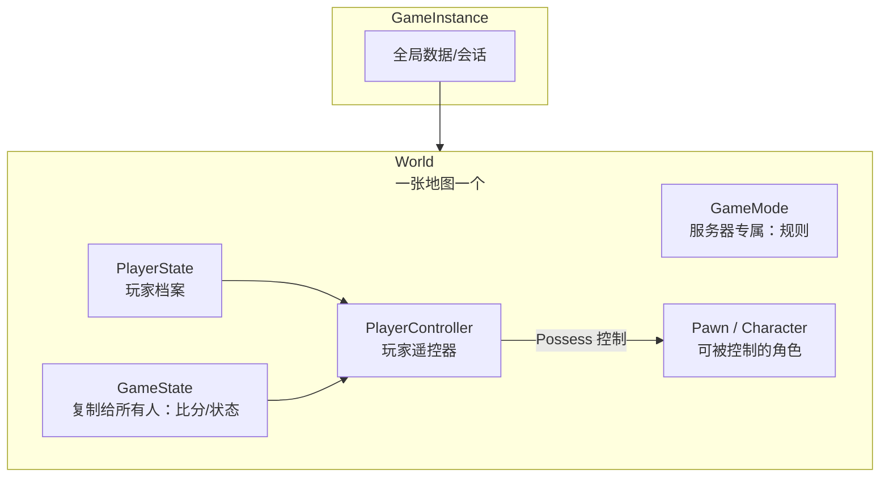
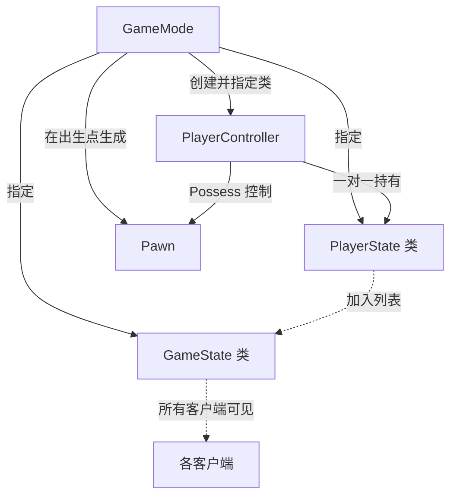
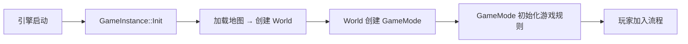
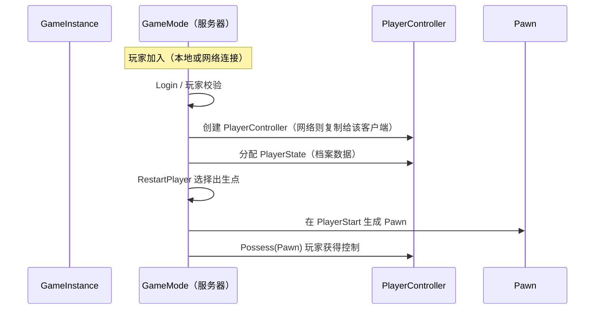
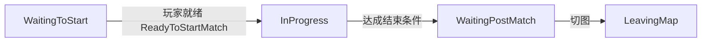
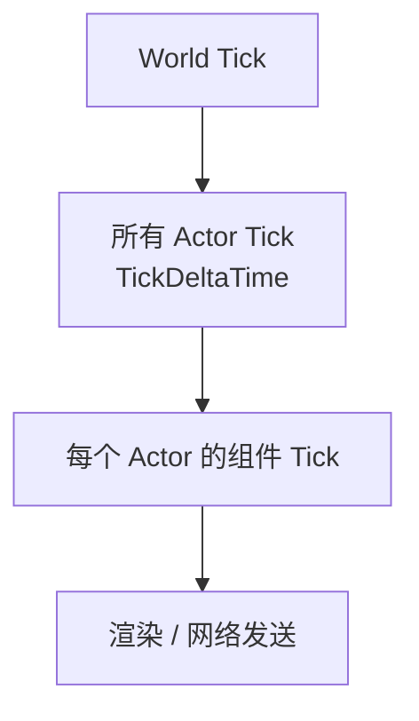

# GamePlay 框架

不同游戏玩法千差万别，但底层要素高度一致：**有一个世界、有一套游戏规则、有玩家、有玩家能控制的角色**。UE 把这些通用骨架抽象成一组相互协作的类，称为 **GamePlay 框架（Gameplay Framework）**。开发者不必从零搭建，只需 **继承并覆写** 对应类即可实现自己的玩法

!!! info "一句话总结"

    GamePlay 框架 = 一套规定"游戏如何运转"的类骨架：**GameInstance**（全局会话）、**World**（世界）、**GameMode/GameState**（规则与共享状态）、**PlayerController**（玩家遥控器）、**PlayerState**（玩家档案）、**Pawn/Character**（可被控制的角色）

## 1 核心类总览

| 类 | 存活范围 | 是否复制 | 职责 |
| --- | --- | --- | --- |
| `UGameInstance` | 整个游戏进程 | 否 | 全局会话数据，跨关卡 |
| `UWorld` | 一张地图 | 否（本机世界） | 承载关卡与所有 Actor，驱动 Tick |
| `AGameModeBase` / `AGameMode` | 一个关卡 | **仅服务器** | 游戏规则、玩家如何加入/重生 |
| `AGameStateBase` / `AGameState` | 一个关卡 | 是（复制给所有客户端） | 所有人共享的比赛状态 |
| `APlayerController` | 一个玩家连接 | 是（复制给所属客户端） | 玩家的输入、视图、控制权 |
| `APlayerState` | 一个玩家连接 | 是 | 玩家的持久档案（名字、分数） |
| `APawn` / `ACharacter` | 一个被控制角色 | 是 | 玩家的"身体"，可被 Controller 控制 |
| `AActor` / `UActorComponent` | 场景物体 | 按需 | 一切场景实体的基类 |

##### 1.1 UGameInstance（全局游戏会话）

- 整个游戏进程 **只创建一个**，**切换关卡不会销毁**，适合存放跨地图的全局数据（玩家设置、存档指针、在线会话、服务器列表）
- 入口虚函数：`Init()`（进程启动时）、`Shutdown()`
- 通过 `UGameplayStatics::GetGameInstance(World)` 或 `GetGameInstance()` 获取
- **不参与网络复制**，只在本地存在

##### 1.2 UWorld（世界）

- 每个关卡对应一个 `UWorld`，管理该关卡的所有 Actor、碰撞、音频、Tick、网络驱动
- `SpawnActor` 生成物体、`GetWorldTimerManager()` 定时器等都在 World 上
- Actor 代码里用 `GetWorld()` 拿到它

!!! info "World vs GameInstance 的生命周期"

    `GameInstance` 跨地图常驻；`World` 随地图加载/卸载而创建销毁。切地图后想保留的数据放 `GameInstance`，随地图一起消失的放 `World` / 关卡 Actor

##### 1.3 AActor / UActorComponent

- `AActor`：可放置到关卡中的实体，一切玩法对象的基类（前几篇涉及的反射、GC 对象）
- `UActorComponent`：Actor 的功能单元（移动、渲染、碰撞），Actor 由组件组合而成

##### 1.4 APawn / ACharacter（角色）

- `APawn`：**可被 Controller 控制（Possess）** 的物理实体，代表玩家或 AI 在世界中的"身体"
- `ACharacter`：Pawn 的常见子类，内置 `CharacterMovementComponent`（移动）、胶囊体碰撞与骨骼网格，人形角色首选

!!! note "输入不归 Pawn 管"

    Pawn 负责"身体"，**输入绑定与决策在 Controller**。所以"谁在控制它"可以随时换，Pawn 不需要关心操控者是玩家还是 AI

##### 1.5 APlayerController（玩家遥控器）

- 每个玩家/本地用户对应一个 `PlayerController`，是玩家与世界的"遥控器"：负责 **输入处理、相机、HUD、控制（Possess）Pawn**
- 服务器在玩家加入时创建，并 **复制给所属客户端**（客户端也有一个实例来驱动本地输入与画面）
- 常用：`SetupInputComponent()` 绑按键、`Possess()/UnPossess()` 控制/释放 Pawn、`GetPawn()` 取当前控制角色
- AI 的对应物是 `AAIController`（同样能 Possess Pawn，输入换成行为树/逻辑）

##### 1.6 APlayerState（玩家档案）

- 每个玩家的 **持久数据**：`PlayerName`、`Score`、队伍等
- **跨 Pawn 重生保留**——角色死了换新 Pawn，`PlayerState` 仍在（分数不丢）
- **复制给所有客户端**，适合做记分板
- 通过 `GetPlayerState()` 从 Controller 获取

##### 1.7 AGameStateBase / AGameState（共享比赛状态）

- 服务器权威，**复制给所有客户端**——客户端没有 GameMode，但能看到 GameState
- `GameState` 存：比赛状态机、已耗时、玩家列表（`PlayerArray`）等
- `GameStateBase` 是基础版（玩家列表等）；`AGameState` 增加 **比赛状态机（Match State）** 与计时
- 通过 `GetWorld()->GetGameState()` 获取

##### 1.8 AGameModeBase / AGameMode（规则）

- **只存在于服务器**，是"这一局怎么玩"的总设计师，负责：

  - 指定默认使用的 `Pawn`、`PlayerController`、`PlayerState`、`GameState`、`HUD` 类
  - 玩家加入（Login）、选择出生点、生成角色（RestartPlayer）、控制权交接
  - 比赛开始/结束的判定与流程

- `AGameModeBase` 提供基础能力；`AGameMode` 额外内置 **比赛状态机**（见 3.4）
- 服务器上通过 `GetWorld()->GetAuthGameMode()` 获取

!!! info "GameMode / GameState 的黄金分工"

    服务器想"改规则"→ 在 **GameMode** 做；要让 **客户端也看到** 比赛状态 → 在 **GameState** 放一个 `Replicated` 属性。GameMode 的修改不会自动同步，客户端也访问不到它

## 2 游戏流程与生命周期

##### 2.1 从启动到进入关卡

##### 2.2 玩家加入流程（Login → Possess）

##### 3.3 出生点与重生

- 出生点用关卡里的 `APlayerStart`
- 死亡后 GameMode 调用 `RestartPlayer`，在合适的出生点重新生成 Pawn 并 Possess
- 用 `ChoosePlayerStart` / `FindPlayerStart` 可定制"哪个出生点"（如基于最近敌人、队伍）

##### 3.4 比赛状态机（Match State）

`AGameMode` 内置一条比赛状态流转线：

- 状态由 **GameMode** 推进，但实际状态值存在 **GameState**（客户端靠它知道"比赛是否开始"）
- `HandleMatchHasStarted` 触发后，世界中的 Actor 才批量执行 `BeginPlay`
- 覆写 `ReadyToStartMatch` / `HandleMatchHasEnded` 等可定制"何时开局、如何结束"

##### 3.5 每帧更新（Tick）

- Actor 需设置 `bCanEverTick = true` 并在 `Tick()` 写逻辑
- 组件 tick 在其所属 Actor tick **之后**
- 不需要每帧更新的 Actor 应关闭 Tick 以节省性能

## 3 网络视角：谁在服务器 / 客户端

| 对象 | 服务器 | 客户端 | 说明 |
| --- | --- | --- | --- |
| GameMode | ✅ 权威 | ❌ 不存在 | 规则只在服务器 |
| GameState | ✅ 权威 | ✅ 只读副本 | 靠复制同步 |
| PlayerState | ✅ 权威 | ✅ 副本 | 每个玩家一份 |
| PlayerController | ✅ 创建 | ✅ 拥有者一份 | 拥有者客户端可输入 |
| Pawn | ✅ 生成/权威 | ✅ 按角色模拟 | Autonomous / Simulated（见网络同步篇） |

!!! note "联动"

    服务器如何把世界状态告诉客户端、玩家输入如何上报，靠的是《网络同步》中的 **属性复制与 RPC**；而这些对象之所以能被网络层识别，依赖《反射系统》的元数据

## 4 实战：想实现一个玩法，该继承谁

| 需求 | 用哪个类 |
| --- | --- |
| 全局存档、跨关卡数据 | `UGameInstance` |
| 胜负判定、重生、开局倒计时 | `AGameMode`（规则，仅服务器） |
| 客户端也能看的比分 / 剩余时间 | `AGameState` + `Replicated` 属性 |
| 玩家名字、分数、队伍（重生不清零） | `APlayerState` |
| 玩家输入、相机、控制角色 | `APlayerController` |
| 玩家操控的"身体"（人形） | `ACharacter` |
| AI 控制的敌人逻辑 | `AAIController` + `APawn` |
| 一张地图内的一次性场景逻辑 | 关卡里的普通 `AActor` |

!!! warning "最常见的错误"

    1. **在客户端读不到 GameMode**：客户端没有 GameMode 实例，需要共享状态时改用 GameState
    2. **把玩家数据放 Pawn**：Pawn 死亡重生后数据丢失，应放 `PlayerState`
    3. **把跨关卡数据放关卡 Actor / World**：切图即销毁，应放 `GameInstance`
    4. **在 GameMode 改属性指望客户端看到**：GameMode 不复制，改完要让客户端知道需同步到 GameState
    5. **混淆 GameMode 与 GameState**：GameMode 是"服务器专属规则"，GameState 是"所有人可见状态"

!!! info "最佳实践"

    1. 规则收敛在 GameMode，状态收敛在 GameState，数据收敛在对应对象——职责清晰才能应对复杂玩法
    2. 每个 `Tick` 都要问"真需要每帧跑吗"，用定时器（`GetWorldTimerManager`）替代高频轮询
    3. 用 C++ 覆写点（`BeginPlay`、`PossessedBy`、`RestartPlayer` 等）留出扩展口，让蓝图只做表现
    4. 需要引用"当前游戏模式/玩家"时，用 `GetWorld()->GetAuthGameMode()`、`UGameplayStatics::GetPlayerController()` 等访问器，避免到处存裸指针
