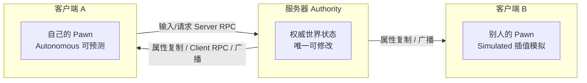
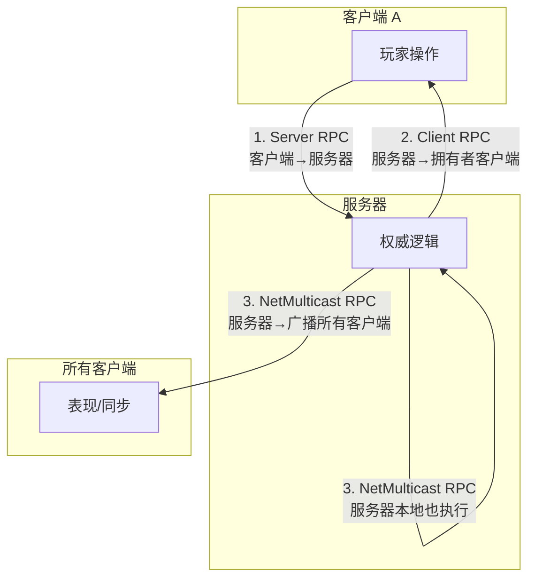
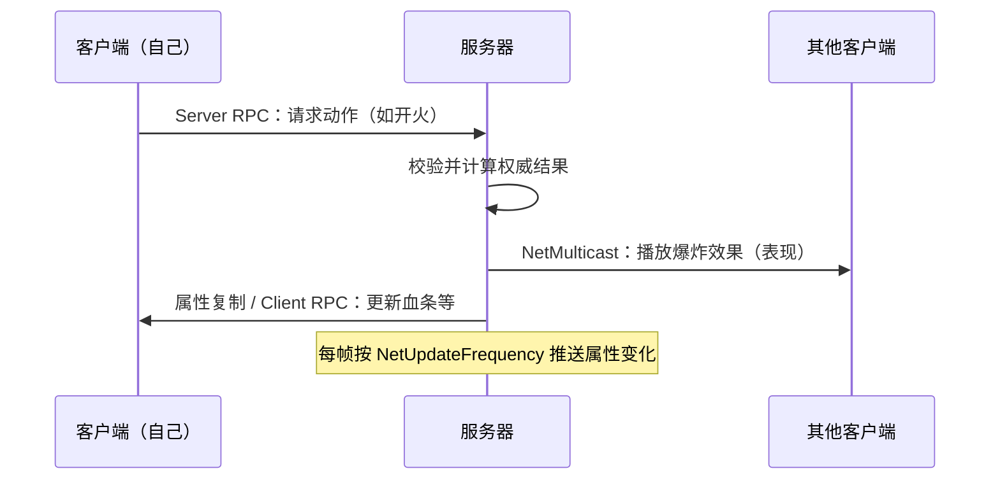

# 网络同步

在多人游戏中，服务器与多个客户端各自运行一份游戏，但它们必须"看到同一个世界"。**网络同步（Network Synchronization / Replication）** 就是让各台机器上的游戏状态保持一致的技术

!!! info "一句话总结"

    UE 的网络同步 = **服务器权威** 管理世界状态 + **属性复制**（服务器把属性变化推给客户端）+ **RPC**（跨机器调函数），从而让所有客户端看到一致、且不被作弊篡改的世界

!!! note "网络同步依赖反射"

    属性复制、RPC 的收发都建立在 **反射系统** 之上（`UPROPERTY(Replicated)`、`UFUNCTION(Server)` 的元数据）

为什么需要网络同步：

| 挑战 | 说明 |
| --- | --- |
| **多机一致性** | 每台机器各自模拟世界，稍有偏差玩家就会"看见不同" |
| **带宽有限** | 不能每帧把所有对象的所有数据发给所有人，必须"按需、按频率、按优先级" |
| **延迟（Latency）** | 网络往返有几十~几百毫秒，本地响应要快，远端又必须公平 |
| **反作弊** | 不能让客户端自己说了算，需要"权威"裁决 |

## 1 网络架构：客户端-服务器模型

### 1.1 服务器类型

| 类型 | 说明 |
| --- | --- |
| **专用服务器（Dedicated Server）** | 只跑逻辑、不渲染画面的独立服务器，最公平、最常见（正式对战） |
| **监听服务器（Listen Server）** | 房主的电脑既是服务器也是玩家，适合合作联机 |

### 1.2 权威（Authority）

服务器是世界的 **唯一权威（Authority）**：真正的状态修改都在服务器上完成，客户端只提交"意图"，由服务器裁决后广播结果。判断自己是否有权威：

```cpp
if (HasAuthority())
{
    // 当前在服务器上，可修改并同步世界状态
}
```

### 1.3 Actor 所有权（Ownership）

一个 Actor 通常"属于"某个客户端（如玩家 Pawn 归控制它的客户端所有）。所有权决定"服务器要把消息单独发给谁"。



### 1.4 网络角色（Role）

每个复制 Actor 在每台机器上有 `LocalRole`（本机角色）与 `RemoteRole`（对端角色）：

| 角色 | 含义 |
| --- | --- |
| `ROLE_Authority` | 服务器，拥有最终决定权 |
| `ROLE_AutonomousProxy` | 客户端上 **自己控制** 的 Pawn，允许本地预测（高响应） |
| `ROLE_SimulatedProxy` | 客户端上 **其他人控制** 的 Pawn，靠接收服务器状态模拟 |
| `ROLE_None` | 不参与复制 |

## 2 属性复制（Property Replication）

把 UObject 成员标记为 `Replicated`，**服务器上的值一旦变化，引擎会定期自动同步给客户端**。注意它是 **单向** 的：只能服务器 → 客户端。

```cpp
UCLASS()
class AMyActor : public AActor
{
    GENERATED_BODY()

    // 标记需要复制的属性（服务器→客户端）
    UPROPERTY(Replicated)
    float Health;

    // 客户端收到新值后自动调用 OnRep_Health
    UPROPERTY(ReplicatedUsing = OnRep_Health)
    int32 Ammo;
    UFUNCTION()
    void OnRep_Health();
    UFUNCTION()
    void OnRep_Ammo();
};
```

还需要在 `GetLifetimeReplicatedProps` 里登记哪些属性要复制、按什么条件复制：

```cpp
#include "Net/UnrealNetwork.h"

void AMyActor::GetLifetimeReplicatedProps(TArray<FLifetimeProperty>& OutLifetimeProps) const
{
    Super::GetLifetimeReplicatedProps(OutLifetimeProps);

    DOREPLIFETIME(AMyActor, Health);                    // 复制给所有客户端
    DOREPLIFETIME_CONDITION(AMyActor, Ammo, COND_OwnerOnly); // 只复制给拥有者
}
```

!!! info "OnRep 回调只在客户端触发"

    `ReplicatedUsing` 指定的回调 **只在客户端收到属性更新时调用**（服务器本地修改不会触发）。常用来驱动动画、音效、UI 等表现逻辑。注意新加入的客户端首次获得属性初始值时，同样会触发一次 OnRep

同步频率与优先级：

| 参数 | 默认 | 作用 |
| --- | --- | --- |
| `NetUpdateFrequency` | 100 | 服务器每秒向客户端发送该 Actor 更新的次数上限 |
| `NetPriority` | 1.0 | 带宽紧张时，谁先发送、发送多少 |

## 3 RPC（远程过程调用）

属性复制适合"持续的状态"，而 **瞬时事件**（开火、爆炸、扣血瞬间）用 RPC 更合适

RPC（Remote Procedure Call，**远程过程调用**）是指：**调用写在本地的一行代码，但实际执行在另一台机器上**。调用方把"函数名 + 参数"打包通过网络发送出去，接收方在自己的引擎里真正执行这段逻辑

!!! info "一句话总结"

    在 UE 里，RPC 就是 **跨网络调函数**：客户端可以调用服务器上的函数，服务器也可以调用某个（或所有）客户端上的函数，写起来就像调用本地函数一样

这行"看似本地、实为远程"的魔法，正是靠 `UFunction` 的反射信息 + 引擎网络层共同实现的

### 3.1 三种 RPC



| 类型 | 声明 | 谁调用 | 在哪里执行 | 典型用途 |
| --- | --- | --- | --- | --- |
| **Server** | `UFUNCTION(Server)` | 客户端 | 服务器 | 客户端把"玩家输入/请求"上报给服务器裁决（如开火、购买） |
| **Client** | `UFUNCTION(Client)` | 服务器 | 拥有该 Actor 的那个客户端 | 服务器把结果单独通知某个玩家（如"你被击中"、弹出血条） |
| **NetMulticast** | `UFUNCTION(NetMulticast)` | 服务器 | 所有客户端 **+** 服务器自己 | 广播给所有人看的效果（爆炸、播音效） |

!!! note "执行权限"

    - 服务器调用 **Server RPC**：不发送，直接在本地执行
    - 非拥有者客户端调用 **Client / NetMulticast RPC**：一般没有意义（非权威），不会被广播
    - 客户端调用 **NetMulticast RPC**：通常只在本地执行，不会广播给别人

### 3.2 可靠性：Reliable / Unreliable

每个 RPC 都要声明传输可靠性：

| 说明符 | 保证 | 代价 | 适用场景 |
| --- | --- | --- | --- |
| `Reliable` | 保证送达、按序到达 | 占用更多带宽、有队列上限 | 重要且低频（扣血、开火、复活） |
| `Unreliable` | 可能丢包、乱序 | 轻量、适合高频 | 高频低重要性（位置、朝向、特效） |

```cpp linenums="1"
UCLASS()
class AMyCharacter : public ACharacter
{
    GENERATED_BODY()

    // 1. 客户端调用 → 服务器执行（可信裁决）
    UFUNCTION(Server, Reliable, WithValidation)
    void ServerFire();
    bool ServerFire_Validate();   // 服务器先做合法性校验（反作弊）
    void ServerFire();            // 在 .cpp 实现真正逻辑

    // 2. 服务器调用 → 拥有者客户端执行
    UFUNCTION(Client, Reliable)
    void ClientOnDamaged(float Damage);

    // 3. 服务器调用 → 广播给所有客户端 + 服务器
    UFUNCTION(NetMulticast, Unreliable)
    void MulticastExplosion(FVector Location);
};
```

调用方式与本地函数一致（引擎自动帮你序列化并发送）：

```cpp
// 客户端代码里"喊"一声，实际在服务器上执行
ServerFire();
```

!!! warning "函数签名限制"

    1. RPC 函数 **必须是 `void` 返回**，不能有返回值
    2. **不能有输出参数**（`out` / 引用）
    3. 参数类型必须能被 **网络序列化**（基本类型、`FVector`、`FString`、结构体、`UObject*` 等）
    4. 只能定义在有网络复制的 Actor / 其组件可复制上下文中，且调用方要持有该对象的相关权限

!!! info "典型应用"

    移动同步、射击命中判定、拾取/交易、聊天、技能释放、动画同步等几乎所有多人游戏逻辑，都由这三种 RPC 组合实现。RPC 与属性复制（`Replicated` 属性自动同步）共同构成了 UE 的网络同步体系

## 4 让 Actor 参与复制

### 4.1 基础开关

```cpp
AMyActor::AMyActor()
{
    bReplicates = true;   // 允许该 Actor 被复制
    // NetUpdateFrequency = 20; 可调
}
```

!!! warning "必须在服务器上生成"

    只有 **服务器** `SpawnActor` 出来的复制 Actor 才会被同步到客户端。客户端本地 `SpawnActor` 生成的对象 **只有自己能看到**。正确做法：客户端用 `Server RPC` 请服务器生成

### 4.2 条件复制（COND_*）

`DOREPLIFETIME_CONDITION` 可进一步控制谁能收到：

| 条件 | 含义 |
| --- | --- |
| `COND_None` | 所有客户端（默认） |
| `COND_OwnerOnly` | 只有拥有者客户端 |
| `COND_SkipOwner` | 除拥有者外的所有客户端 |
| `COND_InitialOnly` | 只在客户端加入时同步一次 |
| `COND_SimulatedOnly` / `COND_AutonomousOnly` | 只给模拟代理 / 自主代理 |

### 4.3 组件 / 子对象复制

组件内的 `Replicated` 属性默认不会被单独复制，需要组件自身开启复制：

```cpp
MyComponent = CreateDefaultSubobject<USomeComponent>(TEXT("MyComponent"));
MyComponent->SetIsReplicatedByDefault(true);
```

## 5 服务器权威的典型流程



最常用的"权威模式"代码骨架：

```cpp
// 客户端按下开火键 → 请求服务器
UFUNCTION(Server, Reliable, WithValidation)
void ServerRequestFire();

// 服务器计算命中后，直接修改服务器上的复制属性（自动同步给所有人）
Health -= Damage;   // Health 是 Replicated
```

## 6 客户端预测、回滚与插值

由于网络有延迟，若所有动作都等服务器回复，玩家会感到"卡"。UE 针对不同角色做了优化：

### 6.1 自主代理（Autonomous Proxy）— 本地预测

自己控制的 Pawn：客户端 **先本地立即执行**（预测，响应快），服务器随后校验；若服务器结果与预测不一致，会发送 **纠正（Correction）**，客户端 **回滚（Rollback）** 到正确状态。`CharacterMovementComponent` 内置了这套移动预测机制

### 6.2 模拟代理（Simulated Proxy）— 插值平滑

看别人控制的 Pawn：客户端不能预测别人，只能等服务器发来的状态。由于更新有间隔，客户端会对收到的位置/朝向做 **插值（Interpolation）**，让移动看起来平滑而非一帧帧跳变

!!! note "移动网络同步是独立体系"

    位移同步由 `CharacterMovementComponent` / `FNetworkPredictionData` 专门处理，比普通属性复制更复杂。普通自定义属性没有内置预测，需自己设计

!!! tip "进阶相关概念"

    | 概念 | 作用 |
    | --- | --- |
    | **初始同步 / 快照** | 新客户端加入时，服务器会把当前世界中的 Actor 与其属性初值发送给它 |
    | **Replication Graph** | Actor 数量极大（如大逃杀）时，统一管理"谁复制给谁"，显著省带宽 |
    | **Dormancy（休眠）** | 长时间无变化的 Actor 进入休眠，停止发送，需要时再唤醒 |
    | **Actor Channel / Bunch** | 服务器与客户端间针对单个 Actor 的传输通道和数据包单位 |
    | **延迟补偿（Lag Compensation）** | 服务器按客户端"看到的时间点"回滚判定命中，减少高延迟吃亏（FPS 常用） |

!!! warning "网络同步最常见的错误"

    1. **忘记 `bReplicates = true`**：Actor 完全不复制，其他客户端看不到
    2. **在客户端改 `Replicated` 属性**：属性复制是单向的（服务器→客户端），客户端改不会同步回服务器。客户端要改状态，必须走 `Server RPC`
    3. **忘记登记 `DOREPLIFETIME`**：只写 `UPROPERTY(Replicated)` 而没在 `GetLifetimeReplicatedProps` 里登记，属性不会复制
    4. **在客户端 `SpawnActor`**：别的客户端/服务器看不见，必须让服务器生成
    5. **随机数 / 时间不统一**：客户端各自随机、各自时钟，易造成状态不一致，随机应由服务器决定后广播

!!! info "最佳实践"

    1. 明确"谁有权威"：**所有关键状态在服务器上改**，客户端只发"意图"
    2. 持续变化的状态用 **属性复制**，一次性事件用 **RPC**
    3. 根据重要性与变化频率合理设置 `NetUpdateFrequency` / `COND_*`，别把所有东西都无条件高频复制
    4. 高频率低重要性（位置）用 `Unreliable`，关键逻辑（伤害、拾取）用 `Reliable`
