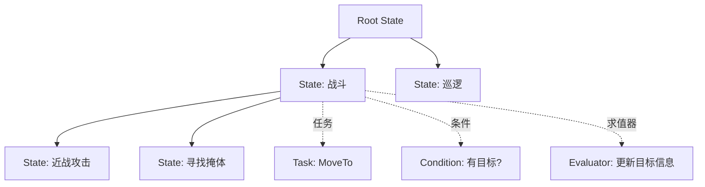
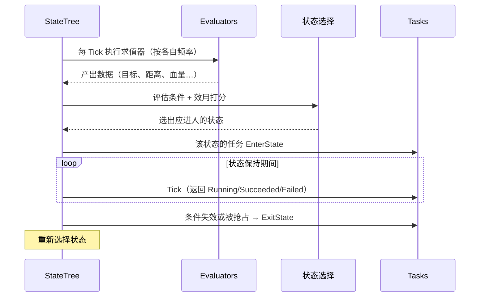

# 状态树

**状态树（StateTree）** 是 UE5 引入的 **数据驱动逻辑框架**，把 **层次化状态机**、**条件 / 效用选择（Utility）** 与 **可复用任务组件** 结合在一起，用于编写 AI 决策与各类状态逻辑，被视为"行为树的下一代 / 补充方案"

!!! info "一句话总结"

    状态树 = **层次化的状态选择**：每帧由求值器（Evaluator）采集数据 → 用条件（Condition）与效用（Consideration）**选出该进入哪个状态** → 执行绑定在该状态上的任务（Task）；数据通过 **参数绑定（Property Binding）** 与外部对象相连，而不是靠黑板



## 1 状态树 vs 行为树

| 维度 | 行为树（Behavior Tree） | 状态树（StateTree） |
| --- | --- | --- |
| 核心模型 | 树的 **执行流**（Sequence/Selector 逐层下发） | 树的 **状态选择**（选中一个状态并保持） |
| 数据 | **黑板（Blackboard）** 存键值 | **参数 + 属性绑定**（绑定到 Actor/组件属性） |
| 决策方式 | 优先级 + 条件 | 优先级 + 条件 + **效用打分（Utility）** |
| 复用 | 任务是节点 | 任务/条件/求值器是 **可复用组件**，可跨树共享 |
| 适用 | 经典 AI 行为流 | AI、游戏流程、UI、角色状态等 **通用状态逻辑** |
| 成熟度 | 非常成熟、资料多 | UE5 新体系，5.3 后趋于稳定，Lyra 用它驱动 Bot AI |

!!! note "不是替代关系，而是场景不同"

    行为树擅长"每帧从根下发一个行为序列"；状态树擅长"在许多候选状态中，依数据选出最合适的一个并保持它"。复杂 AI 中两者都能用，新项目可优先考虑 StateTree

## 2 核心概念

### 2.1 States（状态）

- 树形层次：一个状态可包含 **子状态**
- 进入父状态后，引擎会在其 **子状态中做选择**（按顺序/条件/效用），形成"层次化的状态选择"
- 状态本身不写逻辑，只是"一组任务 + 条件 + 过渡"的容器

### 2.2 Tasks（任务）

- 绑定在状态上，是 **真正干活** 的节点组件
- 生命周期三段式：

| 阶段 | 时机 |
| --- | --- |
| `EnterState` | 状态被进入时（启动逻辑、发起移动） |
| `Tick` | 状态持续期间每帧（返回"进行中/成功/失败"） |
| `ExitState` | 状态退出/被中断时（清理、停止） |

- 任务若需要多帧完成，返回 `Running`，完成后通过完成机制通知（`FinishTask`）

### 2.3 Conditions（条件）

- 决定"这个状态/过渡 **能否** 发生"
- 读取求值器提供的数据（如"目标是否有效""血量是否低于 30%"）

### 2.4 Considerations / Utility（考虑项 / 效用）

- 当 **多个状态都满足条件** 时，用考虑项给它们 **打分**，选最高分
- 这就是 Utility AI 的落地方式：血量低 → 逃跑得分高；弹夹满 → 进攻得分高

### 2.5 Evaluators（求值器）

- 类似行为树的"服务"：**周期性执行、产出数据** 供条件与任务使用
- 例如"每 0.25s 查询最近敌人，写入输出参数"
- 可配置 Tick 频率，避免每帧开销

### 2.6 Transitions（过渡）

- 状态之间的显式切换规则（带触发条件与优先级）
- 触发源包括：`On Tick`、`On Event`（显式发事件）、任务完成（Succeeded / Failed）

### 2.7 Parameters 与数据绑定

- 状态树通过 **Property Binding（属性绑定）** 把外部数据接进来：
  - **Context Actor / Context Object**（如 AIController、Pawn）
  - **External Data**（外部数据源，例如黑板、感知组件）
- 节点（任务/条件/求值器）声明自己需要的参数，编辑器里把它们绑定到外部属性

!!! info "与行为树最大的差异：没有黑板"

    行为树靠黑板存"共享变量"，读写都要经过黑板键；状态树靠 **属性绑定** 直接读写对象上的属性，**数据类型安全、可引用检查**，也便于把逻辑做成可复用组件

## 3 执行机制



关键点：

1. **每帧重新评估选择**：条件/效用变化会立刻导致状态切换（抢占式）
2. **状态是"保持"的**：进入后持续运行其任务，直到完成、失败或被更高优先级抢占
3. **数据先于决策**：求值器提供数据 → 条件判断 → 选择状态 → 执行任务

## 4 一个例子：守卫 AI

```text
Root
└─ Selector（按顺序 / 效用选择）
   ├─ State: 战斗
   │   ├─ Condition: TargetActor 有效 且 距离 < 2000
   │   ├─ Task: RotateToFace(TargetActor)
   │   ├─ Task: MoveTo(KeepDistance)
   │   └─ Children
   │       ├─ State: 射击   Condition: 有视线 → Task: Fire
   │       └─ State: 追击   Task: MoveTo(TargetActor)
   └─ State: 巡逻
       ├─ Task: MoveTo(PatrolPoint)
       └─ Task: Wait(2s)
```

- `Evaluator` 每 0.25s 更新"最近敌人"与"是否有视线"
- 一旦 `TargetActor` 有效，战斗状态立刻 **抢占** 巡逻（条件优先级更高）
- 战斗中在"射击 / 追击"两个子状态间按条件与效用切换

## 5 在工程中使用

### 5.1 运行状态树

状态树通过 **`UStateTreeComponent`** 运行（挂在任意 Actor 上，AI 可用 `UStateTreeAIComponent`）：

```cpp
// 在 AIController 或 Actor 上
UStateTreeComponent* STComp = FindComponentByClass<UStateTreeComponent>();
STComp->SetStateTree(MyStateTreeAsset);
STComp->StartLogic();      // 开始运行（也可配置自动开始）
```

### 5.2 自定义节点

| 要扩展 | 蓝图基类 | C++ 基类 |
| --- | --- | --- |
| 任务 | `StateTreeTaskBlueprintBase` | `FStateTreeTaskBase` / `FStateTreeTaskCommonBase` |
| 条件 | `StateTreeConditionBlueprintBase` | `FStateTreeConditionBase` |
| 求值器 | `StateTreeEvaluatorBlueprintBase` | `FStateTreeEvaluatorBase` |

C++ 任务示意（注意是 `USTRUCT`，可携带实例数据）：

```cpp
USTRUCT()
struct FStateTreeTask_MoveTo : public FStateTreeTaskCommonBase
{
    GENERATED_BODY()

    virtual EStateTreeRunStatus EnterState(FStateTreeExecutionContext& Context,
        const FStateTreeTransitionResult& Transition) const override;

    virtual EStateTreeRunStatus Tick(FStateTreeExecutionContext& Context,
        const float DeltaTime) const override;

    virtual void ExitState(FStateTreeExecutionContext& Context,
        const FStateTreeTransitionResult& Transition) const override;
};
```

## 6 与其它系统配合

| 系统 | 配合方式 |
| --- | --- |
| **AI Perception** | 通过 External Data / 绑定把感知结果接进状态树做条件判断 |
| **EQS** | 查询结果作为参数输入，驱动"找掩体/找射击点"任务 |
| **Gameplay Ability System** | Lyra 式做法：StateTree 决策"何时用哪个技能"，GAS 负责技能执行 |
| **黑板（可选）** | 需要沿用行为树数据时，可把黑板作为 External Data 接入 |

## 7 调试

- **StateTree Debugger**：查看当前执行状态、状态切换历史、条件与考虑项的求值结果
- 可观察"为什么没进某个状态"（条件不满足 / 得分不够）——这是状态树相对行为树更易排查的方面

## 8 常见坑与最佳实践

!!! warning "容易踩的坑"

    1. **属性绑定漏接**：节点参数没绑定到外部数据 → 运行时报错/取到默认值
    2. **求值器频率过高**：每帧查询寻路/感知会造成开销，按需设置频率
    3. **条件与考虑项职责混用**：硬条件用 Condition（不满足就绝不进入），偏好用 Consideration（打分比较）
    4. **忘记在 ExitState 清理**：中断后遗留移动/计时器/特效，会导致状态错乱
    5. **状态粒度太细**：状态过碎会让选择逻辑难读，适度合并

!!! info "最佳实践"

    1. **数据归求值器、判断归条件、动作归任务**，三者职责分离
    2. 把常用逻辑做成 **可复用任务组件**（如"MoveTo""Wait""LookAt"），跨树共享
    3. 抢占逻辑用 **状态顺序 + 条件** 表达，比写复杂过渡更易维护
    4. 用调试器验证"选择结果"是否符合预期，别靠猜
