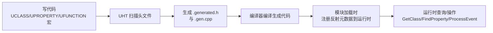
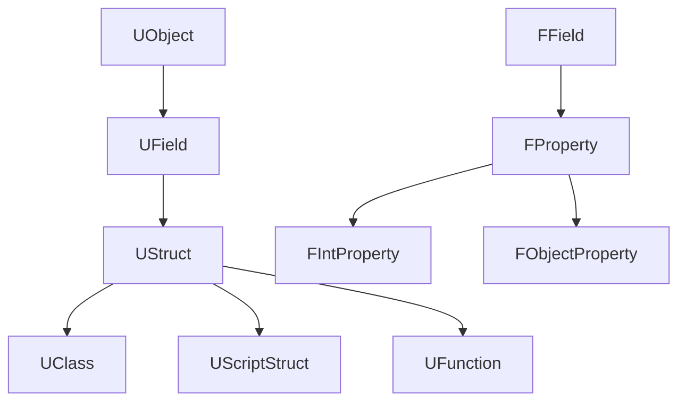

# 反射系统

反射（Reflection）是指程序在 **运行时** 能够"自省"（Introspection）自身结构的能力——即代码可以查询某个对象属于什么类、有哪些属性、哪些函数，甚至动态地创建对象、读写属性、调用函数

C++ 语言本身 **不支持反射**。UE 通过在编译前运行一个名为 **UHT（Unreal Header Tool，Unreal 头文件工具）** 的程序，扫描带有特定宏的代码，自动生成反射元数据，从而在运行时提供了一套"伪反射"机制

!!! info "一句话总结"

    UE 反射系统 = UHT 编译期扫描宏 + 生成的元数据代码 + 运行时查询/操作的 API

游戏开发中大量功能都依赖反射，它是整个 UE 引擎的基石：

| 功能 | 依赖反射的原因 |
| --- | --- |
| **蓝图（Blueprint）** | 蓝图编译器需要动态创建 UObject、读写属性、调用函数，而蓝图脚本并不存在 C++ 源码 |
| **编辑器属性面板** | Details 面板遍历类的属性，根据 `EditAnywhere` 等说明符自动生成编辑 UI |
| **序列化 / 存档** | `SaveGame` 系统、关卡保存通过反射遍历属性自动读写，无需手写每个字段 |
| **垃圾回收（GC）** | GC 通过反射找到对象内引用的其他 UObject，从而追踪可达性 |
| **网络复制** | 标记 `Replicated` 的属性由复制系统通过反射自动同步到客户端 |
| **控制台命令** | `Exec` 函数通过反射按名字查找并调用 |
| **数据驱动** | 配置、DataAsset、蓝图结构体等都能在运行时被统一描述和处理 |



!!! note "UHT 只解析头文件"

    UHT 只扫描 **`.h` 头文件**，因此反射宏（`UCLASS`、`UPROPERTY`、`UFUNCTION` 等）必须写在头文件中，不能写在 `.cpp` 里。同时头文件**最后一行必须包含** `#include "YourClass.generated.h"`

## 1 核心类型

### 1.1 UObject

所有可被反射、可被 GC 管理的对象基类。`UObject` 的实例在运行时都携带自己的 `UClass*`（通过 `GetClass()` 获取），这就是反射的入口。

### 1.2 UClass

描述"某个类的类型信息"的对象—— **类本身在运行时也是一个对象**。它记录类名、父类、属性列表、函数列表、默认对象（CDO）等信息。蓝图生成的类在运行时就是 `UClass` 的实例（`ClassGeneratedBy` 指向蓝图资产）

### 1.3 UStruct

`UClass` 与 `UScriptStruct`（反射结构体）的共同基类。一个 `UStruct` 维护：

- `Children`：直属子字段（属性、函数）的链表
- `SuperStruct`：父结构体（用于继承链）
- `Next`：同一层级的下一个字段

### 1.4 FProperty（属性）

描述一个成员变量的反射信息：名字、类型、在对象中的内存偏移、默认值、说明符等。它是反射中最常用的类型。

!!! info "UE 4.25 的架构变更"

    在 4.25 之前，属性基类 `UProperty` 继承自 `UObject`；4.25 之后重构为 **`FField` 体系**（`FField → FProperty → FIntProperty` 等），属性**不再是 UObject**。这样属性不再受 GC 管理、内存更紧凑、创建更轻量，大幅降低了内存占用和 GC 压力。函数 `UFunction` 仍然继承自 `UObject`。

常见的属性反射类型对应关系：

| C++ 类型 | 反射类型 |
| --- | --- |
| `int32` | `FIntProperty` |
| `float` | `FFloatProperty` |
| `bool` | `FBoolProperty` |
| `FString` | `FStrProperty` |
| `FName` | `FNameProperty` |
| `FText` | `FTextProperty` |
| `TArray<T>` | `FArrayProperty` |
| `TMap<K,V>` | `FMapProperty` |
| `TSet<T>` | `FSetProperty` |
| `UObject*` | `FObjectProperty` |
| `TSubclassOf<UClass>` | `FClassProperty` / `FSoftClassProperty` |
| 结构体（`USTRUCT`） | `FStructProperty` |
| 委托 | `FDelegateProperty` / `FMulticastDelegateProperty` |

### 1.5 UFunction（函数）

描述一个成员函数的反射信息：函数名、参数列表、返回值、`Native` 函数指针、标志位（`BlueprintCallable`、`Exec`、`Server` 等）。蓝图节点、RPC 调用都建立在它之上。

## 2 反射宏

### 2.1 UCLASS（类）

```cpp
UCLASS(Blueprintable, BlueprintType)
class UMyClass : public UObject
{
    GENERATED_BODY()
};
```

常见说明符：`Blueprintable`、`BlueprintType`、`Abstract`、`EditInlineNew`、`Config`、`Transient`、`NotBlueprintable`、`ClassGroup`、`MinimalAPI` 等。

!!! warning "模板类不能被 UCLASS"

    泛型（模板）C++ 类无法做类反射，必须用具体类型或宏展开生成具体类。

### 2.2 USTRUCT / UENUM（结构体 / 枚举）

```cpp
USTRUCT(BlueprintType)
struct FMyStruct
{
    GENERATED_BODY()

    UPROPERTY(EditAnywhere)
    int32 Value;
};

UENUM(BlueprintType)
enum class EMyEnum : uint8
{
    First,
    Second
};
```

### 2.3 UPROPERTY（成员变量）

```cpp
UCLASS()
class UMyClass : public UObject
{
    GENERATED_BODY()

    // 可在编辑器/蓝图读写
    UPROPERTY(EditAnywhere, BlueprintReadWrite, Category = "Stats")
    float Health;

    // 仅蓝图可读
    UPROPERTY(BlueprintReadOnly, VisibleAnywhere)
    int32 MaxHealth;

    // 不参与序列化、不保存
    UPROPERTY(Transient)
    float TempValue;

    // 网络复制
    UPROPERTY(Replicated)
    FVector Location;
};
```

常见说明符：`EditAnywhere`、`EditDefaultsOnly`、`EditInstanceOnly`、`VisibleAnywhere`、`BlueprintReadWrite`、`BlueprintReadOnly`、`Category`、`Transient`、`SaveGame`、`Config`、`Replicated`、`ReplicatedUsing`、`AdvancedDisplay`、`Instanced`、`Meta` 等。

### 2.4 UFUNCTION（成员函数）

```cpp
UCLASS()
class UMyClass : public UObject
{
    GENERATED_BODY()

    // 可在蓝图调用
    UFUNCTION(BlueprintCallable, Category = "Action")
    void DoSomething();

    // 纯函数（无副作用，蓝图里可作连线值）
    UFUNCTION(BlueprintPure)
    float GetHealth() const;

    // 蓝图实现事件
    UFUNCTION(BlueprintImplementableEvent)
    void OnKilled();

    // C++ 有默认实现，蓝图可覆盖
    UFUNCTION(BlueprintNativeEvent)
    void OnHit();

    // 控制台命令
    UFUNCTION(Exec)
    void MyCommand(FString Args);

    // RPC
    UFUNCTION(Server, Reliable)
    void ServerFire();
};
```

### 2.5 UINTERFACE / UDELEGATE

```cpp
UINTERFACE(MinimalAPI, Blueprintable)
class UMyInterface : public UInterface
{
    GENERATED_BODY()
};

class IMyInterface
{
    GENERATED_BODY()
public:
    virtual void DoThing() = 0;
};
```

委托用 `DECLARE_DYNAMIC_MULTICAST_DELEGATE`、`UDELET` 系列宏声明后即可被反射（可在蓝图绑定）

### 2.6 UMETA（元数据）

`meta` 用来附加编辑器提示、工具信息：

```cpp
UPROPERTY(EditAnywhere, meta = (DisplayName = "生命值", ClampMin = "0", ClampMax = "999"))
float Health;
```

## 3 UHT 生成的代码

每个带反射宏的类会生成两份文件：

!!! info ".generated.h"

    被 `GENERATED_BODY()` 宏展开引用。包含 `StaticClass()` 声明、`GetLifetimeReplicatedProps` 等 RPC 声明、访问成员内部辅助、`F...` 的类型相关声明等。

!!! info ".gen.cpp"

    包含类型的"构造器"函数（如 `Z_Construct_UClass_UMyClass`）、每个属性的反射注册代码、以及一个**静态注册对象**：

    ```cpp
    static FCompiledInDefer Z_CompiledInDefer_UClass_UMyClass(
        Z_Construct_UClass_UMyClass,
        &UMyClass::StaticClass,
        TEXT("UMyClass"),
        ...
    );
    ```

    这个静态对象在 **模块加载时** 把类的构造器指针登记到全局注册表，模块 `StartupModule` 时统一创建对应的 `UClass`。因此只要模块被加载，所有反射类就会自动"上线"。

## 4 反射的运行时对象模型



- 每个 `UObject` 通过 `GetClass()` 拿到自己的 `UClass`
- `UClass` 通过 `SuperStruct` 链指向父类（用于向上查找）
- 属性挂在 `UStruct::Children` 链上，用 `TFieldIterator<FProperty>` 遍历
- `GetDefaultObject()`（CDO）保存类的默认属性值，新对象克隆 CDO 初始化

## 5 在代码中使用反射

**遍历类的属性：**

```cpp
UClass* Class = MyObject->GetClass();
for (TFieldIterator<FProperty> It(Class); It; ++It)
{
    FProperty* Property = *It;
    const FString Name = Property->GetName();
    const FString Type = Property->GetCPPType();
    // 通过偏移读取对象中的实际值
    void* ValuePtr = Property->ContainerPtrToValuePtr<void>(MyObject);
    FString OutValue;
    Property->ExportText_Direct(OutValue, ValuePtr, ValuePtr, MyObject, 0);
    UE_LOG(LogTemp, Log, TEXT("%s (%s) = %s"), *Name, *Type, *OutValue);
}
```

**按名字查找并调用函数：**

```cpp
UFunction* Func = Class->FindFunctionByName(TEXT("DoSomething"));
MyObject->ProcessEvent(Func, nullptr);
```

**带参数的调用：**

```cpp
UFunction* Func = Class->FindFunctionByName(TEXT("AddScore"));
struct { int32 Delta; } Params{ 10 };  // 布局需与函数签名一致
MyObject->ProcessEvent(Func, &Params);
```

**按名字查找对象 / 创建对象：**

```cpp
UClass* Cls = LoadClass<UObject>(nullptr, TEXT("/Game/MyBP.MyBP_C"));
UObject* Instance = NewObject<UObject>(this, Cls);
```

## 6 常见注意事项与坑

!!! warning "头文件规范"

    1. `.generated.h` 必须 **最后** `#include`
    2. 反射宏只能写在头文件里
    3. `UCLASS` / `USTRUCT` / `UENUM` 宏与类型名之间不要加注释或修饰符，避免 UHT 解析失败
    4. 大括号配对要整齐，UHT 的解析对格式有一定敏感度

!!! warning "性能与 GC"

    - 属性用 `FField` 体系后已不再参与 GC；但 `UFunction`、`UClass`、`UObject` 仍受 GC 管理
    - 不要在高频循环里频繁用名字查找属性/函数（会走哈希与字符串比较），尽量缓存 `FProperty*` / `UFunction*`
    - 反射遍历会有一定开销，编辑器工具中使用无妨，运行时热路径要谨慎

!!! info "UE5 相关变化"

    UE5 继续使用 4.25 重构后的 `FField` 属性体系，并强化了 IWYU（包含最小化）规范。反射机制本身与 UE4 基本一致，新增的大多为更高层的特性（如 Chaos、Nanite、Lumen 的编辑器集成），反射底层仍以 `UClass` / `FProperty` / `UFunction` 为核心。
