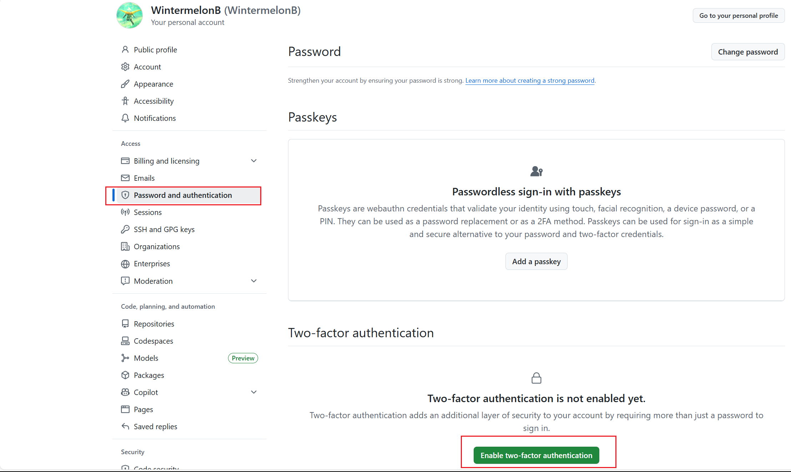
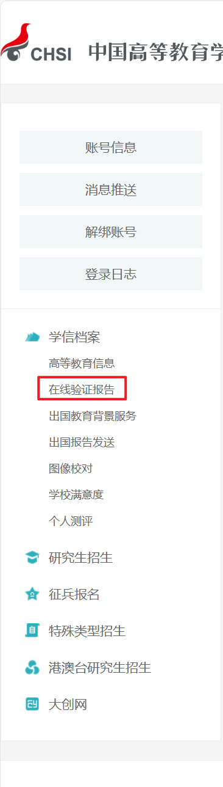
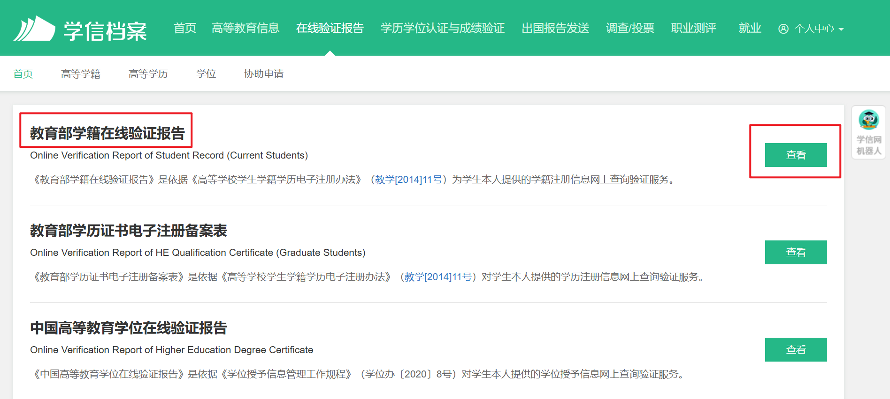
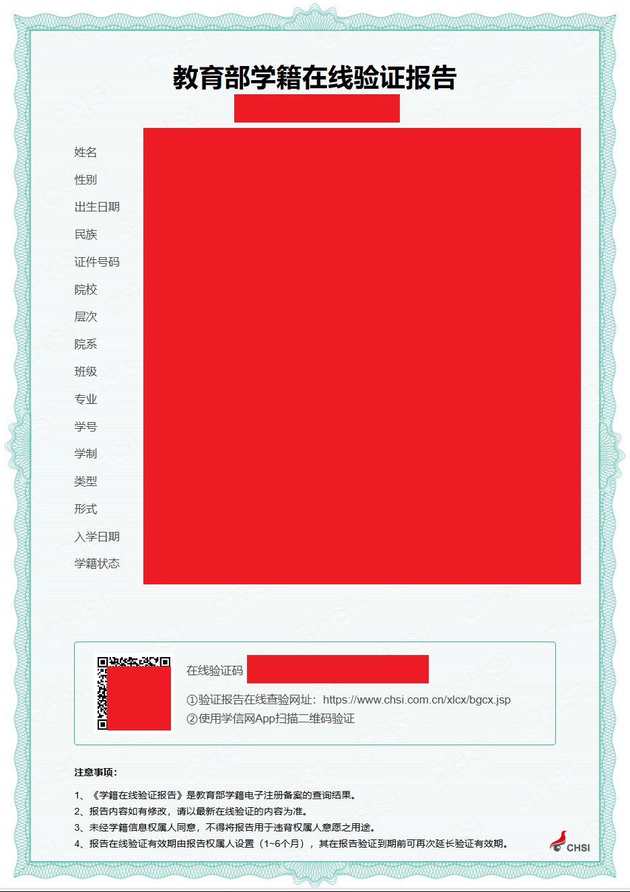
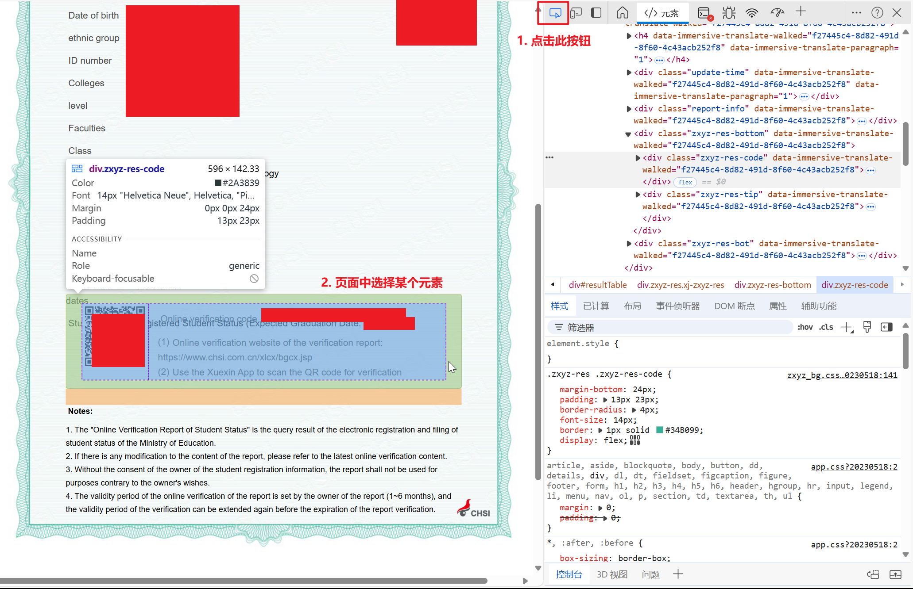
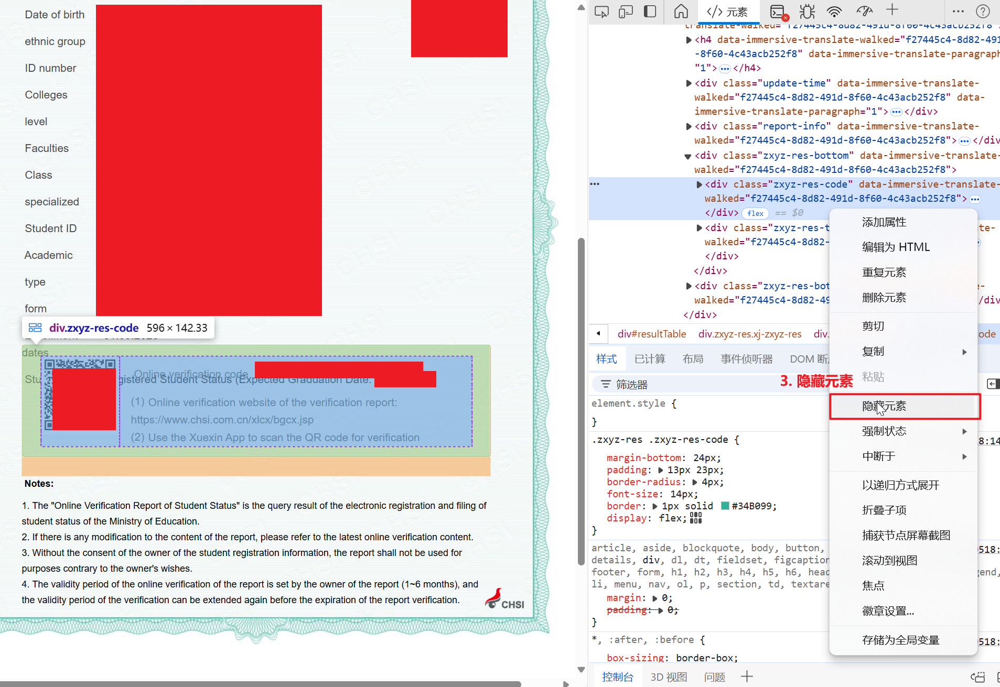

# Github Copilot

<!-- !!! tip "说明"

    此文档正在更新中…… -->

## 申请 github 学生认证

申请 github 学生认证即可免费使用

如何申请 github 学生认证网上有很多教程，本文档暂不涉及

> [Github学生认证及学生包保姆级申请指北](https://github.com/JimmyLing233/Github-Student-Certification-Guide){:target="_blank"}

这里给出一些我在申请的时候总结的小技巧

### 2FA

申请前需启用 github 2FA 验证，打开设置，找到此页面

<figure markdown="span">
    {width="800"}
</figure>

启用 2FA 验证，可以在手机上下载微软的 Authenticator 软件，免费的

> 详细的教程可以自行搜索

### 材料认证

可以使用学信网进行材料认证

登录学信网，点击 ^^在线验证报告^^，选择 ^^教育部学籍在线验证报告^^，申请一份证书即可，建议翻译为英文再提交，可以使用浏览器插件进行翻译

<figure markdown="span">
    {width="400"}
</figure>

<figure markdown="span">
    {width="800"}
</figure>

证书样式如下：

<figure markdown="span">
    {width="800"}
</figure>

使用翻译插件时，翻译后排版可能会出错，可以 F12 打开开发者工具，==通过隐藏某些重叠的元素并灵活运用截图软件，自己手工拼贴出一份完整的英文证书==

> 截图软件推荐：Snipaste（开源免费）

<figure markdown="span">
    {width="800"}
</figure>

<figure markdown="span">
    {width="800"}
</figure>