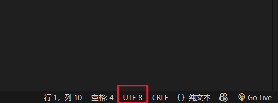
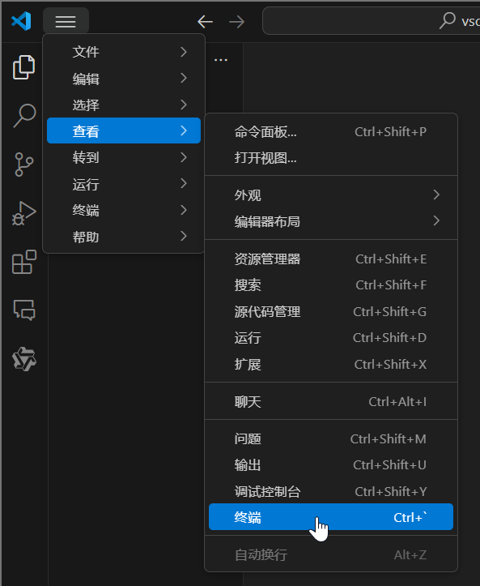

# VS Code

!!! info "AI 介绍"

    Visual Studio Code（简称 VS Code）是一款由微软开发的免费源代码编辑器，支持多种编程语言，并且可以在不同的操作系统上运行，包括 Windows、macOS 和 Linux。VS Code 以其轻量级但功能强大的特性而受到开发者们的喜爱，它结合了现代编辑器的简洁界面与传统 IDE 的强大功能

    主要特点包括：
    
    - **跨平台**：能够在多个主流操作系统上使用
    - **内置 Git 支持**：可以直接在编辑器中进行版本控制操作
    - **智能感知**：根据上下文提供代码补全建议
    - **调试工具**：内置了交互式调试功能
    - **任务自动化**：可以通过配置文件来定义和执行构建任务
    - **扩展性**：拥有庞大的插件市场，允许用户安装各种插件来增加额外的功能，如主题、调试工具、附加语言支持等
    - **多语言支持**：原生支持多种编程语言，同时通过插件可以扩展到更多语言
    - **集成终端**：直接在编辑器内打开命令行接口
    - **实时协作**：支持多人在线协同编辑同一份文档（需通过Live Share插件）
    
    适用场景：
    
    - **Web 开发**：非常适合 HTML, CSS, JavaScript 等前端技术栈
    - **后端开发**：对于 Python, Java, C#, Go 等多种后端语言也提供了良好的支持
    - **云开发**：Azure Functions, AWS Lambda 等功能的开发
    - **移动应用开发**：配合相应的工具链，也可用于 iOS 或 Android 应用开发
    - **游戏开发**：适用于 Unity 等游戏引擎相关的脚本编写
    
    总之，VS Code 是一个非常灵活且高效的开发工具，适合不同类型的开发者使用。由于其高度可定制性和丰富的社区资源，成为了许多程序员日常工作的首选编辑器之一

## 1 下载和安装

!!! info "说明"

    本文档使用 Windows 系统进行演示

软件下载：[Visual Studio Code](https://code.visualstudio.com/){:target="_blank"}

<figure markdown="span">
  { width="600" }
</figure>

点击 Download for Windows 按钮

<figure markdown="span">
  { width="300" }
</figure>

双击运行下载的文件

<figure markdown="span">
  { width="600" }
</figure>

选择 ^^我同意此协议^^，点击下一步

<figure markdown="span">
  { width="600" }
</figure>

选择安装位置，==建议安装在非 C 盘目录下==。选择完成后，点击 Next

!!! info "说明"

    本节使用 Windows 虚拟机进行演示，就不更改安装位置了

<figure markdown="span">
  { width="600" }
</figure>

保持默认，点击下一步

<figure markdown="span">
  { width="600" }
</figure>

- [x] 创建桌面快捷方式：可以勾选
- [x] 将“通过 Code 打开”操作添加到 Windows 资源管理器文件上下文菜单：建议勾选，这样可以很方便的使用 VS Code 打开文件
- [x] 将“通过 Code 打开”操作添加到 Windows 资源管理器目录上下文菜单：建议勾选，这样可以很方便的使用 VS Code 打开文件夹
- [x] 将 Code 注册为受支持的文件类型的编辑器：保持默认的勾选状态
- [x] 添加到 PATH：保持默认的勾选状态

点击下一步

<figure markdown="span">
  { width="600" }
</figure>

点击安装，等待安装完成

<figure markdown="span">
  { width="600" }
</figure>

若勾选 ^^运行 Visual Studio Code^^，点击完成后会立即启动 VS Code

## 2 面板

打开 VS Code，默认语言是英文，我们先安装汉化扩展

<figure markdown="span">
  { width="600" }
</figure>

在界面左侧找到 ^^扩展^^ 面板，在搜索框中输入 `chinese`，安装插件 ^^Chinese (Simplified) (简体中文) Language Pack^^，点击 Install 按钮进行安装

<figure markdown="span">
  { width="600" }
</figure>

安装完成后，右下角出现提示：是否切换至中文语言并重启，点击此按钮。重启后，VS Code 的语言切换为中文

<figure markdown="span">
  { width="600" }
</figure>

在界面左侧找到 ^^资源管理器^^ 面板，点击 ^^打开文件夹^^，我们打开一个文件夹进行演示

<figure markdown="span">
  { width="600" }
</figure>

比如我新建一个 vscode 文件夹，并选择它打开

### 2.1 资源管理器

资源管理器面板就相当于 Windows 的文件资源管理器，能够进行文件的创建、删除、复制、粘贴、重命名等操作

<figure markdown="span">
  { width="600" }
</figure>

将鼠标移动至资源管理器面板上，上方会出现 4 个按钮，我们先点击第 1 个按钮新建文件

<figure markdown="span">
  { width="600" }
</figure>

输入文件名，比如我们新建一个 `test.txt` 文本文件

!!! tip "提示"

    新建文件时，需要写上文件后缀

在右侧的 ^^编辑^^ 面板中，就会打开此文件，可以进行编辑操作，记得及时保存文件哦，快捷键：++ctrl+s++

<figure markdown="span">
  { width="600" }
</figure>

<figure markdown="span">
  { width="600" }
</figure>

将鼠标移动至资源管理器面板上，点击第 2 个按钮新建文件夹，命名为 `test_folder`

我们在这个新的文件夹中创建 1 个新的文件 `test.txt`，有两种方法

1. 选中 `test_folder` 文件夹，点击上方第 1 个按钮新建文件
2. 右键 `test_folder` 文件夹，选择新建文件

<figure markdown="span">
  { width="600" }
</figure>

之后 `vscode` 文件夹内部布局如下

<figure markdown="span">
  { width="600" }
</figure>

同理，可以在某个文件夹下新建文件夹，和 Windows 文件资源管理器的操作类似

这时，使用 Windows 文件资源管理器打开 `vscode` 文件夹，你会发现里面的东西和 VS Code 中的一模一样，在 VS Code 中操作文件就是在操作电脑上的文件

> 感觉我在说废话，但我认为有必要解释清楚这一点，因为可能有些同学没有“编辑器”这一概念

!!! question "为什么你的图标和我的不一样"

    因为我安装了图标美化扩展，下文会介绍

### 2.2 编辑

在编辑面板中，能够对文件进行编辑操作，什么 ++ctrl+c++ ++ctrl+v++ 等等的快捷键都是能够使用的

需要注意的是文件编码格式，一种编码格式的文件使用另一种编码格式打开，可能会出现乱码。在界面右下角会显示当前是使用什么文件编码格式打开文件的

<figure markdown="span">
  { width="500" }
</figure>

我们可以设置默认的文件编码格式，建议设置为 UTF-8 格式

<figure markdown="span">
  { width="600" }
</figure>

打开设置，保证选择的是 ^^用户^^，在搜索框中输入 `encoding`，找到这个设置选项，并设置为 UTF-8

<figure markdown="span">
  { width="600" }
</figure>

!!! question "这个用户和工作区是什么意思"

    下文会介绍

### 2.3 扩展

在扩展面板中，可以下载很多功能强大的扩展

扩展可以随时禁用或卸载

#### 2.3.1 主题/图标

<figure markdown="span">
  { width="600" }
</figure>

打开扩展面板，搜索 `theme` 或者 `icon` 等关键字，可以找到很多主题/图标扩展

我用的是 ^^Material Icon Theme^^，美化资源管理器中图标的扩展

可以一个一个下载尝试，找到自己喜欢的

#### 2.3.2 语言类

当你创建某个语言的文件时，右下角会自动提示你下载对应的插件，一般来说，就已经够用了

比如：新建 `.c` C 语言文件时，会提示下载 ^^C/C++^^ 等插件

> 也可以在网上搜索对应语言的推荐扩展教程

#### 2.3.3 AI 辅助

AI 辅助类插件能够提供代码猜测等功能，例如：

1. ^^GitHub Copilot^^：[申请 Github 学生认证，免费使用 GitHub Copilot](./copilot.md){:target="_blank"}
2. ^^Lingma - Alibaba Cloud AI Coding^^：通义灵码
3. ...

#### 2.3.4 其他

更多请参考：[最新最全 VSCODE 插件推荐（2025版）](https://blog.csdn.net/u011262253/article/details/113879997){:target="_blank"}

!!! tip "提示"

    需要什么就安装什么扩展

### 2.4 终端

<figure markdown="span">
  { width="600" }
</figure>

可以在 VS Code 中直接打开终端，快捷键：++ctrl+grave++

<figure markdown="span">
  { width="600" }
</figure>

### 2.5 搜索

<figure markdown="span">
  { width="600" }
</figure>

搜索面板用来在整个文件夹内搜索字符，包含替换功能

可以设置 ^^包含的文件^^ 和 ^^排除的文件^^

## 3 设置

<figure markdown="span">
  { width="600" }
</figure>

如图所示，可以打开设置面板

一个很有用的设置是：在编辑面板中，按住 ++ctrl++ 键滚动鼠标滚轮，可以放缩字体大小

开启方式：搜索 `zoom`，找到下图所示的设置

<figure markdown="span">
  { width="600" }
</figure>

### 3.1 用户与工作区

<figure markdown="span">
  { width="600" }
</figure>

1. 用户：修改用户设置，会影响全局设置。比如，我们现在在 `vscode` 这个文件夹中 Mouse Wheel Zoom 功能是开启的。当我们打开另外一个文件夹时，该功能仍然可以使用
2. 工作区：修改工作区设置，只会影响当前工作区的设置

具体工作区是如何判定的呢？我们可以切换到工作区，将 Mouse Wheel Zoom 功能开启，会发现资源管理器中自动生成了 `.vscode/settings.json` 文件

<figure markdown="span">
  { width="600" }
</figure>

```json linenums="1" title=".vscode/settings.json"
{
    "editor.mouseWheelZoom": true
}
```

!!! question "`.vscode/settings.json`"

    `.vscode/settings.json` 是一个工作区级别的 **配置文件**，用于定义当前项目（或工作区）的特定设置。它位于项目根目录下的 `.vscode` 文件夹中，专门针对当前项目生效，并会覆盖用户的全局设置

    !!! question "配置文件"

        你可以把配置文件理解成文字版的设置，它和设置的作用一模一样

        比如在设置中打开 Mouse Wheel Zoom 功能，就相当于在配置文件中写上 `"editor.mouseWheelZoom": true` 这么一行

可以这样理解：包含 `.vscode/settings.json` 文件的文件夹，就是一个工作区

如果我们修改这个文件，将 `"editor.mouseWheelZoom": true` 修改为 `"editor.mouseWheelZoom": false`，会发现现在 Mouse Wheel Zoom 功能是无法使用的了。但是如果打开另外别的文件夹，这个功能仍然可以使用

!!! tip "用户与工作区的关系"

    1. 用户设置：

        1. **作用范围**：全局生效，适用于所有 VSCode 打开的项目和文件夹
        2. **配置文件路径**：

            - Windows: `%APPDATA%\Code\User\settings.json`
            - macOS/Linux: `~/.config/Code/User/settings.json`

        3. **用途**：存储个人偏好配置（如主题、字体、快捷键等），优先级最低，会被工作区设置覆盖

    2. 工作区设置：

        1. **作用范围**：仅对当前工作区（打开的文件夹或 `.code-workspace` 多根工作区）生效
        2. **配置文件路径**：项目文件夹下的 `.vscode/settings.json`
        3. **用途**：覆盖用户设置，为特定项目定义独特配置（例如语言特定设置、调试路径等）

了解了用户与工作区的关系，我们就可以为某一个工作区规定独特的配置，而不会干扰其他工作区

!!! tip "用户设置的配置文件"

    也就是全局配置文件，在这里可以打开查看

    <figure markdown="span">
      { width="600" }
    </figure>

    如果你打开了 Mouse Wheel Zoom 功能而且安装了 ^^Material Icon Theme^^ 扩展，那么现在这个文件可能长这样

    ```json linenums="1"
    {
        "editor.mouseWheelZoom": true,
        "workbench.iconTheme": "material-icon-theme",
    }
    ```

    一般来说，你不用理会这个全局配置文件，一些扩展或者设置选项会自动填充配置文件，除非你可能有一些特殊需求，需要编辑全局配置文件

    > 具体如何编辑呢，到时候网上搜索教程就行了

### 3.2 快捷键

<figure markdown="span">
  { width="600" }
</figure>

可以在这里设置快捷键

在这里介绍一些有用的功能和 *我设置的* 对应的快捷键

1. 将选择内容添加到下一个查找匹配项：++ctrl+j++
2. 选择所有找到的查找匹配项：++ctrl+shift+alt+j++
3. 向下复制行：++ctrl+d++
4. 删除行：++ctrl+y++

可以在我们创建的 `test.txt` 文件中试一试这些功能，其中前两个功能解释一下

现在 `test.txt` 文件长这个样子

```txt linenums="1"
你好，VSCode
你好，快捷键
你好，设置
```

我想将这 3 个 “你好” 修改为 “您好”，那前两个功能就很方便了。用鼠标选中第 1 个 “你好”，按一下 ++ctrl+j++，会发现第 2 个 “你好” 也被选中了（同时出现了第 2 个光标），再按一下 ++ctrl+j++，第 3 个 “你好” 也被选中了（同时出现了第 3 个光标）。这个时候输入 “您好”，就可以将这个 3 个 “你好” 一次性全部修改了

<figure markdown="span">
  { width="600" }
</figure>

而 ++ctrl+shift+alt+j++ 则是一次性全选

熟练掌握这个功能可以很快速的修改一些相同的内容

> 当然，有时候 ++ctrl+f++ 搜索替换功能也可以干相同的事情，但是这两个快捷键应该会更快一些

!!! tip "应用"

    在编程中，可能想修改某个变量的名字，那使用 ++ctrl+shift+alt+j++ 这个功能就很方便了

    还有很多使用场景，但是用文字不好描述
