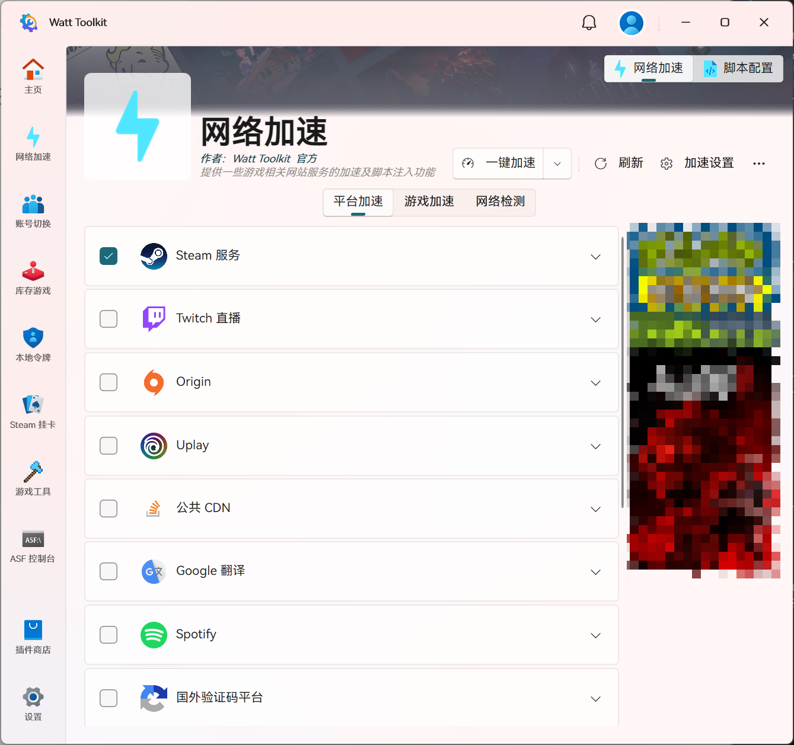
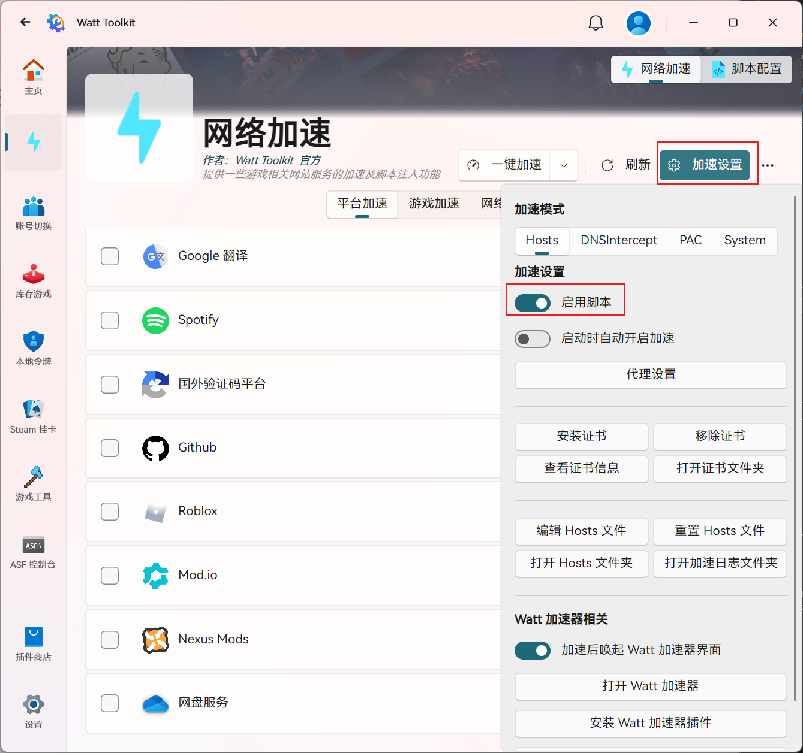
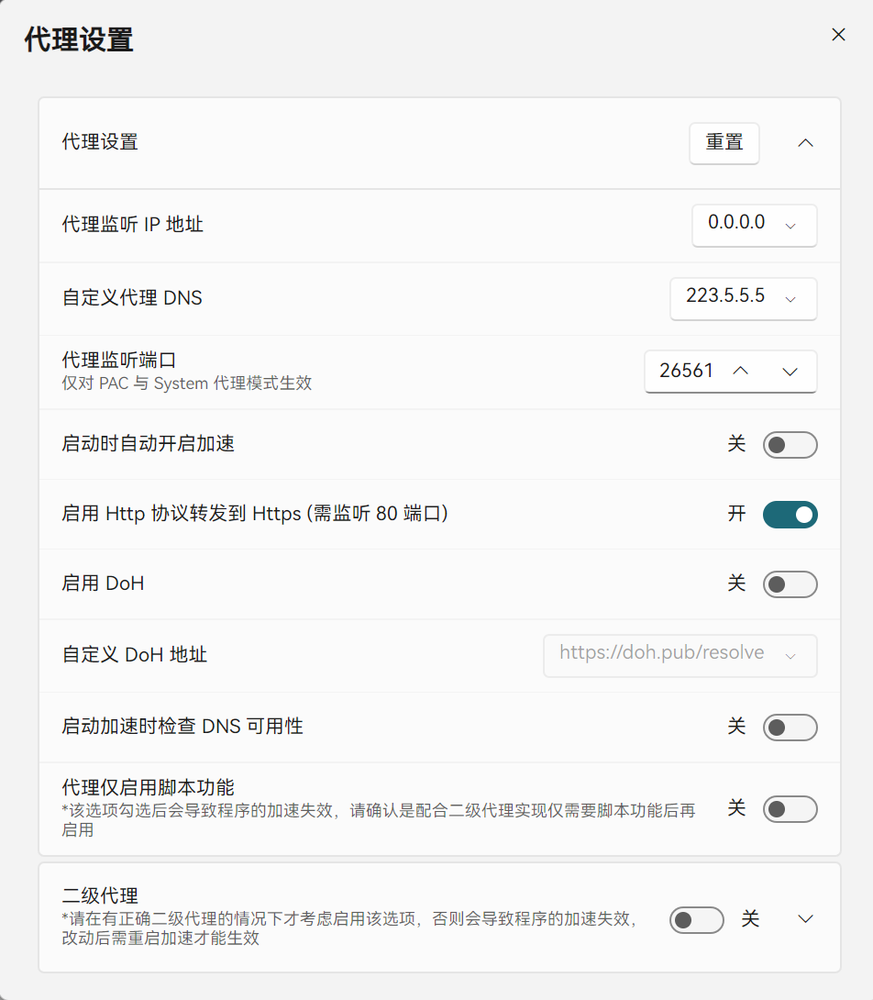
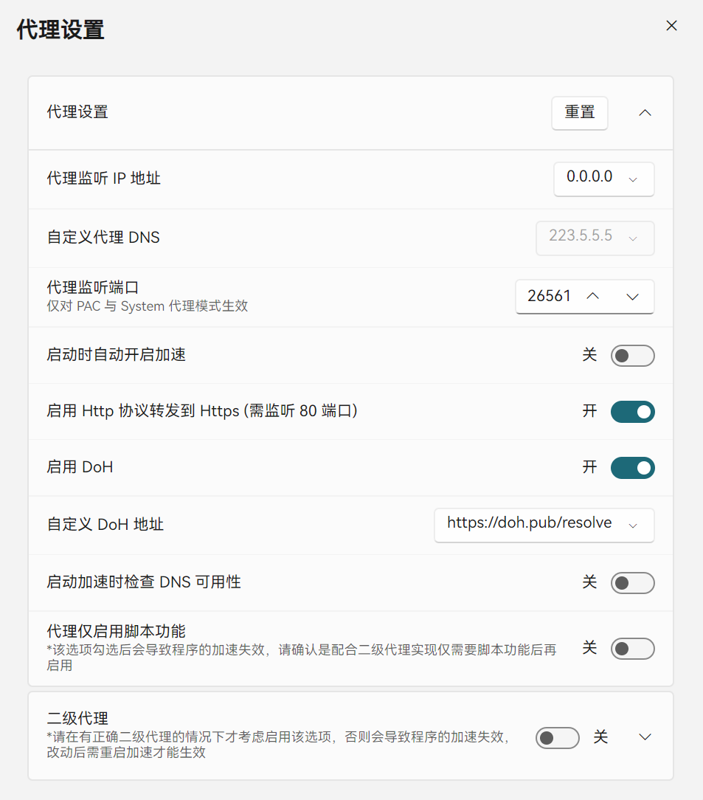

# Watt Toolkit

<!-- !!! tip "说明"

    本文档正在更新中…… -->

!!! info "AI 介绍"

    “Watt Toolkit” 是一个开源的多功能游戏工具箱，原名为 **“Steam++”**，由 **SteamPP** 团队开发。它主要用于优化 Steam、Epic、Ubisoft 等游戏平台的网络连接，并提供一系列实用的游戏辅助功能
    
    **主要功能**：
    
    1. **网络加速**  
    
       - 支持 Steam、Epic、Origin、Uplay 等平台的社区、商店、好友系统加速，解决连接不稳定或加载慢的问题
       - 提供本地反代（Hosts 修改）和代理加速功能
    
    2. **脚本管理**：支持安装和管理 **Userscript**（用户脚本），类似于 Tampermonkey，可用于增强网页功能或自动完成任务
    3. **账号切换**：方便快速切换多个 Steam 账号，无需重复输入密码
    4. **游戏工具**：提供强制游戏窗口化、帧率显示、存档管理等功能
    5. **其他实用功能**：包括 Steam 游戏成就解锁（需谨慎使用）、游戏库存管理、本地令牌管理等
    
    **适用平台**：
    
    - **Windows**（主要支持）
    - **macOS**（部分功能可能有限）
    - **Linux**（通过兼容层运行）
    
    **注意事项**：
    
    - 使用网络加速功能时，需确保遵守平台的服务条款，避免滥用
    - 部分功能（如成就解锁）可能涉及风险，建议谨慎使用

软件下载：[瓦特工具箱(Steam++官网) - Watt Toolkit](https://steampp.net/){:target="_blank"}

> 我只知道怎么用，但是不知道为什么要这样做 😂

<figure markdown="span">
  { width="600" }
</figure>

在网络加速这里可以选择各种平台进行加速，包括 Steam、Github、OneDrive 等等

加速设置里面打开 ^^启用脚本^^，然后点击 ^^代理设置^^

<figure markdown="span">
  { width="600" }
</figure>

有两种加速方式

**1.使用自定义代理 DNS**

!!! info "什么是 DNS"

    我们平时访问什么网站，通常会记住它们的 **域名**（如 `www.baidu.com`）。但计算机之间是通过 **IP 地址**（如 `223.109.82.16`）进行通信的。那么 DNS 服务就是将我们记住的域名转换为计算机可识别的 IP 地址，从而实现计算机之间的通信

设置如下：

<figure markdown="span">
  { width="600" }
</figure>

其中 ^^自定义代理 DNS^^ 可以自行切换。如果启用加速以后，相关网站依旧连接不了，就可以尝试切换其他的代理 DNS，或者使用第 2 种方法

**2.启用 DoH**

!!! info "什么是 DoH"

    DoH（DNS over HTTPS）是一种通过 HTTPS 协议加密 DNS 查询的技术，旨在保护用户的 DNS 请求隐私，防止被窃听或篡改

    简单理解就是在 DNS 的基础上，还有一个加密手段

设置如下：

<figure markdown="span">
  { width="600" }
</figure>

其中 ^^自定义 DoH 地址^^ 可以自行切换。如果启用加速以后，相关网站依旧连接不了，就可以尝试切换其他的 DoH 地址，或者使用第 1 种方法