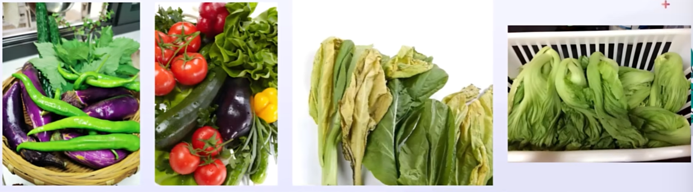
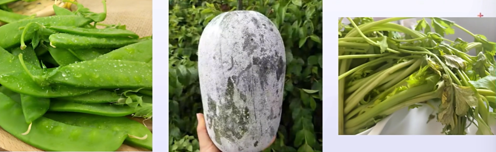
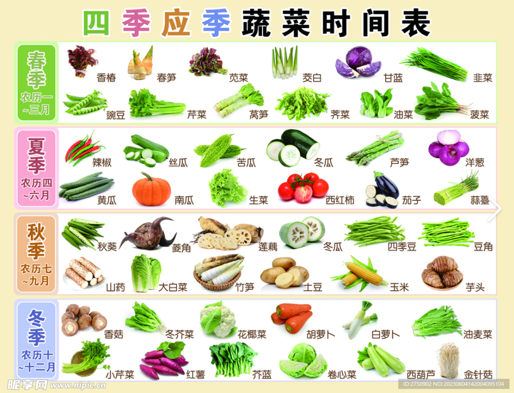

# 做饭的基本逻辑

<!-- !!! tip "说明"

    本文档正在更新中…… -->

!!! info "说明"

    本文档内容建议观看原视频

> 原视频：[我把厨房搬进了教室 上课教做饭](https://www.bilibili.com/video/BV1qzDZYFErq/){:target="_blank"}

来自 ^^方山厨子^^ 老师的话：

> 大学生生活指南之做饭的基本逻辑 
> 解决做饭的畏难问题，不解决好吃问题 
> 希望你学会生活~

## 厨具

**锅：**

1. 炒锅
2. 汤锅
3. 平底锅

炒锅和平底锅可以通用

## 食材

### 蔬菜

观察 **外观**

1. **色泽**：新鲜蔬菜通常颜色鲜艳、有光泽。例如绿叶蔬菜应呈现鲜绿的颜色，没有发黄、枯萎或斑点。像菠菜，叶子应为深绿色且挺拔，没有黄叶或烂叶；西兰花则应是深绿色，花蕾紧密没有发黄或散开的部分
2. **形状**：形状规整，没有畸形或损伤。例如茄子应形状饱满、光滑，没有凹陷或裂口；胡萝卜应粗细均匀，笔直无弯曲，顶部的叶子翠绿新鲜
3. **饱满度**：新鲜蔬菜通常看起来饱满，没有干瘪的现象。例如黄瓜应饱满硬挺，而不是软绵绵的西红柿应圆润饱满，没有皱缩

<figure markdown="span">
    { width="800" }
</figure>

检查 **质地**

1. **脆嫩程度**：用手轻轻捏一下蔬菜，感受其质地。新鲜的蔬菜应该是脆嫩的，而不是软烂的。例如芹菜应该是脆生生的，一折就断；豆芽应该鲜嫩多汁，没有纤维化的感觉
2. **水分含量**：新鲜蔬菜含有充足的水分。可以通过观察蔬菜表面是否有光泽、是否有水滴，以及用手触摸时是否感觉湿润来判断其水分含量。例如白菜叶子应该水灵灵的，而不是干枯的；冬瓜表面应该有一层薄薄的白霜，且感觉沉甸甸的，说明水分充足

<figure markdown="span">
    { width="800" }
</figure>

闻 **气味**

1. 清新的气味：新鲜蔬菜通常具有清新的气味，没有异味。例如香菜应该具有浓郁的香气；青椒应带有淡淡的辣味和清香味。如果蔬菜有刺鼻的气味、霉味或腐臭味，说明不新鲜
2. 特定蔬菜的气味：不同的蔬菜有其独特的气味。例如黄瓜有淡淡的清香味；洋应有辛辣的气味。但如果气味过于浓烈或有腐烂的味道，则可能不新鲜

查看根部和茎叶

1. 根部：对于一些带根的蔬菜，如萝卜、土豆等，观察根部是否新鲜。新鲜的根部应该没有腐烂变色或萎缩的现象。例如胡萝卜的根部应是白色或淡黄色，没有发黑或变软的部分
2. 茎叶：对于有茎叶的蔬菜，如白菜、芹菜等，检查茎叶是否新鲜。叶子应该翠绿挺拔，没有黄叶、烂叶或虫咬的痕迹。茎部应硬挺，没有变软或变色的现象。例如非菜的叶子应是鲜绿色，没有黄叶或干枯的部分，茎部应粗壮硬挺

!!! tip "小常识"

    1. 发芽的土豆不能吃
    2. 没熟的豆角不能吃

考虑季节和产地

1. 季节因素：选择当季蔬菜通常更加新鲜。当季蔬菜是在自然条件下生长成熟的，口感和营养都更好。例如春季的蔬菜、韭菜，夏季的黄瓜、西红柿，秋季的南瓜、土豆，冬季的白菜、萝卜等
2. 产地因素：了解蔬菜的产地也有助于挑选新鲜蔬菜。一般来说，本地生产的蔬菜更新鲜，因为运输时间短、能保持较好的品质。此外，一些特定地区以生产优质蔬菜而闻名，如山东的大葱、云南的菌类等，可以根据产地来选择新鲜的蔬菜

<figure markdown="span">
    { width="800" }
</figure>

> 图片来源：https://www.nipic.com/show/43782550.html

### 肉类

1. 颜色：新鲜的猪肉通常为淡红色或粉红色，有光泽。如果猪肉颜色过深或发略，可能不新鲜或品质较差。新鲜的牛肉颜色深红，有光泽。如果牛肉颜色发略、发白或有斑点，可能不新鲜或有问题；新鲜羊肉的颜色为鲜红色或粉红色新鲜鸡肉的皮肤呈白色或淡黄色，有光泽
2. 脂肪：脂肪部分应为白色或淡黄色，质地坚实。如果脂肪发黄、松软或有异味，说明牛肉品质不佳
3. 纹理：肉质纹理应清晰，脂肪部分洁白且分布均匀。纹理粗糙或脂肪发黄的猪肉可能品质不佳。牛羊肉的纹理应清晰，肉质紧密。可以观察牛肉的横切面，纹理细腻、均匀的牛肉通常品质较好
4. 弹性：用手指轻轻按压肉，新鲜的肉会迅速回弹，恢复原状。如果按压后留下的凹痕难以恢复说明肉不新鲜
5. 气味：正常肉腥味之外闻到刺鼻的异常气味、臭味就不新鲜新鲜鸡肉的眼睛应明亮、饱满，没有凹陷或浑浊。如果眼睛凹陷、浑浊或有分泌物，说明鸡肉不新鲜

### 调料

#### 盐

1. 基础调味：增加咸味，咸味可以突出其他味道，增强食物的口感和风味
2. 提鲜：适量的盐可以提升食物的鲜味。它能够激活食材中的鲜味物质如氨基酸等，使食物更加美味可口。例如，在饪海鲜、肉类和蔬菜时，加入适量的盐可以让它们的鲜味更加浓郁
3. 调节渗透压：盐可以改变食物的渗透压，影响食材的水分含量和质地在腌制食物时，盐可以使食材脱水，从而延长保存时间。同时，盐还可以使蛋白质凝固，改变食物的口感。例如，在制作咸鸭蛋时，盐的渗透作用使蛋黄变得紧实，口感细腻

#### 糖

1. 增加甜味：糖的主要作用是为食物增添甜味，使菜肴口感更加丰富。甜味可以缓和酸味、辣味等刺激性味道，使菜肴更加和谐。例如，在糖醋排骨中，糖的甜味与醋的酸味相互搭配，形成独特的风味
2. 增色作用：糖在高温下会发生焦糖化反应，产生金黄色至褐色的色泽使食物表面更加诱人。例如，在制作红烧肉时，加入适量的糖可以使肉色红亮，增加食欲
3. 中和味道：糖可以缓和食物中的酸味、苦味和辣味等，使菜肴的味道更加柔和。例如，在制作番茄酱时，加入适量的糖可以中和番茄的酸味，使番茄酱更加美味
4. 促进发酵：在制作面包、馒头等发酵食品时，糖可以为酵母提供养分促进发酵过程，使面团膨胀松软

#### 其他

1. 老抽调色，生抽调味
2. 醋的挥发性强，过早加醋会影响昧道
3. 生姜、葱、蒜、料酒都可去腥，米酒白酒也可去腥
4. 在烹调菜肴时如感太辣可加少许醋，辣味即减少
5. 在炖肉和煮烧牛肉，海带，土豆时加少许醋可使之易熟易烂
6. 干辣椒和葱姜一起放锅内爆香，一般家常菜都可以用
7. 花椒炒菜的时候热油后可以放入油里面防止油沸，增加菜的香味
8. 一般来说，黑胡椒适用于炖、煎、烤肉类。能达到香中带辣、美味醒胃的效果
9. 白胡椒多煲汤胡椒香味稍淡，辣味更浓，能捉出鲜味
10. 淀粉可以用于勾芡、挂糊和上浆 (1)

1. 在切好的原料下锅之前，给其表面挂上一层浆或糊之类的保护，这一处理过程叫上浆或挂糊（稀者为浆，稠者为糊） 上浆多用于滑炒，如鱼香肉丝、滑蛋虾仁、滑鸡煲、滑牛肉等 挂糊多用于油炸，如干炸里脊、干炸小黄鱼等

## 烹饪

热传递是烹饪的重要手段

1. 通过油（传导式）热传递：煎、炒、炸 
   辣椒炒肉，炸鸡
2. 通过水（对流式）热传递：煮、炖、蒸、焯 
   煮饺子，炖牛肉，蒸螃蟹
3. 通过辐射式热传递：烤、微波 
   面包、烤肉等

一般情况下，家常菜的处理要考虑如何让食材均匀受热

!!! tip "小常识"

    西兰花要先焯水，然后再炒

## 备菜

择菜、洗菜、改刀（形状大小均匀）

[学习使用菜刀，观看原视频](https://www.bilibili.com/video/BV1qzDZYFErq/?share_source=copy_web&vd_source=8c8806bf56ee59fe86de67e00d08c354&t=608){:target="_blank"}

### 蔬菜

1. 热锅凉油（猪油味道更佳）：将锅烧热，然后加入适量的食用油。热锅凉油可以避免食材粘锅，同时也能保证烹饪过程中的油温适中
2. 爆香佐料：当油温达到一定程度时，加入蒜末、姜末等调料，用中小火煸炒出香味。爆香调料可以为蔬菜增添风味
3. 放入蔬菜：将切好的蔬菜迅速放入锅中，用大火快速翻炒。大火翻炒可以使蔬菜迅速受热，保持其鲜嫩的口感和色泽
4. 调味：根据个人口味加入适量的盐、糖、生抽、蚝油等调料，翻炒均匀。调味时要注意掌握好调料的用量，避免过咸或过甜（醋或柠檬汁的酸性物质可以防止蔬菜氧化，更鲜艳）
5. 加水焖煮（可选）：对于一些比较难熟的蔬菜，如豆角、胡萝卜等，可以加入少量的水，盖上锅盖焖煮片刻，使蔬菜熟透
6. 出锅

[煎鸡蛋，炒青菜，观看原视频](https://www.bilibili.com/video/BV1qzDZYFErq/?share_source=copy_web&vd_source=8c8806bf56ee59fe86de67e00d08c354&t=793){:target="_blank"}

### 肉类

!!! tip "如何判断肉类是要焯水还是腌制"

    红肉（如牛肉、羊肉、猪肉）：
    
    质地较嫩的部位，如里脊肉、嫩肩肉等，如果想保持其鲜嫩口感，可以选择腌制。腌制可以使肉质更加嫩滑，同时增添风味
    
    带有较多血水、异味较重的部位，如牛腩、猪排骨等，一般建议先焯水。焯水可以去除血水和杂质，减少异味

    ---

    白肉（如鸡肉、鸭肉）：
    
    整鸡、整鸭等，如果用于炖煮或煲汤，可以先焯水，去除血水和杂质，使汤更加清澈。如果是切成小块用于炒制等，可以腌制，增加口感和风味
    
    鸡胸肉、鸡腿肉等，如果肉质较嫩，可以腌制；如果表面有较多血水或异味，可以先焯水

    ---
        
    炖煮、煲汤：一般先焯水，去除血水和杂质，使汤更加清澈，味道更纯正

    ---

    炒制：如果想快速烹饪，保持肉质鲜嫩，可以选择腌制。腌制后的肉在炒制过程中更容易熟，口感也更好如果肉的血水较多或异味较重，也可以先焯水，再进行腌制和炒制，以确保菜肴的口感和品质
    
    ---

    红烧、卤制：通常先焯水，去除血水和杂质，然后再进行腌制和烹饪，这样可以使肉更加入味，色泽也更好
    
#### 焯水

一般步骤：

1. 准备工作：将肉类切成适当大小的块状，用清水冲洗干净，去除表面的杂质和血水
2. 浸泡：将肉类放入清水中浸泡一段时间，有助于去除血水和杂质（注意时间）
3. 冷水下锅：将肉类放入锅中，加入足够的冷水，水面要没过肉类
4. 加入调料：可以加入一些姜片、葱段、料酒等调料，有助于去腥
5. 焯水：将锅放在炉灶上，用大火将水烧开，然后转小火，保持水微沸状态，水时间根据肉类的大小和种类而定，一般需要 3-5 分钟
6. 撤去浮沫：焯水过程中，水面上会产生浮沫，这些浮沫是肉类中的杂质和血水，需要用勺子撒去
7. 捞出肉类：焯水完成后，用漏勺或筷子将肉类捞出，用 **热水** 冲洗干净，去除表面的浮沫和杂质
8. 沥干水分：将肉类捞出，晾在漏勺或用厨房纸中吸干表面的水分

#### 腌制

!!! note "理解肉类的“锁水”"

    肉类中的水分可以使肉在烹饪后口感鲜嫩多汁。当肉中的水分充足时，咀嚼起来不会感觉柴，而且肉中的水分可以让肉更好的吸收味道

    !!! example "豆腐举例"

        <figure markdown="span">
            { width="800" }
        </figure>

        > 左图豆腐放入冰箱前，右图豆腐放入冰箱再拿出来

        豆腐放入冰箱后，里面的水分结冰，把豆腐内部的毛孔撑大了，再把豆腐拿出来，里面的水分就流失了

    为了不让肉类的水分流失，可以用鸡蛋、淀粉和油来锁水

    1. 蛋白质的作用：肉类中的蛋白质在一定条件下可以形成凝胶结构，这种结构能够束缚水分，防止水分流失。例如，在腌制肉类时加入适量的盐，盐可以使肉中的蛋白质发生变性，增强蛋白质的凝胶能力，从而更好地锁住水分。此外，蛋白质还可以通过与水分形成氢键等方式结合水分，增加肉的保水性
    2. 淀粉的作用：淀粉在烹饪过程中会吸收水分并膨胀，形成一种黏稠的糊状物，这种糊状物可以包裹在肉的表面，阻止水分的蒸发和流失。比如在制作肉丸时，加入适量的淀粉可以使肉丸更加嫩滑多汁，因为淀粉在肉丸表面形成了一层保护膜，锁住了肉中的水分
    3. 油脂的作用：在肉类表面涂抹一层油脂可以形成一层隔离层，减少肉与空气的接触从而降低水分的蒸发速度。同时，油脂还可以在烹饪过程中渗入肉的内部，增加肉的滋润度。例如，在煎牛排之前，可以在牛排表面涂抹一层橄榄油，这样可以使牛排在煎制过程中更好地保持水分，同时也能增加牛排的香味

一般步骤：

1. 将切好的肉类放入一个容器中，加入适量的盐、糖、生抽、料酒等基础调料，搅拌均匀
2. 根据个人口味加入可选调料，如姜蒜末、胡椒粉、孜然粉、辣椒粉等，再次搅拌均匀
3. 如果需要加入淀粉，可以将淀粉与少量水混合成淀粉水，然后倒入肉中，搅拌均匀。淀粉水可以使淀粉更加均匀地包裹在肉的表面，使肉更加嫩滑
4. 最后加入适量的食用油，搅拌均匀，防止肉在腌制过程中粘连
5. 将腌制好的肉类放入冰箱冷藏一段时间，让调料更好地渗透到肉中。一般来说腌制时间不宜过长，以免肉中的营养成分流失。腌制时间可以根据肉的大小和厚度以及个人口味进行调整，一般在 15 至 30 分钟左右为宜

[腌制演示，观看原视频](https://www.bilibili.com/video/BV1qzDZYFErq/?share_source=copy_web&vd_source=8c8806bf56ee59fe86de67e00d08c354&t=1115){:target="_blank"}

---

炒肉类公式：

1. 热锅凉油：将锅烧热，然后加入适量的食用油。热锅凉油可以避免肉类粘锅，同时也能保证烹饪过程中的油温适中
2. 滑炒肉类（可选）：如果肉类需要滑炒，可以在油温达到一定程度时，将肉类放入锅中，用中火快速翻炒至变色，然后捞出备用。滑炒可以使肉类更加嫩滑，同时也可以去除肉类中的一些味
3. 爆香调料：当油温再次升高时，加入蒜末、姜末、葱段等调料，用中小火煸炒出香味。爆香调料可以为肉类增添风味
4. 放入肉类：将滑炒好的肉类或直接放入锅中的肉类迅速放人锅中，用大火快速翻炒。大火翻炒可以使肉类迅速受热，保持其鲜嫩的口感
5. 调味：根据个人口味加入适量的盐、糖、生抽、老抽、料酒、蚝油等调料，翻炒均匀。调味时要注意拿握好调料的用量，避免过成或过甜
6. 加入配菜（可选）：如果需要，可以加入一些配菜，如蔬菜、菇、豆制品等，与肉类一起翻炒均匀。配菜的加入可以增加菜肴的营养和口感
7. 出锅装盘：当肉类炒熟后，迅速出锅装盘，避免过度烹饪导致肉类变老变硬

[红烧肉，观看原视频](https://www.bilibili.com/video/BV1qzDZYFErq/?share_source=copy_web&vd_source=8c8806bf56ee59fe86de67e00d08c354&t=1205){:target="_blank"}