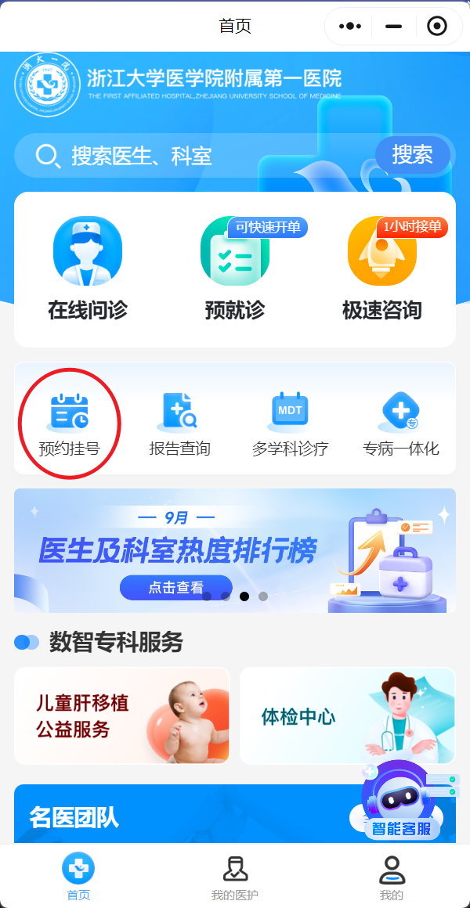
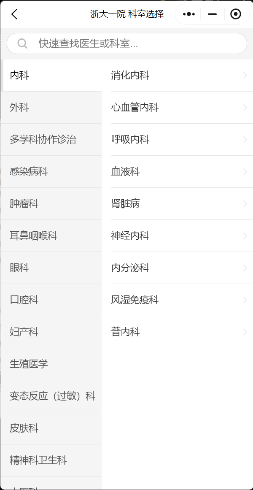
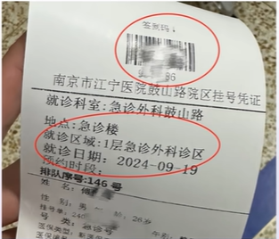

# 医院看病流程

## 1 梳理症状和病史

1. 具体不适的部位、症状表现，包括什么时候开始出现症状
2. 症状具体的特点，如疼痛的程度、发作的频率、是否有加重或缓解的因素
3. 整理既往病史、过敏史、家族病史等信息（一般情况下都没问题，但如果有印象不清楚要和家里确认）

携带身份证或电子医保卡

!!! tip "医保"

    见 [医保](./medical_insurance.md)

## 2 挂号

### 2.1 线上挂号
  
绝大多数医院都可以通过微信搜索“医院名字”直接进行线上挂号

=== "微信"

    例如搜索 ^^浙大一院互联网医院^^ 小程序：

    <figure markdown="span">
        { width="200" }
    </figure>

线上挂号相比较线下能够更好挂指定医生的号（但你得非常了解自己需要挂哪个科室）

<figure markdown="span">
    { width="200" }
</figure>

### 2.2 线下挂号

不清楚挂什么科室，可以在窗口挂号处或导医台说明哪里不适，询问应该挂什么科

挂号成功已缴挂号费，普通门诊费用在几元至几十元不等，专家门诊相对高一些

#### 窗口挂号

注意区分收费窗口和挂号窗口

#### 自助机器挂号

#### 导医台

询问导医台工作人员

## 3 诊治

挂号结束后前往前往相应科室诊治，一般情况下挂号单上会显示科室位置。在科室门口需 **签到** 排队，等待叫号。

- 线上挂号的出示预约挂号二维码、条形码、身份证
- 线下挂号可以使用挂号单

<figure markdown="span">
    { width="200" }
</figure>

### 诊治过程

和医生详细描述症状，医生诊治（可能会遇到医生正好带着学生的情况，一打开门很多人，不要不好意思 (1) ）

1. 特别是中医，他什么都知道都知道道道道……

## 4 做检查

诊治后可能需要检查，例如验血、拍片子等

拿着医生给的单子前往缴费处缴费，缴费可在窗口也可在机器进行。缴费完成后前往检查科室做检查，检查结果出来后拿着检查报告再次前往诊室，将检查结果拿给医生

## 5 取药

1. 医生诊治，开药
2. 缴费
3. 取药窗口 **签到** 取药
4. 如需输液取药后前往输液室

!!! info "中医取药"

    取药回家自己煎，也可医院代煎，一般需要次日取药

