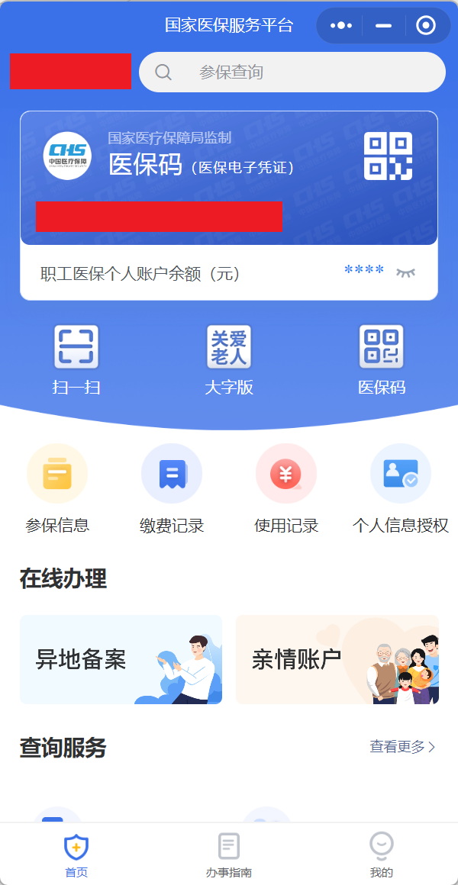
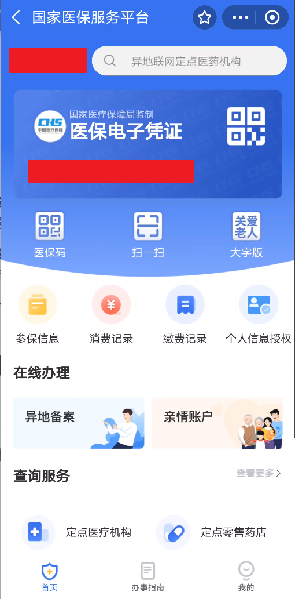
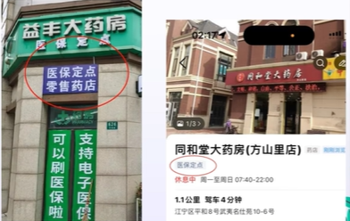
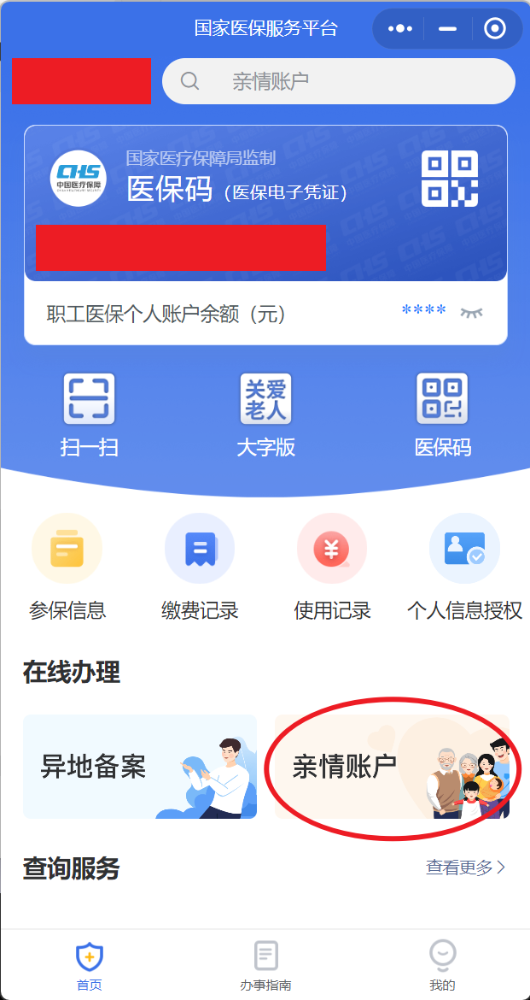
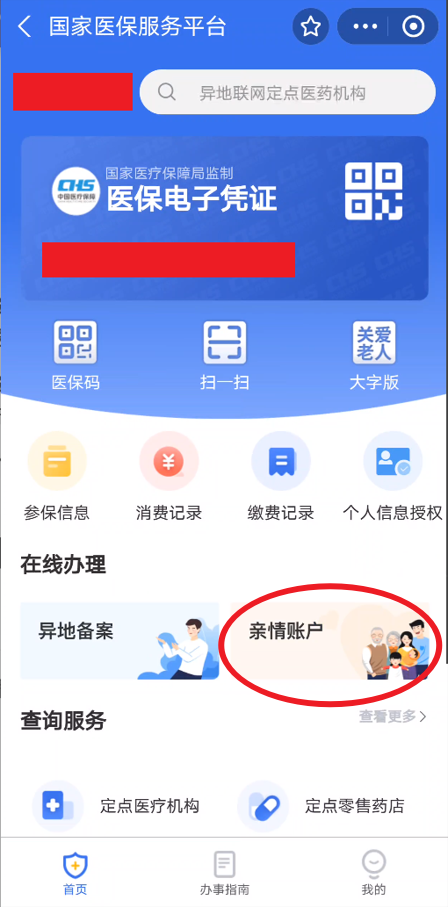
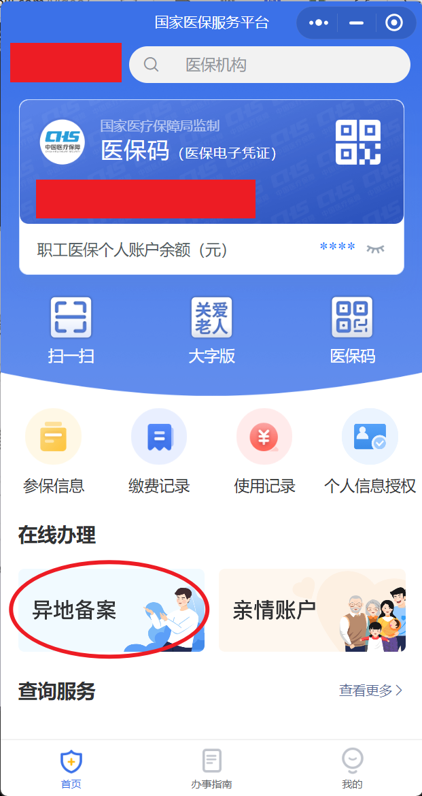
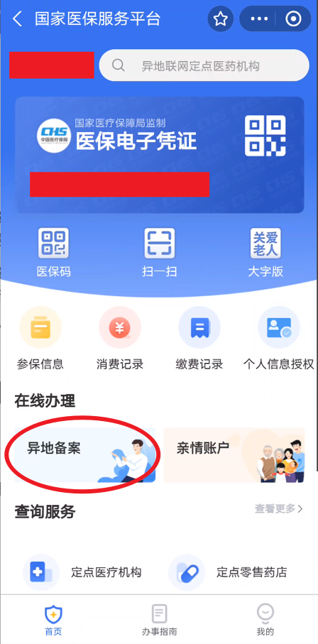

# 医保

<!-- !!! tip "说明"

    此文档正在更新中…… -->

> 原视频：[真的有大学开了《成年人社会常识课》【看病&医保篇】](https://www.bilibili.com/video/BV1eWxneME3Q/){:target="_blank"}

来自 ^^方山厨子^^ 老师的话：

> 没错，是我开的这门课 
> 不知道大家像不像我一样，从小到大没有人教我们如何去生活，如何去认识这个世界…… 
> 只是一直被要求好好学习念书做题，然后一毕业就突然要独自面对这个社会这个世界了，但是很多的社会常识生活技能我们是不知道的。学校以为家庭教，家庭以为学校教……结果就是“不是大学生吗？这都不知道？” 
> 很多人说出社会就知道了，吃过亏就知道了，但吃亏不是老师，吃亏是伤害 
> 我想避免学生受到伤害本身就是老师该做的事情 
> 于是我申请开了这门课 
> 希望你学会的不仅仅是知识， 而是学会获取知识的方法 
> 希望你做知识的管理者 ，而不仅仅是拥有者 
> 但我最希望你明白学习、工作等等等等都只是生活的一部分 
> 希望你学会用自己的方式生活 
> 因为个人的局限性，难免存在错漏，欢迎指正补充

## 1 医保类型

### 1.1 城乡居民基本医疗保险
  
原新农合与城镇居民医疗保险合并而成。主要是面向非正式就业人员、学生以及农村地区的居民。由政府补贴和个人缴费共同构成基金池。可以选择缴或者不缴

#### 缴纳要求

每年个人自行缴纳

#### 面向对象

无正式工作或未就业的城乡居民

#### 报销规则

门诊、住院按照当地规定 **一定比例** 报销，均有 **起付线** 和 **封顶线** ，**年度** 医疗保险金额也有封顶线

???+ example "起付线 - 情形1"

    假设在某地区居民医保起付线为 $500$ 元 
    小明因为咳嗽去社区卫生服务中心看门诊 (1) ，花费了 $300$ 元。由于未达到起付线，这部分费用需小明自己承担，不能通过居民医保报销
    { .annotate }

    1. 门诊按年累计，比如第一次花了 $300$ ，没到起付线， 第二次花了 $300$ ，总共 $600$ ，达到了起付线，可以报上去

???+ example "起付线 - 情形2"

    假设在某地区居民医保起付线为 $500$ 元 
    小红因急性肠胃炎住院，此次住院总费用为 $2000$ 元。在计算医保报销金额时，先扣除起付线 $500$ 元，只有超出起付线的部分（ $2000-500=1500$ 元）才进入居民医保报销范围再根据报销比例进行报销，假如报销比例是 $50\%$ ，那小红报销金额为 $1500 \times 50\% = 750$ 元，自己需要付 $1250$ 元

???+ example "封顶线 - 情形3"

    假设在某地区居民医保起付线为 $500$ 元，封顶线为 $2000$ 元 
    小刚患了一种较为严重的慢性病，一年中多次就医，累计医疗费用达到了 $1800$ 元。在不超过封顶线的情况下，先扣除起付线 $500$ 元，即 $1800 - 500 = 1300$ 元，按 $50\%$ 报销比例计算，报销金额为 $1300 \times 50\% = 650$ 元。小刚自己承担的费用为 $1800 - 650 = 1150$ 元

???+ example "封顶线 - 情形4"

    假设在某地区居民医保起付线为 $500$ 元，封顶线为 $2000$ 元 
    小强不幸患上重大疾病，医疗费用高达 $2500$ 元。由于超过了封顶线 $2000$ 元，那么超出的部分为 $2500 - 2000 = 500$ 元需要小强自己想办法解决。未超出封顶线的部分，先扣除起付线 $500$ 元后为 $2000 - 500 = 1500$ 元按 $50\%$ 报销比例计算，可报销金额为 $1500 \times 50\% = 750$ 元

### 1.2 城镇职工基本医疗保险

主要面向城市中的在职员工和退休人员。个人和雇主共同缴纳保险费，参保人在就医时可以享受一定的报销比例

!!! info "五险一金"

    我们在找工作时，常说的 **五险一金** (1) 其中的医疗保险就属于这一类。企业与你签订劳动关系时，一定要为你缴的
    { .annotate }

    1. 基本养老保险、基本医疗保险、失业保险、工伤保险、生育保险以及住房公积金

#### 缴纳要求

公司每月缴纳

#### 面向对象

企事业单位在职员工

#### 报销规则

门诊、住院按照当地规定 **一定比例** 报销，均有 **起付线** 和 **封顶线** ，**年度** 医保报销金额也有封顶线 **(均高于居民医保)**

!!! info "个人账户"

    - 来源：职工个人缴纳部分（每月工资扣减） + 部分公司缴纳 + 利息收入 (1)
    - 用于支付医保范围内需要个人支付部分的费用，还可用于药店买药及商业保险
    - 专款专用 (2)、积累使用、继承性

1. 像把钱存银行一样，每年会有一定的利息产生
2. 只能用于医疗方面

## 2 医保账户

查看自己的医保账户

=== "微信"

    搜索 ^^国家医保服务平台^^ 小程序，首次使用需实名认证登录 
    <figure markdown="span">
        { width="200" }
    </figure>
    
=== "支付宝"

    搜索 ^^国家医保服务平台^^ 小程序，首次使用需实名认证登录 
    <figure markdown="span">
        { width="200" }
    </figure>

## 3 医保报销

通常，门诊按年累计就诊金额，住院单次就诊金额

### 3.1 报销范围

包括 **药品费** 、**诊疗费** 、**住院费** 等，具体依医保种类和政策而定。需在 **定点医疗机构** 就诊，且医疗项目需 **符合医保目录** 规定

<figure markdown="span">
    { width="300" }
</figure>

### 3.2 使用方法

打开二维码即可使用，在所有缴费环节说明使用医保支付（机器自助缴费也可选择电子医保卡支付）

=== "微信"

    <figure markdown="span">
        { width="200" }
    </figure>

#### 挂号医保报销

线上挂号有时会直接缴费，需要用绑定了医保的就诊卡挂号才能报销，或者无法报销

医院现场刷电子医保缴费时，如果是居民医保需要缴纳个人部分，如果是职工医保会自动从个人账户中扣除需个人缴纳部分

如果发现缴纳的是完全没有报销的金额可能:

1. 年度累计门诊费用未达到起付线
2. 部分地区的挂号费不支持医保报销
3. 部分地区的线上挂号无法报销（尽量现场挂号）（挂号时用医保卡、电子医保身份）

#### 检查买药医保报销

所有缴费环节均出示医保卡或电子医保即可

#### 住院医保报销

住院需要提前预存住院金，住院发生的费用系统会根据医保信息，自行完成报销扣减，非报销部分在预存金中扣除，预存金扣除的钱无法报销，如不在医保报销范围内的检查或用药，剩余的钱出院时进行退款即可

### 3.3 总结

医院挂号尽量选线下

无论什么费用先选医保卡支付，刷不动再个人支付

各地政策不同，需要自行了解当地规则

## 4 亲情账户/家庭共济

如果你是职工医保，个人账户余额自己花不完，可以办理。前提是被供给者也参加医保（目前不够完善，大部分地区只能省内办理）

### 4.1 区别

- 亲情账户：帮家人展示医保码
- 家庭共济：把自己的医保个账额度共济给家人

### 4.2 办理方式

=== "微信"

    <figure markdown="span">
        { width="200" }
    </figure>

=== "支付宝"

    <figure markdown="span">
        { width="200" }
    </figure>

## 5 大学生医保

如果有转学、休学、交换生、应征入伍等情况，如果保留学籍、医保正常在缴的话依旧可以享受大学生医保待遇

大学生使用时分为住院和门诊两部分，在省内医保定点医院住院时，在住院部缴费窗口出示本人的身份证或者电子医保凭证可直接结算

### 5.1 门诊

由参保大学生携带身份证到 **校医院** (1) 进行治疗。发生的医疗费用由门诊统筹基金按一定的比例报销，每学年最高支付有限额。因病情需要确需 **转诊** 的，由校医院的接诊医师开具转诊单并经校医院盖章同意后转往其它医保定点医院就医。转诊后的门诊医疗费用先由患者个人垫付转诊后凭转诊医院的各项票据、转诊单，到校医院缴费窗口进行报销（部分地区可能可以直接使用，需同学们自行了解当地政策）
{ .annotate }

1. 所有的医保需要在定点医院使用，只不过大学生的定点医院就是校医院

若有寒暑假等不在市内无法前往校医院先行治疗的情况，前往医保定点医院进行门诊治疗 (1) ，自行垫付医药费并保存好医疗费用票据、诊断证明、门诊病历、检查化验报告单、门诊收费明细，返校后到校医院缴费窗口进行报销
{ .annotate }

1. 最好办理异地就诊

### 5.2 异地就诊

在外省期间突发急症在当地就近治疗的同学，应在入院之前进行异地就医备案，备案成功后，在当地开通异地结算的医院就医，出院后直接结算

#### 办理方式

=== "微信"

    <figure markdown="span">
        { width="200" }
    </figure>

=== "支付宝"

    <figure markdown="span">
        { width="200" }
    </figure>