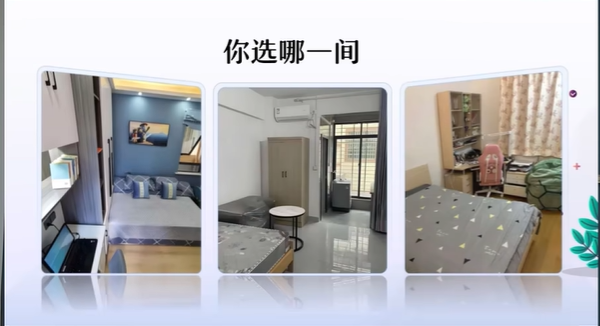
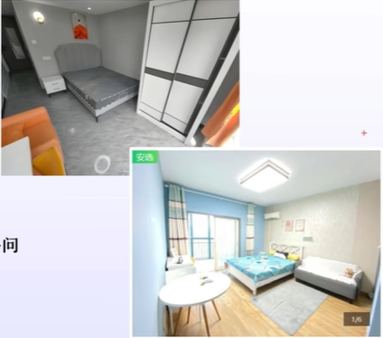
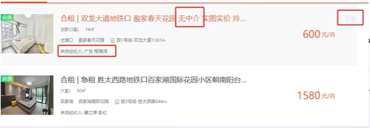
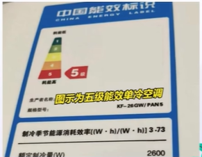

# 租房流程及注意事项

> 原视频：[上课教学生租房](https://www.bilibili.com/video/BV1auC2YvEQR/){:target="_blank"}

来自 ^^方山厨子^^ 老师的话：

> 这节课是《大学生生活指南》的第三节课了 
> 租房是很多大学生朋友刚步入社会的第一道坎，实不相瞒，我也在这道坎上摔了很多次（哭哭TT）可能不够细致准确，但希望能够帮助到你 
> 生活顺利，我陌生的朋友

!!! Question "你选那一间"

    <figure markdown="span">
        { width="400" }
    </figure>

    从左到右分别是A、B、C

    ??? Success "解读"

        选择A和B的，都有雷区，A和B是常见的串串房 (1) ，C是老师的次卧

        > 哈哈哈哈

        如何分辨串串房：

        1. 进门就有刺鼻气味的
        2. 装修风格多为ins、欧美风的
        3. 装修风格不统一、不协调
        4. 家具特别新，膜没撕的
        5. 墙漆墙纸色彩鲜艳，但细节很多问题的

        <figure markdown="span">
            { width="400" }
        </figure>

1. 二房东把房子租过来，利用最便宜的装修材料装修一遍，然后立马组给你，你进去以后就是一个白血病套餐

## 房型

### 普通住宅

**最推荐类型** ，配套齐全、有燃气，民水民电价格低

!!! info "科普"

    1. 居民生活用水： 
    许多城市的居民生活用水水价在 2-3元/立方米 左右 
    例如，有的城市非阶梯水价为 2.2元/立方米 ，有的城市在 2.8元/立方米 。不过部分地区实行阶梯水价制度，不同阶梯水量对应不同的水价，通常用水量基数内价格较低，超出基数后价格会有所上涨

    2. 居民生活用电： 
    一般来说，居民生活用电的基础电价在 0.5元-0.6元/度 。部分地区会根据季节、用电量等因素实行阶梯电价 
    以深圳为例： 
    夏季标准（5月-10月）第一档 0度-260度 的电价为 0.66元/度，第二档 261度-600度 的电价为 0.71元/度，第三档 600度以上 的电价为 0.96元/度 
    非夏季标准（1月-4月、11月-12月）第一档 0度-200度 的电价为 0.66元/度，第二档 201度-400度 的电价为 0.71元/度，第三档 400度以上 的电价为 0.96元/度

### 商住两用（公寓楼）

价格高，商水商电生活成本高，一般无燃气

### 城中村

位置偏，小区质量一般较低，环境比较杂乱

## 合租与整租

### 合租

- 优点：省钱，热闹，不孤单，互相照顾
- 缺点：私密性不够，容易被打扰，物品使用麻烦，公共区域卫生

### 整租

- 优点：完全隐私，自由度高，安全性高
- 缺点：成本较高，容易感到孤独，突发状况可能无人帮助

## 租房前

房子很好，位置很好，价格便宜。满足两点即可，百分百满意的房很难

租房前先确认预算，确认区域

用总收入减去固定支出、储蓄金额和应急资金预留额，剩下的就是可用于租房的预算。

> 老师建议优先考虑通勤方便，通勤时间控制一个小时以内，不然会很痛苦。地铁40分钟，电动车30分钟以内（15-20公里以内）

## 寻找房源

### 线上

各类租房app：自如、链家、wellcce等

综合社交平台：微信、小红书等

搜索关键词“城市+租房”

线上平台多为中介，且信息良莠不齐（中介并不一定意味着不好，但是好不好都有 **中介费** ，中介费一般为半个月或一个月房租）

!!! info "注意"

    即使线上看房，也要找时间线下去看一看，核实一下，不然可能会被骗

!!! example "虚假房源"

    <figure markdown="span">
        { width="500" }
    </figure>

    第一个：标题说“无中介”，但是下方写着“来自经纪人：…… ”，右上角还有个“广告”

    第二个：考虑到具体地理位置等因素，该房价不合理

    距离地铁站可能是直线距离，实际走要走20分钟。获取小区地址后去地图软件确认位置，一般线上就看大致区域和交通是否便捷

### 线下

去线上看的合适小区或单位周边、地铁沿线周边的小区逛。看小区公告栏、问物业、保安。直接走进去逛，会有一些房东把租房信息贴在树上、单车上。找聚集打牌、下棋、唠嗑、跳广场舞的大爷大妈直接问

如果有比较中意的小区群，直接去附近的线下中介问

## 看房

约好房东或中介，一起去看房。外面里面都要看

带个朋友一起，安全且帮你缓冲

### 看外面

附近的配套

- 距离地铁站，公交车站多远，走一趟感受一下，计算时间
- 小区附近有没有工地、铁轨
- 是否临街
- 有没有学校
- 超市购物买菜是否方便
- 菜鸟驿站在哪里，取快递是否方便
- 门口有没有门卫保安
- 楼下有没有商铺，饭店一类

> 老师建议一般楼下有商铺有饭店的话，尽量不要租，因为可能有蟑螂
> !!! tip "除蟑螂小妙招"
>     用硼酸和土豆泥1:1混合，加点糖，散在蟑螂常见的地方，蟑螂会来吃，吃了之后会嗝屁，但不会立马嗝屁，它会渴，渴了之后就会往下找，找下水道里头就钻了，就再也不会上来了，渴死在了下水道

- 小区内人员结构
- 楼上楼下、隔壁单元同楼层有无装修（也能推测一下楼上楼下，邻居家的情况）

### 看里面

- 采光。白天晴天看采光，比较好感受光照。打开手机的指南针，窗户如果朝正北是没有阳光的
- 隔音。晚上看隔音，关窗试试隔音
- 通风。打开门窗感受一下通风
- 家电是否齐全，使用是否有异响能耗等级多少
- 热水器是否使用年限很久，需要清洗
- 冰箱的冷冻功能是否正常
- 空调制冷制热效果是否完好，能耗等级是多少

> <figure markdown="span">
    { width="200" }
    <figcaption>图中为高耗能空调</figcaption>
</figure>

- 油烟机是否能正常使用
- 所有遥控器都试一下
- 灯泡亮度是否正常
- 花洒，水龙头，马桶的水压够不够。花洒温度是否好调节
- 灯泡是否全亮
- 各个开关有无损坏
- 柜子里头有没有发霉
- 墙面，墙角，天花板是否脱皮发霉
- 下水道有没有堵塞
- 是否是独立电表水表，是否民水民电，宽带支持哪个通讯公司

!!! tip "如何判断是否为独立水表"

    电表如果是在屋子里，可能是房东自装电表。如果是和其他业主一起在单元楼里，是国家电表。可以通过支付宝、微信官方渠道缴费的是国家电表，房东代缴或发给你的小程序缴费可能就是自装电表

    自装电表，房东可能会多收费

一个原则：**挑毛病** 。仔仔细细的看，反反复复的看

### 谈细节

如果基本满意，则确认细节

- 能不能贴墙纸、打洞
- 可不可以养宠物
- 水电燃气表在哪里看，是自己交还是房东代交
- 目前需要维修的部分什么时候能修好
- 租房后的维修费用谁出（正常损耗，例如灯泡久了不亮了，空调不制热了等）
- 上一任租户为啥不租了
- 席梦思的膜可不可以拆
- 租押金构成、押金怎么退、多少天退、什么情况会扣押金
- 是否有其他费用，例如物业费、系统费等

## 房租谈判技巧

> 这里还是建议看一下[原视频](https://www.bilibili.com/video/BV1auC2YvEQR/){:target="_blank"}吧

总之，谈判的时候要搞清楚双方的需求到底是什么，租房的人想更便宜租到房，房东想更方便、更省心的把这笔钱赚到

不要去挑房子的毛病谈价格

???+ example "例子"

    你：“灯泡坏了，能不能住进来之前维修一下”

    房东：“行”

    你：“我住进来之前，你帮我把这个修好，我住进来之后，像这种换灯泡、通下水道什么的，我都会”
    
    > 房东觉得很省事

    你：“墙上的霉，我用什么什么东西就消掉了，我比较爱干净”

    > 房东觉得你爱惜房子

    你：“我上一个房子租了三年了，要不是工作变动，还真不想换”

    > 房东觉得你租了三年，讲信用，按时交租

    你：“哥/姐，你跑这一趟确实也不容易，你看这样，如果能再便宜200，我今天当场就签了”

    > 房东心想：“啊，我从大老远跑过来，这个人又爱干净，又会维修，还讲信用，房租按时交，还爱惜房子”

    > 中介心想：“啊，当场就签，那这笔钱我当场就赚了”。中介开始帮你说话

    中介：“哎呀，你看这小伙子/小姑娘多不错呀，这房子又爱惜，怎么怎么的”

    你：“这个房子空多久了”

    房东：“空了三四个月了”

    > 房东更着急了，房子空在那里，没挣就是亏

    你：“我半年付，能不能再少一点点”

    > 房东可能也会考虑一下

    !!! success ""

        房东：٩(๑˃̵ᴗ˂̵๑)۶

        中介：( ๑˃̶ ॣꇴ ॣ˂̶)♪⁺

        你：( ͡° ͜ ͡°)
        
## 签合同

### 房东 + 你（房东 + 中介 + 你）

材料：

1. 身份证原件及复印件
2. 房产证原件及复印件（核对身份证和房产证姓名是否一致）
3. 租房合同

合同仔细阅读，并注意以下细节：

1. 所有产生费用的都仔细看，包括租金、押金
2. 押金在退房后多少日内退还
3. 什么情况下会扣除押金
4. 东西维修费用，如果房东出需要在提出需求后几日内修好
5. 家具详细清单（配合视频录制，所有有问题的部分都录像留存）
6. 违约责任（提前退租）
7. 水电燃气表目前数值及用户编码 (1)
    

1. 用户编码，是用来在国家平台上缴费的

### 二房东 + 你

材料：

1. 二房东身份证原件 + 复印件
2. 二房东与大房东租房合同（确认合同到期时间，防止对方退租前捞一笔跑路）
3. 大房东身份证复印件
4. 房产证复印件
5. 允许转租授权（确认二房东有转租权）

!!! info "注意"

    身份证复印件要标注：仅 {日期} 租房使用

### 内容

1. 明确租房各项费用责任方及时间。房租、物业费、网费、水电费分别谁交，怎么交，什么时候交
2. 明确有无隐形费用。卫生费、电梯卡费、门禁卡费
3. 明确日常维护费用归属。正常使用的家电磨损（一般房东承担）
4. 明确是否可以转租
5. 明确违约条款
6. 明确退押金的标准，满足什么条件全退，什么时候退

### 民法典相关条例

**维修义务：**

第七百一十二条：出租人应当履行租赁物的维修义务，但是当事人另有约定的除外

第七百一十三条：承租人在租赁物需要维修时可以请求出租人在合理期限内维修。出租人未履行维修义务的，承租人可以自行维修，维修费用由出租人负担。因维修租赁物影响承租人使用的，应当相应减少租金或者延长租期。因承租人的过错致使租赁物需要维修的，出租人不承担前款规定的维修义务

**经同意的转租：**

第七百一十六条：承租人经出租人同意，可以将租赁物转租给第三人。承租人转租的，承租人与出租人之间的租赁合同继续有效;第三人造成租赁物损失的，承租人应当赔偿损失

**未经同意的转租：**

第七百一十六条：承租人未经出租人同意转租的，出租人可以解除合同

**默认同意转租：**

第七百一十八条：出租人知道或者应当知道承租人转租，但是在六个月内未提出异议的，视为出租人同意转租

**承租人的优先购买权：**

第七百二十六条：出租人出卖租赁房屋的，应当在出卖之前的合理期限内通知承租人，承租人享有以同等条件优先购买的权利；但是，房屋按份共有人行使优先购买权或者出租人将房屋出卖给近亲属的除外出租人履行通知义务后，承租人在十五日内未明确表示购买的，视为承租人放弃优先购买权

**承租人的优先承租权：**

第七百三十四条：租赁期限届满，承租人继续使用租赁物，出租人没有提出异议的，原租赁合同继续有效，但是租赁期限为不定期。租赁期限届满，房屋承租人享有以同等条件优先承租的权利

**承租人的解除权：**

第七百二十四条：有下列情形之一，非因承租人原因致使租赁物无法使用的，承租人可以解除合同：
(一)租赁物被司法机关或者行政机关依法查封、扣押 
(二)租赁物权属有争议 
(三)租赁物具有违反法律、行政法规关于使用条件的强制性规定情形

第七百三十一条：租赁物危及承租人的安全或者健康的，即使承租人订立合同时明知该租赁物质量不合格，承租人仍然可以随时解除合同

对于当事人对租赁期限没有约定或者约定不明确，依法难以确定租赁期限的情况，视为不定期租赁，承租人可以随时解除合同，但应当在合理期限之前通知对方（具体条文可参考不定期租赁相关规定）

**出租人的解除权：**

第七百一十一条：承租人未按照约定的方法或者未根据租赁物的性质使用租赁物，致使租赁物受到损失的，出租人可以解除合同并请求赔偿损失

第七百二十二条：承租人无正当理由未支付或者迟延支付租金，经出租人要求在合理期限内仍不支付的，出租人可以解除合同

对于当事人对租赁期限没有约定或者约定不明确，依法难以确定租赁期限的情况，视为不定期租赁，出租人也可以随时解除合同，但应当在合理期限之前通知对方（具体条文可参考不定期租赁相关规定）

**居住权与租赁的关系：**

第七百二十六条：设立了居住权的住宅不得出租，但是当事人另有约定的除外

## 注意事项

看房时中介一般会一天带你看好几处，可能会利用锚点效应先带你看差的，可以带上朋友一起，保持清醒的判断。提前索要辛苦费是不合理的

所有口头约定没有用。必须写进合同里或者录音（合同是可以手写补充条款的，不存在麻烦的情况）

!!! info "注意"

    录音需提前告知对方

确认租房后录制完整细致的全屋视频，特别是有损坏的位置

保存物业联系方式

!!! tip "定金"

    > 周黎明. 经济法理论与实务 (M) . 第二版. 杭州：浙江大学出版社，2021. 88-89

    ==定金是在合同订立或在履行之前支付的一定数额的金钱作为担保的担保方式==。《民法典》第五百八十六条规定，当事人可以约定一方向对方给付定金作为债权的担保。定金合同自实际交付定金时成立。定金的数额由当事人约定；但是，==不得超过主合同标的额的百分之二十，超过部分不产生定金的效力==，实际交付的定金数额多于或者少于约定数额的，视为变更约定的定金数额

    当事人可以约定一方向对方给付定金作为债权的担保。债务人履行债务后，定金应当抵作价款或者收回

    ==定金存在一条著名的罚则==，即《民法典》第五百八十七条规定：债务人履行债务的，定金应当抵作价款或者收回。给付定金的一方不履行债务或者履行债务不符合约定，致使不能实现合同目的的，无权请求返还定金；收受定金的一方不履行债务或者履行债务不符合约定，致使不能实现合同目的的，应当双倍返还定金。《民法典》第五百八十八条规定，当事人既约定违约金，又约定定金的，一方违约时，对方可以选择适用违约金或者定金条款。定金不足以弥补一方违约造成的损失的，对方可以请求赔偿超过定金数额的损失

    ==上述定金罚则是定金与订金的最主要区别。订金主要的作用在于预先支付，事实上是一种预订的作用，属于预定金的范畴，在合同得到履行之时，订金往往抵作价款，起到了一个类似预付款的作用；在合同不能履行之时，订金也无法像定金那样适用定金罚则。因此，订金不具有合同担保的作用==

    定金应当以书面形式约定。定金合同从实际交付定金之日起生效

!!! tip "区分定金和订金"

    > 周黎明. 经济法理论与实务 (M) . 第二版. 杭州：浙江大学出版社，2021. 88-89

    定金与订金，在日常生活中都比较常用，两者发音相同，但法律含又却相去甚远。两者差别很大，不能混淆

    ==定金是一种担保方式，具有著名的“定金罚则”==。根据《民法典》的规定，给付定金的一方不履行约定的债务致使不能实现合同目的的，无权要求返还定金；收受定金的一方不履行约定的债务致使不能实现合同目的的，应当双倍返还定金。定金应当以书面形式约定。当事人在定金合同中应当约定交付定金的期限。定全合同从实际交付定金之日起生效。定金的数额由当事人约定，==但不得超过主合同标的额的百分之二十==。若当事人既约定违约金，又约定定金，一方违约时，对方可以选择适用违约金或者定金条款。定金作为合同担保的一种形式，肯要作用是担保合同的履行；定金还有证明合同成立的作用

    ==订金则实际上是一种预付款==，起到的是一种预订金的作旧，预付款是一种支付手段，其目的往往是解决合同一方周转资金短缺的困难。预付款不具有担保债的履行的作用，也不能证明合同的成立。收受预付款一方违约，只需返还所收款项，而无须双倍返还

    ==关于订金，根据我国现行法律的有关规定，其不具有定金的性质==，交付订金的一方主张定金权利的，人民法院不予支持。一般情况下，交付订金的视作交付预付款

    定金与订金均广泛应用于各类合同之中，在商品房预订过程中的运用尤为普遍。关于商品房预订过程中收受订金的行为，建设部曾于2001年4月4日发布《商品房销售管理办法》，其中第二十二条规定，符合商品房销售条件，房地产开发企业在订立商品房买卖合同之前，向买受人收取预订款性质费用的，订立商品房买卖合同时，所收费用应当抵作房价款；当事人未能订立商品房买卖合同的，房地产开发企业应当向买受人返还所收费用；当事人之间另有约定的，从其约定。而在此之前，2001年2月，上海市房屋土地资源管理局发布了《关于规范房地产开发企业商品房预订行为的通知》，其中第三条和第四条规定，房地产开发企业收取订金的，订金数额应当在总房价的千分之五以内，双方在签订商品房预售合同或出售合同后，订金应即时返还或抵充房价。购房者在支付订金后，不购买预订房屋的，订金按预订协议约定的办法处理，但属以下情况的，房地产开发企业应当全额返还购房者支付的订金：①房地产开发企业未签订书面协议收取订金的；②签订的书面协议对订金的处理未作约定或约定不明确的；③双方对预售合同或出售合同条款存在分歧，不能协商一致的；④广告、售楼书、样品房与实际状况不相符的

> [经济法理论与实务](../zju/general_courses/economic_law.md){:target="_blank"}

尽量租住宅

一楼容易潮湿，招蚊虫，采光不好，如果是贴着小区内主路没有隐私。顶楼夏天可能会很热，增加电费支出。租金明显比均价低房子肯定有问题

入住后检查屋内有无摄像头

尽量将内衣物品晾在室内（女生可以在阳台挂两件男士衣物，门口可放男士拖鞋）

## 其他

!!! tip "房东查房"

    房东不可以在你不在的时候来查房

!!! tip "换锁"

    租房前可询问能否换锁，旧锁我不丢，走的时候我带走我的锁，把旧锁帮你装回去