# 如何乘坐交通工具

<!-- !!! tip "说明"

    本文档正在更新中…… -->

> 原视频：[成年人社会常识课-如何乘坐交通工具](https://www.bilibili.com/video/BV1wh29YLEA6/){:target="_blank"}

来自 ^^方山厨子^^ 老师的话：

> 这一节课鼓励大家多走出去，所以没有一步一步讲的特别细 
> 出门在外，就是多问多看，不要怕麻烦别人，也不要怕不好意思 
> 船舶被造出来，从来不是为了停在港口

## 基本流程

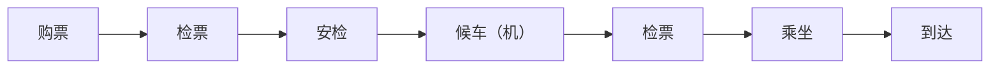

## 公交车

导航软件搜索公交车路线

一般情况用微信、支付宝搜索“城市名 + 公交卡”都能扫码使用电子公交卡，不能就使用现金。没有现金随便找一个便利店或路人换，甚至上车投十块，后来的人现金给你也行，不要不好意思

> 个人觉得支付宝更方便一点

=== "支付宝"

    <figure markdown="span">
        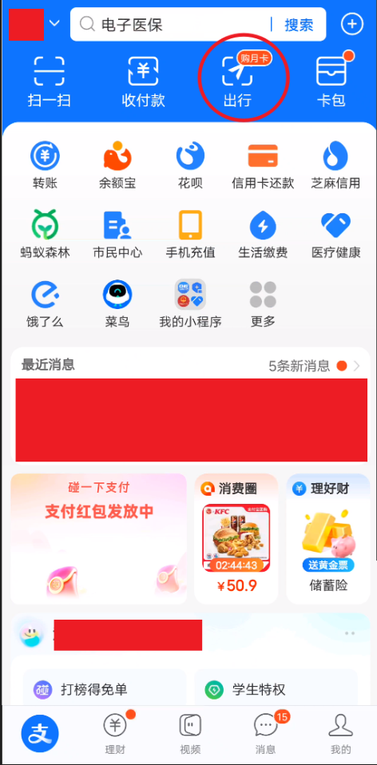{ width="200" }
    </figure>

    点击后，打开定位或手动选择城市，选择 ^^公交^^ ，领取电子公交卡，使用二维码

## 地铁

导航软件搜索地铁路线

一般情况下用微信、支付宝搜索“城市名+地铁”都能扫码使用乘车。有部分城市需要下载本地出行APP或直接在地铁站购票，选好站点即可

=== "支付宝"

    <figure markdown="span">
        { width="200" }
    </figure>

    点击后，打开定位或手动选择城市，选择 ^^地铁^^ ，领取电子地铁卡，使用二维码

## 购票APP

- 铁路12306
- 各个航空公司的APP
- 航旅纵横
- 携程等旅游出行APP

## 学生票

火车硬座5折，动车组二等座75折

=== "铁路12306"

    选择学生票

    

        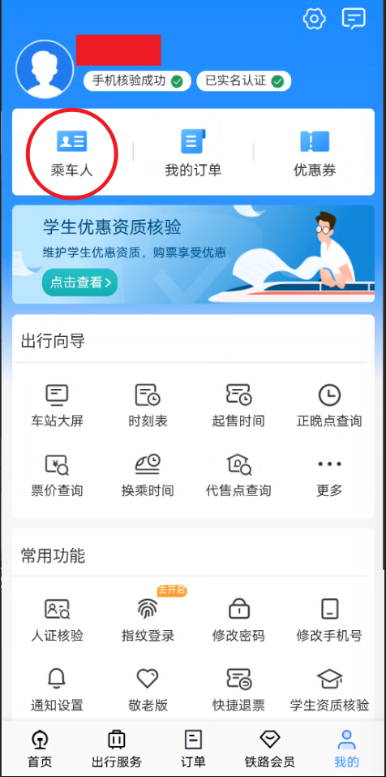{ width="200" }
        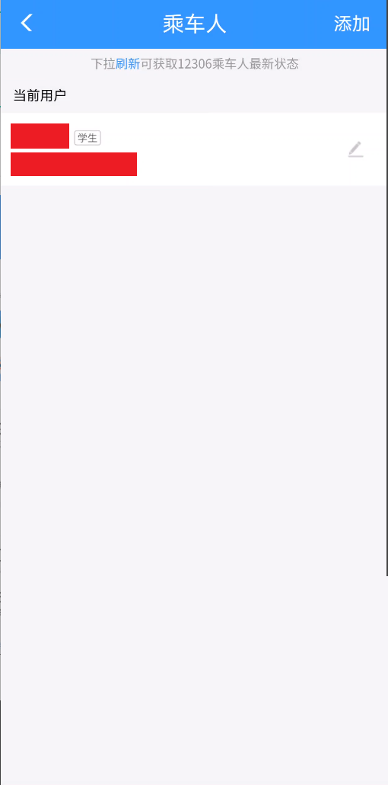{ width="200" }
        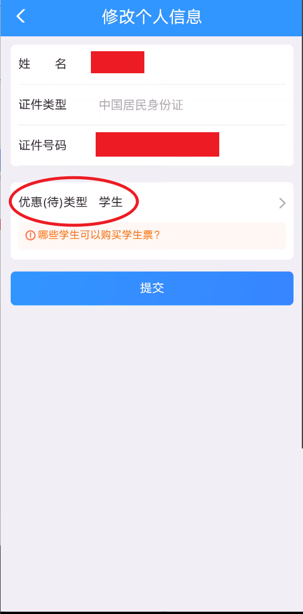{ width="200" }
    

学生证火车票学生优惠卡优惠区间：城市A-B（一般为身份证省市-学校所在省市）

一年只能购买四次。购买学生票需要携带学生证取票验票。大一新生可凭录取通知书购买一次学生票（毕业生可凭学校开具的书面证明），中小学生异地上学凭学校书面证明也可使用

## 高铁

购票后根据信息检票乘车即可。注意检票口的位置和站点有没有错

!!! tip "高铁小知识"

    “G”：代表高速动车组旅客列车，也就是我们常说的高铁。这种列车运行速度非常快，一般在设计时速250千米及以上的线路上运行
    
    “D”：表示动车组旅客列车，通常称为动车。动车的运行速度较快，一般在设计时速200-250千米的线路上运行。相比高铁，动车的票价可能会稍低一些。它的线路覆盖范围较广既连接大城市，也会停靠一些中小城市，为更多旅客提供便捷的交通服务
    
    “C”：为城际动车组列车。主要往返于相邻城市或者城市群内部城市之间
    
    “Z”：是直达特别快速旅客列车的简称。这种列车中间停靠站很少甚至有的车次除了技术停车（如换车头等情况）外，几乎是一站直达目的地

    “T”：代表特别快速旅客列车。它的速度比普通列车快，在铁路运行图中的优先级较高

    “K”：为快速旅客列车。这是一种常见的旅客列车类型。纯数字的车次一般为普通旅客列车，分为普通旅客快车和普通旅客慢车

### 退改规则

没赶上车改签当日其他车次免费（需在人工窗口办理）

| 申请退票距发车时间 | 退票费 |
| :-----: | :-----: |
| 退票时间 $\geqslant 8$ 天 | 无 |
| $48$ 小时 $\leqslant$ 退票时间 $< 8$ 天 | $5\%$ |
| $24$ 小时 $\leqslant$ 退票时间 $< 48$ 小时 | $10\%$ |
| 退票时间 $< 24$ 小时 | $20\%$ |

| 申请改签距发车时间 | 票价差额退票费 |
| :-----: | :-----: |
| 改签时间 $\geqslant 8$ 天 | 无 |
| $48$ 小时 $\leqslant$ 改签时间 $< 8$ 天 | $5\%$ |
| $24$ 小时 $\leqslant$ 改签时间 $< 48$ 小时 | $10\%$ |
| 改签时间 $< 24$ 小时 | $20\%$ |

<table>
    <tbody>
        <tr>
            <th rowspan="2" style="text-align: center; vertical-align: middle;">改签新票</th>
            <th colspan="3" style="text-align: center; vertical-align: middle;">改签费率</th>
        </tr>
        <tr>
            <th style="text-align: center; vertical-align: middle;">开车前 $24$ 小时以上、不足 $48$ 小时改签</th>
            <th style="text-align: center; vertical-align: middle;">开车前不足 $24$ 小时改签</th>
            <th style="text-align: center; vertical-align: middle;">开车后当日 $24$ 小时之前改签</th>
        </tr>
        <tr>
            <th style="text-align: center; vertical-align: middle;">车票载明乘车日期以前的列车或当日其他列车</th>
            <th style="text-align: center; vertical-align: middle;">$0\%$</th>
            <th style="text-align: center; vertical-align: middle;">$0\%$</th>
            <th style="text-align: center; vertical-align: middle;">$0\%$</th>
        </tr>
        <tr>
            <th style="text-align: center; vertical-align: middle;">车票载明乘车日期次日及以后的列车</th>
            <th style="text-align: center; vertical-align: middle;">$5\%$</th>
            <th style="text-align: center; vertical-align: middle;">$15\%$</th>
            <th style="text-align: center; vertical-align: middle;">$40\%$</th>
        </tr>
    </tbody>
</table>

### 候补

候补可以理解为抢票。当前区间没有票，添加候补后如果有其他人退票、平台后续放票，将会自动买票，候补成功率75%，出票才算买到票

每人可以添加5组候补订单，比如全程、联程都行，出票后自动停止同列车同时段其他候补订单

!!! tip "补票小技巧"

    <figure markdown="span">
        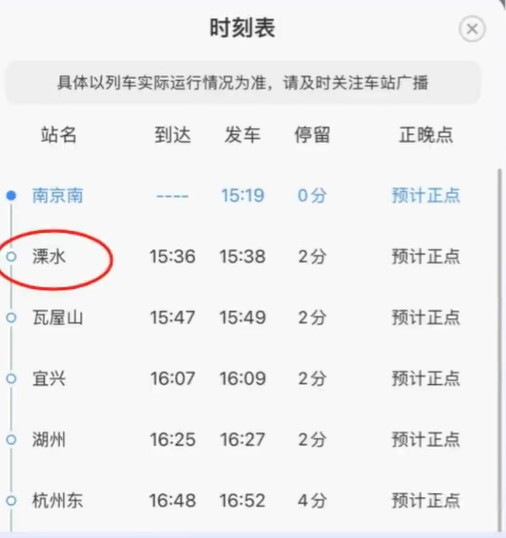{ width="200" }
    </figure>

    如果南京到杭州没票了，可以看途径时刻表，买南京到溧水站，上车找列车员补票，一定要补，不然出不了站

### 小技巧

!!! tip "换乘小技巧"

    <figure markdown="span">
        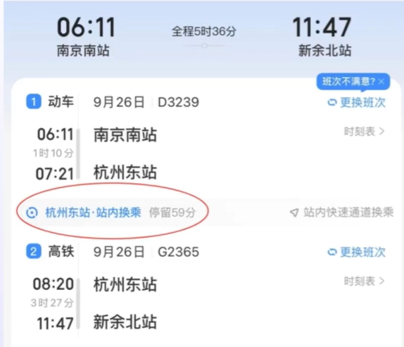{ width="200" }
    </figure>

    换乘不用出站，走联程通道

!!! tip "坐过站怎么办"

    如果坐过站，找列车长说明情况，可以免费乘车返回（要有礼貌）

!!! tip "没带身份证怎么办"

    <figure markdown="span">
        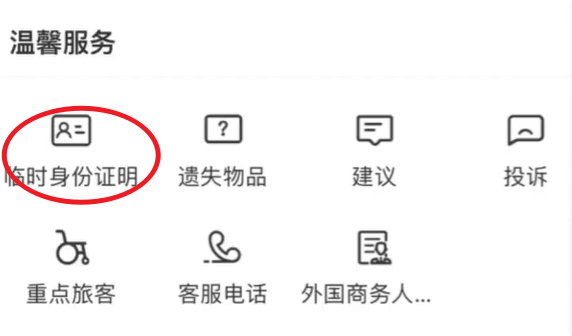{ width="200" }
    </figure>

    没带身份证可在12306上申请临时身份证明，一个月可用5次，每次24小时

!!! tip "积分兑换车票"

    <figure markdown="span">
        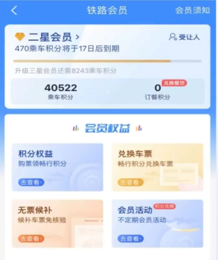{ width="200" }
    </figure>

    1. 积分兑换条件：满10000分可使用积分兑换功能。$积分=票价\times5$，相当于近一年坐2000元火车或高铁
    2. 积分兑换的车票可改签一次，不可退票、办理变更到站业务。改签范围为可兑换的车票
    3. 积分受让人除了自己，可添加8个亲友。但新添加的亲友，2个月后才能生效，使用你的积分
    4. 积分兑换，每$100分=1元$
    5. 显示有"兑"字样的车次才能用积分换票。积分换位车票，显示为赠票，无报销意义 

!!! tip "遗失物品怎么办"

    <figure markdown="span">
        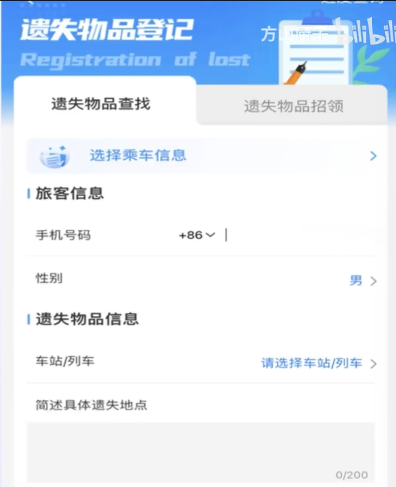{ width="200" }
    </figure>

    12306登记遗失物品

!!! tip "无座车票"

    <figure markdown="span">
        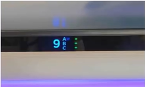{ width="200" }
    </figure>

    有空位就可以坐会儿
    
    - 红色指示灯：表示该座位目前已经有旅客在使用了，也就是“已售”状态
    - 绿色指示灯：意味着该座位目前是空着的，不仅这一站，下一站也不会有人使用
    - 黄色指示灯：黄灯亮表示当前座席在当前站至下一间未售，但是此座席的中间区段已售

    由于动车票是在出发前动态售卖的，随时可能有变

## 飞机

### 购票

携程、同程、去哪儿等APP都行，确定出发地、目的地、出行日期和时间等信息。可以根据自己的需求选择直飞航班或者中转航班。

!!! info "区别"

    - 直飞航班速度快
    - 中转航班价格可能相对较低，但旅行时间会延长，国际航班中转较为常见
  
### 值机

<figure markdown="span">
    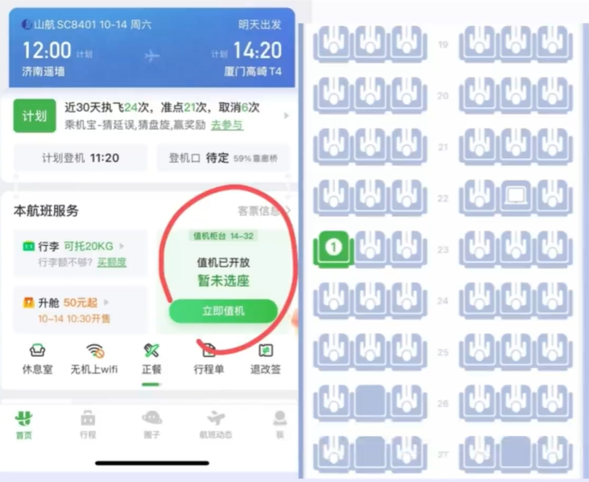{ width="300" }
</figure>

值机，可理解为签到，并选好座位。国内航班一般起飞前40分钟停止值机（不是登机）

#### 线上

一般情况下购票平台都能在起飞前48小时内直接线上值机。建议下载“航旅纵横”APP，这是目前国内权威、功能强大的民航信息服务产品。等同于12306。可自动同步行程信息，线上值机后可凭借二维码过安检、登机

#### 线下

机场柜台值机，第一次可以提前1.5-2h到机场留够时间感受一下

机场会区分航站楼（Terminal），注意区分航站楼编号（例如T1、T2）。购票订单中会显示值机区域（例如B01-B20），前往值机区域柜台递交身份证件即可。会询问对座位有没有要求（靠窗/走廊等）

如果有托运行李，需在一旁等待行李安检，没问题的话会给你行李小票；如果有问题，需要去检验室开箱检查，检查没问题后再返回值机柜台拿登机牌、行李票

没带身份证，用微信、支付宝搜索 ^^临时乘机证明^^

<figure markdown="span">
    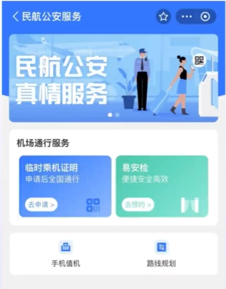{ width="200" }
</figure>

### 行李

#### 随身携带的行李
   
尺寸不超过 $20\times40\times55$ 厘米，长、宽、高之和不超过115厘米，重量一般不超过5kg（看具体机票要求）

随身携带的化妆品、护肤品单瓶不能超过100ml（可以分装）

#### 托运行李

一般来说，长、宽、高三边之和不超过158厘米。每件行李的重量不能超过20公斤

一般有电池的都不能托运，例如笔记本电脑、手机等，充电宝不超过2W毫安

!!! danger "不能携带"

    危险品、打火机、火柴、点烟器、自锅、自喷压力容器等

### 安检

随身行李中笔记本电脑、手机、雨伞、充电宝需要拿出来过安检（一般带电池的都需要拿出来）。外套和靴子也需要脱下

如遇到不能携带的物品可以自弃、补办托运、机场寄存、快递

!!! tip "小技巧"

    如果飞行次数多可使用 ^^易安检^^ 快速通道。支付宝搜索 ^^易安检^^

### 登机

寻找登机口，等待登机

1. 廊桥登机
2. 摆渡车登机

### 飞机上

起飞和降落阶段，不可调座椅靠背，不可关闭遮阳板，不可戴耳机

如耳朵不适可以做咀嚼动作

电子设备全程飞行模式，部分航班有机上wifi，全程不可以使用充电宝，部分机型有USB充电口

遇到气流颠簸很正常，不要慌，相信机组专业人员

### 餐饮

餐食是免费的，不要不好意思。一般先是饮料，想喝什么直接说，再来一杯也没问题

餐食看航班时间，正餐时间航班一般有饭面，非正餐时间发小食。吃完过一会儿会有乘务来收垃圾，最好装回盒子再给，避免弄脏

如果睡着的话乘务员不会打扰，睡醒饿了再要也可以

### 到达目的地

如果有托运行李，可以看购票APP或航旅纵横，会显示行李转盘。取到自己的行李离开即可，出去时可能有工作人员核对有没有拿错行李，给他看一下行李票就行

<figure markdown="span">
    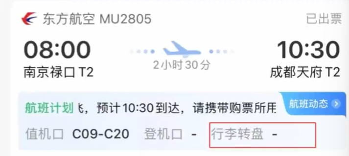{ width="200" }
</figure>

### 国际航班

国际航班带好护照，不需要身份证

#### 过海关

一般国内海关进出都可以走快捷通道，机器过关。出境落地后需要过当地海关，有机器，有人工。都会有明显的标识，不要害怕

大额现金、贵重物品、特殊药品等需要申报

## 延伸

[听老师讲故事](https://www.bilibili.com/video/BV1wh29YLEA6/){:target="_blank"}