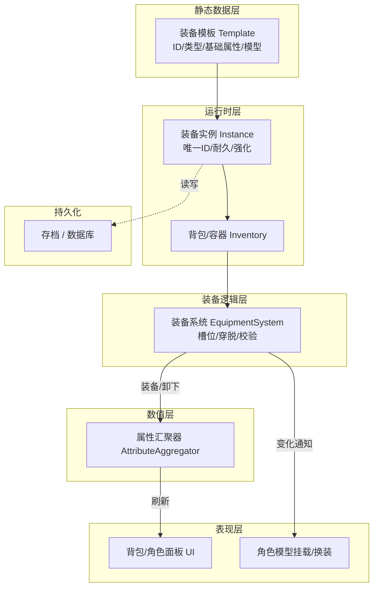

# 装备系统设计

> 前置假设：以最常见的 **RPG / ARPG / MMO** 玩法为例（装备决定数值、多槽位、背包交互）。纯吃鸡（只换武器）、放置类（无背包）可在此基础上删减模块

不同玩法，装备系统重心完全不同，先定位再设计：

| 玩法类型 | 核心诉求 | 系统侧重 |
| --- | --- | --- |
| MMO / 数值 RPG | 属性成长、长期追求 | 属性汇聚、强化、套装 |
| ARPG / 刷子游戏 | 掉落、随机词条、Build | 随机生成、词条、仓库 |
| 生存 / 制造 | 采集-制造-装备闭环 | 材料、耐久、制造配方 |
| MOBA / 射击 | 局内快速成长 | 轻量商店、临时购买 |

一句话：**装备系统的本质是"把物品转化为角色能力"，设计重点是让"装备→属性/能力/表现"这条链清晰可替换**

## 1 整体架构：分层解耦



**核心原则：每一层只关心一件事，层与层之间用"数据 + 事件"通信，不互相持有具体实现**

| 层 | 职责 | 关键点 |
| --- | --- | --- |
| **静态数据层** | 装备"是什么"（可配的表/资产） | 所有数值与描述来自配置，不写死在代码 |
| **实例层** | 具体一件"这件装备"的状态 | 同一模板可有多件实例 |
| **容器层** | 物品存放在哪（背包/仓库/装备栏） | 通用容器，减少重复逻辑 |
| **装备逻辑层** | 穿/脱/替换、槽位约束、校验 | 与 UI、表现无关的核心逻辑 |
| **数值层** | 把所有已穿装备的属性 **聚合** 给角色 | 唯一"算总账"的地方 |
| **表现层** | UI 展示、3D 换装 | 只监听事件，不直接改装备 |
| **持久化层** | 保存/加载/存档 | 只序列化实例层 |

## 2 数据模型设计

### 2.1 静态定义

Template，一份配置描述"这一类装备"

```text
装备模板表 EquipmentTemplate
┌───────┬────────┬────────────┬───────────────┬─────────┐
│ ID    │ 名称   │ 槽位类型    │ 基础属性(字典) │ 模型/图标│
├───────┼────────┼────────────┼───────────────┼─────────┤
│ sword_001 │ 铁剑 │ Weapon     │ ATK:+10       │ SM_Sword │
│ helm_001  │ 铁盔 │ Head       │ DEF:+5        │ SM_Helm  │
└───────┴────────┴────────────┴───────────────┴─────────┘
```

要点：

- **槽位类型（Slot Type）** 决定能穿哪：`Weapon / Head / Chest / Legs / Shoes / Ring ...`
- **需求约束（Requirements）**：等级、职业、力量——写在模板里，由装备逻辑层校验
- 属性用 **字典（Map）** 而非固定字段（`ATK`、`DEF`、`SPD`…），方便以后加新属性不改表结构

### 2.2 运行实例

Instance，描述"这一件"

```text
装备实例
├─ InstanceId     : 唯一实例号（跨存档稳定）
├─ TemplateId     : 指向模板
├─ Durability     : 当前耐久
├─ EnhanceLevel   : 强化等级
├─ Affixes[]      : 随机词条 / 宝石 / 附魔（每件可能不同）
└─ IsBound        : 是否已绑定（不可交易）
```

**模板与实例分离** 的意义：数值、模型等"不会变"的放模板复用；会变的（耐久、强化）放实例，节省内存、方便做"同模板多件"

### 2.3 槽位与角色属性

- 槽位集合固定：`Head, Chest, Legs, Weapon, OffHand, Shoes, Ring1, Ring2, Necklace`
- 每个槽位在任意时刻要么 **空**、要么 **装着一件实例**
- 角色 **最终属性 = 基础属性（升级给的）+ 各槽位装备属性之和**，由一个汇聚器统一计算

## 3 核心接口

```cpp
// —— 装备逻辑层：不依赖 UI，不依赖表现 ——
class EquipmentSystem {
    // 尝试把背包里某件装备穿到某槽
    bool Equip(ItemInstance* item, SlotType slot);
    // 卸下某槽装备，放回背包
    bool Unequip(SlotType slot);
    // 直接替换：旧装备自动回背包
    bool Swap(ItemInstance* item, SlotType slot);

    // 槽位约束校验（类型/职业/等级）——所有"能不能穿"都收敛在这
    bool Validate(ItemInstance* item, SlotType slot) const;

    // 数值汇聚：返回角色当前总属性
    CharacterStats GetAggregatedStats() const;

    // 变化通知：穿/脱/属性变化都广播，UI 与表现订阅
    Delegate<void(SlotType, ItemInstance*)> OnEquipChanged;
    Delegate<void(CharacterStats)>          OnStatsChanged;
};
```

```cpp
// —— 数值汇聚器：与装备细节解耦，只做"求和" ——
class AttributeAggregator {
    void AddSource(/* 基础属性 */);
    void AddSource(/* 装备属性 */);
    CharacterStats Recalculate();  // 汇总 → 提供给战斗/角色系统
};
```

关键接口设计原则：

1. **穿/脱是"原子操作"**：`Equip` 要么成功（装备进槽、旧的回背包、触发重算）要么失败返回原因，不产生中间态
2. **逻辑不碰表现**：装备系统只广播事件，换装、UI 刷新由表现层订阅事件完成
3. **一个"算总账"的入口**：所有"最终属性"来自 `GetAggregatedStats()`，杜绝散落各处的手工加减
4. **校验集中**：等级/职业/槽位等所有规则放 `Validate()`，UI 提示、网络拒绝、逻辑调用都走它，不会漏判

!!! tip "关键流程（以穿上装备为例）"

    ```mermaid
    sequenceDiagram
        participant U as UI/输入
        participant E as EquipmentSystem
        participant B as 背包
        participant A as AttributeAggregator
        participant F as 表现层(模型/UI)
    
        U->>E: 请求 Equip(某件, Weapon槽)
        E->>E: Validate（槽位类型/等级/职业）
        alt 校验失败
            E-->>U: 返回失败原因（等级不足等）
        else 成功
            E->>B: 旧装备放回背包
            E->>E: 记录 槽位→新装备
            E->>A: 触发属性重算
            A-->>E: 新总属性
            E-->>F: 广播 OnEquipChanged / OnStatsChanged
            F->>F: 刷新角色面板、挂载模型、同步网络
        end
    ```

## 4 必须考虑的扩展点

设计时就要留口子，否则后期加功能要大改：

| 扩展 | 需要的预留 |
| --- | --- |
| **强化 / 升级** | 实例上有 `EnhanceLevel`，模板带强化曲线 |
| **随机词条 / 附魔 / 宝石孔** | 实例属性 = 模板基础 + 词条加成，汇聚时都要计入 |
| **套装效果** | 汇聚器能统计"同套装穿了几件" |
| **耐久 / 修理** | 实例带 Durability，战斗消耗走装备逻辑层接口 |
| **绑定 / 交易 / 分解** | 模板带 `IsBoundable`、实例带 `IsBound`，交易/分解作为独立容器操作 |
| **幻化 / 外观** | 表现层的"外观来源"与装备逻辑解耦（穿 A 显 B） |

## 5 网络 / 多端注意事项

- **服务器权威**：穿脱、属性结果是"权威状态"，服务器校验后同步给客户端；客户端只发"请求穿这件"的意图（防止修改本地属性作弊）
- **客户端表现**：表现层只响应服务器同步下来的结果事件
- **存档一致性**：实例 ID 必须全局唯一且稳定，否则存档/断线重连会错乱

## 6 UE5

| 设计层 | UE 中的常见落点 |
| --- | --- |
| 静态模板 | `UDataAsset` / `UDataTable` / 蓝图的 Data Asset（数据驱动） |
| 实例 | `UObject`（如 `UItemInstance`），受反射与 GC 管理 |
| 容器 / 背包 | 一个通用 `UInventoryComponent`（`TArray`/`TMap` 存实例） |
| 装备逻辑 | `UEquipmentComponent`（挂在 Pawn 或 PlayerState） |
| 数值汇聚 | 可接 GAS：把装备属性转成 GameplayEffect 应用给 AbilitySystemComponent |
| 表现换装 | `USkeletalMeshComponent` 按槽位挂载，监听装备事件 |
| 事件通信 | 动态多播委托 / AbilityTask / 蓝图事件 |

这些正是你笔记里 `UDataAsset`、反射/GC、`GameplayEffect`、组件通信知识的综合应用
