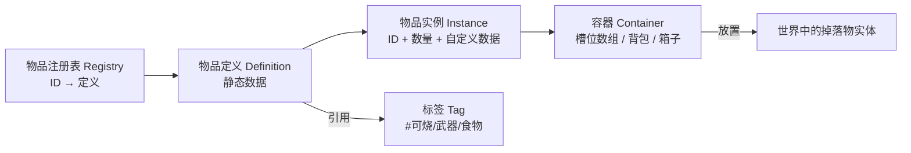
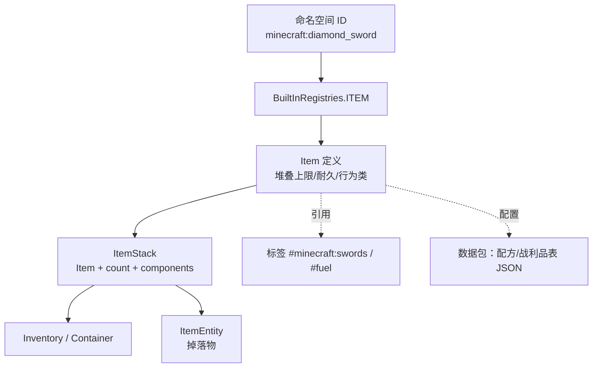

# 物品系统设计

> 前置说明：以下为 **引擎无关** 的通用设计思路。以《我的世界》（Minecraft）这类"上千种物品"的游戏为主要案例——它恰好是"如何用少量代码支撑海量物品"的教科书级范例

物品系统要解决的矛盾很尖锐：游戏希望有 **成百上千种物品**（不同数值、不同行为、不同组合），但代码不可能为每种物品写一个类。**核心答案：类型与实例分离 + 数据驱动 + 组件组合 + 标签分类**

!!! info "一句话总结"

    物品系统 = **物品定义（Type，数据表里的一行）** + **物品实例（Instance，背包里那一把剑）** + **容器（Container，背包/箱子）**，用 **少量行为类型 + 组件组合 + 标签** 取代"每种物品一个类"

## 1 核心难题：物品数量爆炸

《我的世界》有 **上千种物品**，且行为五花八门（能吃、能烧、能当武器、能放方块、能装液体）。如果按"一种物品一个类"写：

```text
Item
├─ DiamondSword        ← 每种剑都要一个类？
├─ IronSword
├─ GoldenSword
├─ ... × 数百
├─ DiamondPickaxe
├─ OakLog
├─ ... × 上千
```

结果是：**类爆炸、代码重复、加物品要改代码、无法热更新与模组扩展**

正确的抽象方式：把"物品"拆成两个正交维度——

| 维度 | 含义 | 例子 |
| --- | --- | --- |
| **类型（Type / Definition）** | "这是什么东西"，**全局唯一、只读、可配** | `minecraft:diamond_sword` 的定义 |
| **实例（Instance）** | "背包里具体这一件"，**有数量与可变数据** | 耐久只剩 30% 的那把钻石剑 |

## 2 核心模型：定义 → 实例 → 容器



### 2.1 物品定义（Definition）：静态数据

一份"配置"描述这类物品的全部不可变属性：

| 字段 | 说明 |
| --- | --- |
| **ID** | 全局稳定标识（命名空间形式，如 `minecraft:diamond_sword`） |
| **名称 / 描述** | 本地化 key（不是硬编码字符串） |
| **图标 / 模型** | 表现资源引用 |
| **堆叠上限** | 64 / 16 / 1（工具与装备一般是 1） |
| **分类标签（Tag）** | 武器、可烧、可食用、可放置…… |
| **行为参数** | 攻击力、饱食度、燃烧时长、放置的方块 ID |
| **耐久** | 最大耐久值（0 表示无耐久） |
| **品质 / 稀有度** | 影响名称颜色、掉落概率 |

### 2.2 物品实例（Instance / Stack）：运行时状态

| 字段 | 说明 |
| --- | --- |
| **定义 ID** | 指向类型 |
| **数量（Count）** | 1 ~ 堆叠上限 |
| **可变数据** | 耐久、附魔、自定义名称、容器内容…… |
| **（可选）唯一实例 ID** | 需要精确追踪时使用 |

**关键设计判断：可变数据放实例，不可变数据放定义。** 这样"几千个相同物品"只占一份定义的内存

### 2.3 容器（Container）：物品存放

- 统一抽象为"**槽位数组**"（背包、箱子、熔炉输入输出、装备栏都是容器）
- 容器只管"格子里放什么、多少"，规则（能不能放、怎么堆叠）由 **物品规则** 决定
- 好处：背包、箱子、漏斗、交易、合成台全部复用同一套容器逻辑

## 3 如何避免"每种物品一个类"

三种常见做法，复杂度递增：

| 方案 | 做法 | 问题 / 适用 |
| --- | --- | --- |
| **A. 每种物品一个类** | `DiamondSword : Sword : Item` | 类爆炸，新物品要改代码。仅适合物品极少的游戏 |
| **B. 一个类 + 数据参数** | `Item` + `{atk, stack, burnTime}` | 简单物品够用，但"行为差异大"时字段会失控（大量 if） |
| **C. 组合：类型 + 组件 + 标签** | 少量行为基类 + **可复用组件** + 标签分类 | 推荐，可扩展、数据驱动 |

### 3.1 推荐方案 C 的构成

1. **少量行为基类**：如 `Item`、`BlockItem`（能放置方块）、`ToolItem`（有耐久与挖掘等级）、`FoodItem`
2. **组件（Component / Capability）组合**：把能力做成可插拔模块

| 组件 | 提供的能力 |
| --- | --- |
| `Damage` | 当前耐久 |
| `Enchantments` | 附魔表 |
| `CustomName` | 自定义名称 |
| `Container` | 装物品（潜影盒、背包） |
| `Food` | 食用效果 |
| `Fuel` | 燃烧时长 |

3. **标签（Tag）分类**：用 `#weapons/swords`、`#fuel`、`#foods` 表达"它属于什么类别"，供其他系统查询
4. **数据配置**：具体数值全部来自数据表 / JSON，改配置不改代码

!!! info "Minecraft 的演进恰好印证了这条路"

    - **早期**：`Item` 子类 + **NBT**（一份自由 KV 大树，什么数据都往里塞）
    - **1.13+**：配方、标签、战利品表改为 **数据包（Data Pack）** 的 JSON，走向数据驱动
    - **1.20.5+**：用 **数据组件（Data Components）** 取代 NBT——`minecraft:damage`、`minecraft:enchantments`、`minecraft:custom_name` 等 **结构化的组件**，正是"组合优于继承"的落地

## 4 行为与分类：用标签/组件替代硬编码

| 硬编码（反模式） | 标签 / 组件（推荐） |
| --- | --- |
| `if (item == DiamondSword) damage = 7;` | 物品定义里配 `AttackDamage: 7` |
| `if (item is Sword) ...` | 查询标签 `#minecraft:swords` |
| `if (item.CanBurn) ...` | 查询组件 `Fuel` 存在与否 / 标签 `#fuel` |
| 新加"能当燃料的物品"要改燃烧逻辑 | 给该物品打上 `#fuel` 标签即可 |

!!! note "标签（Tag）的价值"

    标签把 **分类** 从代码里抽出来变成数据：一个物品可同时属于多个标签（既是武器又是可烧物），新分类不需要改动已有物品的代码，只需打标签——这也是模组能低成本扩展的关键

## 5 配套子系统

| 子系统 | 职责 | 要点 |
| --- | --- | --- |
| **注册表（Registry）** | ID → 定义 的全局映射 | ID 稳定、可序列化、支持模组注册 |
| **容器 / 背包** | 槽位管理、堆叠合并与拆分 | 与具体 UI 解耦 |
| **掉落物** | 世界中的物品实体（可拾取、可合并） | 拾取逻辑与容器解耦 |
| **合成 / 配方** | 输入组合 → 输出 | 数据驱动（表/JSON），支持有序/无序/形状 |
| **加工（熔炉等）** | 时间驱动的转换 | 输入容器 + 配方 + 计时 |
| **耐久 / 消耗** | 使用损耗、损坏处理 | 放组件里 |
| **战利品表（Loot Table）** | 掉落内容按权重随机 | 数据驱动，便于平衡调整 |
| **本地化** | 名称/描述用 key | 多语言与热更 |
| **序列化 / 存档** | 实例数据落盘 | 版本化 + 迁移 |

## 6 Minecraft 案例剖析



几个关键设计点：

1. **命名空间 ID 而非数字下标**：`minecraft:diamond_sword`、`mymod:custom_gem`。字符串 ID 让"插入新物品"**不会打乱已有物品**，存档不会错位——这是支撑"上千种物品 + 模组"的基础
2. **ItemStack = 定义 + 数量 + 组件数据**：同一份定义可以产生无数实例（耐久不同的两把剑是同一个定义的实例）
3. **方块与物品分离**：方块有独立的注册与管理（BlockState、光照、碰撞），通过 `BlockItem` 把"可放置的方块"接到物品系统上——**逻辑与物品系统解耦**
4. **数据包驱动内容**：配方、标签、战利品表都是 JSON，加内容常常 **不用写代码**，改数据即可
5. **数据组件替代 NBT**：从"任意 KV 大杂烩"演进为"有名字、有结构、可校验的组件"，让实例数据可控、可组合

## 7 存档与版本兼容

!!! warning "三个会导致存档损坏的坑"

    1. **用数组下标当 ID**：插入一个新物品，后面所有 ID 全部错位，老存档全废 → 用 **稳定的字符串 ID**
    2. **序列化格式不带版本号**：将来改结构无法迁移 → 每条实例数据带格式版本 + 写迁移逻辑
    3. **删除/重命名物品不处理**：老存档引用到不存在的 ID → 保留 **别名映射**，把旧 ID 指向新 ID

## 8 网络同步

- **服务器权威**：物品的增减、耐久消耗、合成结果由服务器裁定
- 客户端只做 **表现与预测性反馈**（如拾取动画）
- 容器同步要注意"打开箱子时逐格同步"的带宽成本，可用差量同步（详见网络同步文档）

## 9 设计自检清单

!!! info "好设计的标志"

    - 加一种"新数值、新组合"的物品，只需 **改数据/配置**，不改逻辑代码
    - 加一类 **新行为**（如"能装液体"），只需加一个 **组件**，现有物品不受影响
    - "这是不是武器/燃料"这类判断 **查标签，不查具体 ID**
    - 物品定义的 ID **稳定且带命名空间**，插入新物品不破坏存档
    - 表现（图标/模型/音效）与逻辑（数值/行为）**分离**
    - 背包、箱子、装备栏、合成台 **复用同一套容器逻辑**

!!! warning "反模式速查"

    - ❌ 每种物品一个类 / 一长串 `if (id == ...)`
    - ❌ 硬编码物品名做本地化
    - ❌ 实例数据全塞进一个自由 KV 结构（无结构、无校验）
    - ❌ 容器逻辑与 UI 逻辑写在一起
    - ❌ 用数字索引作为物品 ID
